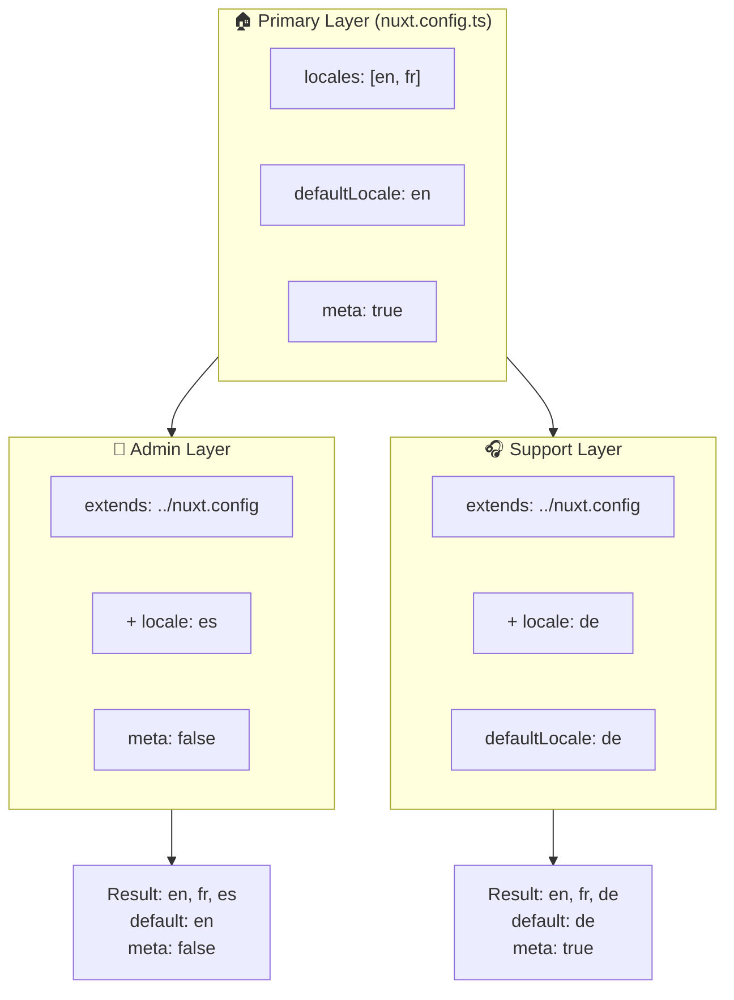

# 🗂️ Layer in `Nuxt I18n Micro`

## 📖 Introduzione ai layer

I layer in `Nuxt I18n Micro` ti permettono di gestire e personalizzare in modo flessibile le impostazioni di localizzazione tra diverse parti della tua applicazione. Definendo diversi layer, puoi regolare la configurazione per vari contesti, ad esempio sovrascrivendo le impostazioni per sezioni specifiche del sito o creando configurazioni di base riutilizzabili che possono essere estese da altre parti della tua applicazione.

### Flusso di ereditarietà dei layer



## 🛠️ Layer di configurazione primaria

Il **Layer di configurazione primaria** è dove imposti le impostazioni di localizzazione predefinite per l'intera applicazione. Questo layer è essenziale in quanto definisce la configurazione globale, comprese le locale supportate, la lingua predefinita e altre impostazioni i18n critiche.

### 📄 Esempio: Definizione del layer di configurazione primaria

Ecco un esempio di come potresti definire il layer di configurazione primaria nel tuo file `nuxt.config.ts`:

```typescript
export default defineNuxtConfig({
  i18n: {
    locales: [
      { code: 'en', iso: 'en-EN', dir: 'ltr' },
      { code: 'fr', iso: 'fr-FR', dir: 'ltr' },
      { code: 'ar', iso: 'ar-SA', dir: 'rtl' },
    ],
    defaultLocale: 'en', // The default locale for the entire app
    translationDir: 'locales', // Directory where translations are stored
    meta: true, // Automatically generate SEO-related meta tags like `alternate`
    autoDetectLanguage: true, // Automatically detect and use the user's preferred language
  },
})
```

## 🌱 Layer figli

I layer figli vengono usati per estendere o sovrascrivere la configurazione primaria per parti specifiche della tua applicazione. Ad esempio, potresti voler aggiungere locale aggiuntive o modificare la locale predefinita per una sezione particolare del tuo sito. I layer figli sono particolarmente utili nelle applicazioni modulari in cui parti diverse dell'applicazione potrebbero avere requisiti di localizzazione differenti.

### 📄 Esempio: Estensione del layer primario in un layer figlio

Supponiamo che tu abbia una sezione del tuo sito che deve supportare locale aggiuntive, o che tu voglia disabilitare una particolare locale in un certo contesto. Ecco come puoi ottenerlo estendendo il layer di configurazione primaria:

```typescript
// basic/nuxt.config.ts (Primary Layer)
export default defineNuxtConfig({
  i18n: {
    locales: [
      { code: 'en', iso: 'en-EN', dir: 'ltr' },
      { code: 'fr', iso: 'fr-FR', dir: 'ltr' },
    ],
    defaultLocale: 'en',
    meta: true,
    translationDir: 'locales',
  },
})
```

```typescript
// extended/nuxt.config.ts (Child Layer)
export default defineNuxtConfig({
  extends: '../basic', // Inherit the base configuration from the 'basic' layer
  i18n: {
    locales: [
      { code: 'en', iso: 'en-EN', dir: 'ltr' }, // Inherited from the base layer
      { code: 'fr', iso: 'fr-FR', dir: 'ltr' }, // Inherited from the base layer
      { code: 'de', iso: 'de-DE', dir: 'ltr' }, // Added in the child layer
    ],
    defaultLocale: 'fr', // Override the default locale to French for this section
    autoDetectLanguage: false, // Disable automatic language detection in this section
  },
})
```

### 🌐 Uso dei layer in un'applicazione modulare

In un'applicazione Nuxt più grande e modulare, potresti avere molteplici sezioni, ognuna con le proprie impostazioni i18n. Sfruttando i layer, puoi mantenere una struttura di configurazione pulita e scalabile.

### 📄 Esempio: Configurazione a layer in un'applicazione modulare

Immagina di avere un sito e-commerce con sezioni distinte come il sito principale, il pannello di amministrazione e il portale di assistenza clienti. Ogni sezione potrebbe richiedere un diverso insieme di locale o altre impostazioni i18n.

#### **Layer primario (configurazione globale):**

```typescript
// nuxt.config.ts
export default defineNuxtConfig({
  i18n: {
    locales: [
      { code: 'en', iso: 'en-EN', dir: 'ltr' },
      { code: 'fr', iso: 'fr-FR', dir: 'ltr' },
    ],
    defaultLocale: 'en',
    meta: true,
    translationDir: 'locales',
    autoDetectLanguage: true,
  },
})
```

#### **Layer figlio per il pannello di amministrazione:**

```typescript
// admin/nuxt.config.ts
export default defineNuxtConfig({
  extends: '../nuxt.config', // Inherit the global settings
  i18n: {
    locales: [
      { code: 'en', iso: 'en-EN', dir: 'ltr' }, // Inherited
      { code: 'fr', iso: 'fr-FR', dir: 'ltr' }, // Inherited
      { code: 'es', iso: 'es-ES', dir: 'ltr' }, // Specific to the admin panel
    ],
    defaultLocale: 'en',
    meta: false, // Disable automatic meta generation in the admin panel
  },
})
```

#### **Layer figlio per il portale di assistenza clienti:**

```typescript
// support/nuxt.config.ts
export default defineNuxtConfig({
  extends: '../nuxt.config', // Inherit the global settings
  i18n: {
    locales: [
      { code: 'en', iso: 'en-EN', dir: 'ltr' }, // Inherited
      { code: 'fr', iso: 'fr-FR', dir: 'ltr' }, // Inherited
      { code: 'de', iso: 'de-DE', dir: 'ltr' }, // Specific to the support portal
    ],
    defaultLocale: 'de', // Default to German in the support portal
    autoDetectLanguage: false, // Disable automatic language detection
  },
})
```

In questo esempio modulare:

- Ogni sezione (admin, support) ha le proprie impostazioni i18n, ma tutte ereditano la configurazione di base.
- Il pannello di amministrazione aggiunge lo spagnolo (`es`) come locale e disabilita la generazione dei meta tag.
- Il portale di supporto aggiunge il tedesco (`de`) come locale e usa il tedesco come predefinito per l'interfaccia utente.

## 📝 Best practice per l'uso dei layer

- **🔧 Mantieni semplice il layer primario:** Il layer primario dovrebbe contenere le impostazioni più comunemente utilizzate che si applicano globalmente all'applicazione. Mantienilo semplice per garantire la coerenza.
- **⚙️ Usa i layer figli per personalizzazioni specifiche:** Sovrascrivi o estendi le impostazioni nei layer figli solo quando necessario. Questo approccio evita complessità inutili nella configurazione.
- **📚 Documenta i tuoi layer:** Documenta chiaramente lo scopo e le specificità di ciascun layer nel tuo progetto. Ciò aiuterà a mantenere la chiarezza e renderà più facile per gli altri (o il te stesso futuro) comprendere la configurazione.
