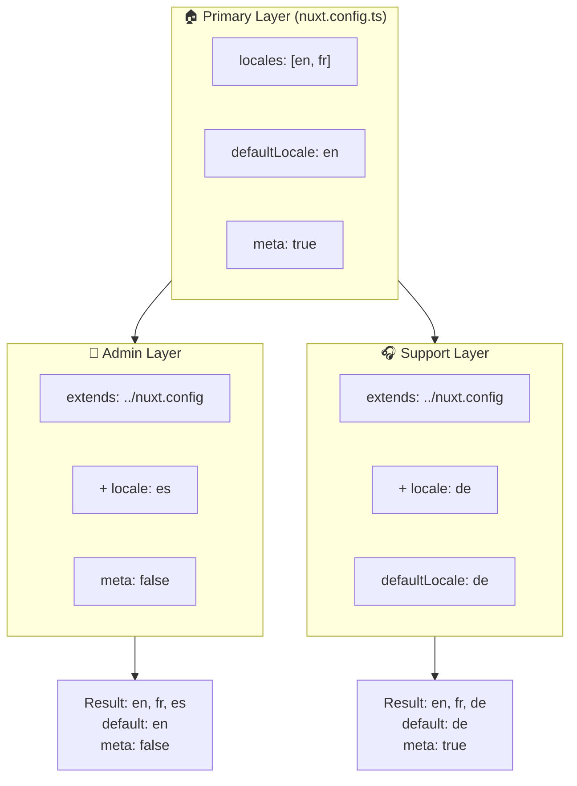

# 🗂️ Layer in `Nuxt I18n Micro`

## 📖 Introduzione ai layer

I layer in `Nuxt I18n Micro` ti permettono di gestire e personalizzare le impostazioni di localizzazione in modo flessibile in diverse parti della tua applicazione. Definendo layer differenti, puoi adattare la configurazione a vari contesti, come sovrascrivere le impostazioni per sezioni specifiche del sito o creare configurazioni base riutilizzabili che possono essere estese da altre parti dell'applicazione.

### Flusso di ereditarietà dei layer



## 🛠️ Layer di configurazione primario

Il **Layer di configurazione primario** è dove definisci le impostazioni di localizzazione predefinite per l'intera applicazione. Questo layer è essenziale perché definisce la configurazione globale, incluse le locale supportate, la lingua predefinita e altre impostazioni i18n critiche.

### 📄 Esempio: definire il layer di configurazione primario

Ecco un esempio di come potresti definire il layer di configurazione primario nel tuo file `nuxt.config.ts`:

```typescript
export default defineNuxtConfig({
  i18n: {
    locales: [
      { code: 'en', iso: 'en-EN', dir: 'ltr' },
      { code: 'fr', iso: 'fr-FR', dir: 'ltr' },
      { code: 'ar', iso: 'ar-SA', dir: 'rtl' },
    ],
    defaultLocale: 'en', // The default locale for the entire app
    translationDir: 'locales', // Directory where translations are stored
    meta: true, // Automatically generate SEO-related meta tags like `alternate`
    autoDetectLanguage: true, // Automatically detect and use the user's preferred language
  },
})
```

## 🌱 Layer figli

I layer figli vengono usati per estendere o sovrascrivere la configurazione primaria per parti specifiche della tua applicazione. Ad esempio, potresti voler aggiungere locale extra o modificare la locale predefinita per una particolare sezione del sito. I layer figli sono particolarmente utili in applicazioni modulari dove parti diverse dell'applicazione possono avere requisiti di localizzazione differenti.

### 📄 Esempio: estendere il layer primario in un layer figlio

Supponiamo di avere una sezione del sito che deve supportare locale aggiuntive, o di voler disabilitare una particolare locale in un certo contesto. Ecco come puoi ottenere questo estendendo il layer di configurazione primario:

```typescript
// basic/nuxt.config.ts (Primary Layer)
export default defineNuxtConfig({
  i18n: {
    locales: [
      { code: 'en', iso: 'en-EN', dir: 'ltr' },
      { code: 'fr', iso: 'fr-FR', dir: 'ltr' },
    ],
    defaultLocale: 'en',
    meta: true,
    translationDir: 'locales',
  },
})
```

```typescript
// extended/nuxt.config.ts (Child Layer)
export default defineNuxtConfig({
  extends: '../basic', // Inherit the base configuration from the 'basic' layer
  i18n: {
    locales: [
      { code: 'en', iso: 'en-EN', dir: 'ltr' }, // Inherited from the base layer
      { code: 'fr', iso: 'fr-FR', dir: 'ltr' }, // Inherited from the base layer
      { code: 'de', iso: 'de-DE', dir: 'ltr' }, // Added in the child layer
    ],
    defaultLocale: 'fr', // Override the default locale to French for this section
    autoDetectLanguage: false, // Disable automatic language detection in this section
  },
})
```

### 🌐 Usare i layer in un'applicazione modulare

In un'applicazione Nuxt più grande e modulare, potresti avere più sezioni, ciascuna con le proprie impostazioni i18n. Sfruttando i layer, puoi mantenere una struttura di configurazione pulita e scalabile.

### 📄 Esempio: configurazione a layer in un'applicazione modulare

Immagina di avere un sito e-commerce con sezioni distinte come il sito web principale, il pannello di amministrazione e il portale di supporto clienti. Ogni sezione potrebbe aver bisogno di un set diverso di locale o di altre impostazioni i18n.

#### **Layer primario (configurazione globale):**

```typescript
// nuxt.config.ts
export default defineNuxtConfig({
  i18n: {
    locales: [
      { code: 'en', iso: 'en-EN', dir: 'ltr' },
      { code: 'fr', iso: 'fr-FR', dir: 'ltr' },
    ],
    defaultLocale: 'en',
    meta: true,
    translationDir: 'locales',
    autoDetectLanguage: true,
  },
})
```

#### **Layer figlio per il pannello admin:**

```typescript
// admin/nuxt.config.ts
export default defineNuxtConfig({
  extends: '../nuxt.config', // Inherit the global settings
  i18n: {
    locales: [
      { code: 'en', iso: 'en-EN', dir: 'ltr' }, // Inherited
      { code: 'fr', iso: 'fr-FR', dir: 'ltr' }, // Inherited
      { code: 'es', iso: 'es-ES', dir: 'ltr' }, // Specific to the admin panel
    ],
    defaultLocale: 'en',
    meta: false, // Disable automatic meta generation in the admin panel
  },
})
```

#### **Layer figlio per il portale di supporto clienti:**

```typescript
// support/nuxt.config.ts
export default defineNuxtConfig({
  extends: '../nuxt.config', // Inherit the global settings
  i18n: {
    locales: [
      { code: 'en', iso: 'en-EN', dir: 'ltr' }, // Inherited
      { code: 'fr', iso: 'fr-FR', dir: 'ltr' }, // Inherited
      { code: 'de', iso: 'de-DE', dir: 'ltr' }, // Specific to the support portal
    ],
    defaultLocale: 'de', // Default to German in the support portal
    autoDetectLanguage: false, // Disable automatic language detection
  },
})
```

In questo esempio modulare:

- Ogni sezione (admin, support) ha le proprie impostazioni i18n, ma tutte ereditano la configurazione base.
- Il pannello admin aggiunge lo spagnolo (`es`) come locale e disabilita la generazione dei meta tag.
- Il portale di supporto aggiunge il tedesco (`de`) come locale e imposta il tedesco come predefinito per l'interfaccia utente.

## 📝 Best practice per l'uso dei layer

- **🔧 Mantieni semplice il layer primario:** il layer primario dovrebbe contenere le impostazioni più comunemente usate che si applicano globalmente all'applicazione. Mantienilo semplice per garantire coerenza.
- **⚙️ Usa i layer figli per personalizzazioni specifiche:** sovrascrivi o estendi le impostazioni nei layer figli solo quando necessario. Questo approccio evita complessità inutili nella configurazione.
- **📚 Documenta i tuoi layer:** documenta chiaramente lo scopo e i dettagli di ciascun layer nel tuo progetto. Questo aiuterà a mantenere chiarezza e renderà più facile per gli altri (o per il tuo futuro io) comprendere la configurazione.
