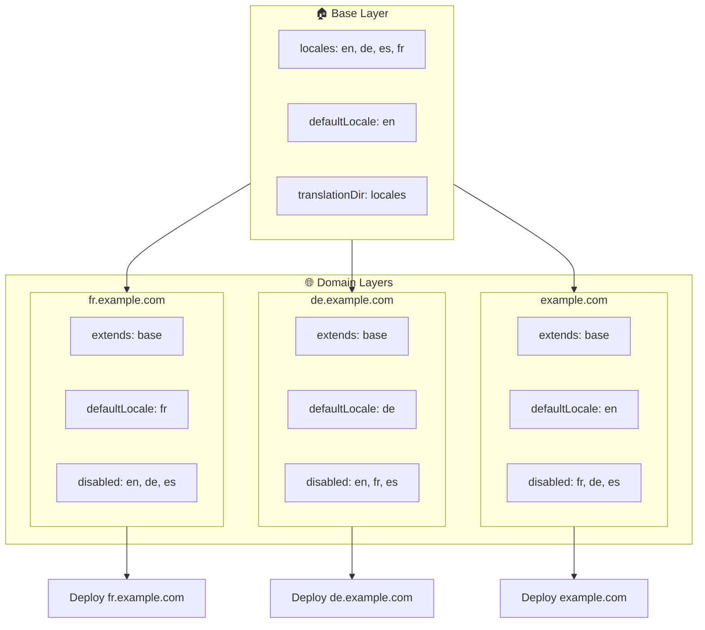

# 🌍 Configurazione di locale multi-dominio con `Nuxt I18n Micro` usando i layer

## 📝 Introduzione

Sfruttando i layer in `Nuxt I18n Micro`, puoi creare una configurazione di localizzazione multi-dominio flessibile e manutenibile. Questo approccio non solo semplifica la gestione dei domini eliminando la necessità di funzionalità complesse, ma consente anche una distribuzione del carico efficiente e una minore complessità del progetto. Eseguendo progetti separati per locale differenti, la tua applicazione può facilmente scalare e adattarsi a requisiti di locale variabili tra più domini, offrendo una soluzione robusta e scalabile per applicazioni globali.

## 🎯 Obiettivo

Creare una configurazione in cui domini diversi servano locale specifiche personalizzando le configurazioni nei layer figli. Questo metodo sfrutta il sistema di layer di Nuxt, permettendoti di mantenere una configurazione di base estendendola o modificandola per ciascun dominio.

### Architettura multi-dominio



## 🛠 Passi per implementare locale multi-dominio

### 1. **Crea il layer di base**

Inizia creando un layer di configurazione di base che includa tutte le impostazioni di locale comuni per la tua applicazione. Questa configurazione fungerà da fondamento per le altre configurazioni specifiche per dominio.

#### **Configurazione del layer di base**

Crea il file di configurazione di base `base/nuxt.config.ts`:

```typescript
// base/nuxt.config.ts

export default defineNuxtConfig({
  i18n: {
    locales: [
      { code: 'en', iso: 'en-US', dir: 'ltr' },
      { code: 'de', iso: 'de-DE', dir: 'ltr' },
      { code: 'es', iso: 'es-ES', dir: 'ltr' },
    ],
    defaultLocale: 'en',
    translationDir: 'locales',
    meta: true,
    autoDetectLanguage: true,
  },
})
```

### 2. **Crea layer figli specifici per dominio**

Per ciascun dominio, crea un layer figlio che modifichi la configurazione di base per soddisfare i requisiti specifici di quel dominio. Puoi disabilitare le locale non necessarie per un dominio specifico.

#### **Esempio: Configurazione per il dominio francese**

Crea una configurazione del layer figlio per il dominio francese in `fr/nuxt.config.ts`:

```typescript
// fr/nuxt.config.ts

export default defineNuxtConfig({
  extends: '../base', // Inherit from the base configuration

  i18n: {
    locales: [
      { code: 'en', iso: 'en-US', dir: 'ltr', disabled: true }, // Disable English
      { code: 'fr', iso: 'fr-FR', dir: 'ltr' }, // Add and enable the French locale
      { code: 'de', iso: 'de-DE', dir: 'ltr', disabled: true }, // Disable German
      { code: 'es', iso: 'es-ES', dir: 'ltr', disabled: true }, // Disable Spanish
    ],
    defaultLocale: 'fr', // Set French as the default locale
    autoDetectLanguage: false, // Disable automatic language detection
  },
})
```

#### **Esempio: Configurazione per il dominio tedesco**

Analogamente, crea una configurazione del layer figlio per il dominio tedesco in `de/nuxt.config.ts`:

```typescript
// de/nuxt.config.ts

export default defineNuxtConfig({
  extends: '../base', // Inherit from the base configuration

  i18n: {
    locales: [
      { code: 'en', iso: 'en-US', dir: 'ltr', disabled: true }, // Disable English
      { code: 'fr', iso: 'fr-FR', dir: 'ltr', disabled: true }, // Disable French
      { code: 'de', iso: 'de-DE', dir: 'ltr' }, // Use the German locale
      { code: 'es', iso: 'es-ES', dir: 'ltr', disabled: true }, // Disable Spanish
    ],
    defaultLocale: 'de', // Set German as the default locale
    autoDetectLanguage: false, // Disable automatic language detection
  },
})
```

### 3. **Deploy dell'applicazione per ciascun dominio**

Effettua il deploy dell'applicazione con la configurazione appropriata per ciascun dominio. Ad esempio:

- Effettua il deploy della configurazione del layer `fr` su `fr.example.com`.
- Effettua il deploy della configurazione del layer `de` su `de.example.com`.

### 4. **Configura più progetti per locale differenti**

Per ciascuna locale e dominio, dovrai eseguire un'istanza separata dell'applicazione. Ciò garantisce che ogni dominio serva la corretta configurazione di locale, ottimizzando la distribuzione del carico e semplificando la struttura del progetto. Eseguendo più progetti su misura per ciascuna locale, puoi mantenere una netta separazione tra le configurazioni e ridurre la complessità dell'intera configurazione.

### 5. **Configura il routing in base al dominio**

Assicurati che il tuo routing sia configurato per indirizzare gli utenti al progetto corretto in base al dominio a cui accedono. Ciò garantirà che ogni dominio serva la locale appropriata, migliorando l'esperienza utente e mantenendo la coerenza tra le diverse regioni.

### 6. **Deploy e verifica**

Dopo aver configurato i layer e aver eseguito il deploy sui rispettivi domini, assicurati che ciascun dominio serva la locale corretta. Testa a fondo l'applicazione per confermare che venga caricata la locale corretta in base al dominio.

## 📝 Best practice

- **Mantieni la configurazione di base generica**: La configurazione di base dovrebbe coprire le impostazioni generali applicabili a tutti i domini.
- **Isola la logica specifica per dominio**: Mantieni le configurazioni specifiche per dominio nei rispettivi layer per mantenere chiarezza e separazione delle responsabilità.

## 🎉 Conclusione

Sfruttando i layer in `Nuxt I18n Micro`, puoi creare una configurazione di localizzazione multi-dominio flessibile e manutenibile. Questo approccio non solo elimina la necessità di funzionalità complesse per la gestione dei domini, ma ti consente anche di distribuire il carico in modo efficiente e ridurre la complessità del progetto. Eseguire progetti separati per locale differenti garantisce che la tua applicazione possa scalare facilmente e adattarsi a diversi requisiti di locale tra vari domini, offrendo una soluzione robusta e scalabile per applicazioni globali.
