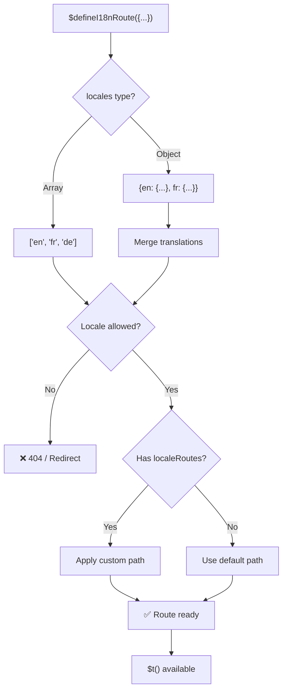
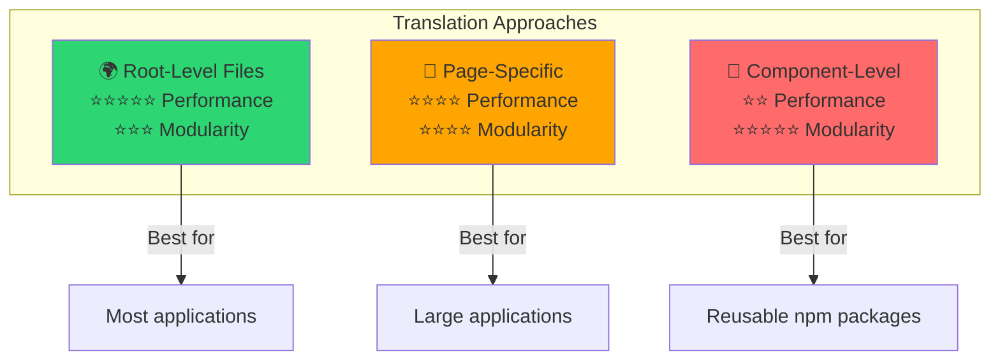

# 📖 Traduzioni per componente

Impara come definire le traduzioni direttamente all'interno dei componenti Vue usando `$defineI18nRoute` per una localizzazione modulare e manutenibile.

## 📖 Panoramica

Le traduzioni per componente in `Nuxt I18n Micro` ti permettono di definire le traduzioni direttamente all'interno di componenti o pagine specifiche usando la funzione `$defineI18nRoute`. Questo approccio è ideale per gestire contenuti localizzati che sono unici per singoli componenti, fornendo un metodo più modulare e manutenibile per gestire le traduzioni.

## 🚀 Avvio rapido

### Uso di base

```vue
<template>
  <div>
    <h1>{{ $t('greeting') }}</h1>
    <p>{{ $t('farewell') }}</p>
  </div>
</template>

<script setup lang="ts">
import { useNuxtApp } from '#imports'

const { $defineI18nRoute, $t } = useNuxtApp()

$defineI18nRoute({
  locales: {
    en: { greeting: 'Hello', farewell: 'Goodbye' },
    fr: { greeting: 'Bonjour', farewell: 'Au revoir' },
    de: { greeting: 'Hallo', farewell: 'Auf Wiedersehen' },
  },
})
</script>
```

### Configurazione richiesta (`script setup`)

`$defineI18nRoute` è un'iniezione dell'app Nuxt, non una macro globale.  
Ottienila sempre da `useNuxtApp()` prima di chiamarla.

```ts
import { useNuxtApp } from '#imports'

const { $defineI18nRoute } = useNuxtApp()
```

## 🏗️ Meta delle rotte a build time

In fase di build, un unplugin di Vite scansiona i file `.vue` di pagina alla ricerca di chiamate a `defineI18nRoute(...)` / `$defineI18nRoute(...)` ed estrae le restrizioni di locale, `localeRoutes` e `disableMeta` nei metadati delle rotte utilizzati da `@i18n-micro/route-strategy`.

- **Build**: l'unplugin (`src/unplugin-define-i18n-route.ts`) viene eseguito durante la trasformazione di Vite e scrive `i18n-route-meta.json` sotto la directory di build di Nuxt
- **Runtime**: il plugin define (`03.define.ts`) espone ancora `$defineI18nRoute` in `script setup` per la configurazione in dev e inline

Normalmente chiami `$defineI18nRoute` solo nelle pagine — il modulo gestisce automaticamente l'estrazione a build time.

## 🔧 Funzione `$defineI18nRoute`

La funzione `$defineI18nRoute` configura il comportamento della rotta in base alla locale corrente, offrendo una soluzione versatile per:

- Controllare l'accesso a rotte specifiche in base alle locale disponibili
- Fornire traduzioni per locale specifiche
- Impostare rotte personalizzate per locale differenti
- Controllare la generazione dei meta tag

### Come funziona



### Firma del metodo

```typescript
const { $defineI18nRoute } = useNuxtApp();
$defineI18nRoute(routeDefinition: DefineI18nRouteConfig);
```

### Parametri

| Parametro      | Tipo                                       | Descrizione                        |
| -------------- | ------------------------------------------ | ---------------------------------- |
| `locales`      | `string[] \| Record<string, Translations>` | Locale disponibili per la rotta    |
| `localeRoutes` | `Record<string, string>`                   | Rotte personalizzate per locale specifiche |
| `disableMeta`  | `boolean \| string[]`                      | Controlla la generazione dei meta tag i18n |

### Descrizioni dettagliate dei parametri

#### `locales`

Definisce quali locale sono disponibili per la rotta:

<CodeGroup>
```typescript Array Format
$defineI18nRoute({
  locales: ['en', 'fr', 'de'], // Simple array of locale codes
})
```

```typescript Object Format
$defineI18nRoute({
  locales: {
    en: { greeting: 'Hello', farewell: 'Goodbye' },
    fr: { greeting: 'Bonjour', farewell: 'Au revoir' },
    de: { greeting: 'Hallo', farewell: 'Auf Wiedersehen' },
    ru: {}, // Russian locale allowed but no translations provided
  },
})
```
</CodeGroup>

#### `localeRoutes`

Consente rotte personalizzate per locale specifiche:

```typescript
$defineI18nRoute({
  localeRoutes: {
    en: '/welcome',
    fr: '/bienvenue',
    de: '/willkommen',
    ru: '/privet', // Custom route path for Russian locale
  },
})
```

#### `disableMeta`

Controlla la generazione dei meta tag i18n:

<CodeGroup>
```typescript Disable All Meta
$defineI18nRoute({
  locales: ['en', 'fr', 'de'],
  disableMeta: true, // Disables all i18n meta tags
})
```

```typescript Disable Specific Locales
$defineI18nRoute({
  locales: ['en', 'fr', 'de'],
  disableMeta: ['en', 'fr'], // Only English and French won't have meta tags
})
```
</CodeGroup>

## 💡 Casi d'uso

### 1. Controllo degli accessi in base alle locale

Definisci quali locale sono ammesse per rotte specifiche:

```typescript
$defineI18nRoute({
  locales: ['en', 'fr', 'de'], // Only these locales are allowed for this route
})
```

### 2. Fornire traduzioni specifiche del componente

Usa l'oggetto `locales` per fornire traduzioni specifiche per ciascuna rotta:

```typescript
$defineI18nRoute({
  locales: {
    en: {
      greeting: 'Hello',
      farewell: 'Goodbye',
      description: 'Welcome to our application',
    },
    fr: {
      greeting: 'Bonjour',
      farewell: 'Au revoir',
      description: 'Bienvenue dans notre application',
    },
    de: {
      greeting: 'Hallo',
      farewell: 'Auf Wiedersehen',
      description: 'Willkommen in unserer Anwendung',
    },
  },
})
```

### 3. Routing personalizzato per locale

Definisci percorsi personalizzati per locale specifiche:

```typescript
$defineI18nRoute({
  locales: ['en', 'fr', 'de'],
  localeRoutes: {
    en: '/welcome',
    fr: '/bienvenue',
    de: '/willkommen',
  },
})
```

### 4. Disabilitare i meta tag

Controlla la generazione dei meta tag SEO per rotte o locale specifiche:

```typescript
// Disable meta tags for all locales
$defineI18nRoute({
  locales: ['en', 'fr', 'de'],
  disableMeta: true,
})

// Disable meta tags only for specific locales
$defineI18nRoute({
  locales: ['en', 'fr', 'de'],
  disableMeta: ['en', 'fr'],
})
```

## ✅ Formati di configurazione supportati

Il parser di `$defineI18nRoute` supporta diverse configurazioni JavaScript:

### Configurazioni statiche

<CodeGroup>
```typescript Static Arrays
$defineI18nRoute({
  locales: ['en', 'de', 'fr'],
})
```

```typescript Static Objects
$defineI18nRoute({
  locales: {
    en: { greeting: 'Hello' },
    de: { greeting: 'Hallo' },
  },
  localeRoutes: {
    en: '/welcome',
    de: '/willkommen',
  },
})
```
</CodeGroup>

### Configurazioni dinamiche

<CodeGroup>
```typescript Variables and Functions
const locales = ['en', 'de', 'fr']
const routes = { en: '/welcome', de: '/willkommen' }

$defineI18nRoute({
  locales: locales,
  localeRoutes: routes,
})
```

```typescript Template Literals
const prefix = 'api'

$defineI18nRoute({
  locales: [`${prefix}-en`, `${prefix}-de`],
  localeRoutes: {
    [`${prefix}-en`]: `/api/welcome`,
    [`${prefix}-de`]: `/api/willkommen`,
  },
})
```
</CodeGroup>

### Configurazioni avanzate

<CodeGroup>
```typescript Spread Operator
const baseLocales = ['en', 'de']
const additionalLocales = ['fr', 'es']

$defineI18nRoute({
  locales: [...baseLocales, ...additionalLocales],
})
```

```typescript Array of Objects
$defineI18nRoute({
  locales: [
    { code: 'en', name: 'English' },
    { code: 'de', name: 'German' },
  ],
})
```
</CodeGroup>

### Logica condizionale

```typescript
$defineI18nRoute({
  locales: process.env.NODE_ENV === 'production' ? ['en', 'de'] : ['en', 'de', 'fr', 'es'],
})
```

### Oggetti annidati complessi

```typescript
$defineI18nRoute({
  locales: {
    'en-us': {
      region: 'US',
      currency: 'USD',
      format: {
        date: 'MM/DD/YYYY',
        time: '12h',
      },
    },
    'de-de': {
      region: 'DE',
      currency: 'EUR',
      format: {
        date: 'DD.MM.YYYY',
        time: '24h',
      },
    },
  },
})
```

### Commenti e formattazione

```typescript
$defineI18nRoute({
  // Supported locales for this component
  locales: [
    'en', // English
    'de', // German
    'fr', // French
  ],
  // Custom routes for each locale
  localeRoutes: {
    en: '/welcome',
    de: '/willkommen',
    fr: '/bienvenue',
  },
})
```

## ❌ Non supportato

Il parser ha limitazioni e non può gestire:

- **Import esterni** (istruzioni `import`)
- **Funzioni async/await**
- **Metodi di classe**
- **Flussi di controllo complessi** (loop, try-catch, switch)
- **Arrow function** nella configurazione
- **Generator function**

## 📝 Esempio completo

Ecco un esempio completo che mostra tutte le funzionalità:

```vue
<template>
  <div class="welcome-page">
    <header>
      <h1>{{ $t('title') }}</h1>
      <p>{{ $t('subtitle') }}</p>
    </header>

    <main>
      <section>
        <h2>{{ $t('features.title') }}</h2>
        <ul>
          <li v-for="feature in $t('features.list')" :key="feature">
            {{ feature }}
          </li>
        </ul>
      </section>

      <section>
        <h2>{{ $t('contact.title') }}</h2>
        <p>{{ $t('contact.description') }}</p>
        <a :href="$t('contact.email')">{{ $t('contact.email') }}</a>
      </section>
    </main>

    <footer>
      <p>{{ $t('footer.copyright') }}</p>
    </footer>
  </div>
</template>

<script setup lang="ts">
import { useNuxtApp } from '#imports'

const { $defineI18nRoute, $t } = useNuxtApp()

// Define comprehensive i18n route configuration
$defineI18nRoute({
  locales: {
    en: {
      title: 'Welcome to Our Platform',
      subtitle: 'The best solution for your needs',
      features: {
        title: 'Key Features',
        list: ['High Performance', 'Easy to Use', 'Scalable Architecture'],
      },
      contact: {
        title: 'Get in Touch',
        description: "We'd love to hear from you",
        email: 'mailto:contact@example.com',
      },
      footer: {
        copyright: '© 2024 Example Company. All rights reserved.',
      },
    },
    fr: {
      title: 'Bienvenue sur Notre Plateforme',
      subtitle: 'La meilleure solution pour vos besoins',
      features: {
        title: 'Fonctionnalités Clés',
        list: ['Haute Performance', 'Facile à Utiliser', 'Architecture Évolutive'],
      },
      contact: {
        title: 'Contactez-Nous',
        description: 'Nous aimerions avoir de vos nouvelles',
        email: 'mailto:contact@example.com',
      },
      footer: {
        copyright: '© 2024 Example Company. Tous droits réservés.',
      },
    },
    de: {
      title: 'Willkommen auf Unserer Plattform',
      subtitle: 'Die beste Lösung für Ihre Bedürfnisse',
      features: {
        title: 'Hauptfunktionen',
        list: ['Hohe Leistung', 'Einfach zu Verwenden', 'Skalierbare Architektur'],
      },
      contact: {
        title: 'Kontaktieren Sie Uns',
        description: 'Wir würden gerne von Ihnen hören',
        email: 'mailto:contact@example.com',
      },
      footer: {
        copyright: '© 2024 Example Company. Alle Rechte vorbehalten.',
      },
    },
  },
  localeRoutes: {
    en: '/welcome',
    fr: '/bienvenue',
    de: '/willkommen',
  },
  disableMeta: false, // Enable SEO meta tags
})
</script>

<style scoped>
.welcome-page {
  max-width: 800px;
  margin: 0 auto;
  padding: 2rem;
}

header {
  text-align: center;
  margin-bottom: 3rem;
}

section {
  margin-bottom: 2rem;
}

footer {
  text-align: center;
  margin-top: 3rem;
  padding-top: 2rem;
  border-top: 1px solid #eee;
}
</style>
```

## ⚡ Considerazioni sulle prestazioni

Incorporare le traduzioni nei componenti Single File (SFC) può influire sulle prestazioni:

### Potenziali problemi

- **Dimensione file aumentata**: Tutte le locale risiedono nell'SFC, a differenza dei file di traduzione separati che consentono un caricamento consapevole della locale
- **Rendering più lento**: Le traduzioni in-file vengono elaborate a runtime
- **Utilizzo della memoria**: Tutte le traduzioni vengono caricate indipendentemente dalla locale corrente

### Best practice

- **Usa traduzioni pagina per pagina** per prestazioni ottimali
- **Riserva le traduzioni a livello di componente** a casi specifici come:
  - Componenti riutilizzabili pubblicati su npm
  - Traduzioni non adatte per i file di root
  - Componenti che devono essere autonomi

### Prestazioni vs modularità

Bilancia le esigenze del tuo progetto quando scegli un approccio:



| Approccio             | Prestazioni | Modularità | Caso d'uso            |
| -------------------- | ----------- | ---------- | ------------------- |
| **File di root** | ⭐⭐⭐⭐⭐  | ⭐⭐⭐     | La maggior parte delle applicazioni   |
| **Per pagina**    | ⭐⭐⭐⭐    | ⭐⭐⭐⭐   | Applicazioni grandi  |
| **Per componente**  | ⭐⭐        | ⭐⭐⭐⭐⭐ | Componenti riutilizzabili |

## 🎯 Best practice

### 1. Mantieni le traduzioni vicine ai componenti

Definisci le traduzioni direttamente all'interno del componente rilevante per mantenere il contenuto localizzato organizzato e manutenibile.

### 2. Usa oggetti locale per flessibilità

Usa il formato oggetto per la proprietà `locales` quando sono richieste traduzioni specifiche o controlli di accesso in base alle locale.

### 3. Documenta le rotte personalizzate

Documenta chiaramente qualsiasi rotta personalizzata impostata per locale differenti per mantenere chiarezza e semplificare sviluppo e manutenzione.

### 4. Considera l'impatto sulle prestazioni

Valuta se le traduzioni a livello di componente sono necessarie per il tuo caso d'uso, considerando le implicazioni sulle prestazioni.

### 5. Usa TypeScript

Sfrutta TypeScript per una migliore sicurezza dei tipi e il supporto IntelliSense:

```typescript
interface ComponentTranslations {
  title: string
  subtitle: string
  features: {
    title: string
    list: string[]
  }
}

$defineI18nRoute({
  locales: {
    en: {
      title: 'Welcome',
      subtitle: 'Subtitle',
      features: {
        title: 'Features',
        list: ['Feature 1', 'Feature 2'],
      },
    } as ComponentTranslations,
  },
})
```

## 📚 Argomenti correlati

- **[Avvio rapido](/quickstart)** - Configurazione di base
- **[Riferimento API](/api/methods)** - Documentazione completa dei metodi
- **[Esempi](/examples)** - Esempi di utilizzo reale

## Riepilogo

La funzionalità delle traduzioni per componente, alimentata dalla funzione `$defineI18nRoute`, offre un modo potente e flessibile per gestire la localizzazione all'interno della tua applicazione Nuxt. Consentendo la definizione di contenuti localizzati e routing a livello di componente, aiuta a creare un'esperienza altamente personalizzata e amichevole adatta alla lingua e alle preferenze regionali del tuo pubblico.

Scegli l'approccio che meglio si adatta alle esigenze del tuo progetto, considerando sia i requisiti di prestazioni sia le preoccupazioni di manutenibilità.
