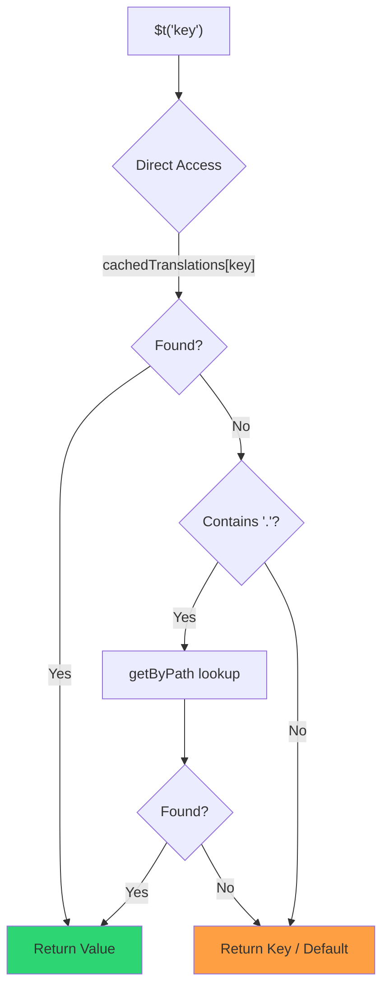

# 🚀 Guida alle prestazioni

## 📖 Introduzione

`Nuxt I18n Micro` è progettato con le prestazioni in mente, offrendo un miglioramento significativo rispetto ai moduli di internazionalizzazione (i18n) tradizionali come `nuxt-i18n`. Questa guida fornisce una panoramica approfondita dei benefici in termini di prestazioni derivanti dall'uso di `Nuxt I18n Micro`, e come si confronta con altre soluzioni.

## 🤔 Perché concentrarsi sulle prestazioni?

Nei progetti di grandi dimensioni e negli ambienti ad alto traffico, i colli di bottiglia nelle prestazioni possono portare a tempi di build lenti, aumento dell'utilizzo della memoria e tempi di risposta del server scadenti. Questi problemi diventano più pronunciati con configurazioni i18n complesse che coinvolgono grandi file di traduzione. `Nuxt I18n Micro` è stato costruito per affrontare direttamente queste sfide ottimizzando per velocità, efficienza di memoria e impatto minimo sulla dimensione del bundle della tua applicazione.

## 📊 Confronto delle prestazioni

Abbiamo condotto una serie di test su fixture identiche tramite `pnpm test:performance` (`pnpm -C scripts cli performance`) contro **`@nuxtjs/i18n@10.6.0`**. Metodologia completa e grafici: [Risultati dei test di prestazioni](/guides/performance-results).

Profilo CLI predefinito: **4 locale** × **2 pagine** (`index`, `page`) × ~10k chiavi foglia dell'index. Alza `--locales` / `--keys` per un carico di regressione più pesante. Il report divide **codice**, **traduzioni** (inclusi `@nuxtjs/i18n` `chunks/raw/*`) e **output totale** deployabile.

```bash
pnpm test:performance
pnpm -C scripts cli performance --only micro --skip-stress
pnpm -C scripts cli performance --locales 12 --keys 100000 --runs 3
```

### ⏱️ Tempo di build e consumo di risorse

<Accordion title="**@nuxtjs/i18n v10.6**">
- **Code Bundle**: 2.16 MB
- **Traduzioni**: 7.21 MB (chunk di messaggi + payload delle locale)
- **Totale deployabile**: 9.37 MB
- **Utilizzo massimo di memoria**: 1.821 MB
- **Tempo trascorso**: 8.34s (media di 3)
</Accordion>

<Tip>
- **Code Bundle**: 1.74 MB — **~19% di codice in meno rispetto a `@nuxtjs/i18n` v10.6**
- **Traduzioni**: 6.8 MB (JSON lazy-loaded)
- **Totale deployabile**: 8.54 MB
- **Utilizzo massimo di memoria**: 1.065 MB — **~41% di memoria in meno rispetto a `@nuxtjs/i18n` v10.6**
- **Tempo trascorso**: 5.34s — **~36% più veloce di `@nuxtjs/i18n` v10.6** (≈ baseline plain-nuxt)
</Tip>

> Vecchi documenti che mostravano `@nuxtjs/i18n` “code ≈ 15 MB / translations 0 B” contavano i file di messaggi `chunks/raw` come codice dell'app. Il classificatore attuale li separa; il gap sul **codice** è più piccolo, e micro rimane in testa per tempo di build, RSS di picco e test di carico.

Consulta il [report di benchmark completo](/guides/performance-results) per grafici, risultati Autocannon e dettagli sulle fixture.

### 🌐 Prestazioni del server sotto carico

Artillery (6s@6 + 60s@60) e Autocannon (10c / 10s), media di 3 esecuzioni consecutive per fixture.

<Accordion title="**@nuxtjs/i18n v10.6**">
- **Richieste al secondo (Artillery)**: 143 [#/sec]
- **Tempo medio di risposta**: 956 ms
- **RPS Autocannon / latenza media**: 72 / 139 ms
</Accordion>

<Tip>
- **Richieste al secondo (Artillery)**: 275 [#/sec] — **~93% in più di `@nuxtjs/i18n` v10.6**
- **Tempo medio di risposta**: 483 ms — **~49% più veloce di `@nuxtjs/i18n` v10.6**
- **RPS Autocannon / latenza media**: 162 / 62 ms
</Tip>

### 📈 Confronto visivo

<Note>
Grafico interattivo omesso nella documentazione Mintlify. Consulta le tabelle di benchmark in questa pagina o i [documenti VitePress](https://s00d.github.io/nuxt-i18n-micro/guide/performance-results) per il grafico: `chart`.
</Note>

<Note>
Grafico interattivo omesso nella documentazione Mintlify. Consulta le tabelle di benchmark in questa pagina o i [documenti VitePress](https://s00d.github.io/nuxt-i18n-micro/guide/performance-results) per il grafico: `chart`.
</Note>

| Metrica         | @nuxtjs/i18n v10.6 | i18n-micro | Miglioramento        |
| --------------- | ------------------ | ---------- | ------------------ |
| Tempo di build      | 8.34s              | 5.34s      | **~36% più veloce**    |
| Memoria (build)  | 1.821 MB           | 1.065 MB   | **~41% in meno**      |
| Code Bundle     | 2.16 MB            | 1.74 MB    | **~19% più piccolo**   |
| Tempo di risposta   | 956 ms             | 483 ms     | **~49% più veloce**    |
| RPS (Artillery) | 143                | 275        | **~93% in più**      |

### 🔍 Interpretazione dei risultati

Rispetto all'attuale `@nuxtjs/i18n` **v10.6** (profilo CLI predefinito, media di 3):

- 🗜️ **Grafo di codice più piccolo**: ~1.74 MB vs ~2.16 MB una volta che i chunk dei messaggi non sono più etichettati erroneamente come "codice".
- 🧠 **RSS di build più basso**: ~1.1 GB di picco vs ~1.8 GB.
- 🕒 **Build più veloci**: ~5.3s vs ~8.3s (micro corrisponde alla baseline di plain-Nuxt su questo profilo).
- ⚡ **Molto meglio sotto carico**: ~275 vs ~143 RPS Artillery, ~162 vs ~72 RPS Autocannon, latenza media inferiore.

I numeri assoluti differiscono dalle vecchie tabelle pubblicate (dizionari più piccoli, Nuxt più vecchio e una divisione ingiusta "0 B translations" per `@nuxtjs/i18n`). Direzionalmente identico: micro resta avanti sul costo di build e sul throughput di richieste.

## ⚙️ Ottimizzazioni chiave

### 🛠️ Design minimalista

`Nuxt I18n Micro` è costruito attorno a un'architettura minimalista con un core piccolo e pacchetti di strategia dedicati. Ciò riduce l'overhead e semplifica la logica interna, portando a prestazioni migliorate.

### 🚦 Routing efficiente

In v3, la generazione delle rotte e la logica dei percorsi runtime sono divise in pacchetti dedicati per un tree-shaking ottimale:

- **`@i18n-micro/route-strategy`** — Generazione di rotte in fase di build: estende le pagine Nuxt con rotte localizzate. Solo la strategia selezionata (`no_prefix`, `prefix`, `prefix_except_default`, `prefix_and_default`) viene inclusa.
- **`@i18n-micro/path-strategy`** — Risoluzione dei percorsi a runtime, redirect e generazione dei link. Usa funzioni pure e flag di contesto pre-computati per minimizzare le allocazioni sui percorsi hot. Le sottopath di esportazione (`/prefix`, `/no-prefix`, ecc.) garantiscono che solo l'implementazione scelta venga inclusa nel bundle.

Questo approccio mantiene la configurazione di routing leggera e garantisce una risoluzione delle rotte veloce indipendentemente dal numero di locale.

### 📂 Caricamento snello delle traduzioni

Il modulo supporta solo file JSON per le traduzioni, con una netta separazione tra file globali e specifici per pagina. Ciò garantisce che venga caricata solo la traduzione necessaria in ogni momento, migliorando ulteriormente le prestazioni.

### 🔒 Cache singleton globalThis

A partire da v3.0.0, il modulo usa un pattern singleton `globalThis` con `Symbol.for` per garantire una singola istanza di cache nell'intero processo Node.js. Ciò impedisce:

- Duplicazione della cache quando lo stesso modulo viene incluso nel bundle più volte
- Ricreazione degli oggetti per richiesta che causa pressione del garbage collector
- Fughe di memoria da istanze di cache orfane

```mermaid
flowchart LR
    subgraph Process["Node.js Process"]
        G["globalThis[Symbol.for('CACHE')]"]

        subgraph R1["SSR Request 1"]
            P1[Plugin Instance] --> G
        end

        subgraph R2["SSR Request 2"]
            P2[Plugin Instance] --> G
        end

        subgraph R3["SSR Request 3"]
            P3[Plugin Instance] --> G
        end
    end

    G --> Cache["Single Map Instance"]
    Cache --> D1["en:index → translations"]
    Cache --> D2["en:about → translations"
```

```typescript
// Internal implementation pattern
const CACHE_KEY = Symbol.for('__NUXT_I18N_STORAGE_CACHE__')
if (!globalThis[CACHE_KEY]) {
  globalThis[CACHE_KEY] = new Map()
}
```

### ⚡ Funzione di traduzione ottimizzata (tFast)

La funzione `$t()` usa una strategia di lookup diretto ottimizzata per la velocità:

1. **Contesto pre-computato**: La locale e il nome della rotta vengono calcolati una volta durante la navigazione, non ad ogni chiamata di `$t()`
2. **Lookup a fonte unica**: Tutte le traduzioni (root + specifiche per pagina + fallback) sono pre-unite in fase di build in un singolo file per pagina — non è necessario un lookup a strati
3. **Deep merge cumulativo alla navigazione**: Quando si naviga all'interno della stessa locale, le nuove traduzioni della pagina vengono unite in profondità (profondità 2 livelli) nel dizionario attivo, così le chiavi della pagina precedente rimangono visibili durante le animazioni di transizione — anche quando le pagine condividono prefissi annidati sovrapposti (ad es. entrambe le pagine hanno chiavi sotto `common.*`)
4. **Garbage collection tramite `page:transition:finish`**: Dopo che l'animazione di transizione è completamente terminata, il dizionario unito viene sostituito con le traduzioni pulite solo per la nuova pagina, liberando memoria dalle chiavi della vecchia pagina
5. **Accesso diretto alle proprietà**: Usa `obj[key]` invece di lookup su Map per i percorsi hot



```typescript
// Simplified lookup logic — single active dictionary
let val = cachedTranslations[key]
if (val === undefined && key.includes('.')) {
  val = getByPath(cachedTranslations, key)
}
```

### 💉 Caricamento lato server (nessun embed HTML)

Le traduzioni caricate durante SSR restano nella **memoria del server** per `$t` durante il rendering. **Non** vengono copiate in `nuxtApp.payload` / nel documento HTML (stessa idea di `@nuxtjs/i18n` con `experimental.preload: false`).

Sul client, `01.plugin.ts` fa `await` di `switchContext`, che carica `/\{apiBaseUrl\}/:page/:locale/data.json` prima che l'app continui — una richiesta, non un blob inline da 8 MB.

`NuxtI18n` mantiene comunque il dizionario unito attivo (`cachedTranslations`) per `$t()` / `$has()`. Le navigazioni nella stessa locale fanno deep merge dei chunk di pagina finché `page:transition:finish` non ripulisce le chiavi obsolete.

#### Situazione attuale

I numeri sotto sono letti dal file di budget misurato ed applicato da `pnpm run budget:payload`.

{/* generated:payload-budget — do not edit; run `pnpm run docs:generate` */}

Misurato su `playground` in `/`, `/de`:

| Misurazione | Dimensione |
| --- | --- |
| Sorgenti di traduzione su disco | 15.2 MB |
| Serviti come file di payload separati | 76.3 MB |
| Il più grande `__NUXT_DATA__` inline | 6.9 MB |
| Asset client | 449.5 KB |

Il playground porta un dizionario deliberatamente sovradimensionato, quindi queste non sono cifre da aspettarsi da un'applicazione reale — sono un punto fisso rispetto a cui misurare. Il budget fallisce quando crescono in modo inatteso, ed è così che un cambiamento accidentale a ciò che il payload trasporta viene notato.

{/* /generated:payload-budget */}

### 💾 Caching e pre-rendering

Le traduzioni passano attraverso diverse cache, e sapere quale ha risposto a una richiesta è la differenza tra una sessione di debug di cinque minuti e una di cinque ore. Ce ne sono quattro, nell'ordine in cui una richiesta le incontra:

| Layer | Dove | Durata | Ripulita da |
| --- | --- | --- | --- |
| Browser / CDN | `Cache-Control` su `/\{apiBaseUrl\}/**` | `httpCacheDuration`, `immutable` | un nuovo `?v=` — ovvero un deploy che ha cambiato le traduzioni |
| Cache di rotta Nitro | `routeRules['/\{apiBaseUrl\}/**'].cache` | 60 s, stale-while-revalidate | riavvio del server |
| Loader server | `CacheControl` in-process, chiave `locale:routeName` | durata del processo, o `cacheTtl` | riavvio del server, HMR in dev |
| Store client | `translationStorage` + il chunk attivo in `NuxtI18n` | durata della pagina | reload |

Due regole le tengono coerenti:

- **La cache di rotta Nitro esiste solo quando esiste `?v=`.** Con un cache-buster ogni URL è unico rispetto al suo contenuto, quindi metterlo in cache sul server è privo di rischi di stallo. Imposta `dateBuild: 0` e quel layer viene spento, perché l'URL è quindi stabile e la risposta dice `must-revalidate` — una cache lato server risponderebbe da una entry obsoleta per un minuto e la vanificherebbe silenziosamente.
- **`immutable` richiede anche `?v=`.** Senza un buster l'header è `public, max-age=0, must-revalidate`, qualunque cosa dica `httpCacheDuration`: un lungo `max-age` su un URL che non cambia mai fissa la prima risposta che un browser abbia mai visto.

<Warning>
Con `translationPayloads.publicAssets` (predefinito in modalità premerged) i payload vengono copiati in `public/<apiBaseUrl>/\{page\}/\{locale\}/data.json`. Una piattaforma che serve quella directory da sé (Cloudflare Pages, Firebase Hosting, `npx serve`) applica i propri header — l'header di `routeRules` Nitro raggiunge solo le risposte che passano attraverso il server. Imposta la policy di cache per quei file statici nella configurazione della piattaforma stessa.
</Warning>

🏁 **Pre-rendering**: in modalità premerged, `publicAssets` scrive già l'albero URL client in `public/`. Opta per `prerenderRoutes` solo se hai bisogno che Nitro materializzi le rotte handler quando quella copia è disabilitata.

### 🗜️ Payload pubblici compressi

Quando `nitro.compressPublicAssets` è abilitato, i payload di traduzione copiati nella directory pubblica ottengono anche fratelli `.gz` e `.br`:

```ts
export default defineNuxtConfig({
  nitro: { compressPublicAssets: true },
})
```

Nitro comprime gli asset pubblici prima dell'hook che copia i payload, quindi senza questa opzione sarebbero l'unica parte non compressa di una build statica. Il modulo non attiva la compressione da solo — applica solo l'impostazione che hai scelto. La selezione per encoding (`\{ gzip: true, brotli: false \}`) viene rispettata.

Payload dell'index del playground: 6.651.984 B raw, 1.012.831 B gzip, 821.617 B brotli.

### ☁️ Output di payload serverless

Su **Node**, l'SSR legge i JSON di traduzione da `public/<apiBaseUrl>` (`readFile`, nessun `serverAssets` Nitro / Rollup `raw:`). Su **Edge**, `serverAssets` Nitro incorpora lo stesso albero (preferisci `mode: 'source'` per cataloghi grandi).

```typescript
export default defineNuxtConfig({
  i18n: {
    translationPayloads: {
      serverAssets: true, // default — Node → public copy; Edge → serverAssets embed
      publicAssets: true, // default in premerged mode
    },
  },
})
```

Usa `translationPayloads.mode: 'source'` per embed Edge compatti (e copie pubbliche compatte opzionali):

```typescript
export default defineNuxtConfig({
  i18n: {
    translationPayloads: {
      mode: 'source',
    },
  },
})
```

`mode: 'source'` mantiene compatti i file sorgente uniti dai layer e unisce root/pagina/fallback a runtime tramite la rotta integrata `/_locales` (o `assets:i18n` di Edge). Per impostazione predefinita disabilita le copie di asset pubblici e le rotte payload pre-renderizzate.

<Warning>
`prerenderRoutes` è `false` per impostazione predefinita. Con `mode: 'source'`, anche `publicAssets` è `false` per impostazione predefinita. L'hosting puramente statico senza un runtime Nitro/edge non può quindi caricare traduzioni sul client a meno che non abiliti uno di questi output, mantieni `serverHandler` disponibile a runtime o ospiti i payload esternamente.

Il predefinito premerged + `publicAssets` posiziona già `/\{apiBaseUrl\}/\{page\}/\{locale\}/data.json` sotto `public/`, così gli host statici possono servire fetch client senza Nitro.
</Warning>

<Warning>
Impostare `apiBaseServerHost` o `apiBaseClientHost` sposta il servizio dei payload su quell'origine, il che comporta i propri requisiti — vedi [Configurazione → Host CDN esterni](/guides/configuration#external-cdn-hosts).
</Warning>

Oppure disabilita singoli output HTTP/pubblici e ospita i payload esternamente:

```typescript
export default defineNuxtConfig({
  i18n: {
    apiBaseClientHost: 'https://cdn.example.com',
    apiBaseServerHost: 'https://cdn.example.com',
    translationPayloads: {
      serverHandler: false,
      publicAssets: false,
      prerenderRoutes: false,
    },
  },
})
```

Mantieni `serverHandler` abilitato quando ti affidi alla rotta locale integrata `/\{apiBaseUrl\}/:page/:locale/data.json`. Disabilitalo quando i payload sono ospitati esternamente e `apiBaseServerHost` punta a quell'origine esterna. Abilita `prerenderRoutes` solo quando hai bisogno che Nitro materializzi rotte di payload statiche e `publicAssets` non le ha già scritte.

Durante la build, il modulo avvisa quando l'output dei payload generati supera `translationPayloads.warnFileCount` (predefinito 500) o `translationPayloads.warnSizeBytes` (predefinito 10 MB). Avvisa anche quando tutti gli output locali sono disabilitati senza host di payload esterni configurati.

## 📝 Suggerimenti per massimizzare le prestazioni

Ecco alcuni suggerimenti per ottenere il massimo delle prestazioni da `Nuxt I18n Micro`:

- 📉 **Limita i dati di locale**: Includi solo le locale di cui hai bisogno nel tuo progetto per mantenere piccola la dimensione del bundle.
- 🗂️ **Usa traduzioni specifiche per pagina**: Organizza i tuoi file di traduzione per pagina per evitare di caricare dati non necessari.
- 💾 **Abilita il caching**: Sfrutta le funzionalità di caching per ridurre il carico del server e migliorare i tempi di risposta.
- 🏁 **Sfrutta il pre-rendering**: Pre-renderizza le tue traduzioni per accelerare i caricamenti delle pagine e ridurre l'overhead a runtime.

Per risultati dettagliati dei test di prestazioni, fai riferimento ai [Risultati dei test di prestazioni](/guides/performance-results).
