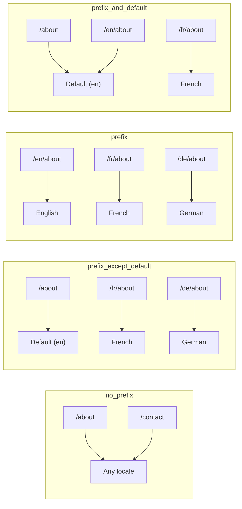
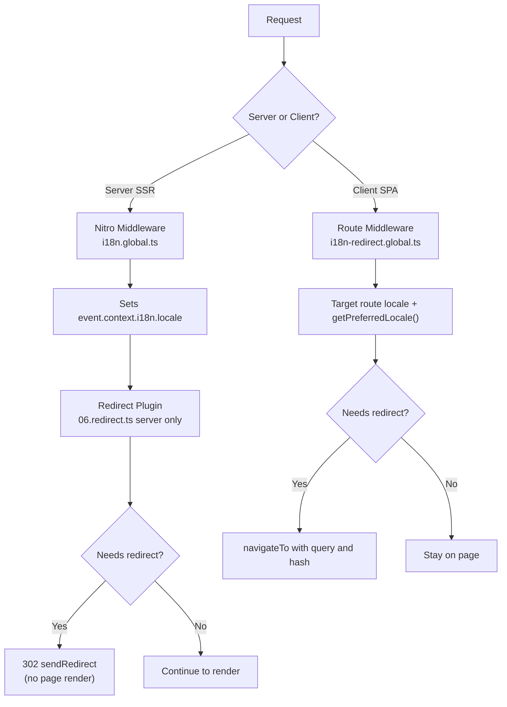

# 🗂️ Strategie di routing in Nuxt I18n Micro

## 📖 Panoramica

Nuxt I18n Micro controlla come i prefissi delle locale appaiono negli URL tramite l'opzione `strategy`. Sotto il cofano, due pacchetti implementano questo:

- **`@i18n-micro/route-strategy`** — generazione di rotte in fase di build (estende le pagine Nuxt con rotte localizzate)
- **`@i18n-micro/path-strategy`** — risoluzione dei percorsi a runtime, redirect, attributi SEO e generazione dei link

Il modulo Nuxt seleziona la classe di strategia corretta in fase di build e la alias tramite `#i18n-strategy`, così solo l'implementazione scelta viene inclusa nel bundle.

## 🚦 Strategie disponibili

{/* generated:option:strategy — do not edit; run `pnpm run docs:generate` */}

**Tipo** `Strategies` · **Predefinito** `'prefix_except_default'`

Strategia di routing URL per i prefissi delle locale.

- `'no_prefix'` — nessuna locale nell'URL; locale memorizzata nel cookie.
- `'prefix_except_default'` — prefisso in tutte le locale eccetto quella predefinita.
- `'prefix'` — prefisso sempre, inclusa la locale predefinita.
- `'prefix_and_default'` — come `prefix`, ma la locale predefinita è accessibile anche senza prefisso.

{/* /generated:option:strategy */}

### Confronto delle strategie



### 🛑 `no_prefix`

Gli URL non hanno segmento di locale. La locale è determinata dai cookie, dallo stato di `useI18nLocale()` o dal rilevamento del browser.

- **Rotte**: `/about`, `/contact` — stesso pattern URL per tutte le locale (nessun prefisso `/en/`, `/fr/`)
- **Persistenza della locale**: Tramite `localeCookie` (impostato automaticamente su `'user-locale'` se non specificato)
- **Percorsi personalizzati**: Supportati tramite [`globalLocaleRoutes`](/guides/configuration#globallocaleroutes) e [`defineI18nRoute`](/guides/custom-locale-routes) — vengono generati slug localizzati senza aggiungere un prefisso di locale agli URL (ad es. `/about` vs `/ueber-uns`). Le rotte annidate, gli alias e le restrizioni per locale sono più semplici che in `prefix_except_default`.

<Tip>
Quando si usa `no_prefix`, `localeCookie` viene automaticamente impostato su `'user-locale'` se non specificato. Ciò è richiesto perché l'URL non contiene informazioni sulla locale.
</Tip>

```typescript
i18n: {
  strategy: 'no_prefix'
  // localeCookie is automatically set to 'user-locale'
}
```

### 🚧 `prefix_except_default`

Tutte le rotte hanno un prefisso di locale **eccetto** la locale predefinita.

- **Locale predefinita**: `/about`, `/contact`
- **Altre locale**: `/fr/about`, `/de/contact`
- **La locale predefinita con prefisso restituisce 404**: `/en/about` → 404 (quando `en` è la predefinita)

```typescript
i18n: {
  strategy: 'prefix_except_default' // This is the default
}
```

### 🌍 `prefix`

Ogni rotta ha un prefisso di locale, inclusa quella predefinita.

- **Tutte le locale**: `/en/about`, `/fr/about`, `/de/about`
- **Root `/`**: Reindirizza a `/\{locale\}/` in base alla preferenza utente

```typescript
i18n: {
  strategy: 'prefix'
}
```

### 🔄 `prefix_and_default`

La locale predefinita è disponibile sia con sia senza prefisso. Le locale non predefinite hanno sempre un prefisso.

- **Locale predefinita**: sia `/about` sia `/en/about` sono validi
- **Altre locale**: `/fr/about`, `/de/about`
- **Nessun redirect da `/`**: Sia `/` sia `/en/` servono la locale predefinita

```typescript
i18n: {
  strategy: 'prefix_and_default'
}
```

## 🔀 Architettura dei redirect (v3)

In v3 la logica dei redirect è divisa in due layer per prestazioni ottimali:

### Come funziona



### Lato server (nessun flash)

1. Il **middleware Nitro** (`i18n.global.ts`) viene eseguito per primo — rileva la locale da URL, cookie o header `Accept-Language` e imposta `event.context.i18n.locale`
2. Il **plugin di redirect** (`06.redirect.ts`, solo server) verifica se il percorso corrente necessita di un redirect usando `i18nStrategy.getClientRedirect()` e restituisce un 302 **prima** che avvenga qualsiasi rendering di pagina
3. Ciò impedisce il "flash di errore" in cui gli utenti vedono brevemente una pagina errata prima del redirect

### Lato client (navigazione SPA)

1. Il middleware di rotta globale (`i18n-redirect.global.ts`) viene eseguito ad ogni navigazione client quando `redirects` è abilitato
2. Deriva la locale preferita prima dalla **rotta di destinazione**, poi ricade su `useI18nLocale().getPreferredLocale()`
3. Usa `i18nStrategy.getClientRedirect()` per decidere se è necessario un redirect
4. Preserva `query` e `hash` durante il redirect

### Ordine di priorità della locale

Sul server, il plugin di redirect determina la locale preferita in questo ordine:

1. **`useState('i18n-locale')`** — priorità massima (impostato programmaticamente tramite `useI18nLocale().setLocale()`)
2. **Cookie** — se `localeCookie` è configurato
3. **Header `Accept-Language`** — se `autoDetectLanguage: true`
4. **`defaultLocale`** — fallback finale

Sul client, il middleware di rotta preferisce la locale della rotta di destinazione, quindi usa la stessa catena di fallback stato/cookie.

### Comportamento di redirect per strategia

| Strategia               | Comportamento `GET /`                          | Cookie richiesto? |
| ----------------------- | --------------------------------------------- | ---------------- |
| `no_prefix`             | Nessun redirect (locale da cookie/stato)      | Impostato automaticamente |
| `prefix`                | 302 → `/\{locale\}/`                          | Consigliato      |
| `prefix_except_default` | 302 → `/\{locale\}/` se locale ≠ default      | Consigliato      |
| `prefix_and_default`    | Nessun redirect (sia `/` sia `/\{locale\}/` validi) | Opzionale         |

### Disabilitare i redirect

```typescript
i18n: {
  redirects: false // Disables automatic locale redirects
}
```

Quando `redirects: false`, i redirect automatici di locale sono disabilitati:

- **Server**: il plugin di redirect (`06.redirect.ts`, solo server) rimane registrato ma salta la logica di redirect. Esegue comunque i **controlli 404** per prefissi di locale non validi (ad es. `/xx/about` dove `xx` non è una locale valida) e la **sincronizzazione del cookie** dal prefisso URL (ad es. visitare `/fr/about` sincronizza il cookie a `fr`)
- **Client**: il middleware di rotta globale `i18n-redirect` **non viene registrato** — nessun redirect automatico SPA

## 🍪 Persistenza della locale basata su cookie

<Warning>
Quando si usa `prefix` o `prefix_except_default` con `redirects: true` (predefinito), **devi** impostare `localeCookie` affinché i redirect funzionino correttamente. Senza un cookie, il plugin di redirect non può ricordare la preferenza di locale dell'utente tra i ricaricamenti di pagina.

```typescript
i18n: {
  strategy: 'prefix_except_default',
  localeCookie: 'user-locale' // Required for redirects to work properly
}
```
</Warning>

**Come funziona `localeCookie` in v3:**

- Gestito internamente da `useI18nLocale()` — **non impostarlo manualmente** tramite `useCookie()`
- Quando un utente visita un URL con prefisso (ad es. `/fr/about`), il cookie viene sincronizzato automaticamente su `fr`
- Alla visita successiva a `/`, il valore del cookie viene usato per il redirect a `/\{locale\}/`
- Se il cookie contiene una locale non valida (non presente nell'elenco `locales`), ricade su `defaultLocale`

| Strategia               | `localeCookie` predefinito | Note                                |
| ----------------------- | ---------------------- | ------------------------------------ |
| `no_prefix`             | Auto: `'user-locale'`  | Richiesto; impostato automaticamente |
| `prefix`                | `null` (disabilitato)  | Imposta a `'user-locale'` per i redirect |
| `prefix_except_default` | `null` (disabilitato)  | Imposta a `'user-locale'` per i redirect |
| `prefix_and_default`    | `null` (disabilitato)  | Opzionale                            |

## 🔍 `autoDetectLanguage` e `autoDetectPath`

### `autoDetectLanguage`

{/* generated:option:autoDetectLanguage — do not edit; run `pnpm run docs:generate` */}

**Tipo** `boolean` · **Predefinito** `true`

Rileva automaticamente la lingua preferita dall'utente dall'header HTTP `Accept-Language`.
Usato in combinazione con `autoDetectPath` per decidere quando avviene il rilevamento.

{/* /generated:option:autoDetectLanguage */}

Il controllo viene eseguito nel middleware server ed è un fallback: un cookie o uno stato esistente ha la precedenza.

```typescript
i18n: {
  autoDetectLanguage: true
}
```

### `autoDetectPath`

{/* generated:option:autoDetectPath — do not edit; run `pnpm run docs:generate` */}

**Tipo** `string` · **Predefinito** `'/'`

Dove possono essere eseguiti i redirect basati su cookie/preferenza `Accept-Language` (quando `redirects` è abilitato).

- `'/'` — solo `/` (i deep link nella locale predefinita restano raggiungibili; predefinito)
- `'no_prefix'` — solo percorsi senza prefisso di locale
- `'*'` — ogni percorso, inclusa la riscrittura di un prefisso di locale esplicito
  (ad es. `/fr/about` → `/de/about` quando il cookie preferisce `de`)

- qualsiasi altra stringa — corrispondenza esatta del percorso (ad es. `'/welcome'`)

La pulizia della strategia con prefisso (ad es. `/en` → `/` in `prefix_except_default`) non è gated.

{/* /generated:option:autoDetectPath */}

```typescript
i18n: {
  autoDetectPath: '/' // Default: only root
  // autoDetectPath: '*' // All paths — redirects even /fr/about to /de/about
}
```

<Warning>
Con `autoDetectPath: '*'`, anche gli URL con un prefisso di locale esplicito (ad es. `/fr/about`) verranno reindirizzati se la locale preferita dell'utente differisce. Ciò può essere utile per configurazioni basate su dominio ma può confondere gli utenti che condividono URL.
</Warning>

Con il predefinito `autoDetectPath: '/'` e un cookie di locale:

| richiesta | cookie | risultato |
| --- | --- | --- |
| `/` | `de` | 302 → `/de` |
| `/about` | `de` | 200, locale predefinita (nessuna riscrittura) |

```typescript
i18n: {
  localeCookie: 'user-locale',
  strategy: 'prefix_except_default',
  // Default — remember language on entry, keep deep links stable
  autoDetectPath: '/',
  // Or redirect on every unprefixed path (but not /de/… → /fr/…):
  // autoDetectPath: 'no_prefix',
}
```

## ⚠️ Problemi noti e best practice

### 1. Mismatch di idratazione nella strategia `no_prefix`

Quando si usa `no_prefix`, la locale viene determinata dinamicamente. Se server e client non concordano sulla locale, vedrai un mismatch di idratazione.

**Soluzione**: Usa `useI18nLocale().setLocale()` in un plugin server (con `order: -10`) per impostare la locale prima dell'inizializzazione di i18n:

```ts
// plugins/i18n-loader.server.ts
export default defineNuxtPlugin({
  name: 'i18n-custom-loader',
  enforce: 'pre',
  order: -10,
  setup() {
    const { setLocale } = useI18nLocale()
    setLocale('ja') // Your detection logic here
  },
})
```

Consulta [Rilevamento personalizzato della lingua](/guides/custom-language-detection) per esempi dettagliati.

### 2. Usa rotte con nome con `localeRoute`

Il routing basato sui percorsi può causare problemi con la risoluzione delle rotte:

```typescript
// May cause issues
$localeRoute('/page')

// Preferred approach
$localeRoute({ name: 'page' })
```

### 3. Uso di `pages: false` con i18n

Quando si usa Nuxt con `pages: false`:

```typescript
export default defineNuxtConfig({
  pages: false,
  i18n: {
    strategy: 'no_prefix', // Recommended
    disablePageLocales: true, // Required
    localeCookie: 'user-locale', // Required for persistence
  },
})
```

**Limitazioni con `pages: false`:**

- Nessun redirect automatico
- Nessun rilevamento della locale basato su URL
- Il cambio di locale lato client richiede il ricaricamento della pagina o il caricamento manuale delle traduzioni

### 4. Gestione di cookie non validi

Se un cookie contiene una locale non valida (non presente nell'elenco `locales`), il modulo ricade in modo elegante su `defaultLocale`. Non vengono lanciati errori.

## 📝 Riepilogo delle best practice

| Raccomandazione            | Dettagli                                                                             |
| ------------------------- | ----------------------------------------------------------------------------------- |
| **Imposta `localeCookie`**    | Imposta sempre per le strategie con prefisso con `redirects: true`                             |
| **Usa `useI18nLocale()`** | Il modo centralizzato per gestire lo stato della locale (sostituisce `useState`/`useCookie` manuali) |
| **Usa rotte con nome**      | `$localeRoute(\{ name: 'page' \})` piuttosto che `$localeRoute('/page')`                       |
| **Locale programmatica**   | Usa `useI18nLocale().setLocale()` in un plugin server con `order: -10`              |
| **Evita cookie manuali**  | Non usare `useCookie('user-locale')` direttamente — `useI18nLocale()` gestisce questo      |
