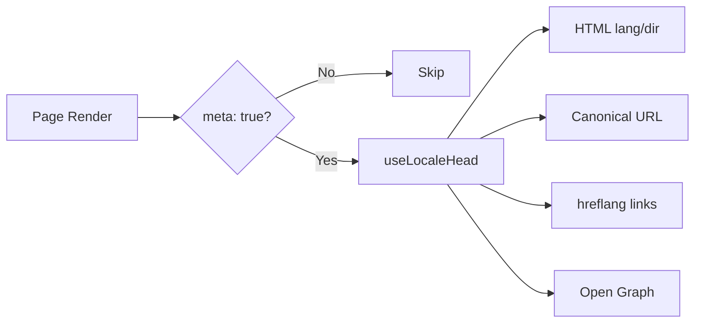

# 🌐 Guida SEO per Nuxt I18n Micro

## 📖 Introduzione

Un SEO (Search Engine Optimization) efficace è essenziale per garantire che il tuo sito multilingue sia accessibile e visibile a utenti di tutto il mondo tramite i motori di ricerca. `Nuxt I18n Micro` semplifica il processo di gestione del SEO per siti multilingue generando automaticamente meta tag e attributi essenziali che informano i motori di ricerca sulla struttura e sul contenuto del tuo sito.

Questa guida spiega come `Nuxt I18n Micro` gestisce il SEO per migliorare la visibilità del tuo sito e l'esperienza utente senza richiedere configurazioni aggiuntive.

## ⚙️ Gestione SEO automatica

### Flusso di generazione dei meta SEO



**Tag generati:**

| Tag             | Esempio                                                  |
| --------------- | -------------------------------------------------------- |
| Attributi HTML | `<html lang="en" dir="ltr">`                             |
| Canonical       | `<link rel="canonical" href="...">`                      |
| hreflang        | `<link rel="alternate" hreflang="en" href="...">`        |
| x-default       | `<link rel="alternate" hreflang="x-default" href="...">` |
| Open Graph      | `<meta property="og:locale" content="en_US">`            |

#### `og` per locale (`og:locale` vs BCP 47)

`<html lang>` e `hreflang` usano **BCP 47** tramite `locale.iso` (ad es. `ar-AE`).  
Open Graph richiede **`language_TERRITORY`** con un **underscore** (`ar_AE`), secondo il [protocollo OG](https://ogp.me/).

Per impostazione predefinita, `og:locale` viene derivato da `iso` quando la mappatura è univoca (`en-US` → `en_US`).  
Imposta una stringa **`og`** esplicita quando hai bisogno di un valore personalizzato (ad es. `zh-Hans` → `zh_CN`).  
Se non è disponibile né `og` né un `iso` convertibile, i tag `og:locale` non vengono generati — in sviluppo ricevi un avviso in console (rispetta `missingWarn`).

```typescript
i18n: {
  meta: true,
  locales: [
    { code: 'ar', iso: 'ar-AE', og: 'ar_AE', dir: 'rtl' },
    { code: 'en', iso: 'en-US' }, // og:locale → en_US
    { code: 'zh', iso: 'zh-Hans', og: 'zh_CN' }, // script tags need explicit og
  ],
}
```

### 🔑 Funzionalità SEO principali

Quando l'opzione `meta` è abilitata in `Nuxt I18n Micro`, il modulo gestisce automaticamente i seguenti aspetti SEO:

1. **🌍 Attributi di lingua e direzione**:
   - Il modulo imposta gli attributi `lang` e `dir` sul tag `<html>` in base alla locale corrente e alla direzione del testo (ad es. `ltr` per l'inglese o `rtl` per l'arabo).

2. **🔗 URL canonici**:
   - Il modulo genera un link canonico (`<link rel="canonical">`) per ciascuna pagina, garantendo che i motori di ricerca riconoscano la versione principale del contenuto.

3. **🌐 Link alternate di lingua (`hreflang`)**:
   - Il modulo genera automaticamente tag `<link rel="alternate" hreflang="">` per tutte le locale disponibili. Ciò aiuta i motori di ricerca a capire quali versioni linguistiche del tuo contenuto sono disponibili, migliorando l'esperienza utente per pubblici globali.
   - Ciascuna locale emette **un** tag: `hreflang = iso || code`. Quando `iso` è impostato, il `code` di routing non viene mai usato come `hreflang` (così chiavi di mercato come `mx` non diventano tag di lingua non validi).
   - L'opzione `hreflangBaseLanguage: true` emette anche un tag di lingua bare derivato da `iso` (ad es. `es-ES` → `es`), rivendicato dalla prima locale regionale in `locales`.

4. **🌏 Hreflang `x-default`**:
   - Il modulo genera automaticamente un tag `<link rel="alternate" hreflang="x-default">` che punta all'URL della locale predefinita. Ciò indica ai motori di ricerca quale URL mostrare agli utenti la cui lingua non corrisponde a nessuna delle locale definite. Non è richiesta alcuna configurazione aggiuntiva — funziona automaticamente quando `meta: true` è impostato.

5. **🔖 Metadati Open Graph**:
   - Il modulo genera meta tag Open Graph (`og:locale`, `og:url`, ecc.) per ciascuna locale, il che è particolarmente utile per la condivisione sui social media e l'indicizzazione dei motori di ricerca.

### 🛠️ Configurazione

Per abilitare queste funzionalità SEO, assicurati che l'opzione `meta` sia impostata a `true` nel tuo file `nuxt.config.ts`:

```typescript
export default defineNuxtConfig({
  modules: ['nuxt-i18n-micro'],
  i18n: {
    locales: [
      { code: 'en', iso: 'en-US', dir: 'ltr' },
      { code: 'fr', iso: 'fr-FR', dir: 'ltr' },
      { code: 'ar', iso: 'ar-SA', dir: 'rtl' },
    ],
    defaultLocale: 'en',
    translationDir: 'locales',
    meta: true, // Enables automatic SEO management
  },
})
```

### 🌍 `metaBaseUrl` dinamico per deployment multi-dominio

Quando `metaBaseUrl` non è impostato, gli URL SEO assoluti vengono risolti in questo ordine (#240):

1. `site.url` da [`nuxt-site-config`](https://nuxtseo.com/docs/site-config) (se quel modulo è presente — ad es. tramite `@nuxtjs/seo`)
2. Altrimenti l'hostname dalla richiesta corrente (`useRequestURL()` / `window.location.origin`)

Il fallback all'origine della richiesta rispetta gli header di reverse-proxy (`X-Forwarded-Host`, `X-Forwarded-Proto`), quindi funziona correttamente dietro nginx, Cloudflare, AWS ALB e proxy simili.

Ciò significa che le app che impostano già `site.url` per sitemap / robots / schema.org **non** necessitano di una seconda dichiarazione `metaBaseUrl`:

```typescript
export default defineNuxtConfig({
  site: {
    url: process.env.NUXT_SITE_URL, // also used by micro for canonical / og:url / hreflang
  },
  i18n: {
    meta: true,
    // metaBaseUrl omitted — picks up site.url, then request origin
  },
})
```

Senza `site.url`, una singola istanza di applicazione può ancora servire **più domini** con tag SEO corretti per ciascuno tramite l'origine della richiesta:

```typescript
export default defineNuxtConfig({
  i18n: {
    meta: true,
    // metaBaseUrl is undefined by default — resolved dynamically from the request
  },
})
```

Ad esempio, una richiesta a `https://site-a.com/en/about` produrrà:

```html
<link rel="canonical" href="https://site-a.com/en/about" /> <meta property="og:url" content="https://site-a.com/en/about" />
```

Mentre la stessa app che serve `https://site-b.com/en/about` produrrà:

```html
<link rel="canonical" href="https://site-b.com/en/about" /> <meta property="og:url" content="https://site-b.com/en/about" />
```

Se hai bisogno di un URL di base fisso che vinca sempre su `site.url`, passa una stringa statica:

```typescript
metaBaseUrl: 'https://example.com'
```

### 🔍 Whitelist delle query canoniche

Per impostazione predefinita, i parametri di query vengono rimossi dagli URL canonici e `og:url` per evitare contenuti duplicati. Puoi mettere in whitelist parametri di query specifici che dovrebbero essere preservati:

```typescript
i18n: {
  canonicalQueryWhitelist: ['page', 'sort', 'filter', 'search', 'q', 'query', 'tag']
}
```

Solo i parametri elencati in `canonicalQueryWhitelist` appariranno negli URL canonici. Tutti gli altri parametri di query (ad es. tracking, ID di sessione) verranno rimossi.

### 🚫 Disabilitare i meta tag per pagina

Puoi disabilitare la generazione dei meta tag SEO per pagine specifiche usando `defineI18nRoute()`:

```vue
<script setup>
// Disable all SEO meta tags for this page
defineI18nRoute({
  disableMeta: true,
})
</script>
```

Puoi anche disabilitare i meta solo per locale specifiche:

```vue
<script setup>
// Disable meta tags only for English locale on this page
defineI18nRoute({
  disableMeta: ['en'],
})
</script>
```

Quando `disableMeta` è attivo, non vengono generati tag `hreflang`, `canonical`, `og:locale`, `og:url` o `x-default` per la pagina/locale interessata.

### 🔇 Locale disabilitate

Le locale con `disabled: true` sono automaticamente escluse dalla generazione di tutti i tag SEO — non vengono creati `hreflang`, `og:locale:alternate` o link alternate:

```typescript
i18n: {
  locales: [
    { code: 'en', iso: 'en-US' },
    { code: 'fr', iso: 'fr-FR', disabled: true }, // excluded from SEO tags
  ]
}
```

### 🙈 Locale opt-out (`seo: false`)

Per locale che devono restare instradabili e tradotte ma non devono apparire nei tag di scoperta cross-locale, imposta `seo: false`. Quelle locale vengono omesse da `hreflang` alternates e `og:locale:alternate`. Se la tua locale **predefinita** configurata ha `seo: false`, anche il link `x-default` non viene emesso.

```typescript
i18n: {
  locales: [
    { code: 'en', iso: 'en-US' },
    { code: 'ru', iso: 'ru-RU', seo: false }, // internal / non-indexed locale
  ]
}
```

### 📌 Comportamento specifico per strategia

| Strategia               | Link hreflang    | x-default             | canonical      | og:url |
| ----------------------- | ---------------- | --------------------- | -------------- | ------ |
| `prefix`                | ✅ Tutte le locale | ✅ URL locale predefinita | ✅ URL corrente | ✅     |
| `prefix_except_default` | ✅ Tutte le locale | ✅ URL non prefissato    | ✅ URL corrente | ✅     |
| `prefix_and_default`    | ✅ Tutte le locale | ✅ URL locale predefinita | ✅ URL corrente | ✅     |
| `no_prefix`             | ❌ Non generati  | ❌ Non generato       | ✅ URL corrente | ✅     |

Per la strategia `no_prefix`, vengono generati solo `canonical`, `og:url`, `og:locale` e gli attributi `html` (`lang`, `dir`). I link alternate di lingua (`hreflang`) e `x-default` non vengono generati perché non ci sono URL distinti per locale.

## Override a livello di pagina (`useI18nHead`)

Per **articoli, guide o qualsiasi contenuto CMS** in cui non ogni locale esiste o gli URL provengono da un'API, usa [`useI18nHead`](/api/composables/use-i18n-head) sulla pagina invece di un plugin i18n head personalizzato.

### Articolo con traduzioni parziali

```vue
<script setup lang="ts">
const article = await loadArticle()
// article.locales = { en: '...', de: '...' } — only translated locales

useI18nHead({
  meta: [{ property: 'og:title', content: article.title }],
  replace: {
    hreflang: Object.entries(article.locales).map(([locale, href]) => ({
      rel: 'alternate',
      hreflang: locale,
      href,
    })),
    ogAlternates: Object.keys(article.locales),
  },
})
</script>
```

### Slug per locale con `$setI18nRouteParams`

Quando gli slug differiscono per lingua, imposta prima i parametri di rotta, poi sovrascrivi gli alternate con URL reali:

```vue
<script setup lang="ts">
const { $defineI18nRoute, $setI18nRouteParams } = useNuxtApp()
const { data: article } = await useFetch(`/api/articles/${slug}`)

$defineI18nRoute({
  localeRoutes: { en: '/blog/[slug]', de: '/de/blog/[slug]' },
})

$setI18nRouteParams({
  en: { slug: article.value.slugEn },
  de: { slug: article.value.slugDe },
})

useI18nHead({
  replace: {
    hreflang: ['en', 'de'].map((locale) => ({
      rel: 'alternate',
      hreflang: locale,
      href: article.value.urls[locale],
    })),
    ogAlternates: ['en', 'de'],
  },
})
</script>
```

### Origine HTTPS dietro un proxy

Per URL assoluti corretti su SSR senza un composable di origine personalizzato:

```ts
i18n: {
  meta: true,
  metaBaseUrl: undefined,
  metaTrustForwardedHost: true,
  metaTrustForwardedProto: true,
}
```

Altri esempi (override canonical, `x-default`, fetch reattivo, helper condivisi): [Composable useI18nHead](/api/composables/use-i18n-head).

### ⚠️ Trailing slash

Il modulo genera URL canonical e `hreflang` in base al percorso effettivo di `useRoute().fullPath`. Se la tua applicazione usa trailing slash (ad es. tramite `router.options` di Nuxt), gli URL generati lo rifletteranno. Tuttavia, `$switchLocalePath` può normalizzare i percorsi e rimuovere i trailing slash. Se la coerenza dei trailing slash è critica per il tuo SEO, verifica che gli URL generati corrispondano alla struttura URL della tua applicazione.

### 🎯 Benefici

Abilitando l'opzione `meta` benefici di:

- **📈 Migliori posizionamenti nei motori di ricerca**: I motori di ricerca possono indicizzare meglio il tuo sito, comprendendo le relazioni tra le diverse versioni linguistiche.
- **👥 Migliore esperienza utente**: Agli utenti viene servita la versione linguistica corretta in base alle loro preferenze, portando a un'esperienza più personalizzata.
- **🔧 Configurazione manuale ridotta**: Il modulo gestisce automaticamente le attività SEO, liberandoti dal bisogno di aggiungere manualmente meta tag e attributi relativi al SEO.

## 🔗 Nuxt SEO (`@nuxtjs/seo`)

[`@nuxtjs/seo`](https://nuxtseo.com/) raggruppa sitemap, robots, schema.org, OG images e moduli correlati. Si integra con **nuxt-i18n-micro** tramite [`nuxt-site-config`](https://nuxtseo.com/docs/site-config/guides/i18n) (v4+).

### Requisiti

- **`@nuxtjs/seo` 3+** (le release attuali usano `nuxt-site-config` 4+, che registra il plugin `nuxt-site-config:i18n` per micro)
- **`i18n.meta: true`** (consigliato — micro fornisce tag head consapevoli della locale; Nuxt SEO aggiunge sitemap, schema.org, ecc.)

### Ordine dei moduli

Elenca **nuxt-i18n-micro prima di `@nuxtjs/seo`** in modo che site config possa leggere la tua configurazione di locale:

```typescript
export default defineNuxtConfig({
  modules: ['nuxt-i18n-micro', '@nuxtjs/seo'],
  site: {
    url: 'https://example.com',
    name: 'My Site',
  },
  i18n: {
    meta: true,
    defaultLocale: 'en',
    locales: [
      { code: 'en', iso: 'en-US' },
      { code: 'de', iso: 'de-DE' },
    ],
  },
})
```

### Nome e descrizione del sito tradotti

Nuxt Site Config legge chiavi di traduzione opzionali dai tuoi file di locale:

```json
{
  "nuxtSiteConfig": {
    "name": "My Site",
    "description": "My site description"
  }
}
```

I valori per locale in `locales/en.json`, `locales/de.json`, ecc. vengono rilevati automaticamente.

### Risoluzione dei problemi

Se vedi `Plugin nuxt-seo:defaults depends on nuxt-site-config:i18n but they are not registered`, aggiorna **`@nuxtjs/seo` a 3+** (vedi [issue #133](https://github.com/s00d/nuxt-i18n-micro/issues/133)). La vecchia `nuxt-site-config` 3.x collegava i18n solo per `@nuxtjs/i18n`, non per micro.

Altro: [Guida Sitemap i18n](https://nuxtseo.com/docs/sitemap/guides/i18n), [Guida Site Config i18n](https://nuxtseo.com/docs/site-config/guides/i18n).
