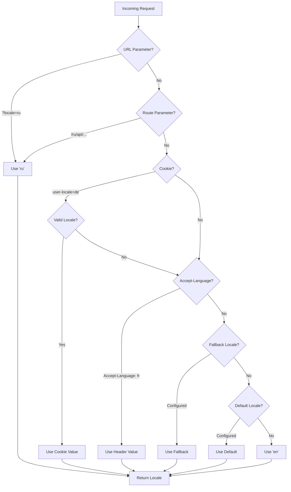

# 🌍 Traduzioni lato server e informazioni sulla locale in Nuxt I18n Micro

## 📖 Panoramica

Nuxt I18n Micro supporta traduzioni lato server e informazioni sulla locale, permettendoti di tradurre contenuti e accedere ai dettagli della locale sul server. Ciò è particolarmente utile per API o applicazioni server-rendered dove la localizzazione è necessaria prima di raggiungere il client.

Le traduzioni usano messaggi di locale definiti nella configurazione di Nuxt I18n e vengono risolte dinamicamente in base alla locale rilevata.

Per impostazione predefinita (`translationPayloads.mode: 'premerged'`), i file di root vengono incorporati in ogni payload di pagina in fase di build come `\{page\}/\{locale\}/data.json`. Il server carica gli stessi file pre-costruiti che il client recupera sotto `/\{apiBaseUrl\}/...`, quindi tutte le chiavi (sia condivise sia specifiche per pagina) sono disponibili negli handler server.

Con `translationPayloads.mode: 'source'`, i file sorgente compatti vengono uniti a runtime quando viene chiamato `loadTranslationsFromServer()` (o la rotta `/_locales`) — su **Edge** tramite `serverAssets` di Nitro, su **Node** dalla copia pubblica opzionale. Consulta la [Guida alle prestazioni — Serverless Payload Output](/guides/performance#serverless-payload-output) e [Architettura della cache e archiviazione](/api/cache) per i dettagli.

Per un elenco consolidato delle API runtime e server, consulta il [Riferimento API](/api/overview).

## 🛠️ Configurazione del middleware lato server

Per abilitare le traduzioni lato server e le informazioni sulla locale, usa le funzioni di middleware fornite:

- `useTranslationServerMiddleware` - per tradurre contenuti
- `useLocaleServerMiddleware` - per accedere alle informazioni sulla locale

Entrambe le funzioni di middleware sono disponibili automaticamente in tutte le rotte server.

La logica di rilevamento della locale è condivisa tra entrambe le funzioni di middleware tramite la funzione di utilità `detectCurrentLocale` per garantire coerenza nel modulo.

## ✨ Uso delle traduzioni negli handler server

Puoi tradurre contenuti in modo trasparente in qualsiasi `eventHandler` usando il middleware di traduzione.

### Esempio: Uso di base della traduzione

```typescript
import { defineEventHandler } from 'h3'

export default defineEventHandler(async (event) => {
  const t = await useTranslationServerMiddleware(event)
  return {
    message: t('greeting'), // Returns the translated value for the key "greeting"
  }
})
```

In questo esempio:

- La locale dell'utente viene rilevata automaticamente da parametri di query, cookie o header.
- La funzione `t` recupera la traduzione appropriata per la locale rilevata.

## 🌍 Uso delle informazioni sulla locale negli handler server

### Uso di base delle informazioni sulla locale

```typescript
import { defineEventHandler } from 'h3'

export default defineEventHandler((event) => {
  const localeInfo = useLocaleServerMiddleware(event)

  return {
    success: true,
    data: localeInfo,
    timestamp: new Date().toISOString(),
  }
})
```

### Fornitura di parametri di locale personalizzati

```typescript
import { defineEventHandler } from 'h3'

export default defineEventHandler((event) => {
  // Force specific locale with custom default
  const localeInfo = useLocaleServerMiddleware(event, 'en', 'ru')

  return {
    success: true,
    data: localeInfo,
    timestamp: new Date().toISOString(),
  }
})
```

### Struttura della risposta

Il middleware di locale restituisce un oggetto `LocaleInfo` con le seguenti proprietà:

```typescript
interface LocaleInfo {
  current: string // Current detected locale code
  default: string // Default locale code
  fallback: string // Fallback locale code
  available: string[] // Array of all available locale codes
  locale: Locale | null // Full locale configuration object
  isDefault: boolean // Whether current locale is the default
  isFallback: boolean // Whether current locale is the fallback
}
```

### Esempio di risposta

```json
{
  "success": true,
  "data": {
    "current": "ru",
    "default": "en",
    "fallback": "en",
    "available": ["en", "ru", "de"],
    "locale": {
      "code": "ru",
      "iso": "ru-RU",
      "dir": "ltr",
      "displayName": "Русский"
    },
    "isDefault": false,
    "isFallback": false
  },
  "timestamp": "2024-01-15T10:30:00.000Z"
}
```

## 🌐 Fornire una locale personalizzata

Se hai bisogno di specificare una locale manualmente (ad es. per test o per determinate richieste), puoi passarla al middleware di traduzione:

### Esempio: Locale personalizzata

```typescript
import { defineEventHandler } from 'h3'

function detectLocale(event): string | null {
  const urlSearchParams = new URLSearchParams(event.node.req.url?.split('?')[1])
  const localeFromQuery = urlSearchParams.get('locale')
  if (localeFromQuery) return localeFromQuery

  return 'en'
}

export default defineEventHandler(async (event) => {
  const t = await useTranslationServerMiddleware(event, 'en', detectLocale(event)) // Force French local, en - default locale
  return {
    message: t('welcome'), // Returns the French translation for "welcome"
  }
})
```

## 📋 Logica di rilevamento della locale

Entrambe le funzioni di middleware determinano automaticamente la locale dell'utente usando il seguente ordine di priorità:



1. **Parametri URL**: `?locale=ru`
2. **Parametri di rotta**: `/ru/api/endpoint`
3. **Cookie**: cookie `user-locale`
4. **Header HTTP**: header `Accept-Language`
5. **Locale di fallback**: Come configurata nelle opzioni del modulo
6. **Locale predefinita**: Come configurata nelle opzioni del modulo
7. **Fallback hardcoded**: `'en'`

> **Nota**: La logica di rilevamento della locale è condivisa tra `useLocaleServerMiddleware` e `useTranslationServerMiddleware` per garantire coerenza nel modulo.

## 📋 Esempi di uso avanzato

### Risposta condizionale in base alla locale

```typescript
import { defineEventHandler } from 'h3'

export default defineEventHandler((event) => {
  const { current, isDefault, locale } = useLocaleServerMiddleware(event)

  // Return different content based on locale
  if (current === 'ru') {
    return {
      message: 'Привет, мир!',
      locale: current,
      isDefault,
    }
  }

  if (current === 'de') {
    return {
      message: 'Hallo, Welt!',
      locale: current,
      isDefault,
    }
  }

  // Default English response
  return {
    message: 'Hello, World!',
    locale: current,
    isDefault,
  }
})
```

### Rilevamento personalizzato della locale

```typescript
import { defineEventHandler } from 'h3'

export default defineEventHandler((event) => {
  // Force German locale with English as fallback
  const { current, isDefault, locale } = useLocaleServerMiddleware(event, 'en', 'de')

  return {
    message: 'Hallo, Welt!',
    locale: current,
    isDefault: false, // Will be false since we forced German
  }
})
```

### API consapevole della locale con validazione

```typescript
import { defineEventHandler, createError } from 'h3'

export default defineEventHandler((event) => {
  const { current, available, locale } = useLocaleServerMiddleware(event)

  // Validate if the detected locale is supported
  if (!available.includes(current)) {
    throw createError({
      statusCode: 400,
      statusMessage: `Unsupported locale: ${current}. Available locales: ${available.join(', ')}`,
    })
  }

  // Return locale-specific configuration
  return {
    locale: current,
    direction: locale?.dir || 'ltr',
    displayName: locale?.displayName || current,
    availableLocales: available,
  }
})
```

### Integrazione con il middleware di traduzione

Puoi combinare le informazioni sulla locale con il middleware di traduzione per un'internazionalizzazione completa:

```typescript
import { defineEventHandler } from 'h3'

export default defineEventHandler(async (event) => {
  const localeInfo = useLocaleServerMiddleware(event)
  const t = await useTranslationServerMiddleware(event)

  return {
    locale: localeInfo.current,
    message: t('welcome_message'),
    availableLocales: localeInfo.available,
    isDefault: localeInfo.isDefault,
  }
})
```

## 📝 Best practice

1. **Convalida sempre le locale**: Verifica che la locale rilevata sia nella tua lista di locale disponibili
2. **Usa logica di fallback**: Fornisci valori predefiniti sensati quando il rilevamento della locale fallisce
3. **Metti in cache le informazioni sulla locale**: Per applicazioni con prestazioni critiche, considera di mettere in cache i risultati del rilevamento della locale
4. **Gestisci i casi limite**: Considera locale non supportate e fornisci risposte di errore appropriate
5. **Combina con le traduzioni**: Usa le informazioni sulla locale insieme al middleware di traduzione per un supporto i18n completo

## 🚀 Considerazioni sulle prestazioni

- Entrambe le funzioni di middleware sono leggere e progettate per un'esecuzione veloce
- Il rilevamento della locale usa catene di fallback efficienti
- Nessuna chiamata API esterna viene effettuata durante il rilevamento della locale
- I risultati vengono calcolati sincronicamente per prestazioni ottimali
