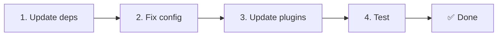

# 📦 Aggiornamento da v2.x a v3.x

<Tip>
Consulta [Migrazione da nuxt-i18n](/migration/from-nuxtjs-i18n). Quella guida copre la migrazione dall'ecosistema vue-i18n, non da nuxt-i18n-micro v2.
</Tip>

La v3.0.0 introduce modifiche architetturali fondamentali: pacchetti di strategia, un nuovo sistema di caching, gestione centralizzata della locale tramite `useI18nLocale()` e una pipeline di redirect ridisegnata. Questa sezione copre tutte le modifiche non retrocompatibili e come aggiornare il tuo codice.

## Passi di migrazione



## Riepilogo delle modifiche non retrocompatibili

- **Stato della locale** — `useState` / `useCookie` manuali → composable `useI18nLocale()`
- **Accesso alla config** — `useRuntimeConfig().public.i18nConfig` → `getI18nConfig()` da `#build/i18n.strategy.mjs`
- **Componente di redirect** — opzione `fallbackRedirectComponentPath` → plugin server di redirect + middleware di route client (automatico)
- **`includeDefaultLocaleRoute`** — supportato (deprecato) → rimosso, usa l'opzione `strategy`
- **`experimental.hmr`** — sotto `experimental` → opzione a livello root
- **`previousPageFallback`** — rimosso completamente (la strategia di merge cumulativo lo gestisce automaticamente)
- **Caching** — `useStorage('cache')` → singleton `TranslationStorage` (`Symbol.for` su `globalThis`)
- **Trasferimento SSR** — Runtime config → payload Nuxt (v3 usava `useState`; i chunk ora vivono in `payload.data`, vedi [Performance](/guides/performance#server-side-payload-transfer))
- **Classi di strategia** — interne → pacchetti separati (`@i18n-micro/route-strategy`, `@i18n-micro/path-strategy`)

## Rimosso: `fallbackRedirectComponentPath`

L'opzione `fallbackRedirectComponentPath` e il componente di fallback `locale-redirect.vue` sono stati rimossi. La logica di redirect è ora gestita da:

1. **Middleware server** (`i18n.global.ts`) — imposta `event.context.i18n.locale`
2. **Plugin server di redirect** (`06.redirect.ts`, solo server) — redirect 302 prima del render
3. **Middleware di route client** (`i18n-redirect.global.ts`) — redirect SPA dopo l'idratazione

```diff
 i18n: {
   strategy: 'prefix_except_default',
-  fallbackRedirectComponentPath: '~/components/MyRedirect.vue',
 }
```

Se avevi logica di redirect personalizzata nel componente di fallback, implementala invece in un plugin server:

```ts
// plugins/i18n-loader.server.ts
export default defineNuxtPlugin({
  name: 'i18n-custom-redirect',
  enforce: 'pre',
  order: -10,
  setup() {
    const { setLocale } = useI18nLocale()
    // Your custom detection logic
    setLocale(detectedLocale)
  },
})
```

## Rimosso: `includeDefaultLocaleRoute`

Usa invece l'opzione `strategy`:

- `includeDefaultLocaleRoute: true` → `strategy: 'prefix'`
- `includeDefaultLocaleRoute: false` → `strategy: 'prefix_except_default'` (predefinito)

```diff
 i18n: {
-  includeDefaultLocaleRoute: true,
+  strategy: 'prefix',
 }
```

## Accesso alla config: `getI18nConfig()` sostituisce `useRuntimeConfig`

```diff
- const config = useRuntimeConfig()
- const cookieName = config.public.i18nConfig?.localeCookie || 'user-locale'
+ import { getI18nConfig } from '#build/i18n.strategy.mjs'
+ const { localeCookie: configCookie } = getI18nConfig()
+ const cookieName = configCookie ?? 'user-locale'
```

## Gestione della locale: `useI18nLocale()` sostituisce lo stato manuale

In v2 potresti aver usato direttamente `useState('i18n-locale')` o `useCookie('user-locale')`. In v3 usa il composable centralizzato `useI18nLocale()`:

```diff
- const locale = useState('i18n-locale')
- const cookie = useCookie('user-locale')
- locale.value = 'fr'
- cookie.value = 'fr'
+ const { setLocale } = useI18nLocale()
+ setLocale('fr') // Updates both state and cookie atomically
```

Consulta [Rilevamento personalizzato della lingua](/guides/custom-language-detection) per esempi dettagliati.

## Opzioni sperimentali spostate / rimosse

`hmr` è stato spostato da `experimental` al livello root. `previousPageFallback` è stato rimosso completamente. Il modulo ora usa una strategia di deep merge cumulativo (profondità di 2 livelli) che preserva automaticamente le traduzioni della pagina precedente durante le animazioni di transizione, anche quando le pagine condividono chiavi annidate sovrapposte. Dopo che l'animazione di transizione è completata, l'hook `page:transition:finish` ripulisce dalla memoria le chiavi della pagina vecchia.

```diff
 i18n: {
-  experimental: {
-    hmr: true,
-    previousPageFallback: true
-  }
+  hmr: true,
+  // previousPageFallback removed — handled automatically
 }
```

## Architettura dei redirect (v3)

I redirect sono ora gestiti automaticamente da due componenti:

1. **Lato server** (`06.redirect.ts`, solo server): viene eseguito durante SSR, emette redirect 302 prima di qualsiasi rendering della pagina. Nessun "error flash"
2. **Lato client** (`i18n-redirect.global.ts`): middleware di route globale sulla navigazione SPA; preserva query string e hash

Priorità della locale per i redirect:

1. `useState('i18n-locale')` — impostato tramite `useI18nLocale().setLocale()`
2. Cookie — se `localeCookie` è configurato
3. Header `Accept-Language` — se `autoDetectLanguage: true`
4. `defaultLocale` — fallback

Nessuna modifica al codice richiesta per configurazioni standard.

<Warning>
Per le strategie `prefix` e `prefix_except_default` con `redirects: true`, imposta `localeCookie: 'user-locale'` per abilitare la persistenza della locale tra i ricaricamenti di pagina. Senza di esso, i redirect usano solo `Accept-Language` o `defaultLocale`.
</Warning>

## TypeScript: tipi del modulo interno (opzionale)

Se incontri errori di tipo relativi a import interni come `#i18n-internal/plural`, `#i18n-internal/strategy` o `#i18n-internal/config`, aggiungi la sezione `imports` al `package.json` del tuo progetto:

```json
{
  "imports": {
    "#i18n-internal/plural": "nuxt-i18n-micro/internals",
    "#i18n-internal/strategy": "nuxt-i18n-micro/internals",
    "#i18n-internal/config": "nuxt-i18n-micro/internals"
  }
}
```
