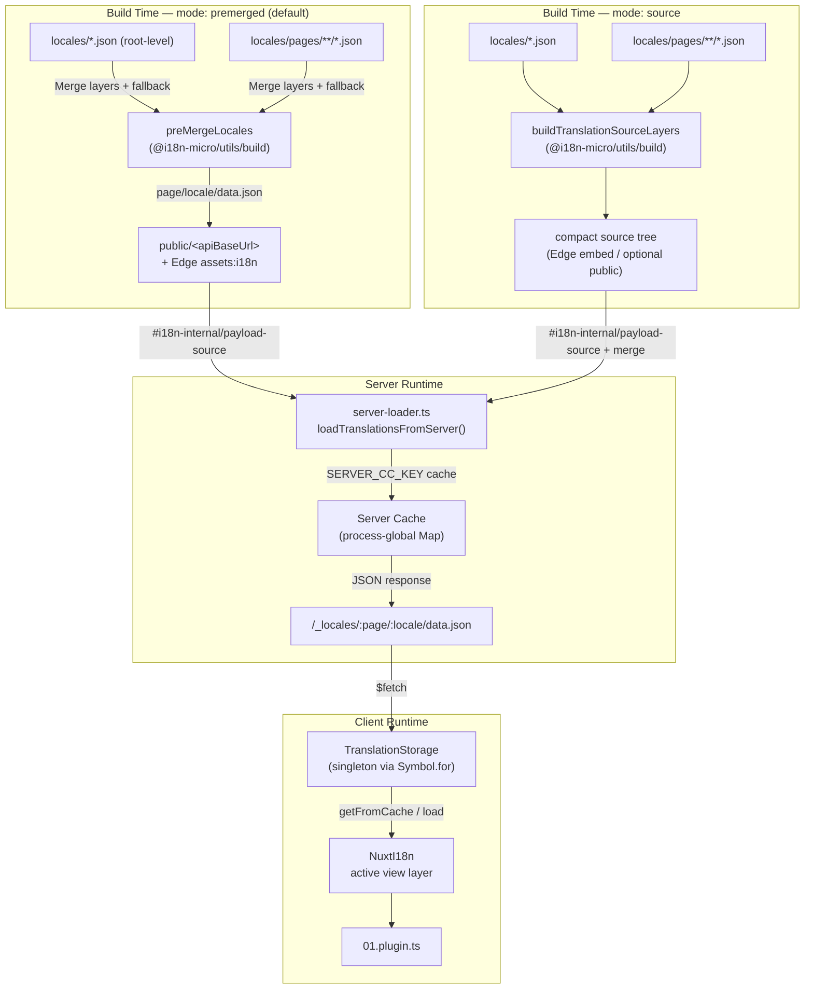

# 🗄️ 翻訳キャッシュとストレージのアーキテクチャ

## 📖 概要

Nuxt I18n Micro v3 は、翻訳のために多層キャッシュアーキテクチャを使用します。ペイロードの読み込みは `translationPayloads.mode` に依存します。

- **`premerged`**(デフォルト)— ルート、ページ、フォールバック、レイヤーファイルが、ビルド時に `@i18n-micro/utils/build` を通じて `\{page\}/\{locale\}/data.json` にマージされます。
- **`source`** — コンパクトなソースファイルは、`@i18n-micro/utils/source-loader` と `@i18n-micro/utils/merge-source` によるランタイムマージのために保持されます(Edge は Nitro の `serverAssets` に埋め込みます。Node はコピーされたときに `public/` から読み取ります)。

このページでは、組み込みキャッシュの動作と、カスタムユースケース(管理ツール、外部 API、キャッシュ無効化)向けの拡張方法を説明します。

## 📊 アーキテクチャの概要

### データフロー



## 🧱 コアコンポーネント

### 1. `TranslationStorage`(クライアント + サーバー)

**ファイル**: `src/runtime/utils/storage.ts`

クライアントとサーバーの両方に対して統一された翻訳ストレージを提供するシングルトンクラスです。複数のバンドルが読み込まれた場合でも、`globalThis` 上の `Symbol.for('__NUXT_I18N_STORAGE_CACHE__')` を用いてインスタンスが 1 つだけ存在することを保証します。

**主なメソッド:**

| メソッド                              | 説明                                                            |
| ----------------------------------- | ---------------------------------------------------------------------- |
| `getFromCache(locale, routeName?)`  | 同期チェック: キャッシュされたインメモリデータ、または `null` を返します。 |
| `load(locale, routeName?, options)` | キャッシュ付きの非同期ロード: まずキャッシュを確認し、次に `$fetch` で取得します。 |
| `clear()`                           | キャッシュ全体をクリアします。                                                |

**キャッシュキーの形式**: `\{locale\}:\{routeName\}`(例: `en:index`、`fr:about`)

```typescript
import { translationStorage } from '../utils/storage'

// 同期的なキャッシュチェック
const cached = translationStorage.getFromCache('en', 'index')

// 非同期ロード(自動キャッシュあり)
const result = await translationStorage.load('en', 'index', {
  apiBaseUrl: '_locales',
  baseURL: '/',
  dateBuild: '2024-01-01',
})
// result.data — マージされた翻訳
// result.cacheKey — 使用されたキャッシュキー
```

### ⚙️ 決定的なキャッシュバスティング (`i18n.dateBuild`)

デフォルトでは、このモジュールはビルド時に `Date.now()` を用いて `dateBuild` を生成します。それは生成される `#build/i18n.strategy.mjs` に埋め込まれ、再ビルド後に翻訳フェッチのキャッシュを無効化するクエリパラメーター (`?v=...`) として使用されます。

再現性のあるビルド(たとえばローリングデプロイでチャンクキャッシュのヒット率を向上させたい場合など)が必要な場合は、`nuxt.config` に安定した値を設定してください。

```ts
export default defineNuxtConfig({
  i18n: {
    // 任意の安定した文字列/数値(git SHA、CI ビルド番号、リリースタグなど)
    dateBuild: process.env.GIT_SHA ?? 'local-dev',
  },
})
```

### 2. `loadTranslationsFromServer()`(サーバー専用)

**ファイル**: `src/runtime/server/utils/server-loader.ts`

ロケール / ページの翻訳を読み込み、マージ結果を `@i18n-micro/hmr/cache-keys` (`SERVER_CC_KEY`) でキー付けされたプロセスグローバルな `CacheControl` マップにキャッシュします。

動作: SSR は `#i18n-internal/payload-source` から読み込みます。**Node** は `public/<apiBaseUrl>` 配下(premerged モードでは `\{page\}/\{locale\}/data.json`)を `readFile` します。**Edge** は `assets:i18n` を使います。`premerged` は 1 ファイルを読み取り、`source` は `@i18n-micro/utils/source-loader` を通じて root / page / fallback をマージします。

```typescript
import { loadTranslationsFromServer } from '../server/utils/server-loader'

// { data: Translations, json: string } を返す
const { data, json } = await loadTranslationsFromServer('en', 'index')
```

### 3. クライアントロード(HTML への埋め込みなし)

辞書は `nuxtApp.payload` に**書き込まれません**。サーバーは SSR レンダリング用にそれらをメモリ上に保持します。クライアントプラグインは `switchContext` を `await` し、`/\{apiBaseUrl\}/:page/:locale/data.json` を読み込みます(`@nuxtjs/i18n` の `experimental.preload: false` と同じデフォルト姿勢)。

`NuxtI18n` は `$t()` と `$has()` が使用するアクティブなビュー層の辞書を保持します。`NuxtTranslationLoader` はロケール / ルートコンテキストを切り替え、そのレイヤーにチャンクをマージします。

### 4. サーバー API ルート

**ルート**: `/_locales/\{page\}/\{locale\}/data.json`

**ファイル**: `src/runtime/server/routes/i18n.ts`

この Nitro ルートは、アクティブなペイロードモードに対してマージされた翻訳を提供します。`loadTranslationsFromServer()` を呼び出し、結果を JSON として返します。

本番環境では、以下も設定します。

```http
Cache-Control: public, max-age={httpCacheDuration}, immutable
```

デフォルトの `httpCacheDuration` は `31536000`(1 年)です。クライアントは `?v=\{dateBuild\}` によるキャッシュバスティングでペイロードを要求するため、これは安全です。ヘッダーを省略するには `httpCacheDuration: 0` を設定します。開発環境ではこのヘッダーは適用されません。

## 📥 拡張: カスタム翻訳ロード

### キャッシュから読み取る(サーバールート)

```ts
// server/api/i18n/load-cache.[post].ts
import { defineEventHandler, readBody } from 'h3'
import { loadTranslationsFromServer } from '#imports'

export default defineEventHandler(async (event) => {
  const { page, locale } = await readBody<{ page: string; locale: string }>(event)
  const { data } = await loadTranslationsFromServer(locale, page)
  return { locale, page, data }
})
```

### 翻訳を更新する(ファイル + キャッシュ無効化)

```ts
// server/api/i18n/update.[post].ts
import { defineEventHandler, readBody, createError } from 'h3'
import { join } from 'node:path'
import { readFile, writeFile } from 'node:fs/promises'
import { deepMergeTranslations } from '@i18n-micro/utils/deep-merge'

export default defineEventHandler(async (event) => {
  const { path, updates } = await readBody<{ path: string; updates: Record<string, unknown> }>(event)

  if (!path || !updates) {
    throw createError({ statusCode: 400, statusMessage: 'Missing path or updates' })
  }

  const fullPath = join('locales', path)
  let existing: Record<string, unknown> = {}

  try {
    const content = await readFile(fullPath, 'utf-8')
    existing = JSON.parse(content) as Record<string, unknown>
  } catch {
    // ファイルが存在しない — 新規作成
  }

  const merged = deepMergeTranslations(existing, updates)
  await writeFile(fullPath, JSON.stringify(merged, null, 2), 'utf-8')

  return { success: true, path, updated: merged }
})
```


## 🧹 キャッシュのクリア

### プログラム的なキャッシュクリア(クライアント)

組み込みの `$clearCache` メソッドを使用します。

```vue
<script setup>
const { $clearCache } = useNuxtApp()

// TranslationStorage とプラグインレベルキャッシュの両方をクリアします
$clearCache()
</script>
```

### サーバーキャッシュの動作

サーバー側のキャッシュ (`loadTranslationsFromServer`) はプロセスグローバルで、次のいずれかまで存続します。

- サーバープロセスが再起動される
- 新しいデプロイが検出される(`dateBuild` の値が異なる)

サーバーレス環境では、コールドスタートごとにキャッシュはフレッシュな状態になります。

## ⚙️ サーバーレス構成

サーバーレス環境(Cloudflare Workers、AWS Lambda)では、組み込みキャッシュはインメモリの `Map` オブジェクトを使用します。翻訳キャッシュ自体に外部ストレージの構成は必要ありません。

ただし、ソース翻訳ファイル用の Nitro ストレージは構成が必要な場合があります。

```ts
export default defineNuxtConfig({
  nitro: {
    storage: {
      // デフォルトのファイルシステムストレージが利用できない場合にのみ必要
      'assets:server': {
        driver: 'cloudflare-kv-binding',
        binding: 'MY_KV_NAMESPACE',
      },
    },
  },
})
```

## 💡 v2 との主な違い

| 観点           | v2                            | v3                                                                       |
| ---------------- | ----------------------------- | ------------------------------------------------------------------------ |
| クライアントキャッシュ     | `useStorage('cache')`         | `TranslationStorage` シングルトン(`globalThis` 上の `Symbol.for`)                |
| SSR 転送     | ランタイム設定                | `payload.data` 経由の完全なチャンク(v3.0 では `useState`)                    |
| サーバーキャッシュ     | Nitro キャッシュストレージ           | `Symbol.for` によるプロセスグローバルな `Map`                                    |
| マージロジック      | クライアント側                   | ビルド時 (`premerged`) またはランタイム (`source`)、`@i18n-micro/utils/*` 経由 |
| キャッシュキー形式 | `i18n:merged:\{page\}:\{locale\}` | `\{locale\}:\{routeName\}`                                                   |

## 📚 関連

- [パフォーマンスガイド](/guides/performance) — キャッシュがパフォーマンスに与える影響
- [サーバーサイド翻訳](/guides/server-side-translations) — サーバールートでの翻訳の使用
- [Firebase デプロイ](/guides/firebase) — デプロイに関するキャッシュの考慮事項
