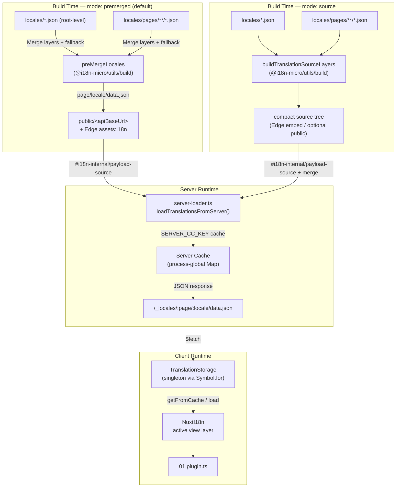

# 🗄️ 翻訳キャッシュとストレージのアーキテクチャ

## 📖 概要

Nuxt I18n Micro v3 は、翻訳のために多層キャッシュアーキテクチャを使用します。ペイロードの読み込みは `translationPayloads.mode` に依存します:

- **`premerged`**(デフォルト) — root、page、fallback、レイヤーファイルはビルド時に `@i18n-micro/utils/build` を通じて `\{page\}/\{locale\}/data.json` にマージされます
- **`source`** — コンパクトなソースファイルが保持され、`@i18n-micro/utils/source-loader` と `@i18n-micro/utils/merge-source` を介してランタイムでマージされます(Edge は Nitro `serverAssets` に埋め込みます。Node はコピー時に `public/` から読み込みます)

このページでは、組み込みキャッシュの動作と、カスタムユースケース(管理ツール、外部 API、キャッシュ無効化)向けに拡張する方法を説明します。

## 📊 アーキテクチャの概要

### データフロー



## 🧱 コアコンポーネント

### 1. `TranslationStorage`(クライアント + サーバー)

**ファイル**: `src/runtime/utils/storage.ts`

クライアントとサーバーの両方に対して統一された翻訳ストレージを提供するシングルトンクラスです。複数のバンドルが読み込まれても 1 つのインスタンスのみが存在するように、`globalThis` 上で `Symbol.for('__NUXT_I18N_STORAGE_CACHE__')` を使用します。

**主要メソッド:**

| メソッド                              | 説明                                                            |
| ----------------------------------- | ---------------------------------------------------------------------- |
| `getFromCache(locale, routeName?)`  | 同期チェック: キャッシュされたインメモリデータ、または `null` を返す            |
| `load(locale, routeName?, options)` | キャッシュ付きの非同期読み込み: まずキャッシュを確認し、次に `$fetch` で取得 |
| `clear()`                           | キャッシュ全体をクリア                                                |

**キャッシュキー形式**: `\{locale\}:\{routeName\}`(例: `en:index`、`fr:about`)

```typescript
import { translationStorage } from '../utils/storage'

// Synchronous cache check
const cached = translationStorage.getFromCache('en', 'index')

// Async load (with automatic caching)
const result = await translationStorage.load('en', 'index', {
  apiBaseUrl: '_locales',
  baseURL: '/',
  dateBuild: '2024-01-01',
})
// result.data — merged translations
// result.cacheKey — cache key used
```

### ⚙️ 決定論的キャッシュバスティング(`i18n.dateBuild`)

デフォルトでは、モジュールはビルド時に `Date.now()` を使用して `dateBuild` を生成します。これは生成された `#build/i18n.strategy.mjs` に埋め込まれ、再ビルド後の翻訳フェッチキャッシュを無効化するためのクエリパラメーター(`?v=...`)として使用されます。

再現可能なビルドが必要な場合(例: ローリングデプロイでチャンクキャッシュヒット率を改善するため)、`nuxt.config` に安定した値を設定してください:

```ts
export default defineNuxtConfig({
  i18n: {
    // Any stable string/number (git SHA, CI build number, release tag, etc.)
    dateBuild: process.env.GIT_SHA ?? 'local-dev',
  },
})
```

### 2. `loadTranslationsFromServer()`(サーバー専用)

**ファイル**: `src/runtime/server/utils/server-loader.ts`

ロケール / ページ用の翻訳を読み込み、`@i18n-micro/hmr/cache-keys`(`SERVER_CC_KEY`)でキー付けされたプロセスグローバルな `CacheControl` マップに、マージされた結果をキャッシュします。

挙動: SSR は `#i18n-internal/payload-source` から読み込みます — **Node** は `public/<apiBaseUrl>` 配下から `readFile`(premerged モードでは `\{page\}/\{locale\}/data.json`)、**Edge** は `assets:i18n`。`premerged` は 1 つのファイルを読み、`source` は `@i18n-micro/utils/source-loader` を通じて root / page / fallback をマージします。

```typescript
import { loadTranslationsFromServer } from '../server/utils/server-loader'

// Returns { data: Translations, json: string }
const { data, json } = await loadTranslationsFromServer('en', 'index')
```

### 3. クライアント読み込み(HTML 埋め込みなし)

辞書は `nuxtApp.payload` に **書き込まれません**。サーバーは SSR レンダー用にメモリ上に保持し、クライアントプラグインは `switchContext` を `await` して `/\{apiBaseUrl\}/:page/:locale/data.json` を読み込みます(`@nuxtjs/i18n` の `experimental.preload: false` と同じデフォルトの姿勢です)。

`NuxtI18n` は `$t()` と `$has()` が使用するアクティブなビューレイヤー辞書を保持します。`NuxtTranslationLoader` はロケール / ルートコンテキストを切り替え、チャンクをそのレイヤーにマージします。

### 4. サーバー API ルート

**ルート**: `/_locales/\{page\}/\{locale\}/data.json`

**ファイル**: `src/runtime/server/routes/i18n.ts`

この Nitro ルートは、アクティブなペイロードモードに対してマージされた翻訳を配信します。`loadTranslationsFromServer()` を呼び出し、結果を JSON として返します。

本番では次も設定します:

```http
Cache-Control: public, max-age={httpCacheDuration}, immutable
```

デフォルトの `httpCacheDuration` は `31536000`(1 年)。クライアントが `?v=\{dateBuild\}` のキャッシュバスティング付きでペイロードをリクエストするため安全です。ヘッダーを省略するには `httpCacheDuration: 0` を設定してください。開発時にはヘッダーは適用されません。

## 📥 拡張: カスタム翻訳読み込み

### キャッシュから読み込む(サーバールート)

```ts
// server/api/i18n/load-cache.[post].ts
import { defineEventHandler, readBody } from 'h3'
import { loadTranslationsFromServer } from '#imports'

export default defineEventHandler(async (event) => {
  const { page, locale } = await readBody<{ page: string; locale: string }>(event)
  const { data } = await loadTranslationsFromServer(locale, page)
  return { locale, page, data }
})
```

### 翻訳を更新する(ファイル + キャッシュ無効化)

```ts
// server/api/i18n/update.[post].ts
import { defineEventHandler, readBody, createError } from 'h3'
import { join } from 'node:path'
import { readFile, writeFile } from 'node:fs/promises'
import { deepMergeTranslations } from '@i18n-micro/utils/deep-merge'

export default defineEventHandler(async (event) => {
  const { path, updates } = await readBody<{ path: string; updates: Record<string, unknown> }>(event)

  if (!path || !updates) {
    throw createError({ statusCode: 400, statusMessage: 'Missing path or updates' })
  }

  const fullPath = join('locales', path)
  let existing: Record<string, unknown> = {}

  try {
    const content = await readFile(fullPath, 'utf-8')
    existing = JSON.parse(content) as Record<string, unknown>
  } catch {
    // File does not exist — create new
  }

  const merged = deepMergeTranslations(existing, updates)
  await writeFile(fullPath, JSON.stringify(merged, null, 2), 'utf-8')

  return { success: true, path, updated: merged }
})
```

<Tip>

</Tip>

## 🧹 キャッシュのクリア

### プログラム的なキャッシュクリア(クライアント)

組み込みの `$clearCache` メソッドを使用します:

```vue
<script setup>
const { $clearCache } = useNuxtApp()

// Clears both TranslationStorage and plugin-level cache
$clearCache()
</script>
```

### サーバーキャッシュの挙動

サーバー側キャッシュ(`loadTranslationsFromServer`)はプロセスグローバルで、次のタイミングまで存続します:

- サーバープロセスが再起動する
- 新しいデプロイメントが検出される(`dateBuild` 値が異なる)

サーバーレス環境では、各コールドスタートに新しいキャッシュがあります。

## ⚙️ サーバーレス設定

サーバーレス環境(Cloudflare Workers、AWS Lambda)では、組み込みキャッシュはインメモリの `Map` オブジェクトを使用します。翻訳キャッシュ自体に外部ストレージの設定は必要ありません。

ただし、ソース翻訳ファイル用の Nitro ストレージには設定が必要な場合があります:

```ts
export default defineNuxtConfig({
  nitro: {
    storage: {
      // Only needed if default file-system storage is unavailable
      'assets:server': {
        driver: 'cloudflare-kv-binding',
        binding: 'MY_KV_NAMESPACE',
      },
    },
  },
})
```

## 💡 v2 との主な違い

| 側面           | v2                            | v3                                                                       |
| ---------------- | ----------------------------- | ------------------------------------------------------------------------ |
| クライアントキャッシュ     | `useStorage('cache')`         | `TranslationStorage` シングルトン(globalThis の Symbol.for)                |
| SSR 転送     | ランタイム設定                | `payload.data` を通じた完全なチャンク(v3.0 では `useState` を使用)                    |
| サーバーキャッシュ     | Nitro キャッシュストレージ           | `Symbol.for` によるプロセスグローバル `Map`                                    |
| マージロジック      | クライアントサイド                   | ビルド時(`premerged`)またはランタイム(`source`)。`@i18n-micro/utils/*` 経由 |
| キャッシュキー形式 | `i18n:merged:\{page\}:\{locale\}` | `\{locale\}:\{routeName\}`                                                   |

## 📚 関連

- [パフォーマンスガイド](/guides/performance) — キャッシュがパフォーマンスに与える影響
- [サーバーサイド翻訳](/guides/server-side-translations) — サーバールートでの翻訳の使用
- [Firebase デプロイ](/guides/firebase) — デプロイ固有のキャッシュに関する考慮事項
