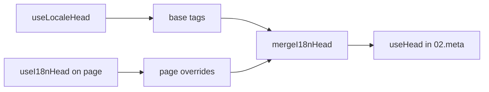

# `useI18nHead` コンポーザブル

`useI18nHead` を使うと、カスタムメタプラグインなしで**ページごと**に i18n SEO タグをカスタマイズできます。`meta: true` の場合、モジュールは入力を [`useLocaleHead`](/api/composables/use-locale-head) の出力の上にマージします。

代表的なケース:

- **CMS / ブログ記事** — 一部のロケールにのみ翻訳が存在し、代替 URL が言語ごとに異なる(異なるスラッグやパス)。
- **動的な canonical** — canonical URL が `$switchLocalePath` ではなく API からの記事 URL と一致する必要がある。
- **追加の Open Graph** — 自動生成の `og:locale` / `og:url` と並んで `og:title`、`og:description`、`og:image` を出力する。
- **部分的な制御** — モジュールが生成する canonical と `og:url` は残し、`hreflang` と `og:locale:alternate` のみを置き換える。

---

## シグネチャ

{/* generated:symbol:useI18nHead — do not edit; run `pnpm run docs:generate` */}

```ts
useI18nHead(input?: MaybeRefOrGetter<I18nHeadInput | null>): { pageHead: any; resetPageHead: () => void }
```

i18n SEO の head タグに対するページレベルの上書きを登録します。
`02.meta` プラグインによって `useLocaleHead` の出力の上にマージされます。

| パラメーター | 型 | 説明 |
| --- | --- | --- |
| `input`(オプション) | `MaybeRefOrGetter<I18nHeadInput \| null>` |  |

{/* /generated:symbol:useI18nHead */}

## パイプラインの中での位置付け



ページコンポーネント内で `useI18nHead` を呼び出します。`02.meta` プラグインは、各 `updateMeta()`(ルート変更、`$setI18nRouteParams`、クライアントの `page:finish`)後に上書きを適用します。

---

## 例 1 — 一部のロケールにのみ翻訳がある記事

一般的なパターン: API がどのロケールが存在するかと、それらの絶対または相対 URL を返します。

```ts
interface Article {
  title: string
  slug: string
  /** ロケールコード → ページ URL(絶対またはサイト相対) */
  locales: Record<string, string>
}
```

```vue
<script setup lang="ts">
const route = useRoute()
const { data: article } = await useFetch<Article>(`/api/articles/${route.params.slug}`)

const localeCodes = computed(() => Object.keys(article.value?.locales ?? {}))

useI18nHead(() => {
  if (!article.value) return null

  return {
    meta: [
      { property: 'og:title', content: article.value.title },
      { property: 'og:type', content: 'article' },
    ],
    replace: {
      hreflang: localeCodes.value.map((locale) => ({
        rel: 'alternate',
        hreflang: locale,
        href: article.value!.locales[locale]!,
      })),
      ogAlternates: localeCodes.value,
    },
  }
})
</script>
```

`ogAlternates` は `i18n.locales` 設定の**ロケールコード**を受け取ります。`og:locale:alternate` の値は `locale.og` または `iso` を通じて解決されます(Open Graph の `en_US` 形式)。

---

## 例 2 — ロケール単位のスラッグを持つ記事(`$defineI18nRoute` + `$setI18nRouteParams`)

URL がローカライズされたルートテンプレートと動的パラメーターから構築される場合。

```vue
<script setup lang="ts">
const { $defineI18nRoute, $setI18nRouteParams } = useNuxtApp()
const route = useRoute()

const { data: article } = await useFetch(`/api/articles/${route.params.slug}`)

$defineI18nRoute({
  localeRoutes: {
    en: '/blog/[slug]',
    de: '/de/blog/[slug]',
    fr: '/fr/blog/[slug]',
  },
})

if (article.value) {
  $setI18nRouteParams({
    en: { slug: article.value.slugEn },
    de: { slug: article.value.slugDe },
    fr: { slug: article.value.slugFr },
  })

  const availableLocales = article.value.availableLocales as string[]

  useI18nHead({
    meta: [{ property: 'og:title', content: article.value.title }],
    replace: {
      hreflang: availableLocales.map((locale) => ({
        rel: 'alternate',
        hreflang: locale,
        href: article.value!.urls[locale],
      })),
      ogAlternates: availableLocales,
    },
  })
}
</script>
```

モジュールが生成する代替は、**設定されたすべての**ロケールをリストします。`replace.hreflang` は、実際に翻訳が存在するロケールのみにタグを制限します。

---

## 例 3 — デフォルトロケールの記事 URL に対するカスタム `x-default`

デフォルトでは、`x-default` は `$switchLocalePath` からのデフォルトロケール URL を指します。記事の場合は、デフォルト翻訳の URL を指すようにします。

```vue
<script setup lang="ts">
const { $defaultLocale } = useNuxtApp()
const article = await loadArticle()

const defaultLocale = $defaultLocale() ?? 'en'
const defaultHref = article.locales[defaultLocale]

useI18nHead({
  replace: {
    hreflang: Object.entries(article.locales).map(([locale, href]) => ({
      rel: 'alternate',
      hreflang: locale,
      href,
    })),
    xDefault: defaultHref ? { rel: 'alternate', hreflang: 'x-default', href: defaultHref } : false,
    ogAlternates: Object.keys(article.locales),
  },
})
</script>
```

---

## 例 4 — canonical と `og:url` を API データで置き換え

canonical が CMS から提供された URL と一致する必要がある場合(マルチドメイン、カスタムパス、または事前構築された絶対 URL)。

```vue
<script setup lang="ts">
const article = await loadArticle()
const canonical = article.canonicalUrl // 例: https://www.example.com/en/blog/my-post

useI18nHead({
  replace: {
    canonical,
    ogUrl: canonical,
    hreflang: buildAlternateLinks(article),
    ogAlternates: Object.keys(article.locales),
  },
  meta: [
    { property: 'og:title', content: article.title },
    { name: 'description', content: article.excerpt },
  ],
})
</script>
```

---

## 例 5 — 自動 canonical / `og:url` は維持し、代替のみを置き換え

`$switchLocalePath` + `$setI18nRouteParams` が正しい canonical と `og:url` を生成している場合、検出タグのみを置き換えます。

```vue
<script setup lang="ts">
const article = await loadArticle()

useI18nHead({
  replace: {
    hreflang: buildAlternateLinks(article),
    ogAlternates: Object.keys(article.locales),
  },
})
</script>
```

---

## 例 6 — コンテンツ詳細ページの完全な head(meta + links)

「ページメタ」と「代替リンク」を別々のヘルパーに分けるのに似たパターンで、1 回の呼び出しで組み合わせます。

```vue
<script setup lang="ts">
const article = await loadArticle()
const alternates = Object.entries(article.locales).map(([locale, href]) => ({
  rel: 'alternate' as const,
  hreflang: locale,
  href: normalizeSeoUrl(href), // 必要に応じて ?query と #hash を取り除く
}))

useI18nHead({
  meta: [
    { property: 'og:title', content: article.title },
    { property: 'og:description', content: article.description },
    { property: 'og:image', content: article.imageUrl },
    { name: 'twitter:card', content: 'summary_large_image' },
    { name: 'twitter:title', content: article.title },
  ],
  replace: {
    canonical: article.canonicalUrl,
    ogUrl: article.canonicalUrl,
    hreflang: alternates,
    ogAlternates: Object.keys(article.locales),
  },
})
</script>
```

```ts
/** クエリとハッシュを削除。SEO 用に CMS URL をクリーンにする必要があるときに便利 */
function normalizeSeoUrl(href: string): string {
  try {
    const url = new URL(href, 'https://placeholder.local')
    url.search = ''
    url.hash = ''
    return href.startsWith('http') ? url.href : `${url.pathname}`
  } catch {
    return href.split(/[?#]/)[0] ?? href
  }
}
```

---

## 例 7 — 2 つのコンテンツタイプ、同じパターン(ニュースとガイド)

同じ API 形状で、異なるルート名。小さなヘルパーを再利用します。

```ts
// composables/useArticleHead.ts
import type { I18nHeadInput } from '@i18n-micro/types'

interface LocalizedContent {
  title: string
  locales: Record<string, string>
  canonicalUrl?: string
}

export function buildArticleHead(content: LocalizedContent): I18nHeadInput {
  const localeCodes = Object.keys(content.locales)
  const canonical = content.canonicalUrl ?? content.locales.en

  return {
    meta: [{ property: 'og:title', content: content.title }],
    replace: {
      canonical,
      ogUrl: canonical,
      hreflang: localeCodes.map((locale) => ({
        rel: 'alternate',
        hreflang: locale,
        href: content.locales[locale]!,
      })),
      ogAlternates: localeCodes,
    },
  }
}
```

```vue
<!-- pages/blog/[slug].vue -->
<script setup lang="ts">
const article = await loadArticle()
useI18nHead(buildArticleHead(article))
</script>
```

```vue
<!-- pages/guides/[slug].vue -->
<script setup lang="ts">
const guide = await loadGuide()
useI18nHead(buildArticleHead(guide))
</script>
```

---

## 例 8 — 組み込みの代替を無効化し、自前のリストを提供

モジュールの hreflang ジェネレーターを無効化し、カスタムリストを渡すのと同等です(重複する代替セットなし)。

```vue
<script setup lang="ts">
const article = await loadArticle()

useI18nHead({
  disable: ['hreflang', 'x-default', 'og-alternates'],
  link: Object.entries(article.locales).map(([locale, href]) => ({
    rel: 'alternate',
    hreflang: locale,
    href,
  })),
  replace: {
    ogAlternates: Object.keys(article.locales),
  },
})
</script>
```

または、`disable` なしで `replace.hreflang` を使うほうが推奨されます。すべての `rel="alternate"` リンクを 1 ステップで置き換えられます。

---

## 例 9 — ランディングページ: 追加の OG のみ、すべての i18n タグは維持

```vue
<script setup lang="ts">
const { t } = useI18n()

useI18nHead({
  meta: [
    { property: 'og:title', content: t('landing.ogTitle') },
    { property: 'og:description', content: t('landing.ogDescription') },
  ],
})
</script>
```

---

## 例 10 — 商品ページ: 単一ロケール実験のために hreflang を無効化

```vue
<script setup lang="ts">
useI18nHead({
  disable: ['hreflang', 'x-default'],
  // canonical、og:locale、og:url は引き続き生成されます
})
</script>
```

---

## 例 11 — クライアント側フェッチ後のリアクティブ更新

```vue
<script setup lang="ts">
const article = ref<Article | null>(null)

onMounted(async () => {
  article.value = await $fetch('/api/articles/latest')
})

useI18nHead(() => {
  if (!article.value) return null
  return {
    meta: [{ property: 'og:title', content: article.value.title }],
    replace: {
      hreflang: Object.entries(article.value.locales).map(([locale, href]) => ({
        rel: 'alternate',
        hreflang: locale,
        href,
      })),
    },
  }
})
</script>
```

head は `page:finish` および `pageHead` の状態変更時に更新されます。

---

## 例 12 — リバースプロキシ背後の HTTPS オリジン

以前、canonical / 絶対代替 URL 用に「パブリックオリジン」コンポーザブルを解決していた場合は、代わりにモジュール設定を使用します。

```ts
// nuxt.config.ts
export default defineNuxtConfig({
  i18n: {
    meta: true,
    // undefined = 現在のリクエストからのオリジン(マルチドメイン対応)
    metaBaseUrl: undefined,
    metaTrustForwardedHost: true,
    metaTrustForwardedProto: true,
  },
})
```

その後、`replace.hreflang` / `replace.canonical` に**パスまたは完全な URL**を渡します。モジュールは SSR で `X-Forwarded-Host` / `X-Forwarded-Proto` を伴って `useRequestURL` を使用します。

---

## API リファレンス

### `meta`

追加の `<meta>` タグ。`id`、`property`、`name` で重複排除されます。

### `link`

追加の `<link>` タグ。`id` または `rel` + `hreflang` で重複排除されます。

### `htmlAttrs`

`useLocaleHead`(`lang`、`dir`)からの `<html>` 属性にマージされます。

### `replace`

| キー            | 型                      | 効果                                         |
| -------------- | ------------------------- | ---------------------------------------------- |
| `canonical`    | `string \| false`         | canonical リンクを置換または削除               |
| `hreflang`     | `I18nHeadLink[] \| false` | すべての `rel="alternate"` リンクを置換または削除  |
| `xDefault`     | `I18nHeadLink \| false`   | `hreflang="x-default"` を置換または削除       |
| `ogLocale`     | `string \| false`         | `og:locale` を置換または削除                  |
| `ogUrl`        | `string \| false`         | `og:url` を置換または削除                     |
| `ogAlternates` | `string[] \| false`       | 指定したロケールコードで `og:locale:alternate` を再構築 |

### `disable`

| 値           | 削除対象                                  |
| --------------- | ---------------------------------------- |
| `hreflang`      | ロケール代替リンク(`x-default` を除く) |
| `x-default`     | `hreflang="x-default"` リンク              |
| `canonical`     | canonical リンク                           |
| `og`            | `og:locale` と `og:url`                 |
| `og-alternates` | `og:locale:alternate` タグ               |
| `html`          | `<html>` の `lang` / `dir`               |

---

## `useLocaleHead` と `useI18nHead`

| コンポーザブル      | スコープ                | 使用時期                                |
| --------------- | -------------------- | ------------------------------------------ |
| `useLocaleHead` | グローバル / 手動 head | `meta: false`、完全カスタムの `useHead` 構成 |
| `useI18nHead`   | ページ単位の上書き   | `meta: true`、特定ページのカスタマイズ     |

`meta: true` の場合、`useI18nHead` のみを使用するページでは `useLocaleHead` は**不要**です。

---

## カスタム i18n head プラグインからの移行

多くのプロジェクトは、以下を行うカスタムプラグインを維持しています。

- 共有ステートからページ固有の代替リンクをマージ
- 重複した地域 `hreflang` エントリをフィルタリング
- `og:locale` の値を正規化
- SEO URL からクエリ文字列を削除

これは、各コンテンツページの `useI18nHead` とモジュールのデフォルトで置き換えられます。

| これまでのアプローチ                                     | `useI18nHead` を使うと                                   |
| ----------------------------------------------------- | ---------------------------------------------------- |
| 共有ステート + 「この記事に存在するロケール」 | `replace: \{ ogAlternates: localeCodes \}`             |
| `rel="alternate"` リンクを構築する別ヘルパー      | `replace: \{ hreflang: links \}`                       |
| ページ状態を head にマージするカスタムプラグイン            | `02.meta` の組み込みマージ                          |
| 絶対 URL 用のカスタム「パブリックオリジン」              | `metaBaseUrl` + forwarded ヘッダー(例 12 を参照)   |
| 短い `og:locale`(`en_US` の代わりに `en`)           | `locale.og` を設定するか、`iso` → `en_US` を使用(OG プロトコル) |

**`iso` からの `hreflang`:** 各ロケールは `hreflang = iso || code` で 1 つの代替を出力します。`iso` が設定されている場合、ルーティングの `code` は使用されません(`hreflang="mx"` のような無効なタグを回避)。`hreflangBaseLanguage: true` で素言語フォールバック(`es-ES` → `es` も出力)を有効化できます。`code` ではなく `iso` から派生します。完全にカスタムのリストには `replace.hreflang` を使用してください。

**JSON-LD:** `useI18nHead` は構造化データを生成しません。並行して `useHead(\{ script: [...] \})` や専用の JSON-LD ヘルパーを使用してください。

---

## 関連情報

- [SEO ガイド](/guides/seo) — 自動メタ生成とページレベルの上書き
- [`useLocaleHead`](/api/composables/use-locale-head) — 低レベル head API
