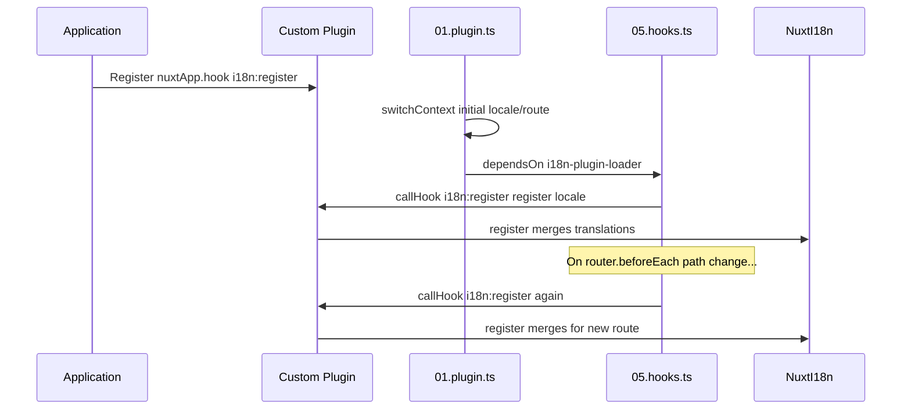

# 📢 イベント

## 🔄 `i18n:register`

`Nuxt I18n Micro` の `i18n:register` イベントを使うと、アプリケーションの i18n コンテキストへ翻訳を動的に追加でき、国際化プロセスをシームレスかつ柔軟にできます。このイベントにより、必要に応じて新しい翻訳を統合し、アプリケーションのローカライズ機能を強化できます。

### 📝 イベントの詳細

- **目的**:
  - 特定のロケール向けの既存翻訳セットに追加の翻訳を動的に組み込めるようにします。

- **ペイロード**:
  - **`register`**:
    - イベントによって提供される関数で、2 つの引数を受け取ります:
      - **`translations`**(`Translations`):
        - `Translations` インターフェースに従って構成された、キーと値のペアで翻訳を表すオブジェクト。
      - **`locale`**(`string`、任意):
        - 翻訳が登録されるロケールコード(例: `'en'`、`'ru'`)。指定されていない場合、イベントで提供されるロケールがデフォルトになります。

- **挙動**:
  - トリガーされると、`register` 関数は指定されたロケールの現在のコンテキストに新しい翻訳をマージし、アプリケーション全体で利用可能な翻訳を更新します。

### ⏱️ 発火タイミング

モジュールの hooks プラグイン(`05.hooks.ts`、`dependsOn: ['i18n-plugin-loader']`)は `nuxtApp.callHook('i18n:register', …)` を呼び出します:

1. **起動時に 1 回** — メインの i18n プラグイン(`01.plugin.ts`)が初期ルート用の翻訳を読み込んだ後
2. **ナビゲーション時** — `router.beforeEach` でパスが変わったとき、または `strategy: 'no_prefix'` の場合はすべてのナビゲーションで

通常の Nuxt プラグイン内で `nuxtApp.hook('i18n:register', …)` を使ってリスナーを登録します。hooks プラグインはローダーが準備できた後に実行されるので、翻訳を拡張する必要があるときにコールバックが呼ばれます。

`nuxt.config` で `hooks: false` を設定すると、自動的な `i18n:register` の呼び出しを無効化できます([設定 — `hooks`](/guides/configuration#hooks) を参照)。

### 💡 使用例

以下の例は、`i18n:register` イベントを使って翻訳を動的に追加する方法を示します:

```typescript
nuxt.hook('i18n:register', async (register: (translations: unknown, locale?: string) => void, locale: string) => {
  register(
    {
      greeting: 'Hello',
      farewell: 'Goodbye',
    },
    locale,
  )
})
```

### 🛠️ 説明



- **イベントのトリガー**:
  - hooks プラグイン(`05.hooks.ts`)は、メインローダーが準備できた後、および関連するナビゲーション時に `i18n:register` を発火します。

- **翻訳の追加**:
  - この例は「greeting」と「farewell」の英語翻訳を登録します。
  - `register` 関数は、指定されたロケールの既存セットへこれらの翻訳をマージします。

### 🔗 主なメリット

- **動的な更新**:
  - アプリケーション全体を再デプロイせずに翻訳を容易に更新・追加できます。

- **ローカライズの柔軟性**:
  - ユーザーやアプリケーションのニーズに応じて、リアルタイムのローカライズ調整をサポートします。

`i18n:register` イベントを使うことで、アプリケーションのローカライズ戦略を柔軟かつ適応可能に保ち、全体的なユーザー体験を向上させられます。

---

## 🛠️ プラグインによる翻訳の変更

Nuxt アプリケーションで翻訳を動的に変更するには、プラグインの使用が推奨されます。プラグインは、モジュールや外部の翻訳ファイルと連携する際に、ローカライズ更新を扱うための構造化された方法を提供します。

### **プラグインの登録**

モジュールを使っている場合、翻訳変更が行われるプラグインをモジュールの設定に追加して登録します:

```javascript
addPlugin({
  src: resolve('./plugins/extend_locales'),
})
```

これにより `./plugins/extend_locales` にあるプラグインが登録され、翻訳の動的な読み込みと登録を処理します。

### **プラグインの実装**

プラグイン内でロケール変更を管理できます。Nuxt プラグインでの実装例を以下に示します:

```typescript
import { defineNuxtPlugin } from '#app'

export default defineNuxtPlugin(async (nuxtApp) => {
  // Function to load translations from JSON files and register them
  const loadTranslations = async (lang: string) => {
    try {
      const translations = await import(`../locales/${lang}.json`)
      return translations.default
    } catch (error) {
      console.error(`Error loading translations for language: ${lang}`, error)
      return null
    }
  }

  // Hook into the 'i18n:register' event to dynamically add translations
  // eslint-disable-next-line @typescript-eslint/ban-ts-comment
  // @ts-expect-error
  nuxtApp.hook('i18n:register', async (register: (translations: unknown, locale?: string) => void, locale: string) => {
    const translations = await loadTranslations(locale)
    if (translations) {
      register(translations, locale)
    }
  })
})
```

### 📝 詳細な説明

1. **翻訳の読み込み**:

- `loadTranslations` 関数は、ロケールに基づいて翻訳ファイルを動的にインポートします。ファイルは `locales` ディレクトリにあり、ロケールコードに従って命名(例: `en.json`、`de.json`)されている必要があります。
- 正常に読み込まれると翻訳が返され、そうでない場合はエラーがログに記録されます。

2. **翻訳の登録**:

- プラグインは `nuxtApp.hook` を使って `i18n:register` イベントにフックします。
- イベントが発火されると、`register` 関数が読み込んだ翻訳と対応するロケールで呼び出されます。
- これにより、新しい翻訳が指定されたロケールの i18n コンテキストにマージされ、アプリケーション全体で利用可能な翻訳が更新されます。

### 🔗 翻訳変更にプラグインを使うメリット

- **関心の分離**:
  - ローカライズロジックをメインアプリケーションコードとは別にカプセル化し、管理と保守を容易にします。

- **動的でスケーラブル**:
  - 翻訳を動的に読み込み・登録することで、アプリケーション全体を再デプロイせずにコンテンツを更新できます。頻繁に更新されるコンテンツや多言語コンテンツを持つアプリで特に有用です。

- **強化されたローカライズの柔軟性**:
  - プラグインを使うと、必要に応じて翻訳を変更・拡張でき、ユーザーの好みやビジネス要件に応じたより適応的で応答性の高いローカライズ戦略が可能になります。

このアプローチを採用することで、プラグインを使った構造的で保守しやすいプロセスを通じてアプリケーションのローカライズを効率的に拡張・変更でき、変化するニーズに国際化を対応させ、全体的なユーザー体験を向上させられます。
