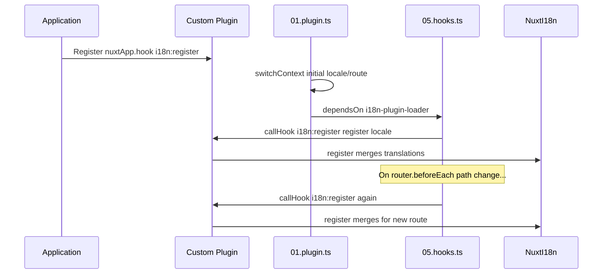

# 📢 イベント

## 🔄 `i18n:register`

`Nuxt I18n Micro` の `i18n:register` イベントは、アプリケーションの i18n コンテキストに翻訳を動的に追加できるようにします。これにより、国際化プロセスがシームレスかつ柔軟になります。このイベントを使うと、必要に応じて新しい翻訳を統合し、アプリケーションのローカライズ機能を強化できます。

### 📝 イベントの詳細

- **目的**:
  - 特定のロケール向けに既存のセットへ追加の翻訳を動的に組み込みます。

- **ペイロード**:
  - **`register`**:
    - イベントから提供される関数で、2 つの引数を取ります。
      - **`translations`** (`Translations`):
        - `Translations` インターフェースに従って整理された、翻訳のキーと値のペアを含むオブジェクト。
      - **`locale`** (`string`、オプション):
        - 翻訳を登録するロケールコード(例: `'en'`、`'ru'`)。指定がない場合はイベントで提供されたロケールがデフォルトになります。

- **動作**:
  - トリガーされると、`register` 関数は新しい翻訳を指定ロケールの現在のコンテキストにマージし、アプリケーション全体で利用可能な翻訳を更新します。

### ⏱️ 発火タイミング

モジュールの hooks プラグイン(`05.hooks.ts`、`dependsOn: ['i18n-plugin-loader']`)は、`nuxtApp.callHook('i18n:register', …)` を呼び出します。

1. **起動時に一度** — メインの i18n プラグイン (`01.plugin.ts`) が初期ルートの翻訳を読み込んだ後。
2. **ナビゲーション時** — `router.beforeEach` でパスが変わったとき、または `strategy: 'no_prefix'` の場合はナビゲーションごと。

リスナーは通常の Nuxt プラグインで `nuxtApp.hook('i18n:register', …)` として登録します。hooks プラグインはローダーの準備が整った後に実行されるため、翻訳を拡張する必要があるときにコールバックが呼び出されます。

`nuxt.config` で `hooks: false` を設定すると、自動的な `i18n:register` の呼び出しを無効化できます([設定 — `hooks`](/guides/configuration#hooks) を参照)。

### 💡 使用例

以下の例は、`i18n:register` イベントを使って翻訳を動的に追加する方法を示します。

```typescript
nuxt.hook('i18n:register', async (register: (translations: unknown, locale?: string) => void, locale: string) => {
  register(
    {
      greeting: 'Hello',
      farewell: 'Goodbye',
    },
    locale,
  )
})
```

### 🛠️ 説明



- **イベントのトリガー**:
  - hooks プラグイン (`05.hooks.ts`) は、メインローダーの準備が整った後と、関連するナビゲーション時に `i18n:register` を発火します。

- **翻訳の追加**:
  - この例では `"greeting"` と `"farewell"` の英語翻訳を登録します。
  - `register` 関数は、これらの翻訳を指定ロケールの既存セットにマージします。

### 🔗 主なメリット

- **動的更新**:
  - アプリケーション全体を再デプロイせずに、翻訳を簡単に更新または追加できます。

- **ローカライズの柔軟性**:
  - ユーザーやアプリケーションのニーズに応じて、リアルタイムのローカライズ調整をサポートします。

`i18n:register` イベントを使うことで、アプリケーションのローカライズ戦略を柔軟かつ適応的に保ち、全体的なユーザー体験を向上できます。

---

## 🛠️ プラグインによる翻訳の変更

Nuxt アプリケーションで動的に翻訳を変更するには、プラグインの利用を推奨します。特にモジュールや外部の翻訳ファイルを扱う場合、プラグインはローカライズの更新を構造的に扱う方法を提供します。

### **プラグインの登録**

モジュールを使用している場合は、翻訳変更を行うプラグインをモジュール構成に追加して登録します。

```javascript
addPlugin({
  src: resolve('./plugins/extend_locales'),
})
```

これで `./plugins/extend_locales` にあるプラグインが登録され、翻訳の動的な読み込みと登録を処理します。

### **プラグインの実装**

プラグイン内でロケール変更を管理できます。以下は Nuxt プラグインの実装例です。

```typescript
import { defineNuxtPlugin } from '#app'

export default defineNuxtPlugin(async (nuxtApp) => {
  // JSON ファイルから翻訳を読み込んで登録する関数
  const loadTranslations = async (lang: string) => {
    try {
      const translations = await import(`../locales/${lang}.json`)
      return translations.default
    } catch (error) {
      console.error(`Error loading translations for language: ${lang}`, error)
      return null
    }
  }

  // 'i18n:register' イベントにフックして翻訳を動的に追加
  // eslint-disable-next-line @typescript-eslint/ban-ts-comment
  // @ts-expect-error
  nuxtApp.hook('i18n:register', async (register: (translations: unknown, locale?: string) => void, locale: string) => {
    const translations = await loadTranslations(locale)
    if (translations) {
      register(translations, locale)
    }
  })
})
```

### 📝 詳細な説明

1. **翻訳の読み込み**:

- `loadTranslations` 関数は、ロケールに基づいて翻訳ファイルを動的にインポートします。ファイルは `locales` ディレクトリに配置され、ロケールコードに従って命名されている想定です(例: `en.json`、`de.json`)。
- 読み込みに成功すると翻訳が返されます。失敗した場合はエラーがログに記録されます。

2. **翻訳の登録**:

- プラグインは `nuxtApp.hook` を使って `i18n:register` イベントにフックします。
- イベントがトリガーされると、`register` 関数が読み込まれた翻訳と対応するロケールとともに呼び出されます。
- これにより、新しい翻訳が指定されたロケールの i18n コンテキストにマージされ、アプリケーション全体で利用可能な翻訳が更新されます。

### 🔗 プラグインによる翻訳変更のメリット

- **関心の分離**:
  - ローカライズロジックをメインアプリケーションコードとは別にカプセル化し、管理と保守を容易にします。

- **動的かつスケーラブル**:
  - 翻訳を動的に読み込み登録することで、アプリケーション全体を再デプロイせずにコンテンツを更新できます。頻繁に更新される多言語コンテンツを持つアプリケーションに特に有用です。

- **強化されたローカライズの柔軟性**:
  - プラグインを使うと必要に応じて翻訳を変更・拡張でき、ユーザー設定やビジネス要件に合わせた、より適応的で応答的なローカライズ戦略を提供できます。

このアプローチを採用することで、プラグインを用いた構造的で保守可能なプロセスを通じてアプリケーションのローカライズを効率的に拡張・変更でき、国際化を変化するニーズに適応させ、全体的なユーザー体験を向上できます。
