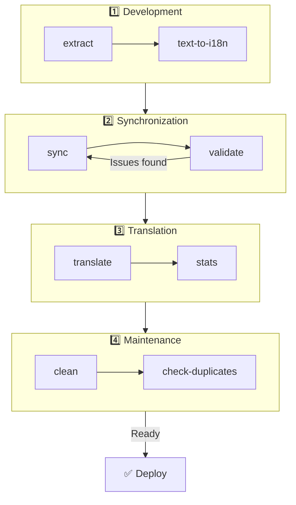

# 🌐 nuxt-i18n-micro-cli ガイド

## 📖 はじめに

`nuxt-i18n-micro-cli` は、`nuxt-i18n-micro` モジュール(Nuxt I18n Micro)を使う Nuxt.js プロジェクトでのローカライズおよび国際化プロセスを合理化するためのコマンドラインツールです。コードベースから翻訳キーを抽出したり、翻訳ファイルを管理したり、ロケール間で翻訳を同期したり、外部の翻訳サービスを利用して翻訳を自動化したりといったユーティリティを提供します。

このガイドでは、`nuxt-i18n-micro-cli` のインストール、設定、およびプロジェクトの翻訳を効果的に管理する使い方を順を追って説明します。パッケージは [npmjs.com](https://www.npmjs.com/package/nuxt-i18n-micro-cli) にあります。

## 🔧 インストールとセットアップ

### 📦 nuxt-i18n-micro-cli のインストール

グローバル、または Nuxt プロジェクトの dev 依存関係としてインストールします(CI では後者を推奨):

```bash
# global
npm install -g nuxt-i18n-micro-cli

# or per project
pnpm add -D nuxt-i18n-micro-cli
pnpm exec i18n-micro text-to-i18n --dryRun
```

プロジェクトが Nuxt 4 の `app/` ディレクトリ(`app/pages`、`app/components` など)を使用している場合は、**`nuxt-i18n-micro-cli` ≥ 2.1.1** を使用してください。それ以前の CLI バージョンは、プロジェクトルートの `pages/` のみをスキャンしていました。

### 🛠 プロジェクトでの初期化

インストール後、Nuxt.js プロジェクトディレクトリで `i18n-micro` コマンドを実行できます。

プロジェクトが `nuxt-i18n-micro` でセットアップされ、`nuxt.config.ts`(または `nuxt.config.js`)に必要な設定があることを確認してください。

### 📄 共通の引数

- `--cwd`: 現在の作業ディレクトリを指定(デフォルト: `.`)。
- `--logLevel`: ログレベルを設定(`silent`、`info`、`verbose`)。
- `--translationDir`: JSON 翻訳ファイルを含むディレクトリ(デフォルト: `locales`)。

## 📊 CLI ワークフロー概要



### ワークフローの手順

| フェーズ           | コマンド                    | 目的                           |
| --------------- | --------------------------- | --------------------------------- |
| **開発** | `extract`、`text-to-i18n`   | 翻訳キーを見つけて抽出する |
| **同期**        | `sync`、`validate`          | すべてのロケールが同じキーを持つようにする |
| **翻訳**   | `translate`、`stats`        | 未翻訳のキーを自動翻訳する       |
| **メンテナンス** | `clean`、`check-duplicates` | 翻訳を整った状態に保つ            |

## 📋 コマンド

### 🔄 `text-to-i18n` コマンド

CLI パッケージ: [`nuxt-i18n-micro-cli`](https://www.npmjs.com/package/nuxt-i18n-micro-cli)

**説明**: Vue/TS/JS ファイルをスキャンしてハードコードされたユーザー向け文字列を検出し、それらを `$t('...')` に置き換え、新しいキーを JSON 翻訳ファイルへマージします。**Nuxt プロジェクトルート**(`nuxt.config` がある場所)から実行してください。

**使い方**:

```bash
i18n-micro text-to-i18n [options]
```

**オプション**:

| オプション                  | デフォルト           | 説明                                                           |
| ----------------------- | ----------------- | --------------------------------------------------------------------- |
| `--translationFile`     | `locales/en.json` | 新しいキー用の JSON ファイル(プロジェクトルートからの相対パス)。                    |
| `--path`                | —                 | 単一のファイルまたはディレクトリのみを処理(例: `app/pages/about.vue`)。      |
| `--context`             | —                 | キーのプレフィックス(例: `auth` → `auth.*`)。                                  |
| `--dryRun`              | `false`           | ファイル書き込みなしでプレビュー。                                        |
| `--verbose`             | `false`           | 追加のログ出力。                                                        |
| `--interactive`         | `false`           | 適用前に各キーを確認または編集。                             |
| `--extractOnlyDirs`     | `plugins`         | キーを抽出するがソースファイルを**書き換えない**ディレクトリ。 |
| `--extractOnlyPatterns` | —                 | 抽出のみを行う glob 風パターン(例: `**/*.plugin.ts`)。              |

**例**:

```bash
i18n-micro text-to-i18n --translationFile locales/en.json --context auth --dryRun
```

#### スキャンされるフォルダー

<Info>
CLI **v2.1.1** 以降、`text-to-i18n` は従来のルートフォルダーと `app/*` の同等物の両方をスキャンします。コマンドは**プロジェクトルート**から実行してください — `cd app` はしないでください。
</Info>

以下の配下から `*.vue`、`*.js`、`*.ts` を収集します:

| Nuxt 3(プロジェクトルート) | Nuxt 4(`app/` ディレクトリ) |
| --------------------- | ------------------------- |
| `pages/`              | `app/pages/`              |
| `components/`         | `app/components/`         |
| `plugins/`            | `app/plugins/`            |
| `layouts/`            | `app/layouts/`            |

その他のフォルダー(`server/`、`composables/`、`middleware/` など)は、`--path` を使わない限りスキップされます。Nuxt 4 では、プロジェクトルートから実行してください(`cd app` は不要)。`i18n.translationDir` が `locales/` 以外の場合は、`--translationFile` を合わせてください。

```bash
i18n-micro text-to-i18n --path app/pages
```

#### 仕組み

1. 上記のディレクトリ(または `--path`)からファイルを収集します。
2. リテラル / テンプレートテキストを `$t('generated.key')` に置き換えます(デフォルトで `plugins/` は抽出専用)。
3. 既存のエントリを削除せずに、新しいキーを `--translationFile` にマージします。

**変換例**:

変換前:

```vue
<template>
  <div>
    <h1>Welcome to our site</h1>
    <p>Please sign in to continue</p>
  </div>
</template>
```

変換後:

```vue
<template>
  <div>
    <h1>{{ $t('pages.home.welcome_to_our_site') }}</h1>
    <p>{{ $t('pages.home.please_sign_in') }}</p>
  </div>
</template>
```

**ベストプラクティス**: まず dry run を実行、フルラン前にコミット、`nuxt.config` の `i18n.translationDir` と `--translationFile` を揃える、ブートストラップコードのために `--extractOnlyDirs plugins` を保持する。

**制限事項**: モジュールにはバンドルされていない独立した npm パッケージ、`nuxt.config` を自動的には読まない、`$t(...)` を出力する、複雑な動的文字列には代わりに `extract` / `search` が必要な場合がある。

### 📊 `stats` コマンド

**説明**: `stats` コマンドは、Nuxt.js プロジェクト内の各ロケールに対する翻訳統計を表示するために使用します。利用可能なキー総数に対して翻訳済みのキーがいくつあるかを表示し、翻訳の進捗を把握するのに役立ちます。

**使い方**:

```bash
i18n-micro stats [options]
```

**オプション**:

- `--full`: 統合された翻訳統計のみを表示(デフォルト: `false`)。

**例**:

```bash
i18n-micro stats --full
```

### 🌍 `translate` コマンド

**説明**: `translate` コマンドは、外部翻訳サービスを使って未翻訳のキーを自動的に翻訳します。Google Translate、DeepL などのサービスの API を活用して不足している翻訳を埋めることで、翻訳プロセスを簡素化します。

**使い方**:

```bash
i18n-micro translate [options]
```

**オプション**:

- `--service`: 使用する翻訳サービス(例: `google`、`deepl`、`yandex`)。指定しない場合、コマンドは選択を求めます。
- `--token`: 選択した翻訳サービスに対応する API キー。指定しない場合、入力を求められます。
- `--options`: 翻訳サービス用の追加オプション。key:value のペアをカンマ区切りで指定します(例: `model:gpt-3.5-turbo,max_tokens:1000`)。
- `--replace`: 既存の翻訳を置き換えて、すべてのキーを翻訳(デフォルト: `false`)。

**例**:

```bash
i18n-micro translate --service deepl --token YOUR_DEEPL_API_KEY
```

#### 🌐 サポートされる翻訳サービス

`translate` コマンドは複数の翻訳サービスをサポートしています。サポートされる主なサービス:

- **Google Translate**(`google`)
- **DeepL**(`deepl`)
- **Yandex Translate**(`yandex`)
- **OpenAI**(`openai`)
- **Azure Translator**(`azure`)
- **IBM Watson**(`ibm`)
- **Baidu Translate**(`baidu`)
- **LibreTranslate**(`libretranslate`)
- **MyMemory**(`mymemory`)
- **Lingva Translate**(`lingvatranslate`)
- **Papago**(`papago`)
- **Tencent Translate**(`tencent`)
- **Systran Translate**(`systran`)
- **Yandex Cloud Translate**(`yandexcloud`)
- **ModernMT**(`modernmt`)
- **Lilt**(`lilt`)
- **Unbabel**(`unbabel`)
- **Reverso Translate**(`reverso`)

#### ⚙️ サービス設定

一部のサービスには、固有の設定や API キーが必要です。`translate` コマンドを使うときに、サービスを指定し、必要に応じて `--token`(API キー)と追加の `--options` を指定できます。

例:

```bash
i18n-micro translate --service openai --token YOUR_OPENAI_API_KEY --options openaiModel:gpt-3.5-turbo,max_tokens:1000
```

### 🛠️ `extract` コマンド

**説明**: コードベースから翻訳キーを抽出し、スコープ別に整理します。

**使い方**:

```bash
i18n-micro extract [options]
```

**オプション**:

- `--prod, -p`: 本番モードで実行。

**例**:

```bash
i18n-micro extract
```

### 🔄 `sync` コマンド

**説明**: ロケール間で翻訳ファイルを同期し、すべてのロケールが同じキーを持つようにします。

**使い方**:

```bash
i18n-micro sync [options]
```

**例**:

```bash
i18n-micro sync
```

### ✅ `validate` コマンド

**説明**: 参照ロケールと比較して、翻訳ファイル内の不足キーや余分なキーを検証します。

**使い方**:

```bash
i18n-micro validate [options]
```

**例**:

```bash
i18n-micro validate
```

### 🧹 `clean` コマンド

**説明**: 翻訳ファイルから未使用の翻訳キーを削除します。

**使い方**:

```bash
i18n-micro clean [options]
```

**例**:

```bash
i18n-micro clean
```

### 📤 `import` コマンド

**説明**: PO ファイルを JSON 形式に戻し、翻訳ディレクトリに保存します。

**使い方**:

```bash
i18n-micro import [options]
```

**オプション**:

- `--potsDir`: PO ファイルを含むディレクトリ(デフォルト: `pots`)。

**例**:

```bash
i18n-micro import --potsDir pots
```

### 📥 `export` コマンド

**説明**: 外部の翻訳管理のために、翻訳を PO ファイルへエクスポートします。

**使い方**:

```bash
i18n-micro export [options]
```

**オプション**:

- `--potsDir`: PO ファイルを保存するディレクトリ(デフォルト: `pots`)。

**例**:

```bash
i18n-micro export --potsDir pots
```

### 🗂️ `export-csv` コマンド

**説明**: `export-csv` コマンドは、JSON ファイルから翻訳キーと値、およびファイルパスを含めて CSV 形式でエクスポートします。表計算ソフトで翻訳データを扱いたいチームに便利です。

**使い方**:

```bash
i18n-micro export-csv [options]
```

**オプション**:

- `--csvDir`: エクスポートされた CSV ファイルを保存するディレクトリ。
- `--delimiter`: CSV ファイルの区切り文字を指定(デフォルト: `,`)。

**例**:

```bash
i18n-micro export-csv --csvDir csv_files
```

### 📑 `import-csv` コマンド

**説明**: `import-csv` コマンドは、CSV ファイルから翻訳データをインポートし、対応する JSON ファイルを更新します。表計算からの一括更新を反映するのに便利です。

**使い方**:

```bash
i18n-micro import-csv [options]
```

**オプション**:

- `--csvDir`: インポートする CSV ファイルを含むディレクトリ。
- `--delimiter`: CSV ファイルで使用する区切り文字を指定(デフォルト: `,`)。

**例**:

```bash
i18n-micro import-csv --csvDir csv_files
```

### 🧾 `diff` コマンド

**説明**: 同じディレクトリ内(サブディレクトリを含む)のデフォルトロケールと他のロケールの翻訳ファイルを比較します。デフォルトロケールと他のロケールに対する不足キーとその値を検出し、翻訳進捗や差異の追跡を容易にします。

**使い方**:

```bash
i18n-micro diff [options]
```

**例**:

```bash
i18n-micro diff
```

### 🔍 `check-duplicates` コマンド

**説明**: `check-duplicates` コマンドは、ルートレベルとページ固有の両方を含む、すべての翻訳ファイルにわたって、各ロケール内で重複する翻訳値を検出します。同じ言語内で異なるキーが同一の翻訳値を共有しないようにし、翻訳の明確さと一貫性を維持します。

**使い方**:

```bash
i18n-micro check-duplicates [options]
```

**例**:

```bash
i18n-micro check-duplicates
```

**仕組み**:

- コマンドは各ロケールについて、ルートレベルとページ固有の翻訳ファイルの両方をチェックします。
- 翻訳値が複数の場所(ルートレベルの翻訳内、または異なるページ間)に現れる場合、それが見つかったファイルとキーとともに重複した値を報告します。
- 重複が見つからない場合、そのロケールに重複した翻訳値がないことを確認します。

このコマンドにより、翻訳キーが一意の値を維持できるようになり、同じロケール内での意図しない繰り返しを防げます。

### 🔄 `replace-values` コマンド

**説明**: `replace-values` コマンドは、すべてのロケール全体で翻訳値の一括置換を行います。シンプルなテキスト置換と、正規表現(regex)を使った高度な置換の両方をサポートします。正規表現パターン内でキャプチャグループを使い、置換文字列内で参照することもできるため、より複雑な置換シナリオに理想的です。

**使い方**:

```bash
i18n-micro replace-values [options]
```

**オプション**:

- `--search`: 翻訳内で検索するテキストまたは正規表現パターン。必須オプションです。
- `--replace`: 検出された翻訳に対する置換テキスト。必須オプションです。
- `--useRegex`: 正規表現パターンを使った検索を有効化(デフォルト: `false`)。

**例 1**: シンプルな置換

すべてのロケール全体で「Hello」を「Hi」に置き換えます:

```bash
i18n-micro replace-values --search "Hello" --replace "Hi"
```

**例 2**: 正規表現による置換

正規表現検索を有効化し、「Hello」で始まり数字が続くすべての文字列(例: 「Hello123」)を、すべてのロケール全体で「Hi」に置き換えます:

```bash
i18n-micro replace-values --search "Hello\\d+" --replace "Hi" --useRegex
```

**例 3**: 正規表現のキャプチャグループを使用

キャプチャグループを使って、一致した文字列の一部を置換に動的に挿入できます。例えば、「Hello [name]」を「Hi [name]」に置き換え、名前部分を保持します:

```bash
i18n-micro replace-values --search "Hello (\\w+)" --replace "Hi $1" --useRegex
```

このケースでは、`$1` が最初のキャプチャグループ(「Hello」の後の `[name]` 部分)を参照します。置換後も元の名前が保持されます。

**仕組み**:

- コマンドはすべての翻訳ファイル(グローバルとページ固有の両方)を走査します。
- 検索文字列または正規表現パターンに一致した箇所は、指定した置換テキストで置き換えられます。
- 正規表現を使う場合、キャプチャグループは置換文字列内で `$1`、`$2` などとして参照できます。
- すべての変更がログに記録され、ファイルパス、翻訳キー、および翻訳値の変更前/変更後の状態が表示されます。

**ログ**:
各置換について、コマンドは以下の情報を含む詳細をログに出力します:

- ロケールとファイルパス
- 変更された翻訳キー
- 置換前の値と置換後の新しい値
- キャプチャグループ付きの正規表現を使用した場合、ログにはグループの一致内容とそれらがどのように置き換えられたかが表示されます

これにより、置換操作中にどこで何が変更されたかを正確に追跡でき、翻訳ファイル全体の変更履歴を明確に把握できます。

## 🛠 サンプル

- **翻訳を抽出する**:

  ```bash
  i18n-micro extract
  ```

- **Google Translate を使って未翻訳のキーを翻訳する**:

  ```bash
  i18n-micro translate --service google --token YOUR_GOOGLE_API_KEY
  ```

- **既存の翻訳を置き換えて、すべてのキーを翻訳する**:

  ```bash
  i18n-micro translate --service deepl --token YOUR_DEEPL_API_KEY --replace
  ```

- **翻訳ファイルを検証する**:

  ```bash
  i18n-micro validate
  ```

- **未使用の翻訳キーをクリーンアップする**:

  ```bash
  i18n-micro clean
  ```

- **翻訳ファイルを同期する**:

  ```bash
  i18n-micro sync
  ```

## ⚙️ 設定ガイド

`nuxt-i18n-micro-cli` は、`nuxt.config.ts`(または `nuxt.config.js`)の Nuxt.js i18n 設定に依存します。`nuxt-i18n-micro` モジュールがインストールされ、設定されていることを確認してください。

### 🔑 nuxt.config.js の例

```ts
export default defineNuxtConfig({
  modules: ['nuxt-i18n-micro'],
  i18n: {
    locales: [
      { code: 'en', iso: 'en-US' },
      { code: 'fr', iso: 'fr-FR' },
    ],
    defaultLocale: 'en',
    fallbackLocale: 'en',
    translationDir: 'locales', // or 'app/locales' for Nuxt 4 colocation
  },
})
```

`translationDir` が `nuxt-i18n-micro-cli` が使用するディレクトリ(デフォルト `locales`)と一致していることを確認してください。

## 📝 ベストプラクティス

### 🔑 一貫したキー命名

翻訳キーは一貫性があり説明的であるようにし、混乱や重複を避けてください。

### 🧹 定期的なメンテナンス

未使用の翻訳キーを定期的に削除して翻訳ファイルをクリーンに保つため、`clean` コマンドを定期的に使いましょう。

### 🛠 翻訳ワークフローの自動化

`nuxt-i18n-micro-cli` コマンドを開発ワークフローや CI/CD パイプラインに統合し、翻訳ファイルの抽出、翻訳、検証、同期を自動化しましょう。

### 🛡️ API キーを安全に管理する

API キーが必要な翻訳サービスを使用する際は、キーを安全に保管し、バージョン管理システムにコミットしないようにしてください。環境変数や安全なキー管理ソリューションの利用を検討してください。

## 📞 サポートと貢献

問題が発生したり改善提案がある場合、プロジェクトに貢献したり、プロジェクトリポジトリで issue を開いてください。

---

このガイドに従うことで、`nuxt-i18n-micro-cli` を使って Nuxt.js プロジェクト内の翻訳を効果的に管理でき、国際化の作業を合理化し、さまざまなロケールのユーザーに滑らかな体験を提供できます。
