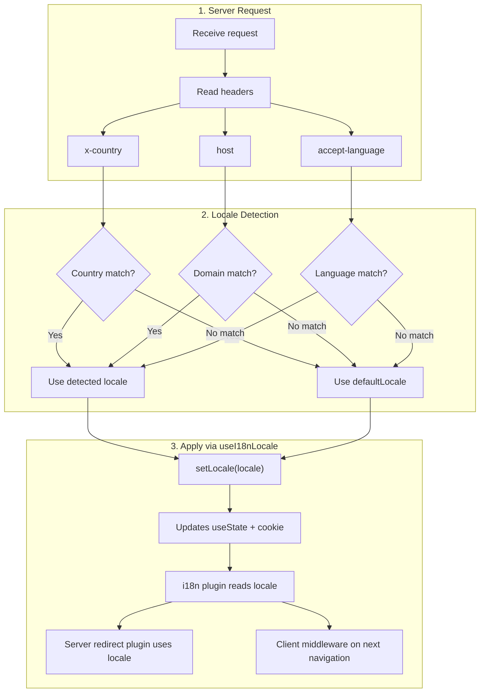

# 🔧 Nuxt I18n Micro でのカスタム言語検出

## 📖 概要

Nuxt I18n Micro v3 は、すべてのロケール管理のための一元化されたコンポーザブル `useI18nLocale()` を提供します。これは v2 での手動の `useState`/`useCookie` パターンに代わるものです。サーバープラグイン内で `useI18nLocale().setLocale()` を使うことで、モジュールのリダイレクトおよびクッキーシステムとの完全な互換性を維持しつつ、任意のカスタム検出ロジックを実装できます。

## 🏗️ アーキテクチャ

```mermaid
flowchart TB
    subgraph Plugins["Plugin Execution Order"]
        A["Your plugin<br/>order: -10"] -->|setLocale()| B["01.plugin.ts<br/>order: -5"]
        B --> C["06.redirect.ts server<br/>order: 10"]
    end

    subgraph Client["Client SPA Navigation"]
        D["i18n-redirect.global.ts<br/>route middleware"]
    end

    subgraph State["Locale State"]
        E["useState('i18n-locale')"]
        F["localeCookie"]
    end

    A -->|"setLocale() updates both"| E
    A -->|"setLocale() updates both"| F
    B -->|reads| E
    C -->|reads| E
    C -->|reads| F
    D -->|reads target route +| E
```

**基本原則**: `order: -10` のサーバープラグイン内で `useI18nLocale().setLocale()` を呼び出します。これにより `useState('i18n-locale')` とロケールクッキーの両方がアトミックに更新され、i18n プラグイン(`order: -5`)とサーバーリダイレクトプラグイン(`order: 10`)は最初の SSR リクエストで正しいロケールを参照できます。クライアント側の自動リダイレクトは、以降のナビゲーションでグローバルルートミドルウェアとして実行されます。

## 🛠️ 組み込みの自動検出を無効化する

ロケール検出を完全にコントロールしたい場合、組み込みメカニズムを無効にします:

```ts
export default defineNuxtConfig({
  i18n: {
    autoDetectLanguage: false,
  },
})
```

## ✨ 例: `useI18nLocale` を用いたサーバーサイドの検出

これはすべての戦略に対して**推奨されるアプローチ**です。

### ステップ 1: `nuxt.config.ts` の設定

```ts
export default defineNuxtConfig({
  modules: ['nuxt-i18n-micro'],
  i18n: {
    strategy: 'no_prefix', // Works with ANY strategy
    defaultLocale: 'en',
    localeCookie: 'user-locale',
    autoDetectLanguage: false,
    locales: [
      { code: 'en', iso: 'en-US' },
      { code: 'de', iso: 'de-DE' },
      { code: 'ja', iso: 'ja-JP' },
    ],
  },
})
```

### ステップ 2: `plugins/i18n-loader.server.ts` の作成

```ts
import { defineNuxtPlugin, useRequestHeaders } from '#imports'

export default defineNuxtPlugin({
  name: 'i18n-custom-loader',
  enforce: 'pre',
  order: -10, // Execute BEFORE the i18n plugin (which has order -5)

  setup() {
    const { setLocale } = useI18nLocale()
    const headers = useRequestHeaders(['host', 'x-country', 'accept-language'])
    let detectedLocale = 'en'

    // --- YOUR DETECTION LOGIC ---

    // Example 1: By domain
    const host = headers['host']
    if (host?.includes('example.de')) {
      detectedLocale = 'de'
    }
    // Example 2: By custom header
    else if (headers['x-country'] === 'JP') {
      detectedLocale = 'ja'
    }
    // Example 3: By Accept-Language header
    else if (headers['accept-language']?.includes('de')) {
      detectedLocale = 'de'
    }

    // --- APPLY THE LOCALE ---
    setLocale(detectedLocale)
  },
})
```

### 仕組み



1. **プラグインが最初に実行される**(`order: -10`) — ヘッダー、ドメイン、その他のソースからロケールを検出します
2. **`setLocale()` が両方を更新** — `useState('i18n-locale')` とクッキーを更新し、以降のすべてのプラグインで即座に参照可能にします
3. **i18n プラグイン**(`order: -5`)がロケールを読み取り、正しい翻訳を読み込みます
4. **サーバーリダイレクトプラグイン**(`order: 10`)は SSR 時のリダイレクト判断にロケールを使用します
5. **クライアントルートミドルウェア**(`i18n-redirect`)は、URL のロケールが設定と一致しない場合、SPA ナビゲーションで再リダイレクトを適用します

## 🌐 戦略別の動作

`useI18nLocale().setLocale()` は**すべての戦略**で動作します。リダイレクトの挙動は戦略に依存します:

<Tip>
| 戦略 | `setLocale('de')` の効果 |
|----------|---------------------------|
| `no_prefix` | ドイツ語でレンダリング、URL は変わらない |
| `prefix` | 302 → `/de/`(サーバーサイドリダイレクト) |
| `prefix_except_default` | `de` ≠ default の場合 302 → `/de/`。`de` = default の場合はリダイレクトなし |
| `prefix_and_default` | リダイレクトなし(`/` と `/de/` の両方が有効) |
</Tip>

**重要な注意事項:**

- クッキーベースのロケール検出はデフォルトで無効です(`localeCookie: null`)
- クッキー永続化を有効化するには `localeCookie: 'user-locale'` を設定します
- クッキー/state の値が `locales` リストに存在しない場合、`defaultLocale` にフォールバックします

## 🏢 応用: ドメインベースの検出

各ドメインが異なるロケールを配信するマルチドメイン構成の場合:

```ts
import { defineNuxtPlugin, useRequestHeaders } from '#imports'

export default defineNuxtPlugin({
  name: 'i18n-domain-loader',
  enforce: 'pre',
  order: -10,

  setup() {
    const { setLocale } = useI18nLocale()
    const headers = useRequestHeaders(['host'])
    const host = headers['host'] || ''

    let detectedLocale = 'en'

    if (host.endsWith('.de') || host.includes('german.')) {
      detectedLocale = 'de'
    } else if (host.endsWith('.fr') || host.includes('french.')) {
      detectedLocale = 'fr'
    } else if (host.endsWith('.jp') || host.includes('japanese.')) {
      detectedLocale = 'ja'
    }

    setLocale(detectedLocale)
  },
})
```

## 🔄 応用: ユーザーの設定を尊重する

ユーザーが手動で言語を切り替えられる場合、自動検出より彼らの選択を優先します:

```ts
import { defineNuxtPlugin, useRequestHeaders } from '#imports'

export default defineNuxtPlugin({
  name: 'i18n-smart-loader',
  enforce: 'pre',
  order: -10,

  setup() {
    const { getLocale, setLocale } = useI18nLocale()

    // If user already has a preference (from cookie), respect it
    if (getLocale()) {
      return
    }

    // Otherwise, detect locale from headers
    const headers = useRequestHeaders(['accept-language'])
    let detectedLocale = 'en'

    const acceptLanguage = headers['accept-language'] || ''
    if (acceptLanguage.includes('de')) {
      detectedLocale = 'de'
    } else if (acceptLanguage.includes('ja')) {
      detectedLocale = 'ja'
    }

    setLocale(detectedLocale)
  },
})
```

## ⚙️ サーバー専用またはクライアント専用のプラグイン

プラグインがどこで実行されるかを制御するには、[Nuxt のファイル名規約](https://nuxt.com/docs/getting-started/directory-structure#plugins) を使用します:

- **サーバー専用**: `i18n-loader.server.ts` — SSR 時のみ実行(ヘッダーベースの検出に推奨)
- **クライアント専用**: `i18n-loader.client.ts` — ブラウザ内でのみ実行(`localStorage` や DOM ベースの検出用)

<Tip>

</Tip>

## ✅ まとめ

| 機能                                    | 説明                                                              |
| -------------------------------------- | ----------------------------------------------------------------- |
| `useI18nLocale().setLocale()`          | `useState` とクッキーをアトミックに更新。すべての戦略で動作 |
| `useI18nLocale().getLocale()`          | state またはクッキーから現在のロケールを返す                        |
| `useI18nLocale().getPreferredLocale()` | 優先ロケールを返す(`locales` リストに対して検証済み)              |
| プラグイン `order: -10`                 | 自作プラグインが i18n 初期化より前に実行されるようにする              |
| `enforce: 'pre'`                       | 「pre」プラグイングループで実行される                                |

**やってはいけないこと:**

- `useCookie('user-locale')` を直接使わない — `useI18nLocale()` が内部でクッキーを管理します
- `useState('i18n-locale')` を直接使わない — 代わりに `useI18nLocale().setLocale()` を使用してください
- `order` を -5 以上に設定しない — プラグインは i18n プラグインより前に実行する必要があります
