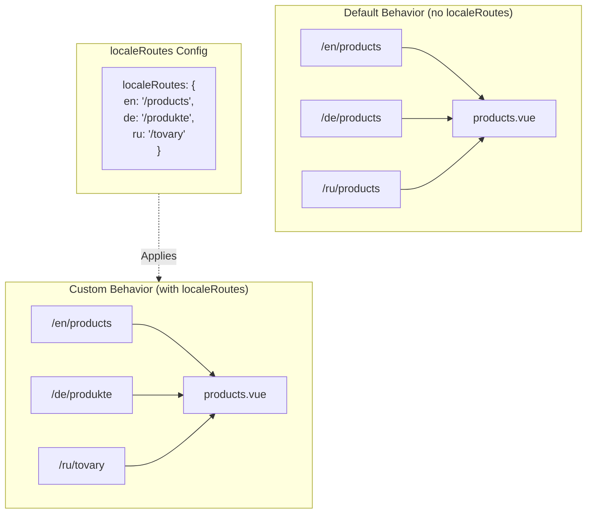

# 🔗 `Nuxt I18n Micro` の `localeRoutes` によるカスタムローカライズドルート

## 📖 `localeRoutes` の概要

`Nuxt I18n Micro` の `localeRoutes` 機能を使うと、特定のロケール向けにカスタムルートを定義でき、アプリケーションのルーティング構造に柔軟性と制御を持たせられます。この機能は、特定のロケールが異なる URL 構造や独自のパス、あるいは特定の地域的・言語的な慣例に従う必要がある場合に特に有用です。

## 🚀 `localeRoutes` の主なユースケース

`localeRoutes` の主なユースケースは、異なるロケール向けに個別のルートを提供し、URL が直感的でターゲットオーディエンスに関連性を持つようにすることでユーザー体験を向上させることです。例えば、ページの英語版とロシア語版で異なるパスを用意し、ロシア語ロケールがローカライズされた URL 形式に従うようにすることが可能です。

### 📄 例: `$defineI18nRoute` 内で `localeRoutes` を定義する

`$defineI18nRoute` 関数内で `localeRoutes` を使って特定のロケール向けにカスタムルートを定義する例です:

```typescript
import { useNuxtApp } from '#imports'

const { $defineI18nRoute } = useNuxtApp()

$defineI18nRoute({
  localeRoutes: {
    ru: '/localesubpage', // Custom route path for the Russian locale
    de: '/lokaleseite', // Custom route path for the German locale
  },
})
```

> [!IMPORTANT]
> `$defineI18nRoute` はグローバル関数ではありません。`script setup` では、まず `useNuxtApp()` から取得してから呼び出してください。

### 🔄 `localeRoutes` の仕組み



- **デフォルトの挙動**: `localeRoutes` がない場合、すべてのロケールはプライマリパスで定義された共通のルート構造を使用します。
- **カスタム挙動**: `localeRoutes` を使うと、特定のロケールは設定で定義されたロケール固有のルートを持ち、デフォルトのパスを上書きします。

## 🌱 `localeRoutes` のユースケース

### 📄 例: ページ内で `localeRoutes` を使う

`$defineI18nRoute` と `localeRoutes` の使い方を示すシンプルな Vue コンポーネントです:

```vue
<template>
  <div>
    <!-- Display greeting message based on the current locale -->
    <p>{{ $t('greeting') }}</p>

    <!-- Navigation links -->
    <div>
      <NuxtLink :to="$localeRoute({ name: 'index' })"> Go to Index </NuxtLink>
      |
      <NuxtLink :to="$localeRoute({ name: 'about' })"> Go to About Page </NuxtLink>
    </div>
  </div>
</template>

<script setup>
import { useNuxtApp } from '#imports'

const { $getLocale, $switchLocale, $getLocales, $localeRoute, $t, $defineI18nRoute } = useNuxtApp()

// Define translations and custom routes for specific locales
$defineI18nRoute({
  localeRoutes: {
    ru: '/localesubpage', // Custom route path for Russian locale
  },
})
</script>
```

### 🛠️ 異なるコンテキストでの `localeRoutes` の利用

- **ランディングページ**: カスタムルートを使って、マーケティングキャンペーンに合わせたランディングページ URL をローカライズします。
- **ドキュメントサイト**: 各ロケール向けに個別のルートを提供し、ローカライズされたコンテンツ構造とより良く一致させます。
- **EC サイト**: SEO とユーザー体験を向上させるため、ロケールごとに商品やカテゴリー URL をカスタマイズします。

## `localeRoutes` を使用したナビゲーション

ローカライズされたルートは、ページディレクトリ内のファイル名と直接一致しないため、名前ではなくオブジェクトでナビゲーションを参照する必要があります。

```vue
<template>
  /**
   * Exemple page: /pages/about-us.vue
   * EN /about-us
   * ES /sobre-nosotros
   * FR /a-propos
   */

  // Using NuxtLink
  <NuxtLink :to="$localeRoute({ name: 'about-us' })">
    Go to About Page
  </NuxtLink>

  // Using I18nLink
  <I18nLink :to="{ name: 'about-us' }">
    Go to About Page
  </NuxtLink>

  // The string literal navigation wouldn't work for any locale but english
  <I18nLink to="/about-us">
    Go to About Page
  </NuxtLink>
</template>
```

### ネストされたページの命名

デフォルトでは、ページはファイル名とパス名に基づいて命名されます。つまり:

- `/pages/about-us.vue` は `$localeRoute(\{ name: 'about-us' \})` でアクセスできます
- `/pages/about-us/physical-stores.vue` は `$localeRoute(\{ name: 'about-us-physical-stores' \})` でアクセスできます

この挙動を上書きするには、`definePageMeta` でページに明示的な名前を付けます。

```vue
// /pages/about-us/physical-stores.vue
<script setup>
definePageMeta({
  name: 'our-stores'
})
```

このページは、`$localeRoute` または `I18nLink` から `:to='\{ name: "our-stores" \}'` として名前で参照できるようになります。

## 🎯 スラッグと `$setI18nRouteParams` による動的ルート

スラッグやパラメーターを含む動的ルートを扱う場合、動的セグメントを持つ `localeRoutes` と `$setI18nRouteParams` を組み合わせて、各ロケール向けにロケール固有のスラッグを提供できます。

### `localeRoutes` の動的ルートパラメーター

Nuxt のルートパラメーター構文(キャッチオールルート用の `[...slug]`、単一パラメーター用の `[param]`、または名前付きパラメーター用の `:param()`)を使って動的ルートを定義できます:

```vue
<script setup lang="ts">
import { useNuxtApp, useRoute, useFetch, createError } from '#imports'

const { $defineI18nRoute, $setI18nRouteParams } = useNuxtApp()

// Define custom routes with dynamic segments
$defineI18nRoute({
  localeRoutes: {
    en: '/our-products/[...slug]',
    es: '/nuestros-productos/[...slug]',
  },
})
</script>
```

### ロケール固有のルートパラメーターの設定

`$setI18nRouteParams` 関数を使うと、ロケールごとに異なるパラメーター値(スラッグなど)を設定できます。コンテンツにロケール固有の URL がある場合に特に有用です。

**重要**: `$setI18nRouteParams` は、ロケール固有のスラッグを含むデータを取得した後、通常は `useFetch` または `useAsyncData` の内部で呼び出す必要があります。

```vue
<script setup lang="ts">
import { useNuxtApp, useRoute, useFetch, createError } from '#imports'

interface Product {
  title: string
  price: string
  urlEn: string // English slug
  urlEs: string // Spanish slug
}

const { $defineI18nRoute, $setI18nRouteParams } = useNuxtApp()

const route = useRoute()
const slug = Array.isArray(route.params.slug) ? route.params.slug[0] : route.params.slug

// Fetch product data that includes locale-specific slugs
const { data: product, error } = await useFetch<Product>(`/api/product/${slug}`)
if (error.value)
  throw createError({
    statusCode: error.value?.statusCode,
    statusMessage: error.value?.statusMessage,
    fatal: true,
  })

// Define custom routes with dynamic segments
$defineI18nRoute({
  localeRoutes: {
    en: '/our-products/[...slug]',
    es: '/nuestros-productos/[...slug]',
  },
})

// Set different slugs for different locales
if (product.value) {
  $setI18nRouteParams({
    en: { slug: product.value.urlEn },
    es: { slug: product.value.urlEs },
  })
}
</script>
```

### 完全な例: ロケール固有スラッグを持つ商品ページ

商品詳細ページで `localeRoutes` と `$setI18nRouteParams` を組み合わせて使う完全な例です:

```vue
<template>
  <div v-if="product">
    <h1>{{ product.title }}</h1>
    <p>{{ $t('price') }}: {{ product.price }}</p>
    <div class="locale-switcher">
      <a :href="$switchLocalePath('en')">English</a>
      <a :href="$switchLocalePath('es')">Español</a>
    </div>
  </div>
</template>

<script setup lang="ts">
import { useNuxtApp, useRoute, useFetch, createError } from '#imports'

interface Product {
  title: string
  price: string
  urlEn: string
  urlEs: string
}

const { $t, $defineI18nRoute, $setI18nRouteParams, $switchLocalePath } = useNuxtApp()

// Set page name for easier navigation
definePageMeta({ name: 'product-slug' })

const route = useRoute()
const slug = Array.isArray(route.params.slug) ? route.params.slug[0] : route.params.slug

// Fetch product data
const { data: product, error } = await useFetch<Product>(`/api/product/${slug}`)
if (error.value)
  throw createError({
    statusCode: error.value?.statusCode,
    statusMessage: error.value?.statusMessage,
    fatal: true,
  })

// Define locale-specific routes with dynamic segments
$defineI18nRoute({
  localeRoutes: {
    en: '/our-products/[...slug]',
    es: '/nuestros-productos/[...slug]',
  },
})

// Set locale-specific slugs so $switchLocalePath works correctly
if (product.value) {
  $setI18nRouteParams({
    en: { slug: product.value.urlEn },
    es: { slug: product.value.urlEs },
  })
}
</script>
```

### 例: 商品リストページ

リストページから動的ルートへリンクする場合、パラメーター付きのルート名を使います:

```vue
<template>
  <div>
    <h1>{{ $t('title') }}</h1>
    <ul>
      <li v-for="product in products?.[$getLocale()] || []" :key="product.id">
        <I18nLink :to="{ name: 'product-slug', params: { slug: product.url } }"> {{ product.title }} – {{ product.price }} </I18nLink>
      </li>
    </ul>
  </div>
</template>

<script setup lang="ts">
import { useNuxtApp, useFetch, createError } from '#imports'

interface Product {
  id: string
  title: string
  price: string
  url: string
}

type ProductsByLocale = Record<string, Product[]>

const { $t, $defineI18nRoute, $getLocale } = useNuxtApp()

const { data: products, error } = await useFetch<ProductsByLocale>('/api/product')
if (error.value)
  throw createError({
    statusCode: error.value?.statusCode,
    statusMessage: error.value?.statusMessage,
    fatal: true,
  })

$defineI18nRoute({
  locales: {
    en: {
      title: 'Our Product Range',
      description: 'Discover our collection of high-quality products.',
    },
    es: {
      title: 'Nuestra Gama de Productos',
      description: 'Descubra nuestra colección de productos de alta calidad.',
    },
  },
  localeRoutes: {
    en: '/our-products',
    es: '/nuestros-productos',
  },
})
</script>
```

### 仕組み

1. **ルート定義**: `localeRoutes` は各ロケールの基本パス構造を定義します(`[...slug]` や `[id]` のような動的セグメントを含む)。

2. **パラメーター設定**: `$setI18nRouteParams` は、各ロケール向けの実際のパラメーター値を設定します。ユーザーが `$switchLocalePath` を使ってロケールを切り替えると、モジュールはこれらのパラメーターを使って正しい URL を構築します。

3. **パラメーター形式**: パラメーターオブジェクトは次の構造と一致する必要があります:

   ```typescript
   {
     [localeCode]: {
       [paramName]: paramValue
     }
   }
   ```

4. **ナビゲーション**: 動的ルートのローカライズ版間を移動するには、`I18nLink` または `$localeRoute` にルート名とパラメーターを渡して使用します。

### 重要な注意点

- **タイミング**: `$setI18nRouteParams` は、ロケール固有のスラッグを含むデータを取得した後、通常は `useFetch` または `useAsyncData` の内部で呼び出す必要があります。

- **パラメーター名**: `$setI18nRouteParams` のパラメーター名は、ルートパラメーター名(例: `[...slug]` に対して `slug`、`[id]` に対して `id`)と一致する必要があります。

- **ルート名**: `definePageMeta(\{ name: 'route-name' \})` を使う場合、`I18nLink` または `$localeRoute` でルートにリンクするときにこの名前を使用します。

- **キャッチオールルート**: キャッチオールルート(`[...slug]`)の場合、slug パラメーターは配列、または配列に変換される文字列である必要があります。

## 🧩 プログラマティックなルート(`pages:extend`) — #244

`pages:extend` で作成されたルートには `defineI18nRoute()` を書く場所がなく、多くの場合、複数のルートが 1 つのラッパー SFC を共有します。ファイルキーに基づくスキャンでは、これらが単一エントリに折りたたまれてしまいます。

ローカライズされたパスを `route.meta` に**入れないでください**(それらはクライアントのルートテーブルに含まれてしまうため)。1 つのレジストリを保持し、それを 2 通りに投影します:

1. `pages:extend` へ(Nuxt ルートを作成)
2. ルートの**名前**(ファイルパスではなく)をキーとする `i18n.globalLocaleRoutes` へ

`@i18n-micro/utils/split-locale-routes` から `splitLocaleRoutes` を使用します:

```typescript
import { splitLocaleRoutes } from '@i18n-micro/utils/split-locale-routes'

const dynamic = splitLocaleRoutes([
  {
    name: 'products_tag',
    path: '/products/:tag',
    file: '~/pages/_dynamic.vue',
    paths: { fr: '/produits/:tag', de: '/produkte/:tag' },
  },
  {
    name: 'products_category',
    path: '/products/category/:category',
    file: '~/pages/_dynamic.vue',
    paths: { fr: '/produits/categorie/:category' },
  },
  // Disable localization for a programmatic route:
  // { name: 'internal', path: '/internal', file: '~/pages/_dynamic.vue', paths: false },
])

export default defineNuxtConfig({
  hooks: {
    'pages:extend'(pages) {
      pages.push(...dynamic.pages)
    },
  },
  i18n: {
    globalLocaleRoutes: dynamic.globalLocaleRoutes,
  },
})
```

両側は同期を維持し、共有ラッパーがお互いを上書きすることはなくなります。`globalLocaleRoutes` だけでは不十分です — これは Nuxt のページテーブル内に既に存在するルートのパスをカスタマイズするだけです。

## 📝 `localeRoutes` を使うためのベストプラクティス

- **🚀 関連性のあるロケールで使用する**: URL 構造がユーザー体験や SEO に大きく影響する場合に主に `localeRoutes` を適用しましょう。小さな違いのために過度に使用するのは避けてください。
- **🔧 一貫性を保つ**: 特別な理由がない限り、ロケール間でルーティングパターンを一貫させましょう。このアプローチは明確さの維持と複雑さの低減に役立ちます。
- **📚 カスタムルートを文書化する**: `localeRoutes` で定義したカスタムルートは、特にモジュール式アプリケーションでは、チームメンバーがルーティングロジックを理解できるよう明確に文書化しましょう。
