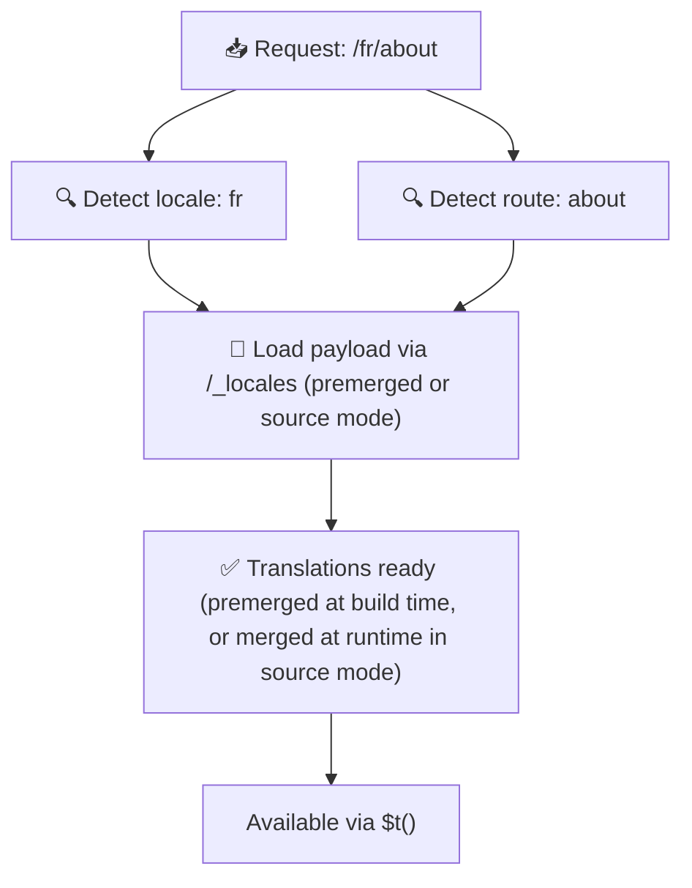

# 📂 フォルダー構成ガイド

## 📖 はじめに

翻訳ファイルを効果的に整理することは、スケーラブルで効率的な国際化(i18n)システムを維持するために不可欠です。`Nuxt I18n Micro` は、ルートレベルおよびページ固有の翻訳を管理するための明確なアプローチを提供することで、このプロセスを簡素化します。このガイドでは、推奨されるフォルダー構成と、`Nuxt I18n Micro` がこれらの翻訳をどのように扱うかを説明します。

## 🗂️ 推奨されるフォルダー構成

`Nuxt I18n Micro` は、翻訳をルートレベルのファイルと `pages` ディレクトリ内のページ固有ファイルに整理します。`translationPayloads.mode: 'premerged'`(デフォルト)では、ルートレベルの翻訳はビルド時にすべてのページファイルへ自動的にマージされるため、各ページはランタイムのマージオーバーヘッドなしで完全な翻訳セットを保持します。

`mode: 'source'` では、ソースファイルは Nitro のアセットとして分離されたまま保存され、`/_locales` ルート経由でランタイムにマージされます。[サーバーレス ペイロード出力](/guides/performance#serverless-payload-output) を参照してください。

### 🔧 基本構成

以下は、従うべき基本的なフォルダー構成の例です:

```text
locales/
├── pages/
│   ├── index/
│   │   ├── en.json
│   │   ├── fr.json
│   │   └── ar.json
│   ├── about/
│   │   ├── en.json
│   │   ├── fr.json
│   │   └── ar.json
├── en.json
├── fr.json
└── ar.json

```

### 📄 構成の説明

#### 1. 🌍 ルートレベルの翻訳ファイル

- **パス:** `/locales/\{locale\}.json`(例: `/locales/en.json`)
- **目的:** アプリケーション全体で共有される翻訳(ナビゲーションメニュー、ヘッダー、フッターなど)が含まれます。`mode: 'premerged'`(デフォルト)では、ビルド時にすべてのページ固有ファイルへ自動的にマージされ、サーバーはページごとにあらかじめビルドされた単一ファイルを返します。

  **内容例(`/locales/en.json`):**

  ```json
  {
    "menu": {
      "home": "Home",
      "about": "About Us",
      "contact": "Contact"
    },
    "footer": {
      "copyright": "© 2024 Your Company"
    }
  }
  ```

#### 2. 📄 ページ固有の翻訳ファイル

- **パス:** `/locales/pages/\{routeName\}/\{locale\}.json`(例: `/locales/pages/index/en.json`)
- **目的:** 個々のページに固有の翻訳が含まれます。`mode: 'premerged'`(デフォルト)では、ルートレベルの翻訳がビルド時にベースとしてマージされるため、各ページファイルは自己完結型になります。

  **内容例(`/locales/pages/index/en.json`):**

  ```json
  {
    "title": "Welcome to Our Website",
    "description": "We offer a wide range of products and services to meet your needs."
  }
  ```

  **内容例(`/locales/pages/about/en.json`):**

  ```json
  {
    "title": "About Us",
    "description": "Learn more about our mission, vision, and values."
  }
  ```

### 📂 動的ルートとネストされたパスの取り扱い

`Nuxt I18n Micro` は、ルート内の動的セグメントとネストされたパスを特定の命名規則を使ってフラットなフォルダー構造に自動変換します。これにより、翻訳を一貫性のある、アクセスしやすい方法で保存できます。

#### 動的ルートの翻訳フォルダー構成

`/products/[id]` のような動的ルートを扱う場合、モジュールは動的セグメント `[id]` をファイル構造内の静的な形式に変換します。

**動的ルートのフォルダー構成例:**

`/products/[id]` のようなルートの場合、翻訳ファイルは `products-id` という名前のフォルダーに保存されます:

```text
locales/pages/
├── products-id/
│   ├── en.json
│   ├── fr.json
│   └── ar.json

```

**ネストされた動的ルートのフォルダー構成例:**

`/products/key/[id]` のようなネストされたルートの場合、翻訳ファイルは `products-key-id` という名前のフォルダーに保存されます:

```text
locales/pages/
├── products-key-id/
│   ├── en.json
│   ├── fr.json
│   └── ar.json

```

**多階層のネストされたルートのフォルダー構成例:**

`/products/category/[id]/details` のようなさらに複雑なネストされたルートの場合、翻訳ファイルは `products-category-id-details` という名前のフォルダーに保存されます:

```text
locales/pages/
├── products-category-id-details/
│   ├── en.json
│   ├── fr.json
│   └── ar.json

```

### 🛠 ディレクトリ構成のカスタマイズ

別のディレクトリに翻訳を保存したい場合、`Nuxt I18n Micro` では翻訳ファイルの保存先ディレクトリをカスタマイズできます。`nuxt.config.ts` で設定できます。

**例: 翻訳ディレクトリのカスタマイズ**

```typescript
export default defineNuxtConfig({
  i18n: {
    translationDir: 'i18n', // Custom directory path
  },
})
```

これにより、`Nuxt I18n Micro` はデフォルトの `/locales` ディレクトリではなく `/i18n` ディレクトリ内の翻訳ファイルを参照するようになります。

## ⚙️ 翻訳の読み込み方法

### 🌍 動的なロケールルート

`Nuxt I18n Micro` は、翻訳を効率的に読み込むために動的なロケールルートを使用します。ユーザーがページを訪問すると、モジュールは適切なロケールを判定し、現在のルートとロケールに基づいて対応する翻訳ファイルを読み込みます。



例えば:

- `/en/index` を訪問すると、`/locales/pages/index/en.json` から翻訳が読み込まれます。
- `/fr/about` を訪問すると、`/locales/pages/about/fr.json` から翻訳が読み込まれます。

この方法により、必要な翻訳のみが読み込まれるため、サーバー負荷とクライアント側パフォーマンスの両方を最適化できます。

### 💾 キャッシュとプリレンダリング

パフォーマンスをさらに向上させるため、`Nuxt I18n Micro` は翻訳ファイルのキャッシュとプリレンダリングをサポートしています:

- **キャッシュ**: 翻訳ファイルが一度読み込まれると、後続リクエスト用にキャッシュされ、同じデータを繰り返し取得する必要がなくなります。
- **プリレンダリング**: ビルドプロセス中に、設定されたすべてのロケールとルートに対して翻訳ファイルをプリレンダリングでき、ランタイム遅延なしにサーバーから直接配信できます。

## 📝 ベストプラクティス

### 📂 ページ固有ファイルを賢く使う

ページ固有のファイルを活用して翻訳を整理しましょう。これにより、各ページの翻訳をコンパクトかつ高速に読み込めるようになります。特に複雑または大量のコンテンツを含むページで重要です。

### 🔑 翻訳キーの一貫性を保つ

ファイル全体で翻訳キーに一貫した命名規則を使いましょう。これにより明確さを維持でき、アプリケーションの成長に伴う翻訳管理の問題を防げます。

### 🗂️ コンテキストごとに翻訳を整理する

ファイル内で関連する翻訳をグループ化しましょう。例えば、すべてのボタンラベルを `buttons` キー配下に、フォーム関連のテキストを `forms` キー配下にまとめるといった方法です。これにより可読性が向上するだけでなく、異なるロケール間での翻訳管理も容易になります。

### ⚠️ ネスト深度の制限(2 レベル推奨)

クライアントサイドのナビゲーション時、`Nuxt I18n Micro` は最適化された 2 レベルの深いマージを使用して、離脱ページと遷移先ページの翻訳を結合します。これにより、両ページに重なりのあるネストキー(例: 両ページに `common.*` 配下のキーがある場合)が遷移アニメーション中に保持されます。

**これは、標準の `Section → Key → Value` 構造(2 レベル)では正しく機能します:**

```json
// Page A translations
{ "common": { "fromA": "Text A" } }

// Page B translations
{ "common": { "fromB": "Text B" } }

// During transition, both are available:
// { "common": { "fromA": "Text A", "fromB": "Text B" } }
```

**ただし、3 レベル以上のネストを使うと、より深いキーが遷移時に上書きされる可能性があります:**

```json
// Page A translations
{ "auth": { "form": { "login": "Login" } } }

// Page B translations
{ "auth": { "form": { "register": "Register" } } }

// During transition: "login" key is lost
// { "auth": { "form": { "register": "Register" } } }
```

<Tip>

</Tip>

### 🧹 未使用の翻訳を定期的にクリーンアップする

時間の経過とともに、機能の削除や再構成によりアプリケーションに未使用の翻訳キーが蓄積されることがあります。翻訳ファイルを定期的に見直してクリーンアップし、シンプルで保守しやすい状態を保ちましょう。
