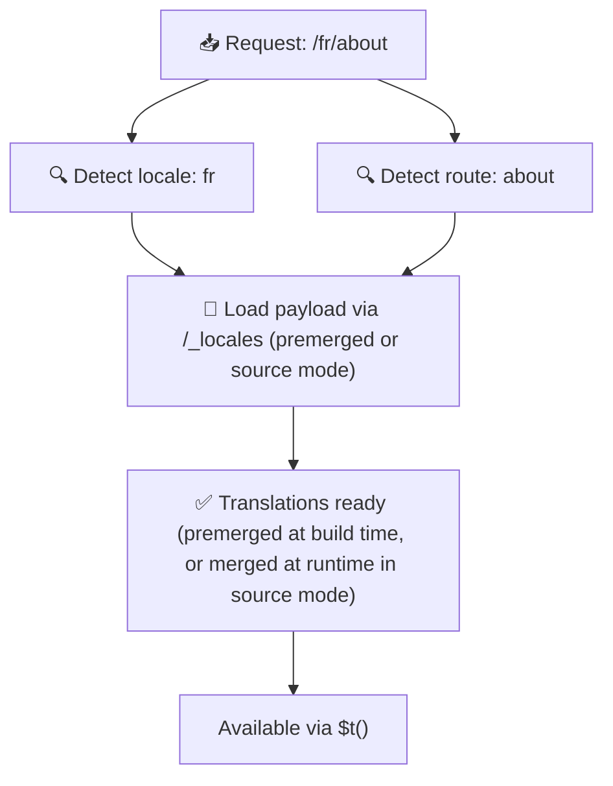

# 📂 フォルダー構造ガイド

## 📖 はじめに

翻訳ファイルを効果的に整理することは、スケーラブルで効率的な国際化 (i18n) システムを維持するために不可欠です。`Nuxt I18n Micro` は、ルートレベルとページ固有の翻訳を管理するための明確なアプローチを提供することで、このプロセスを簡素化します。このガイドでは、推奨されるフォルダー構造と、`Nuxt I18n Micro` がこれらの翻訳をどのように扱うかを説明します。

## 🗂️ 推奨フォルダー構造

`Nuxt I18n Micro` は翻訳をルートレベルファイルと `pages` ディレクトリ内のページ固有ファイルに整理します。`translationPayloads.mode: 'premerged'`(デフォルト)では、ビルド時にルートレベル翻訳が各ページファイルへ自動的にマージされ、ランタイムでのマージオーバーヘッドなしに各ページが完全な翻訳セットを持ちます。

`mode: 'source'` では、ソースファイルは Nitro のアセット内で分離されたままとなり、`/_locales` ルートを通じてランタイムでマージされます。[サーバーレスペイロード出力](/guides/performance#serverless-payload-output) を参照してください。

### 🔧 基本構造

以下は、従うべきフォルダー構造の基本例です。

```text
locales/
├── pages/
│   ├── index/
│   │   ├── en.json
│   │   ├── fr.json
│   │   └── ar.json
│   ├── about/
│   │   ├── en.json
│   │   ├── fr.json
│   │   └── ar.json
├── en.json
├── fr.json
└── ar.json

```

### 📄 構造の説明

#### 1. 🌍 ルートレベルの翻訳ファイル

- **パス:** `/locales/\{locale\}.json`(例: `/locales/en.json`)
- **目的:** これらのファイルには、アプリケーション全体で共有される翻訳(ナビゲーションメニュー、ヘッダー、フッターなど)が含まれます。`mode: 'premerged'`(デフォルト)では、ビルド時にすべてのページ固有ファイルへ自動的にマージされるため、サーバーはページごとに事前構築された 1 つのファイルを返します。

  **サンプル内容 (`/locales/en.json`):**

  ```json
  {
    "menu": {
      "home": "Home",
      "about": "About Us",
      "contact": "Contact"
    },
    "footer": {
      "copyright": "© 2024 Your Company"
    }
  }
  ```

#### 2. 📄 ページ固有の翻訳ファイル

- **パス:** `/locales/pages/\{routeName\}/\{locale\}.json`(例: `/locales/pages/index/en.json`)
- **目的:** これらのファイルには、個別のページに固有の翻訳が含まれます。`mode: 'premerged'`(デフォルト)では、ビルド時にルートレベル翻訳がベースとしてマージされるため、各ページファイルは自己完結型になります。

  **サンプル内容 (`/locales/pages/index/en.json`):**

  ```json
  {
    "title": "Welcome to Our Website",
    "description": "We offer a wide range of products and services to meet your needs."
  }
  ```

  **サンプル内容 (`/locales/pages/about/en.json`):**

  ```json
  {
    "title": "About Us",
    "description": "Learn more about our mission, vision, and values."
  }
  ```

### 📂 動的ルートとネストされたパスの処理

`Nuxt I18n Micro` は、特定のリネーム規則を使用して、ルート内の動的セグメントとネストされたパスを自動的にフラットなフォルダー構造に変換します。これにより、すべての翻訳が一貫してアクセスしやすい方法で保存されます。

#### 動的ルートの翻訳フォルダー構造

`/products/[id]` のような動的ルートを扱う場合、モジュールは動的セグメント `[id]` をファイル構造内で静的な形式に変換します。

**動的ルートのフォルダー構造の例:**

`/products/[id]` のようなルートの場合、翻訳ファイルは `products-id` という名前のフォルダーに格納されます。

```text
locales/pages/
├── products-id/
│   ├── en.json
│   ├── fr.json
│   └── ar.json

```

**ネストされた動的ルートのフォルダー構造の例:**

`/products/key/[id]` のようなネストされたルートの場合、翻訳ファイルは `products-key-id` という名前のフォルダーに格納されます。

```text
locales/pages/
├── products-key-id/
│   ├── en.json
│   ├── fr.json
│   └── ar.json

```

**多階層ネストルートのフォルダー構造の例:**

`/products/category/[id]/details` のようなより複雑なネストルートの場合、翻訳ファイルは `products-category-id-details` という名前のフォルダーに格納されます。

```text
locales/pages/
├── products-category-id-details/
│   ├── en.json
│   ├── fr.json
│   └── ar.json

```

### 🛠 ディレクトリ構造のカスタマイズ

翻訳を別のディレクトリに格納したい場合、`Nuxt I18n Micro` では翻訳ファイルを格納するディレクトリをカスタマイズできます。これは `nuxt.config.ts` ファイルで設定できます。

**例: 翻訳ディレクトリのカスタマイズ**

```typescript
export default defineNuxtConfig({
  i18n: {
    translationDir: 'i18n', // カスタムディレクトリパス
  },
})
```

これにより、`Nuxt I18n Micro` はデフォルトの `/locales` ディレクトリではなく `/i18n` ディレクトリで翻訳ファイルを探すようになります。

## ⚙️ 翻訳の読み込み方法

### 🌍 動的なロケールルート

`Nuxt I18n Micro` は動的なロケールルートを使って翻訳を効率的に読み込みます。ユーザーがページにアクセスすると、モジュールは適切なロケールを判定し、現在のルートとロケールに基づいて対応する翻訳ファイルを読み込みます。



例:

- `/en/index` にアクセスすると、`/locales/pages/index/en.json` から翻訳が読み込まれます。
- `/fr/about` にアクセスすると、`/locales/pages/about/fr.json` から翻訳が読み込まれます。

この方法は、必要な翻訳のみが読み込まれることを保証し、サーバー負荷とクライアント側パフォーマンスの両方を最適化します。

### 💾 キャッシュとプリレンダリング

パフォーマンスをさらに高めるため、`Nuxt I18n Micro` は翻訳ファイルのキャッシュとプリレンダリングをサポートします。

- **キャッシュ**: 翻訳ファイルが一度読み込まれると、その後のリクエストのためにキャッシュされ、同じデータを繰り返し取得する必要が減ります。
- **プリレンダリング**: ビルドプロセス中に、設定されたすべてのロケールとルートについて翻訳ファイルを事前レンダリングでき、ランタイム遅延なしにサーバーから直接配信できます。

## 📝 ベストプラクティス

### 📂 ページ固有ファイルを賢く使う

翻訳を整理するためにページ固有ファイルを活用します。これにより、各ページの翻訳が軽量に保たれ、読み込みが高速になります。複雑または大きなコンテンツを持つページで特に重要です。

### 🔑 翻訳キーの一貫性を保つ

ファイル間で翻訳キーに一貫した命名規則を使用します。これにより明確さが維持され、特にアプリケーションが成長するにつれて翻訳を管理する際の問題を防げます。

### 🗂️ コンテキストで翻訳を整理する

ファイル内で関連する翻訳をまとめてグループ化します。たとえば、すべてのボタンラベルを `buttons` キーの下に、すべてのフォーム関連テキストを `forms` キーの下にグループ化します。これにより読みやすさが向上するだけでなく、異なるロケール間での翻訳管理も容易になります。

### ⚠️ ネスト深さの制限(2 レベル推奨)

クライアント側ナビゲーション中、`Nuxt I18n Micro` は最適化された 2 レベルのディープマージを使って、離れるページと入るページからの翻訳を結合します。これにより、重複するネストキー(例: 両方のページに `common.*` 配下のキーがある場合)が遷移アニメーション中に保持されます。

**これは標準の `Section → Key → Value` 構造(2 レベル)で正しく動作します。**

```json
// ページ A の翻訳
{ "common": { "fromA": "Text A" } }

// ページ B の翻訳
{ "common": { "fromB": "Text B" } }

// 遷移中は両方が利用可能:
// { "common": { "fromA": "Text A", "fromB": "Text B" } }
```

**ただし、3 レベル以上のネストを使用すると、遷移中に深いキーが上書きされる可能性があります。**

```json
// ページ A の翻訳
{ "auth": { "form": { "login": "Login" } } }

// ページ B の翻訳
{ "auth": { "form": { "register": "Register" } } }

// 遷移中: "login" キーが失われます
// { "auth": { "form": { "register": "Register" } } }
```


### 🧹 未使用翻訳の定期的なクリーンアップ

時間が経つと、特に機能が削除または再構成された場合に、アプリケーションに未使用の翻訳キーが蓄積することがあります。翻訳ファイルを定期的に確認してクリーンアップし、軽量で保守可能な状態に保ちます。
