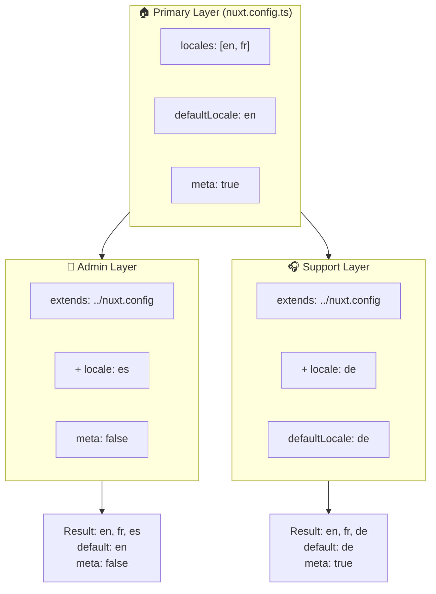

# 🗂️ `Nuxt I18n Micro` におけるレイヤー

## 📖 レイヤーの概要

`Nuxt I18n Micro` のレイヤーを使うと、アプリケーションのさまざまな部分でローカライズ設定を柔軟に管理・カスタマイズできます。異なるレイヤーを定義することで、さまざまなコンテキストの設定を調整できます。たとえば、サイトの特定セクションの設定を上書きしたり、アプリケーションの他の部分から拡張できる再利用可能なベース設定を作成したりできます。

### レイヤー継承の流れ



## 🛠️ プライマリ設定レイヤー

**プライマリ設定レイヤー**は、アプリケーション全体のデフォルトのローカライズ設定を行う場所です。このレイヤーはグローバル設定(サポートされるロケール、デフォルト言語、その他の重要な i18n 設定)を定義するため、不可欠です。

### 📄 例: プライマリ設定レイヤーの定義

以下は、`nuxt.config.ts` ファイルでプライマリ設定レイヤーを定義する例です。

```typescript
export default defineNuxtConfig({
  i18n: {
    locales: [
      { code: 'en', iso: 'en-EN', dir: 'ltr' },
      { code: 'fr', iso: 'fr-FR', dir: 'ltr' },
      { code: 'ar', iso: 'ar-SA', dir: 'rtl' },
    ],
    defaultLocale: 'en', // アプリ全体のデフォルトロケール
    translationDir: 'locales', // 翻訳の格納ディレクトリ
    meta: true, // `alternate` などの SEO 関連メタタグを自動生成
    autoDetectLanguage: true, // ユーザーの希望言語を自動検出して使用
  },
})
```

## 🌱 子レイヤー

子レイヤーは、アプリケーションの特定の部分についてプライマリ設定を拡張または上書きするために使用します。たとえば、サイトの特定セクションで追加のロケールを追加したり、デフォルトロケールを変更したりできます。子レイヤーは、アプリケーションの各部分が異なるローカライズ要件を持つ可能性のあるモジュラーアプリケーションで特に有用です。

### 📄 例: 子レイヤーでのプライマリレイヤーの拡張

サイトのあるセクションで追加のロケールをサポートしたい、または特定のコンテキストで特定のロケールを無効化したいとします。プライマリ設定レイヤーを拡張することでこれを実現できます。

```typescript
// basic/nuxt.config.ts(プライマリレイヤー)
export default defineNuxtConfig({
  i18n: {
    locales: [
      { code: 'en', iso: 'en-EN', dir: 'ltr' },
      { code: 'fr', iso: 'fr-FR', dir: 'ltr' },
    ],
    defaultLocale: 'en',
    meta: true,
    translationDir: 'locales',
  },
})
```

```typescript
// extended/nuxt.config.ts(子レイヤー)
export default defineNuxtConfig({
  extends: '../basic', // 'basic' レイヤーからベース設定を継承
  i18n: {
    locales: [
      { code: 'en', iso: 'en-EN', dir: 'ltr' }, // ベースレイヤーから継承
      { code: 'fr', iso: 'fr-FR', dir: 'ltr' }, // ベースレイヤーから継承
      { code: 'de', iso: 'de-DE', dir: 'ltr' }, // 子レイヤーで追加
    ],
    defaultLocale: 'fr', // このセクションではデフォルトロケールをフランス語に上書き
    autoDetectLanguage: false, // このセクションでは自動言語検出を無効化
  },
})
```

### 🌐 モジュラーアプリケーションでのレイヤーの使用

より大規模でモジュラーな Nuxt アプリケーションでは、各セクションが独自の i18n 設定を必要とする複数のセクションを持つ場合があります。レイヤーを活用することで、クリーンでスケーラブルな設定構造を維持できます。

### 📄 例: モジュラーアプリケーションでの階層化設定

メインの Web サイト、管理パネル、カスタマーサポートポータルなど、異なるセクションを持つ EC サイトを想像してください。各セクションで異なるロケールセットや他の i18n 設定が必要な場合があります。

#### **プライマリレイヤー(グローバル設定):**

```typescript
// nuxt.config.ts
export default defineNuxtConfig({
  i18n: {
    locales: [
      { code: 'en', iso: 'en-EN', dir: 'ltr' },
      { code: 'fr', iso: 'fr-FR', dir: 'ltr' },
    ],
    defaultLocale: 'en',
    meta: true,
    translationDir: 'locales',
    autoDetectLanguage: true,
  },
})
```

#### **管理パネル用の子レイヤー:**

```typescript
// admin/nuxt.config.ts
export default defineNuxtConfig({
  extends: '../nuxt.config', // グローバル設定を継承
  i18n: {
    locales: [
      { code: 'en', iso: 'en-EN', dir: 'ltr' }, // 継承
      { code: 'fr', iso: 'fr-FR', dir: 'ltr' }, // 継承
      { code: 'es', iso: 'es-ES', dir: 'ltr' }, // 管理パネル固有
    ],
    defaultLocale: 'en',
    meta: false, // 管理パネルでは自動メタ生成を無効化
  },
})
```

#### **カスタマーサポートポータル用の子レイヤー:**

```typescript
// support/nuxt.config.ts
export default defineNuxtConfig({
  extends: '../nuxt.config', // グローバル設定を継承
  i18n: {
    locales: [
      { code: 'en', iso: 'en-EN', dir: 'ltr' }, // 継承
      { code: 'fr', iso: 'fr-FR', dir: 'ltr' }, // 継承
      { code: 'de', iso: 'de-DE', dir: 'ltr' }, // サポートポータル固有
    ],
    defaultLocale: 'de', // サポートポータルではドイツ語をデフォルトに
    autoDetectLanguage: false, // 自動言語検出を無効化
  },
})
```

このモジュラーな例では:

- 各セクション(admin、support)は独自の i18n 設定を持ちますが、すべてベース設定を継承しています。
- 管理パネルはスペイン語 (`es`) をロケールとして追加し、メタタグ生成を無効化しています。
- サポートポータルはドイツ語 (`de`) をロケールとして追加し、ユーザーインターフェースをドイツ語にデフォルト設定しています。

## 📝 レイヤー使用のベストプラクティス

- **🔧 プライマリレイヤーはシンプルに保つ:** プライマリレイヤーには、アプリケーション全体でグローバルに適用される、最も一般的に使用される設定を含めます。一貫性を確保するためにシンプルに保ちます。
- **⚙️ 子レイヤーは特定のカスタマイズに使う:** 必要な場合にのみ子レイヤーで設定を上書きまたは拡張します。このアプローチにより、設定の不必要な複雑さを避けられます。
- **📚 レイヤーをドキュメント化する:** プロジェクト内の各レイヤーの目的と詳細を明確にドキュメント化します。これにより明確さが保たれ、他の人(または将来の自分)が設定を理解しやすくなります。
