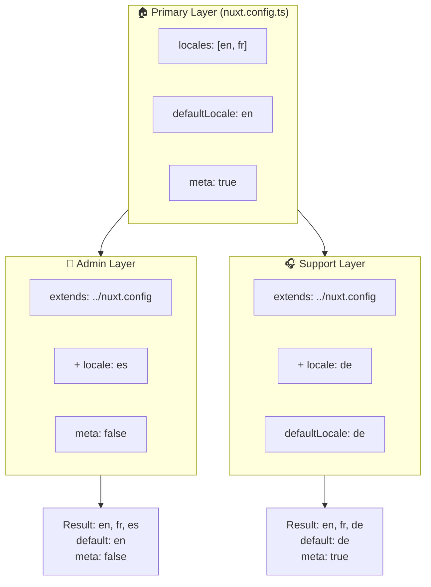

# 🗂️ `Nuxt I18n Micro` のレイヤー

## 📖 レイヤーの概要

`Nuxt I18n Micro` のレイヤーを使うと、アプリケーションのさまざまな部分にわたってローカライズ設定を柔軟に管理・カスタマイズできます。異なるレイヤーを定義することで、サイトの特定セクションの設定を上書きしたり、他の部分から拡張できる再利用可能なベース設定を作成したりと、さまざまなコンテキストに合わせて構成を調整できます。

### レイヤーの継承フロー



## 🛠️ プライマリ設定レイヤー

**プライマリ設定レイヤー** は、アプリケーション全体のデフォルトのローカライズ設定を行う場所です。このレイヤーは、サポートするロケール、デフォルト言語、その他の重要な i18n 設定を含むグローバル設定を定義するため不可欠です。

### 📄 例: プライマリ設定レイヤーの定義

`nuxt.config.ts` にプライマリ設定レイヤーを定義する例です:

```typescript
export default defineNuxtConfig({
  i18n: {
    locales: [
      { code: 'en', iso: 'en-EN', dir: 'ltr' },
      { code: 'fr', iso: 'fr-FR', dir: 'ltr' },
      { code: 'ar', iso: 'ar-SA', dir: 'rtl' },
    ],
    defaultLocale: 'en', // The default locale for the entire app
    translationDir: 'locales', // Directory where translations are stored
    meta: true, // Automatically generate SEO-related meta tags like `alternate`
    autoDetectLanguage: true, // Automatically detect and use the user's preferred language
  },
})
```

## 🌱 子レイヤー

子レイヤーは、アプリケーションの特定部分に対してプライマリ設定を拡張または上書きするために使用します。例えば、追加のロケールを加えたり、特定のセクションでデフォルトロケールを変更したい場合に有用です。子レイヤーは、アプリケーションの部分ごとに異なるローカライズ要件があるモジュール式アプリケーションで特に役立ちます。

### 📄 例: 子レイヤーでプライマリレイヤーを拡張

サイトの一部で追加のロケールをサポートしたい、または特定コンテキストで特定のロケールを無効にしたいとします。プライマリ設定レイヤーを拡張することでそれを実現できます:

```typescript
// basic/nuxt.config.ts (Primary Layer)
export default defineNuxtConfig({
  i18n: {
    locales: [
      { code: 'en', iso: 'en-EN', dir: 'ltr' },
      { code: 'fr', iso: 'fr-FR', dir: 'ltr' },
    ],
    defaultLocale: 'en',
    meta: true,
    translationDir: 'locales',
  },
})
```

```typescript
// extended/nuxt.config.ts (Child Layer)
export default defineNuxtConfig({
  extends: '../basic', // Inherit the base configuration from the 'basic' layer
  i18n: {
    locales: [
      { code: 'en', iso: 'en-EN', dir: 'ltr' }, // Inherited from the base layer
      { code: 'fr', iso: 'fr-FR', dir: 'ltr' }, // Inherited from the base layer
      { code: 'de', iso: 'de-DE', dir: 'ltr' }, // Added in the child layer
    ],
    defaultLocale: 'fr', // Override the default locale to French for this section
    autoDetectLanguage: false, // Disable automatic language detection in this section
  },
})
```

### 🌐 モジュール式アプリケーションでのレイヤーの利用

より大規模でモジュール式の Nuxt アプリケーションでは、複数のセクションがそれぞれ独自の i18n 設定を必要とすることがあります。レイヤーを活用することで、クリーンかつスケーラブルな設定構造を維持できます。

### 📄 例: モジュール式アプリケーションでのレイヤー設定

メインサイト、管理パネル、カスタマーサポートポータルといった異なるセクションを持つ EC サイトを想像してみてください。各セクションで異なるロケールや i18n 設定が必要になる可能性があります。

#### **プライマリレイヤー(グローバル設定):**

```typescript
// nuxt.config.ts
export default defineNuxtConfig({
  i18n: {
    locales: [
      { code: 'en', iso: 'en-EN', dir: 'ltr' },
      { code: 'fr', iso: 'fr-FR', dir: 'ltr' },
    ],
    defaultLocale: 'en',
    meta: true,
    translationDir: 'locales',
    autoDetectLanguage: true,
  },
})
```

#### **管理パネル用の子レイヤー:**

```typescript
// admin/nuxt.config.ts
export default defineNuxtConfig({
  extends: '../nuxt.config', // Inherit the global settings
  i18n: {
    locales: [
      { code: 'en', iso: 'en-EN', dir: 'ltr' }, // Inherited
      { code: 'fr', iso: 'fr-FR', dir: 'ltr' }, // Inherited
      { code: 'es', iso: 'es-ES', dir: 'ltr' }, // Specific to the admin panel
    ],
    defaultLocale: 'en',
    meta: false, // Disable automatic meta generation in the admin panel
  },
})
```

#### **カスタマーサポートポータル用の子レイヤー:**

```typescript
// support/nuxt.config.ts
export default defineNuxtConfig({
  extends: '../nuxt.config', // Inherit the global settings
  i18n: {
    locales: [
      { code: 'en', iso: 'en-EN', dir: 'ltr' }, // Inherited
      { code: 'fr', iso: 'fr-FR', dir: 'ltr' }, // Inherited
      { code: 'de', iso: 'de-DE', dir: 'ltr' }, // Specific to the support portal
    ],
    defaultLocale: 'de', // Default to German in the support portal
    autoDetectLanguage: false, // Disable automatic language detection
  },
})
```

このモジュール式の例では:

- 各セクション(admin、support)が独自の i18n 設定を持ちつつも、すべてがベース設定を継承しています。
- 管理パネルはロケールとしてスペイン語(`es`)を追加し、メタタグの生成を無効化しています。
- サポートポータルはロケールとしてドイツ語(`de`)を追加し、UI のデフォルトをドイツ語にしています。

## 📝 レイヤーを使うためのベストプラクティス

- **🔧 プライマリレイヤーはシンプルに保つ:** プライマリレイヤーには、アプリケーション全体に適用される最もよく使われる設定を配置し、一貫性を確保するためにシンプルに保ちましょう。
- **⚙️ 個別のカスタマイズには子レイヤーを使う:** 必要な場合にのみ子レイヤーで設定を上書き・拡張します。これにより、設定が不必要に複雑になるのを避けられます。
- **📚 レイヤーを文書化する:** プロジェクト内の各レイヤーの目的と詳細を明確に文書化しましょう。これにより、明確さを維持でき、他の人(または将来の自分)が設定を理解しやすくなります。
