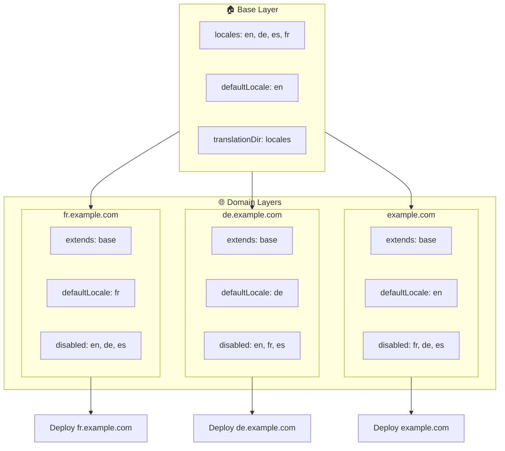

# 🌍 レイヤーを使った `Nuxt I18n Micro` によるマルチドメインロケール設定

## 📝 はじめに

`Nuxt I18n Micro` のレイヤーを活用することで、柔軟かつ保守しやすいマルチドメイン ローカライズ構成を作成できます。このアプローチは、複雑な機能を必要とせずにドメイン管理をシンプルにするだけでなく、負荷の分散を効率化し、プロジェクトの複雑さも低減します。ロケールごとに別プロジェクトを実行することで、アプリケーションは複数ドメインにまたがるさまざまなロケール要件に容易にスケールし適応できます。これにより、グローバルアプリケーション向けに堅牢かつ拡張性のあるソリューションが得られます。

## 🎯 目的

子レイヤー内の構成をカスタマイズすることで、異なるドメインごとに特定のロケールを提供するセットアップを実現します。この方法は Nuxt のレイヤリング機能を活用し、ベース設定を維持しつつ、各ドメイン向けに拡張・変更を可能にします。

### マルチドメインのアーキテクチャ



## 🛠 マルチドメインロケールの実装手順

### 1. **ベースレイヤーを作成する**

まず、アプリケーションで共通のロケール設定をすべて含むベース設定レイヤーを作成します。この設定は、他のドメイン固有の設定の基盤となります。

#### **ベースレイヤーの設定**

`base/nuxt.config.ts` にベース設定ファイルを作成します:

```typescript
// base/nuxt.config.ts

export default defineNuxtConfig({
  i18n: {
    locales: [
      { code: 'en', iso: 'en-US', dir: 'ltr' },
      { code: 'de', iso: 'de-DE', dir: 'ltr' },
      { code: 'es', iso: 'es-ES', dir: 'ltr' },
    ],
    defaultLocale: 'en',
    translationDir: 'locales',
    meta: true,
    autoDetectLanguage: true,
  },
})
```

### 2. **ドメインごとの子レイヤーを作成する**

各ドメインについて、そのドメインの固有要件に合わせてベース設定を変更する子レイヤーを作成します。特定ドメインで不要なロケールは無効にできます。

#### **例: フランスドメインの設定**

`fr/nuxt.config.ts` にフランスドメイン用の子レイヤー設定を作成します:

```typescript
// fr/nuxt.config.ts

export default defineNuxtConfig({
  extends: '../base', // Inherit from the base configuration

  i18n: {
    locales: [
      { code: 'en', iso: 'en-US', dir: 'ltr', disabled: true }, // Disable English
      { code: 'fr', iso: 'fr-FR', dir: 'ltr' }, // Add and enable the French locale
      { code: 'de', iso: 'de-DE', dir: 'ltr', disabled: true }, // Disable German
      { code: 'es', iso: 'es-ES', dir: 'ltr', disabled: true }, // Disable Spanish
    ],
    defaultLocale: 'fr', // Set French as the default locale
    autoDetectLanguage: false, // Disable automatic language detection
  },
})
```

#### **例: ドイツドメインの設定**

同様に、`de/nuxt.config.ts` にドイツドメイン用の子レイヤー設定を作成します:

```typescript
// de/nuxt.config.ts

export default defineNuxtConfig({
  extends: '../base', // Inherit from the base configuration

  i18n: {
    locales: [
      { code: 'en', iso: 'en-US', dir: 'ltr', disabled: true }, // Disable English
      { code: 'fr', iso: 'fr-FR', dir: 'ltr', disabled: true }, // Disable French
      { code: 'de', iso: 'de-DE', dir: 'ltr' }, // Use the German locale
      { code: 'es', iso: 'es-ES', dir: 'ltr', disabled: true }, // Disable Spanish
    ],
    defaultLocale: 'de', // Set German as the default locale
    autoDetectLanguage: false, // Disable automatic language detection
  },
})
```

### 3. **各ドメイン用のアプリケーションをデプロイする**

各ドメインごとに対応する設定でアプリケーションをデプロイします。例えば:

- `fr` レイヤーの設定を `fr.example.com` にデプロイします。
- `de` レイヤーの設定を `de.example.com` にデプロイします。

### 4. **異なるロケール向けに複数プロジェクトをセットアップする**

各ロケール・ドメインに対して、アプリケーションの別インスタンスを実行する必要があります。これにより、各ドメインが正しいロケール設定を配信するようになり、負荷分散が最適化され、プロジェクト構造もシンプルになります。ロケールごとに調整された複数プロジェクトを運用することで、設定の分離を明確に保ち、全体構成の複雑さを低減できます。

### 5. **ドメインに基づいたルーティングを設定する**

アクセスされたドメインに応じて正しいプロジェクトへユーザーが誘導されるようにルーティングを設定してください。これにより、各ドメインが適切なロケールを配信し、ユーザー体験が向上し、地域間の一貫性が保たれます。

### 6. **デプロイして検証する**

レイヤーを設定し、各ドメインへデプロイした後、各ドメインが正しいロケールを配信していることを確認します。アプリケーションを十分にテストし、ドメインに応じて正しいロケールが読み込まれることを検証してください。

## 📝 ベストプラクティス

- **ベース設定を汎用的に保つ**: ベース設定はすべてのドメインに適用可能な一般設定を含めるようにします。
- **ドメイン固有のロジックを分離する**: ドメイン固有の設定は、それぞれのレイヤーに保持して、明確さと関心の分離を維持します。

## 🎉 まとめ

`Nuxt I18n Micro` のレイヤーを活用することで、柔軟で保守しやすいマルチドメイン ローカライズ構成を作成できます。このアプローチは、複雑なドメイン管理機能を不要にするだけでなく、負荷を効率的に分散し、プロジェクトの複雑さを低減できます。ロケールごとに別プロジェクトを実行することで、アプリケーションは容易にスケールし、複数ドメインにまたがるロケール要件へ適応できます。これにより、グローバルアプリケーション向けに堅牢で拡張性のあるソリューションを提供できます。
