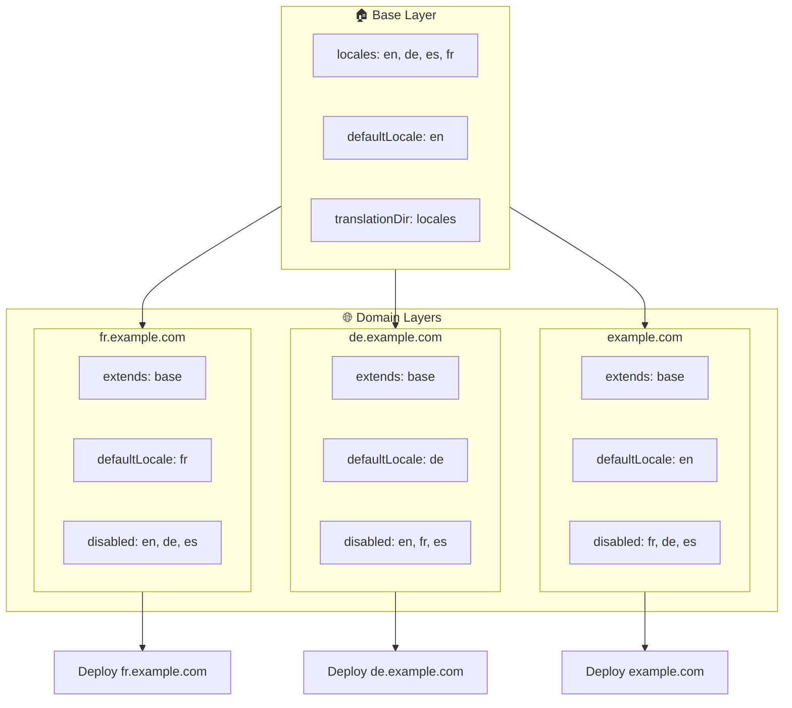

# 🌍 レイヤーを使った `Nuxt I18n Micro` によるマルチドメインロケールのセットアップ

## 📝 はじめに

`Nuxt I18n Micro` のレイヤーを活用することで、柔軟で保守可能なマルチドメインローカライズ構成を作成できます。このアプローチは複雑な機能を必要とせずにドメイン管理を簡素化するだけでなく、負荷分散を効率化し、プロジェクトの複雑さを削減します。異なるロケール用に別々のプロジェクトを実行することで、アプリケーションは複数のドメインにわたるさまざまなロケール要件に容易にスケールし適応でき、グローバルアプリケーションに対する堅牢でスケーラブルなソリューションを提供します。

## 🎯 目的

子レイヤーで設定をカスタマイズすることで、異なるドメインが特定のロケールを配信するセットアップを作成します。この方法は Nuxt のレイヤリングシステムを活用し、ベース設定を維持しながら各ドメインに対して拡張または変更できるようにします。

### マルチドメインアーキテクチャ



## 🛠 マルチドメインロケールを実装する手順

### 1. **ベースレイヤーを作成する**

アプリケーションのすべての共通ロケール設定を含むベース設定レイヤーを作成することから始めます。この設定は、他のドメイン固有の設定の基礎として機能します。

#### **ベースレイヤーの設定**

ベース設定ファイル `base/nuxt.config.ts` を作成します。

```typescript
// base/nuxt.config.ts

export default defineNuxtConfig({
  i18n: {
    locales: [
      { code: 'en', iso: 'en-US', dir: 'ltr' },
      { code: 'de', iso: 'de-DE', dir: 'ltr' },
      { code: 'es', iso: 'es-ES', dir: 'ltr' },
    ],
    defaultLocale: 'en',
    translationDir: 'locales',
    meta: true,
    autoDetectLanguage: true,
  },
})
```

### 2. **ドメイン固有の子レイヤーを作成する**

各ドメインについて、ベース設定を変更してそのドメインの特定要件を満たす子レイヤーを作成します。特定ドメインで不要なロケールを無効化できます。

#### **例: フランス語ドメインの設定**

`fr/nuxt.config.ts` にフランス語ドメイン用の子レイヤー設定を作成します。

```typescript
// fr/nuxt.config.ts

export default defineNuxtConfig({
  extends: '../base', // ベース設定を継承

  i18n: {
    locales: [
      { code: 'en', iso: 'en-US', dir: 'ltr', disabled: true }, // 英語を無効化
      { code: 'fr', iso: 'fr-FR', dir: 'ltr' }, // フランス語ロケールを追加して有効化
      { code: 'de', iso: 'de-DE', dir: 'ltr', disabled: true }, // ドイツ語を無効化
      { code: 'es', iso: 'es-ES', dir: 'ltr', disabled: true }, // スペイン語を無効化
    ],
    defaultLocale: 'fr', // デフォルトロケールをフランス語に設定
    autoDetectLanguage: false, // 自動言語検出を無効化
  },
})
```

#### **例: ドイツ語ドメインの設定**

同様に、`de/nuxt.config.ts` にドイツ語ドメイン用の子レイヤー設定を作成します。

```typescript
// de/nuxt.config.ts

export default defineNuxtConfig({
  extends: '../base', // ベース設定を継承

  i18n: {
    locales: [
      { code: 'en', iso: 'en-US', dir: 'ltr', disabled: true }, // 英語を無効化
      { code: 'fr', iso: 'fr-FR', dir: 'ltr', disabled: true }, // フランス語を無効化
      { code: 'de', iso: 'de-DE', dir: 'ltr' }, // ドイツ語ロケールを使用
      { code: 'es', iso: 'es-ES', dir: 'ltr', disabled: true }, // スペイン語を無効化
    ],
    defaultLocale: 'de', // デフォルトロケールをドイツ語に設定
    autoDetectLanguage: false, // 自動言語検出を無効化
  },
})
```

### 3. **各ドメインにアプリケーションをデプロイする**

各ドメインに適切な設定でアプリケーションをデプロイします。例:

- `fr` レイヤー設定を `fr.example.com` にデプロイ。
- `de` レイヤー設定を `de.example.com` にデプロイ。

### 4. **異なるロケール用に複数のプロジェクトをセットアップする**

各ロケールとドメインについて、別々のアプリケーションインスタンスを実行する必要があります。これにより、各ドメインが正しいロケール設定を配信し、負荷分散を最適化してプロジェクト構造を簡素化できます。ロケールごとにカスタマイズされた複数のプロジェクトを実行することで、設定間のクリーンな分離を維持し、全体的なセットアップの複雑さを削減できます。

### 5. **ドメインに基づいてルーティングを設定する**

アクセスされているドメインに基づいて、ユーザーを正しいプロジェクトに誘導するようにルーティングが設定されていることを確認してください。これにより、各ドメインが適切なロケールを配信することが保証され、ユーザー体験が向上し、異なる地域間での一貫性が維持されます。

### 6. **デプロイして確認する**

レイヤーを設定してそれぞれのドメインにデプロイした後、各ドメインが正しいロケールを配信していることを確認します。ドメインに応じて正しいロケールが読み込まれることを確認するため、アプリケーションを徹底的にテストしてください。

## 📝 ベストプラクティス

- **ベース設定を汎用的に保つ**: ベース設定には、すべてのドメインに適用可能な一般的な設定を含めます。
- **ドメイン固有ロジックを分離する**: 明確さと関心の分離を維持するため、ドメイン固有の設定はそれぞれのレイヤーに保ちます。

## 🎉 まとめ

`Nuxt I18n Micro` のレイヤーを活用することで、柔軟で保守可能なマルチドメインローカライズ構成を作成できます。このアプローチは、複雑なドメイン管理機能の必要性を排除するだけでなく、負荷を効率的に分散し、プロジェクトの複雑さを削減します。異なるロケール用に別々のプロジェクトを実行することで、アプリケーションが容易にスケールし、さまざまなドメインにわたる異なるロケール要件に適応できるようになり、グローバルアプリケーションに対する堅牢でスケーラブルなソリューションを提供します。
