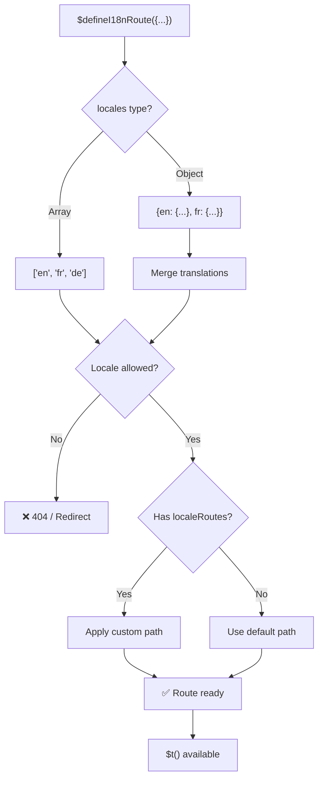
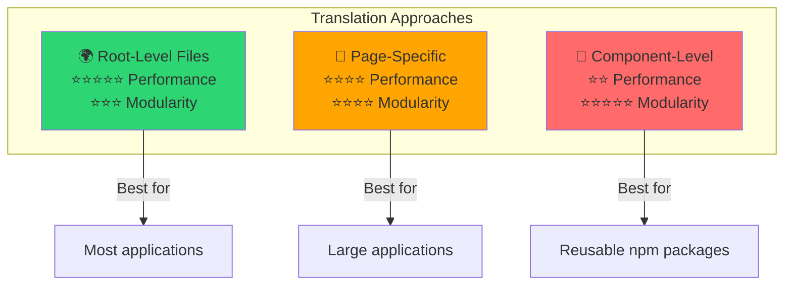

# 📖 コンポーネント単位の翻訳

`$defineI18nRoute` を使って Vue コンポーネント内で直接翻訳を定義し、モジュラーで保守しやすいローカライズを実現する方法を学びます。

## 📖 概要

`Nuxt I18n Micro` のコンポーネント単位の翻訳では、`$defineI18nRoute` 関数を使って特定のコンポーネントやページの内部で直接翻訳を定義できます。このアプローチは、個々のコンポーネントに固有のローカライズされたコンテンツを管理するのに理想的で、翻訳を扱うためのよりモジュラーで保守しやすい方法を提供します。

## 🚀 クイックスタート

### 基本的な使い方

```vue
<template>
  <div>
    <h1>{{ $t('greeting') }}</h1>
    <p>{{ $t('farewell') }}</p>
  </div>
</template>

<script setup lang="ts">
import { useNuxtApp } from '#imports'

const { $defineI18nRoute, $t } = useNuxtApp()

$defineI18nRoute({
  locales: {
    en: { greeting: 'Hello', farewell: 'Goodbye' },
    fr: { greeting: 'Bonjour', farewell: 'Au revoir' },
    de: { greeting: 'Hallo', farewell: 'Auf Wiedersehen' },
  },
})
</script>
```

### 必要なセットアップ(`script setup`)

`$defineI18nRoute` は Nuxt アプリの注入であり、グローバルマクロではありません。  
常に `useNuxtApp()` から取得してから呼び出してください。

```ts
import { useNuxtApp } from '#imports'

const { $defineI18nRoute } = useNuxtApp()
```

## 🏗️ ビルド時のルートメタ

ビルド時、Vite の unplugin がページの `.vue` ファイルをスキャンして `defineI18nRoute(...)` / `$defineI18nRoute(...)` の呼び出しを見つけ、ロケール制限、`localeRoutes`、`disableMeta` を抽出して `@i18n-micro/route-strategy` が使用するルートメタデータに変換します。

- **ビルド**: unplugin(`src/unplugin-define-i18n-route.ts`)が Vite の transform 中に実行され、Nuxt のビルドディレクトリ配下に `i18n-route-meta.json` を書き出します
- **ランタイム**: define プラグイン(`03.define.ts`)は開発時とインライン設定用に `script setup` で `$defineI18nRoute` を引き続き提供します

通常、`$defineI18nRoute` はページでのみ呼び出します — モジュールがビルド時の抽出を自動的に処理します。

## 🔧 `$defineI18nRoute` 関数

`$defineI18nRoute` 関数は、現在のロケールに基づいてルートの挙動を設定し、次のような多目的なソリューションを提供します:

- 利用可能なロケールに基づいて、特定のルートへのアクセスを制御する
- 特定のロケール向けに翻訳を提供する
- 異なるロケール向けにカスタムルートを設定する
- メタタグ生成を制御する

### 仕組み



### メソッドシグネチャ

```typescript
const { $defineI18nRoute } = useNuxtApp();
$defineI18nRoute(routeDefinition: DefineI18nRouteConfig);
```

### パラメーター

| パラメーター      | 型                                       | 説明                        |
| -------------- | ------------------------------------------ | ---------------------------------- |
| `locales`      | `string[] \| Record<string, Translations>` | ルートで利用可能なロケール    |
| `localeRoutes` | `Record<string, string>`                   | 特定のロケール向けのカスタムルート |
| `disableMeta`  | `boolean \| string[]`                      | i18n メタタグ生成を制御   |

### パラメーターの詳細説明

#### `locales`

ルートで利用可能なロケールを定義します:

<CodeGroup>
```typescript Array Format
$defineI18nRoute({
  locales: ['en', 'fr', 'de'], // Simple array of locale codes
})
```

```typescript Object Format
$defineI18nRoute({
  locales: {
    en: { greeting: 'Hello', farewell: 'Goodbye' },
    fr: { greeting: 'Bonjour', farewell: 'Au revoir' },
    de: { greeting: 'Hallo', farewell: 'Auf Wiedersehen' },
    ru: {}, // Russian locale allowed but no translations provided
  },
})
```
</CodeGroup>

#### `localeRoutes`

特定のロケール向けにカスタムルートを設定できます:

```typescript
$defineI18nRoute({
  localeRoutes: {
    en: '/welcome',
    fr: '/bienvenue',
    de: '/willkommen',
    ru: '/privet', // Custom route path for Russian locale
  },
})
```

#### `disableMeta`

i18n のメタタグ生成を制御します:

<CodeGroup>
```typescript Disable All Meta
$defineI18nRoute({
  locales: ['en', 'fr', 'de'],
  disableMeta: true, // Disables all i18n meta tags
})
```

```typescript Disable Specific Locales
$defineI18nRoute({
  locales: ['en', 'fr', 'de'],
  disableMeta: ['en', 'fr'], // Only English and French won't have meta tags
})
```
</CodeGroup>

## 💡 ユースケース

### 1. ロケールに基づくアクセス制御

特定のルートで許可するロケールを定義します:

```typescript
$defineI18nRoute({
  locales: ['en', 'fr', 'de'], // Only these locales are allowed for this route
})
```

### 2. コンポーネント固有の翻訳を提供

各ルート向けに特定の翻訳を提供するには `locales` オブジェクトを使用します:

```typescript
$defineI18nRoute({
  locales: {
    en: {
      greeting: 'Hello',
      farewell: 'Goodbye',
      description: 'Welcome to our application',
    },
    fr: {
      greeting: 'Bonjour',
      farewell: 'Au revoir',
      description: 'Bienvenue dans notre application',
    },
    de: {
      greeting: 'Hallo',
      farewell: 'Auf Wiedersehen',
      description: 'Willkommen in unserer Anwendung',
    },
  },
})
```

### 3. ロケール別のカスタムルーティング

特定のロケール向けにカスタムパスを定義します:

```typescript
$defineI18nRoute({
  locales: ['en', 'fr', 'de'],
  localeRoutes: {
    en: '/welcome',
    fr: '/bienvenue',
    de: '/willkommen',
  },
})
```

### 4. メタタグを無効化する

特定のルートまたはロケール向けの SEO メタタグ生成を制御します:

```typescript
// Disable meta tags for all locales
$defineI18nRoute({
  locales: ['en', 'fr', 'de'],
  disableMeta: true,
})

// Disable meta tags only for specific locales
$defineI18nRoute({
  locales: ['en', 'fr', 'de'],
  disableMeta: ['en', 'fr'],
})
```

## ✅ サポートされる設定形式

`$defineI18nRoute` のパーサーは、さまざまな JavaScript 設定をサポートします:

### 静的な設定

<CodeGroup>
```typescript Static Arrays
$defineI18nRoute({
  locales: ['en', 'de', 'fr'],
})
```

```typescript Static Objects
$defineI18nRoute({
  locales: {
    en: { greeting: 'Hello' },
    de: { greeting: 'Hallo' },
  },
  localeRoutes: {
    en: '/welcome',
    de: '/willkommen',
  },
})
```
</CodeGroup>

### 動的な設定

<CodeGroup>
```typescript Variables and Functions
const locales = ['en', 'de', 'fr']
const routes = { en: '/welcome', de: '/willkommen' }

$defineI18nRoute({
  locales: locales,
  localeRoutes: routes,
})
```

```typescript Template Literals
const prefix = 'api'

$defineI18nRoute({
  locales: [`${prefix}-en`, `${prefix}-de`],
  localeRoutes: {
    [`${prefix}-en`]: `/api/welcome`,
    [`${prefix}-de`]: `/api/willkommen`,
  },
})
```
</CodeGroup>

### 高度な設定

<CodeGroup>
```typescript Spread Operator
const baseLocales = ['en', 'de']
const additionalLocales = ['fr', 'es']

$defineI18nRoute({
  locales: [...baseLocales, ...additionalLocales],
})
```

```typescript Array of Objects
$defineI18nRoute({
  locales: [
    { code: 'en', name: 'English' },
    { code: 'de', name: 'German' },
  ],
})
```
</CodeGroup>

### 条件付きロジック

```typescript
$defineI18nRoute({
  locales: process.env.NODE_ENV === 'production' ? ['en', 'de'] : ['en', 'de', 'fr', 'es'],
})
```

### 複雑な入れ子オブジェクト

```typescript
$defineI18nRoute({
  locales: {
    'en-us': {
      region: 'US',
      currency: 'USD',
      format: {
        date: 'MM/DD/YYYY',
        time: '12h',
      },
    },
    'de-de': {
      region: 'DE',
      currency: 'EUR',
      format: {
        date: 'DD.MM.YYYY',
        time: '24h',
      },
    },
  },
})
```

### コメントとフォーマット

```typescript
$defineI18nRoute({
  // Supported locales for this component
  locales: [
    'en', // English
    'de', // German
    'fr', // French
  ],
  // Custom routes for each locale
  localeRoutes: {
    en: '/welcome',
    de: '/willkommen',
    fr: '/bienvenue',
  },
})
```

## ❌ サポートされないもの

パーサーには制限があり、次を扱うことはできません:

- **外部の import**(`import` 文)
- **async/await 関数**
- **クラスメソッド**
- **複雑な制御フロー**(ループ、try-catch、switch)
- 設定内の **アロー関数**
- **ジェネレーター関数**

## 📝 完全な例

すべての機能を示す包括的な例です:

```vue
<template>
  <div class="welcome-page">
    <header>
      <h1>{{ $t('title') }}</h1>
      <p>{{ $t('subtitle') }}</p>
    </header>

    <main>
      <section>
        <h2>{{ $t('features.title') }}</h2>
        <ul>
          <li v-for="feature in $t('features.list')" :key="feature">
            {{ feature }}
          </li>
        </ul>
      </section>

      <section>
        <h2>{{ $t('contact.title') }}</h2>
        <p>{{ $t('contact.description') }}</p>
        <a :href="$t('contact.email')">{{ $t('contact.email') }}</a>
      </section>
    </main>

    <footer>
      <p>{{ $t('footer.copyright') }}</p>
    </footer>
  </div>
</template>

<script setup lang="ts">
import { useNuxtApp } from '#imports'

const { $defineI18nRoute, $t } = useNuxtApp()

// Define comprehensive i18n route configuration
$defineI18nRoute({
  locales: {
    en: {
      title: 'Welcome to Our Platform',
      subtitle: 'The best solution for your needs',
      features: {
        title: 'Key Features',
        list: ['High Performance', 'Easy to Use', 'Scalable Architecture'],
      },
      contact: {
        title: 'Get in Touch',
        description: "We'd love to hear from you",
        email: 'mailto:contact@example.com',
      },
      footer: {
        copyright: '© 2024 Example Company. All rights reserved.',
      },
    },
    fr: {
      title: 'Bienvenue sur Notre Plateforme',
      subtitle: 'La meilleure solution pour vos besoins',
      features: {
        title: 'Fonctionnalités Clés',
        list: ['Haute Performance', 'Facile à Utiliser', 'Architecture Évolutive'],
      },
      contact: {
        title: 'Contactez-Nous',
        description: 'Nous aimerions avoir de vos nouvelles',
        email: 'mailto:contact@example.com',
      },
      footer: {
        copyright: '© 2024 Example Company. Tous droits réservés.',
      },
    },
    de: {
      title: 'Willkommen auf Unserer Plattform',
      subtitle: 'Die beste Lösung für Ihre Bedürfnisse',
      features: {
        title: 'Hauptfunktionen',
        list: ['Hohe Leistung', 'Einfach zu Verwenden', 'Skalierbare Architektur'],
      },
      contact: {
        title: 'Kontaktieren Sie Uns',
        description: 'Wir würden gerne von Ihnen hören',
        email: 'mailto:contact@example.com',
      },
      footer: {
        copyright: '© 2024 Example Company. Alle Rechte vorbehalten.',
      },
    },
  },
  localeRoutes: {
    en: '/welcome',
    fr: '/bienvenue',
    de: '/willkommen',
  },
  disableMeta: false, // Enable SEO meta tags
})
</script>

<style scoped>
.welcome-page {
  max-width: 800px;
  margin: 0 auto;
  padding: 2rem;
}

header {
  text-align: center;
  margin-bottom: 3rem;
}

section {
  margin-bottom: 2rem;
}

footer {
  text-align: center;
  margin-top: 3rem;
  padding-top: 2rem;
  border-top: 1px solid #eee;
}
</style>
```

## ⚡ パフォーマンス上の考慮事項

シングルファイルコンポーネント(SFC)に翻訳を埋め込むと、パフォーマンスに影響する場合があります:

### 潜在的な問題

- **ファイルサイズの増加**: ロケール別読み込みが可能な別ファイル方式と異なり、すべてのロケールが SFC 内に存在します
- **レンダリングの遅さ**: インラインの翻訳はランタイムで処理されます
- **メモリ使用量**: 現在のロケールにかかわらずすべての翻訳が読み込まれます

### ベストプラクティス

- 最適なパフォーマンスのため、**ページ単位の翻訳を使う**
- **コンポーネントレベルの翻訳**は次のような特定のケースに留める:
  - npm で公開される再利用可能なコンポーネント
  - ルートレベルのファイルには不向きな翻訳
  - 自己完結が必要なコンポーネント

### パフォーマンス vs モジュラー性

アプローチを選ぶ際は、プロジェクトのニーズをバランスさせましょう:



| アプローチ             | パフォーマンス | モジュラー性 | ユースケース            |
| -------------------- | ----------- | ---------- | ------------------- |
| **ルートレベルファイル** | ⭐⭐⭐⭐⭐  | ⭐⭐⭐     | 大半のアプリケーション   |
| **ページ固有**    | ⭐⭐⭐⭐    | ⭐⭐⭐⭐   | 大規模アプリケーション  |
| **コンポーネントレベル**  | ⭐⭐        | ⭐⭐⭐⭐⭐ | 再利用可能なコンポーネント |

## 🎯 ベストプラクティス

### 1. 翻訳をコンポーネントの近くに置く

関連するコンポーネント内で直接翻訳を定義し、ローカライズされたコンテンツを整理しつつ保守しやすくしましょう。

### 2. 柔軟性のためにロケールオブジェクトを使う

ロケールに基づいた特定の翻訳やアクセス制御が必要な場合、`locales` プロパティにオブジェクト形式を使用します。

### 3. カスタムルートを文書化する

異なるロケール向けに設定したカスタムルートを明確に文書化し、明瞭さを維持して開発と保守を簡素化しましょう。

### 4. パフォーマンスへの影響を考慮する

パフォーマンスへの影響を考えて、コンポーネントレベルの翻訳がユースケースに必要かどうかを検討しましょう。

### 5. TypeScript を使う

TypeScript を活用してより良い型安全性と IntelliSense のサポートを得ましょう:

```typescript
interface ComponentTranslations {
  title: string
  subtitle: string
  features: {
    title: string
    list: string[]
  }
}

$defineI18nRoute({
  locales: {
    en: {
      title: 'Welcome',
      subtitle: 'Subtitle',
      features: {
        title: 'Features',
        list: ['Feature 1', 'Feature 2'],
      },
    } as ComponentTranslations,
  },
})
```

## 📚 関連トピック

- **[はじめに](/quickstart)** - 基本的なセットアップと設定
- **[API リファレンス](/api/methods)** - すべてのメソッドのドキュメント
- **[サンプル](/examples)** - 実用的な使用例

## まとめ

`$defineI18nRoute` 関数によって実現されるコンポーネント単位の翻訳機能は、Nuxt アプリケーション内でローカライズを管理するための強力かつ柔軟な方法を提供します。コンポーネントレベルでローカライズされたコンテンツとルーティングを定義できるようにすることで、ユーザーの言語や地域設定に合わせた、高度にカスタマイズされた使いやすい体験の構築に役立ちます。

パフォーマンス要件と保守性の両方を考慮しつつ、プロジェクトのニーズに最適なアプローチを選びましょう。
