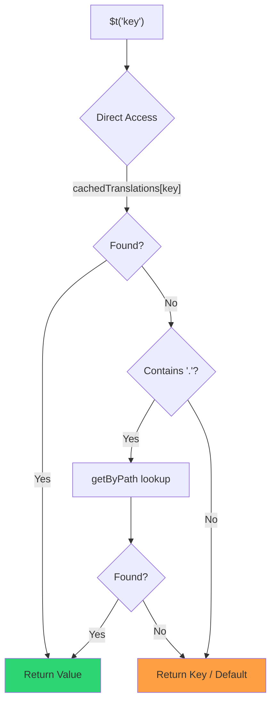

# 🚀 パフォーマンスガイド

## 📖 はじめに

`Nuxt I18n Micro` はパフォーマンスを重視して設計されており、`nuxt-i18n` のような従来の国際化(i18n)モジュールに対して大幅な改善を提供します。このガイドでは、`Nuxt I18n Micro` のパフォーマンス上の利点と、他のソリューションとの比較を詳しく説明します。

## 🤔 なぜパフォーマンスに注力するのか?

大規模プロジェクトやトラフィックの多い環境では、パフォーマンスのボトルネックはビルド時間の増加、メモリ使用量の増大、サーバー応答時間の悪化を招きます。これらの問題は、大きな翻訳ファイルを含む複雑な i18n セットアップでより顕著になります。`Nuxt I18n Micro` は、速度、メモリ効率、アプリケーションのバンドルサイズへの影響の最小化を最適化することで、こうした課題に真正面から取り組むために構築されました。

## 📊 パフォーマンス比較

`pnpm test:performance`(`pnpm -C scripts cli performance`)を用いて、同一のフィクスチャに対して **`@nuxtjs/i18n@10.6.0`** との比較テストを実施しました。詳細な手法とチャートは [パフォーマンステスト結果](/guides/performance-results) を参照してください。

デフォルトの CLI プロファイル: **4 ロケール** × **2 ページ**(`index`、`page`)× 約 10k の index リーフキー。より重いリグレッションレーダー負荷には `--locales` / `--keys` を引き上げます。レポートは、**コード**、**翻訳**(`@nuxtjs/i18n` の `chunks/raw/*` を含む)、**合計**のデプロイ対象出力に分けて表示されます。

```bash
pnpm test:performance
pnpm -C scripts cli performance --only micro --skip-stress
pnpm -C scripts cli performance --locales 12 --keys 100000 --runs 3
```

### ⏱️ ビルド時間とリソース消費

<Accordion title="**@nuxtjs/i18n v10.6**">
- **コードバンドル**: 2.16 MB
- **翻訳**: 7.21 MB(メッセージチャンク + ロケールペイロード)
- **合計デプロイ対象**: 9.37 MB
- **最大メモリ使用量**: 1,821 MB
- **経過時間**: 8.34s(3 回の平均)
</Accordion>

<Tip>
- **コードバンドル**: 1.74 MB — **`@nuxtjs/i18n` v10.6 よりコードが約 19% 小さい**
- **翻訳**: 6.8 MB(遅延読み込みされる JSON)
- **合計デプロイ対象**: 8.54 MB
- **最大メモリ使用量**: 1,065 MB — **`@nuxtjs/i18n` v10.6 よりメモリが約 41% 少ない**
- **経過時間**: 5.34s — **`@nuxtjs/i18n` v10.6 より約 36% 高速**(≈ plain-nuxt ベースライン)
</Tip>

> `@nuxtjs/i18n` を「code ≈ 15 MB / translations 0 B」と表示していた古いドキュメントは、`chunks/raw` のメッセージファイルをアプリコードとして数えていました。現在の分類ではそれらを分離しており、**コード**での差は縮まっていますが、micro は依然としてビルド時間、ピーク RSS、負荷テストでリードしています。

チャート、Autocannon の結果、フィクスチャの詳細は [完全なベンチマークレポート](/guides/performance-results) を参照してください。

### 🌐 負荷下でのサーバーパフォーマンス

Artillery(6s@6 + 60s@60)と Autocannon(10c / 10s)。フィクスチャごとに 3 回連続実行した平均。

<Accordion title="**@nuxtjs/i18n v10.6**">
- **秒間リクエスト数(Artillery)**: 143 [#/sec]
- **平均レスポンス時間**: 956 ms
- **Autocannon RPS / 平均レイテンシ**: 72 / 139 ms
</Accordion>

<Tip>
- **秒間リクエスト数(Artillery)**: 275 [#/sec] — **`@nuxtjs/i18n` v10.6 より約 93% 多い**
- **平均レスポンス時間**: 483 ms — **`@nuxtjs/i18n` v10.6 より約 49% 高速**
- **Autocannon RPS / 平均レイテンシ**: 162 / 62 ms
</Tip>

### 📈 視覚的比較

<Note>
Mintlify のドキュメントでは、インタラクティブなチャートは省略されています。このページのベンチマーク表または [VitePress ドキュメント](https://s00d.github.io/nuxt-i18n-micro/guide/performance-results) のチャートを参照してください: `chart`。
</Note>

<Note>
Mintlify のドキュメントでは、インタラクティブなチャートは省略されています。このページのベンチマーク表または [VitePress ドキュメント](https://s00d.github.io/nuxt-i18n-micro/guide/performance-results) のチャートを参照してください: `chart`。
</Note>

| 指標          | @nuxtjs/i18n v10.6 | i18n-micro | 改善        |
| --------------- | ------------------ | ---------- | ------------------ |
| ビルド時間      | 8.34s              | 5.34s      | **約 36% 高速**    |
| メモリ(ビルド)  | 1,821 MB           | 1,065 MB   | **約 41% 少ない**      |
| コードバンドル     | 2.16 MB            | 1.74 MB    | **約 19% 小さい**   |
| レスポンス時間   | 956 ms             | 483 ms     | **約 49% 高速**    |
| RPS(Artillery) | 143                | 275        | **約 93% 多い**      |

### 🔍 結果の解釈

現行の `@nuxtjs/i18n` **v10.6** に対して(デフォルト CLI プロファイル、3 回の平均):

- 🗜️ **より小さなコードグラフ**: メッセージチャンクを「コード」として誤ラベル化しなくなったことで、~1.74 MB vs ~2.16 MB。
- 🧠 **ビルド RSS が低い**: ピーク ~1.1 GB vs ~1.8 GB。
- 🕒 **ビルドが速い**: ~5.3s vs ~8.3s(このプロファイルでは micro が plain-Nuxt ベースラインに匹敵)。
- ⚡ **負荷下で大幅に優れる**: Artillery で ~275 vs ~143 RPS、Autocannon で ~162 vs ~72 RPS、平均レイテンシも低い。

絶対値は以前公表された表と異なります(辞書がより小さかった、Nuxt が古かった、`@nuxtjs/i18n` で「translations 0 B」となる不公平な分割があった)。方向性は同じです — micro はビルドコストとリクエストスループットで先行しています。

## ⚙️ 主要な最適化

### 🛠️ ミニマルな設計

`Nuxt I18n Micro` は、小さなコアと専用の戦略パッケージを中心にしたミニマルなアーキテクチャで構築されています。これによりオーバーヘッドが削減され、内部ロジックがシンプルになり、パフォーマンスが向上します。

### 🚦 効率的なルーティング

v3 では、ルート生成とランタイムパスロジックが最適なツリーシェイキングのために専用パッケージに分割されました:

- **`@i18n-micro/route-strategy`** — ビルド時ルート生成: Nuxt のページをローカライズされたルートで拡張します。選択された戦略(`no_prefix`、`prefix`、`prefix_except_default`、`prefix_and_default`)のみが含まれます。
- **`@i18n-micro/path-strategy`** — ランタイムのパス解決、リダイレクト、リンク生成。純粋関数と事前計算されたコンテキストフラグを使い、ホットパスでの割り当てを最小化します。サブパスエクスポート(`/prefix`、`/no-prefix` など)により、選択された実装のみがバンドルされます。

このアプローチにより、ルーティング設定は軽量に保たれ、ロケール数に関係なく高速なルート解決が保証されます。

### 📂 効率化された翻訳の読み込み

モジュールは翻訳に JSON ファイルのみをサポートし、グローバルとページ固有のファイルが明確に分離されています。これにより、必要な翻訳データのみが必要なタイミングで読み込まれ、パフォーマンスがさらに向上します。

### 🔒 GlobalThis シングルトンキャッシュ

v3.0.0 から、モジュールは `Symbol.for` を使った `globalThis` シングルトンパターンを使用し、Node.js プロセス全体で単一のキャッシュインスタンスを保証します。これにより次を防ぎます:

- 同じモジュールが複数回バンドルされた場合のキャッシュ重複
- リクエストごとのオブジェクト再生成によるガベージコレクション圧
- 孤立したキャッシュインスタンスによるメモリリーク

```mermaid
flowchart LR
    subgraph Process["Node.js Process"]
        G["globalThis[Symbol.for('CACHE')]"]

        subgraph R1["SSR Request 1"]
            P1[Plugin Instance] --> G
        end

        subgraph R2["SSR Request 2"]
            P2[Plugin Instance] --> G
        end

        subgraph R3["SSR Request 3"]
            P3[Plugin Instance] --> G
        end
    end

    G --> Cache["Single Map Instance"]
    Cache --> D1["en:index → translations"]
    Cache --> D2["en:about → translations"
```

```typescript
// Internal implementation pattern
const CACHE_KEY = Symbol.for('__NUXT_I18N_STORAGE_CACHE__')
if (!globalThis[CACHE_KEY]) {
  globalThis[CACHE_KEY] = new Map()
}
```

### ⚡ 最適化された翻訳関数(tFast)

`$t()` 関数は、速度に最適化された直接ルックアップ戦略を使用します:

1. **事前計算されたコンテキスト**: ロケールとルート名はナビゲーション中に一度だけ計算され、`$t()` 呼び出しごとには計算されません
2. **単一ソースルックアップ**: すべての翻訳(root + ページ固有 + フォールバック)はビルド時に単一のページごとのファイルに事前マージされ、階層的な検索は不要です
3. **ナビゲーション時の累積的なディープマージ**: 同じロケール内でナビゲートするとき、新ページの翻訳がアクティブな辞書にディープマージ(2 レベル)されるため、遷移アニメーション中も前ページのキーが引き続き参照可能です — 両ページが `common.*` 配下など、ネストされたプレフィックスを共有していても機能します
4. **`page:transition:finish` によるガベージコレクション**: 遷移アニメーションが完全に終了した後、マージされた辞書は新ページ用のクリーンな翻訳のみに置き換えられ、旧ページのキーからメモリを解放します
5. **直接プロパティアクセス**: ホットパスでは Map ルックアップの代わりに `obj[key]` を使用します



```typescript
// Simplified lookup logic — single active dictionary
let val = cachedTranslations[key]
if (val === undefined && key.includes('.')) {
  val = getByPath(cachedTranslations, key)
}
```

### 💉 サーバーサイドでの読み込み(HTML 埋め込みなし)

SSR 中に読み込まれる翻訳は、レンダー中の `$t` 用に**サーバーメモリ**に保持されます。`nuxtApp.payload` / HTML ドキュメントには**コピーされません**(`@nuxtjs/i18n` の `experimental.preload: false` と同じ考え方です)。

クライアントでは、`01.plugin.ts` が `switchContext` を `await` し、アプリの続行前に `/\{apiBaseUrl\}/:page/:locale/data.json` を読み込みます — 8 MB のインラインブロブではなく、1 リクエストです。

`NuxtI18n` は、`$t()` / `$has()` 用のアクティブなマージ済み辞書(`cachedTranslations`)を引き続き保持します。同じロケール内のナビゲーションでは、`page:transition:finish` が古いキーをクリーンアップするまで、ページチャンクがディープマージされます。

#### 現在の状況

以下の数値は、`pnpm run budget:payload` が計測し検証する予算ファイルから読み取られています。

{/* generated:payload-budget — do not edit; run `pnpm run docs:generate` */}

`playground` の `/`、`/de` で計測:

| 計測項目 | サイズ |
| --- | --- |
| ディスク上の翻訳ソース | 15.2 MB |
| 個別ペイロードファイルとして配信 | 76.3 MB |
| インラインの最大 `__NUXT_DATA__` | 6.9 MB |
| クライアントアセット | 449.5 KB |

playground には意図的に過大な辞書を持たせているため、実際のアプリケーションでこれらの数値を期待するべきではありません — これは計測の基準点です。予期せず数値が増えると予算が失敗するため、ペイロードが運ぶ内容の意図しない変更に気づけます。

{/* /generated:payload-budget */}

### 💾 キャッシュとプリレンダリング

翻訳はいくつかのキャッシュを通過します。どのキャッシュが応答したのかを把握することが、5 分と 5 時間のデバッグ差につながります。リクエストが遭遇する順に 4 つあります:

| レイヤー | 場所 | 有効期間 | クリア方法 |
| --- | --- | --- | --- |
| ブラウザ / CDN | `/\{apiBaseUrl\}/**` の `Cache-Control` | `httpCacheDuration`、`immutable` | 新しい `?v=` — 翻訳を変更したデプロイ |
| Nitro ルートキャッシュ | `routeRules['/\{apiBaseUrl\}/**'].cache` | 60 秒、stale-while-revalidate | サーバー再起動 |
| サーバーローダー | プロセス内 `CacheControl`、キー `locale:routeName` | プロセスライフタイム、または `cacheTtl` | サーバー再起動、開発時の HMR |
| クライアントストア | `translationStorage` および `NuxtI18n` 内のアクティブチャンク | ページライフタイム | リロード |

これらが互いに矛盾しないようにする 2 つのルール:

- **Nitro ルートキャッシュは `?v=` がある場合にのみ存在します。** キャッシュバスターにより各 URL はコンテンツ固有になるので、サーバー側でキャッシュしても古くなる心配はありません。`dateBuild: 0` を設定するとこのレイヤーはオフになります。URL が安定するとレスポンスは `must-revalidate` となり、サーバー側キャッシュは最大 1 分間、古いエントリーから応答して静かにその意図を破壊してしまうためです。
- **`immutable` も `?v=` を必要とします。** バスターがなければ、`httpCacheDuration` の値にかかわらずヘッダーは `public, max-age=0, must-revalidate` になります: 変わらない URL に長い `max-age` を付けると、ブラウザが最初に見たレスポンスが固定されてしまうためです。

<Warning>
`translationPayloads.publicAssets`(プリマージモードのデフォルト)を使う場合、ペイロードは `public/<apiBaseUrl>/\{page\}/\{locale\}/data.json` にコピーされます。そのディレクトリを自前で配信するプラットフォーム(Cloudflare Pages、Firebase Hosting、`npx serve`)は独自のヘッダーを適用します — Nitro の `routeRules` ヘッダーは、サーバーを経由するレスポンスにのみ届きます。これらの静的ファイルのキャッシュポリシーは、プラットフォーム側の設定で行ってください。
</Warning>

🏁 **プリレンダリング**: プリマージモードでは、`publicAssets` がすでにクライアント URL ツリーを `public/` に書き込んでいます。そのコピーを無効化した際に Nitro でハンドラールートを実体化したい場合のみ、`prerenderRoutes` を有効にしてください。

### 🗜️ 圧縮されたパブリックペイロード

`nitro.compressPublicAssets` が有効な場合、public ディレクトリにコピーされる翻訳ペイロードにも `.gz` と `.br` の兄弟ファイルが付与されます:

```ts
export default defineNuxtConfig({
  nitro: { compressPublicAssets: true },
})
```

Nitro は、ペイロードをコピーするフックの前にパブリックアセットを圧縮するため、これがないと静的ビルド内で圧縮されない唯一の部分になってしまいます。モジュール自身は圧縮を有効化しません — 選択した設定を適用するだけです。エンコーディング別の選択(`\{ gzip: true, brotli: false \}`)は尊重されます。

Playground の index ペイロード: 6,651,984 B(生)、1,012,831 B(gzip)、821,617 B(brotli)。

### ☁️ サーバーレスのペイロード出力

**Node** では、SSR は `public/<apiBaseUrl>` から翻訳 JSON を読み取ります(`readFile`、Nitro `serverAssets` / Rollup `raw:` なし)。**Edge** では、Nitro `serverAssets` が同じツリーを埋め込みます(大きなカタログでは `mode: 'source'` を推奨)。

```typescript
export default defineNuxtConfig({
  i18n: {
    translationPayloads: {
      serverAssets: true, // default — Node → public copy; Edge → serverAssets embed
      publicAssets: true, // default in premerged mode
    },
  },
})
```

コンパクトな Edge 埋め込み(およびオプションでコンパクトなパブリックコピー)のために `translationPayloads.mode: 'source'` を使います:

```typescript
export default defineNuxtConfig({
  i18n: {
    translationPayloads: {
      mode: 'source',
    },
  },
})
```

`mode: 'source'` はレイヤーマージされたソースファイルをコンパクトに保ち、組み込みの `/_locales` ルート(または Edge の `assets:i18n`)を通じて root / ページ / フォールバックをランタイムでマージします。デフォルトでは、パブリックアセットのコピーとプリレンダリングされたペイロードルートを無効化します。

<Warning>
`prerenderRoutes` はデフォルトで `false` です。`mode: 'source'` では `publicAssets` もデフォルトで `false` になります。したがって、Nitro / エッジランタイムのない純粋な静的ホスティングでは、これらの出力のいずれかを有効化するか、`serverHandler` をランタイムで利用可能に保つか、ペイロードを外部でホストしない限り、クライアントで翻訳を読み込めません。

デフォルトのプリマージ + `publicAssets` は既に `/\{apiBaseUrl\}/\{page\}/\{locale\}/data.json` を `public/` 配下に配置しているため、静的ホストは Nitro なしでクライアントのフェッチを配信できます。
</Warning>

<Warning>
`apiBaseServerHost` または `apiBaseClientHost` を設定すると、ペイロードの配信がそのオリジンに移りますが、これには独自の要件があります — [設定 → 外部 CDN ホスト](/guides/configuration#external-cdn-hosts) を参照してください。
</Warning>

または、個別の HTTP / パブリック出力を無効化し、ペイロードを外部でホストします:

```typescript
export default defineNuxtConfig({
  i18n: {
    apiBaseClientHost: 'https://cdn.example.com',
    apiBaseServerHost: 'https://cdn.example.com',
    translationPayloads: {
      serverHandler: false,
      publicAssets: false,
      prerenderRoutes: false,
    },
  },
})
```

組み込みのローカル `/\{apiBaseUrl\}/:page/:locale/data.json` ルートに依存する場合は `serverHandler` を有効のままにしてください。ペイロードが外部でホストされ、`apiBaseServerHost` がその外部オリジンを指している場合は無効化します。`publicAssets` がまだ静的ペイロードルートを書き込んでいない状態で、それらを Nitro に実体化させたい場合のみ `prerenderRoutes` を有効にしてください。

ビルド中、生成されたペイロード出力が `translationPayloads.warnFileCount`(デフォルト 500)または `translationPayloads.warnSizeBytes`(デフォルト 10 MB)を超えると、モジュールは警告を出します。また、外部のペイロードホストが設定されずにすべてのローカル出力が無効になっている場合にも警告します。

## 📝 パフォーマンスを最大化するためのヒント

`Nuxt I18n Micro` から最大のパフォーマンスを引き出すためのヒントをいくつか紹介します:

- 📉 **ロケールデータを制限する**: プロジェクトに必要なロケールのみを含め、バンドルサイズを小さく保ちましょう。
- 🗂️ **ページ固有の翻訳を使う**: 翻訳ファイルをページ別に整理し、不要なデータの読み込みを避けましょう。
- 💾 **キャッシュを有効にする**: キャッシュ機能を活用してサーバー負荷を減らし、レスポンス時間を改善しましょう。
- 🏁 **プリレンダリングを活用する**: 翻訳をプリレンダリングしてページ読み込みを高速化し、ランタイムオーバーヘッドを減らしましょう。

パフォーマンステストの詳細な結果については、[パフォーマンステスト結果](/guides/performance-results) を参照してください。
