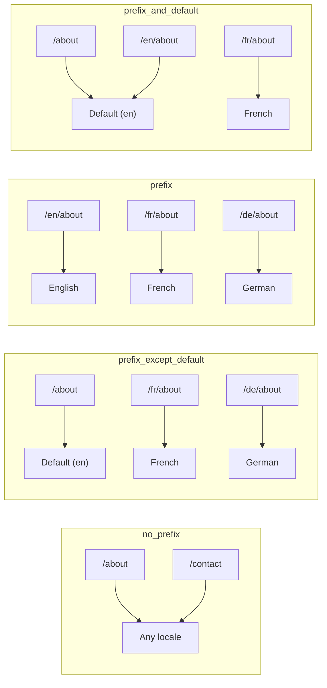
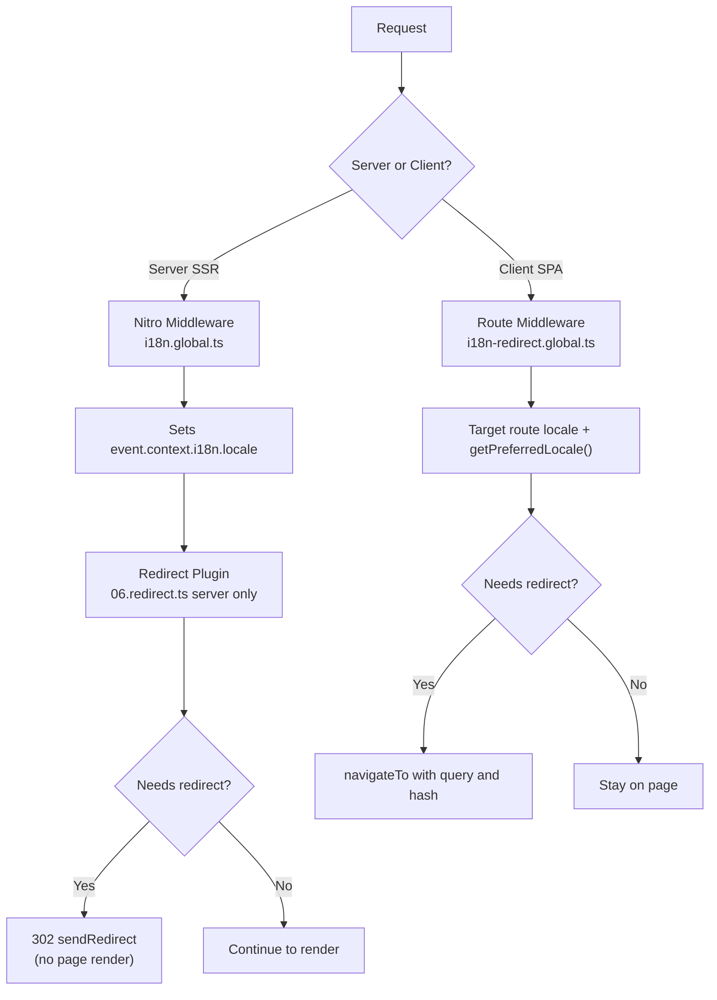

# 🗂️ Nuxt I18n Micro のルーティング戦略

## 📖 概要

Nuxt I18n Micro は `strategy` オプションを通じて、ロケールプレフィックスが URL にどのように表示されるかを制御します。内部では、次の 2 つのパッケージがこれを実装しています:

- **`@i18n-micro/route-strategy`** — ビルド時のルート生成(Nuxt のページをローカライズされたルートで拡張)
- **`@i18n-micro/path-strategy`** — ランタイムのパス解決、リダイレクト、SEO 属性、リンク生成

Nuxt モジュールはビルド時に正しい戦略クラスを選択し、`#i18n-strategy` 経由でエイリアスするため、選択された実装のみがバンドルされます。

## 🚦 利用可能な戦略

{/* generated:option:strategy — do not edit; run `pnpm run docs:generate` */}

**型** `Strategies` · **デフォルト** `'prefix_except_default'`

ロケールプレフィックス用の URL ルーティング戦略。

- `'no_prefix'` — URL にロケールなし。ロケールはクッキーに保存されます。
- `'prefix_except_default'` — デフォルト以外のすべてのロケールにプレフィックスを付与。
- `'prefix'` — デフォルトを含め常にプレフィックスを付与。
- `'prefix_and_default'` — `prefix` と同様だが、デフォルトロケールはプレフィックスなしでもアクセス可能。

{/* /generated:option:strategy */}

### 戦略の比較



### 🛑 `no_prefix`

URL にはロケールセグメントがありません。ロケールはクッキー、`useI18nLocale()` の状態、またはブラウザ検出によって決定されます。

- **ルート**: `/about`、`/contact` — すべてのロケールで同じ URL パターン(`/en/`、`/fr/` のプレフィックスなし)
- **ロケールの永続化**: `localeCookie` 経由(指定されていない場合は自動的に `'user-locale'` に設定)
- **カスタムパス**: [`globalLocaleRoutes`](/guides/configuration#globallocaleroutes) と [`defineI18nRoute`](/guides/custom-locale-routes) 経由でサポート — URL にロケールプレフィックスを追加せずに、ローカライズされたスラッグを生成できます(例: `/about` と `/ueber-uns`)。ネストされたルート、エイリアス、ロケールごとの制限は、`prefix_except_default` よりもシンプルです。

<Tip>
`no_prefix` を使う場合、`localeCookie` は指定されていない場合、自動的に `'user-locale'` に設定されます。URL にロケール情報が含まれないため、これが必要です。
</Tip>

```typescript
i18n: {
  strategy: 'no_prefix'
  // localeCookie is automatically set to 'user-locale'
}
```

### 🚧 `prefix_except_default`

デフォルトロケール**以外**のすべてのルートにロケールプレフィックスが付きます。

- **デフォルトロケール**: `/about`、`/contact`
- **その他のロケール**: `/fr/about`、`/de/contact`
- **プレフィックス付きのデフォルトロケールは 404**: `/en/about` → 404(`en` がデフォルトの場合)

```typescript
i18n: {
  strategy: 'prefix_except_default' // This is the default
}
```

### 🌍 `prefix`

デフォルトロケールを含め、すべてのルートにロケールプレフィックスが付きます。

- **すべてのロケール**: `/en/about`、`/fr/about`、`/de/about`
- **ルート `/`**: ユーザーの設定に基づいて `/\{locale\}/` にリダイレクト

```typescript
i18n: {
  strategy: 'prefix'
}
```

### 🔄 `prefix_and_default`

デフォルトロケールは、プレフィックス付きとなしの両方で利用可能です。デフォルト以外のロケールには常にプレフィックスが付きます。

- **デフォルトロケール**: `/about` と `/en/about` の両方が有効
- **その他のロケール**: `/fr/about`、`/de/about`
- **`/` からのリダイレクトなし**: `/` と `/en/` の両方がデフォルトロケールを配信

```typescript
i18n: {
  strategy: 'prefix_and_default'
}
```

## 🔀 リダイレクトアーキテクチャ(v3)

v3 では、リダイレクトロジックが最適なパフォーマンスのために 2 つのレイヤーに分割されています:

### 仕組み



### サーバーサイド(フラッシュなし)

1. **Nitro ミドルウェア**(`i18n.global.ts`)が最初に実行 — URL、クッキー、または `Accept-Language` ヘッダーからロケールを検出し、`event.context.i18n.locale` を設定します
2. **リダイレクトプラグイン**(`06.redirect.ts`、サーバー専用)が `i18nStrategy.getClientRedirect()` を使って現在のパスがリダイレクトを必要とするかを確認し、ページレンダリング**前**に 302 を発行します
3. これにより、リダイレクト前にユーザーが誤ったページを一瞬見てしまう「エラーフラッシュ」を防ぎます

### クライアントサイド(SPA ナビゲーション)

1. `redirects` が有効な場合、グローバルルートミドルウェア(`i18n-redirect.global.ts`)が各クライアントナビゲーションで実行されます
2. **対象のルート**から優先ロケールを最初に導出し、次に `useI18nLocale().getPreferredLocale()` にフォールバックします
3. `i18nStrategy.getClientRedirect()` を使ってリダイレクトが必要かを判断します
4. リダイレクト時に `query` と `hash` を保持します

### ロケールの優先順位

サーバー上では、リダイレクトプラグインは次の順序で優先ロケールを決定します:

1. **`useState('i18n-locale')`** — 最優先(`useI18nLocale().setLocale()` を通じてプログラム的に設定)
2. **クッキー** — `localeCookie` が設定されている場合
3. **`Accept-Language` ヘッダー** — `autoDetectLanguage: true` の場合
4. **`defaultLocale`** — 最終フォールバック

クライアント上では、ルートミドルウェアがまず対象ルートのロケールを優先し、その後同じ state/クッキーのフォールバックチェーンを使用します。

### 戦略ごとのリダイレクト挙動

| 戦略                | `GET /` の挙動                              | クッキーは必要? |
| ----------------------- | --------------------------------------------- | ---------------- |
| `no_prefix`             | リダイレクトなし(クッキー/state からロケール)        | 自動設定         |
| `prefix`                | 302 → `/\{locale\}/`                            | 推奨      |
| `prefix_except_default` | ロケール ≠ デフォルトの場合 302 → `/\{locale\}/`        | 推奨      |
| `prefix_and_default`    | リダイレクトなし(`/` と `/\{locale\}/` の両方が有効) | 任意         |

### リダイレクトを無効化

```typescript
i18n: {
  redirects: false // Disables automatic locale redirects
}
```

`redirects: false` の場合、自動ロケールリダイレクトは無効になります:

- **サーバー**: リダイレクトプラグイン(`06.redirect.ts`、サーバー専用)は登録されたままですが、リダイレクトロジックはスキップされます。無効なロケールプレフィックス(例: `/xx/about` で `xx` が有効なロケールでない場合)に対する **404 チェック**と、URL プレフィックスからの**クッキーの同期**(例: `/fr/about` を訪問するとクッキーが `fr` に同期される)は引き続き行われます
- **クライアント**: `i18n-redirect` グローバルルートミドルウェアは**登録されません** — SPA 自動リダイレクトはありません

## 🍪 クッキーベースのロケール永続化

<Warning>
`prefix` または `prefix_except_default` を `redirects: true`(デフォルト)で使用する場合、リダイレクトが正しく機能するには **必ず** `localeCookie` を設定する必要があります。クッキーがないと、リダイレクトプラグインはページ再読み込みをまたいだユーザーのロケール設定を記憶できません。

```typescript
i18n: {
  strategy: 'prefix_except_default',
  localeCookie: 'user-locale' // Required for redirects to work properly
}
```
</Warning>

**v3 での `localeCookie` の動作:**

- `useI18nLocale()` によって内部的に管理されます — `useCookie()` 経由で**手動設定しないでください**
- ユーザーがプレフィックス付き URL(例: `/fr/about`)を訪問すると、クッキーは自動的に `fr` に同期されます
- 次に `/` にアクセスしたときは、クッキーの値を使用して `/\{locale\}/` にリダイレクトします
- クッキーに無効なロケール(`locales` リストにないもの)が含まれている場合、`defaultLocale` にフォールバックします

| 戦略                | `localeCookie` のデフォルト | メモ                                |
| ----------------------- | ---------------------- | ------------------------------------ |
| `no_prefix`             | 自動: `'user-locale'`  | 必須。自動的に設定される          |
| `prefix`                | `null`(無効)      | リダイレクトのために `'user-locale'` を設定 |
| `prefix_except_default` | `null`(無効)      | リダイレクトのために `'user-locale'` を設定 |
| `prefix_and_default`    | `null`(無効)      | 任意                             |

## 🔍 `autoDetectLanguage` と `autoDetectPath`

### `autoDetectLanguage`

{/* generated:option:autoDetectLanguage — do not edit; run `pnpm run docs:generate` */}

**型** `boolean` · **デフォルト** `true`

`Accept-Language` HTTP ヘッダーから、ユーザーの優先言語を自動検出します。
検出のタイミングを決定するために `autoDetectPath` と組み合わせて使用します。

{/* /generated:option:autoDetectLanguage */}

このチェックはサーバーミドルウェアで実行され、フォールバックとして機能します: クッキーや既存の state が優先されます。

```typescript
i18n: {
  autoDetectLanguage: true
}
```

### `autoDetectPath`

{/* generated:option:autoDetectPath — do not edit; run `pnpm run docs:generate` */}

**型** `string` · **デフォルト** `'/'`

クッキー / Accept-Language の設定に基づくリダイレクトを実行する場所(`redirects` が有効な場合)。

- `'/'` — `/` のみ(デフォルトロケールのディープリンクは到達可能なまま。デフォルト)
- `'no_prefix'` — ロケールプレフィックスのないパスのみ
- `'*'` — すべてのパス。明示的なロケールプレフィックスの書き換えを含む
  (例: クッキーが `de` を好む場合、`/fr/about` → `/de/about`)

- その他の文字列 — 完全一致のパス(例: `'/welcome'`)

プレフィックス戦略のクリーンアップ(例: `prefix_except_default` 配下で `/en` → `/`)はゲートされません。

{/* /generated:option:autoDetectPath */}

```typescript
i18n: {
  autoDetectPath: '/' // Default: only root
  // autoDetectPath: '*' // All paths — redirects even /fr/about to /de/about
}
```

<Warning>
`autoDetectPath: '*'` を使うと、明示的なロケールプレフィックス付きの URL(例: `/fr/about`)であっても、ユーザーの優先ロケールが異なる場合はリダイレクトされます。ドメインベースの構成では有用な場合がありますが、URL を共有するユーザーには混乱を招く可能性があります。
</Warning>

デフォルトの `autoDetectPath: '/'` とロケールクッキーの組み合わせでは:

| リクエスト | クッキー | 結果 |
| --- | --- | --- |
| `/` | `de` | 302 → `/de` |
| `/about` | `de` | 200、デフォルトロケール(書き換えなし) |

```typescript
i18n: {
  localeCookie: 'user-locale',
  strategy: 'prefix_except_default',
  // Default — remember language on entry, keep deep links stable
  autoDetectPath: '/',
  // Or redirect on every unprefixed path (but not /de/… → /fr/…):
  // autoDetectPath: 'no_prefix',
}
```

## ⚠️ 既知の問題とベストプラクティス

### 1. `no_prefix` 戦略でのハイドレーションミスマッチ

`no_prefix` を使う場合、ロケールは動的に決定されます。サーバーとクライアントでロケールが一致しない場合、ハイドレーションミスマッチが発生します。

**解決策**: サーバープラグイン内で `useI18nLocale().setLocale()`(`order: -10`)を使い、i18n 初期化前にロケールを設定してください:

```ts
// plugins/i18n-loader.server.ts
export default defineNuxtPlugin({
  name: 'i18n-custom-loader',
  enforce: 'pre',
  order: -10,
  setup() {
    const { setLocale } = useI18nLocale()
    setLocale('ja') // Your detection logic here
  },
})
```

詳しい例は [カスタム言語検出](/guides/custom-language-detection) を参照してください。

### 2. `localeRoute` で名前付きルートを使う

パスベースのルーティングは、ルート解決で問題を起こすことがあります:

```typescript
// May cause issues
$localeRoute('/page')

// Preferred approach
$localeRoute({ name: 'page' })
```

### 3. i18n と `pages: false` を併用する

`pages: false` で Nuxt を使う場合:

```typescript
export default defineNuxtConfig({
  pages: false,
  i18n: {
    strategy: 'no_prefix', // Recommended
    disablePageLocales: true, // Required
    localeCookie: 'user-locale', // Required for persistence
  },
})
```

**`pages: false` の制限:**

- 自動リダイレクトなし
- URL ベースのロケール検出なし
- クライアントサイドのロケール切り替えには、ページ再読み込みまたは手動での翻訳読み込みが必要

### 4. 無効なクッキーの扱い

クッキーに無効なロケール(`locales` リストにないもの)が含まれている場合、モジュールは `defaultLocale` に穏やかにフォールバックします。エラーはスローされません。

## 📝 ベストプラクティスまとめ

| 推奨事項            | 詳細                                                                             |
| ------------------------- | ----------------------------------------------------------------------------------- |
| **`localeCookie` を設定**    | `redirects: true` を伴うプレフィックス戦略では常に設定                             |
| **`useI18nLocale()` を使う** | ロケール状態を管理する一元的な方法(手動の `useState`/`useCookie` を置き換え) |
| **名前付きルートを使う**      | `$localeRoute('/page')` より `$localeRoute(\{ name: 'page' \})`                       |
| **プログラム的なロケール設定**   | `order: -10` のサーバープラグインで `useI18nLocale().setLocale()` を使う              |
| **手動のクッキーを避ける**  | `useCookie('user-locale')` を直接使わない — `useI18nLocale()` が管理します      |
