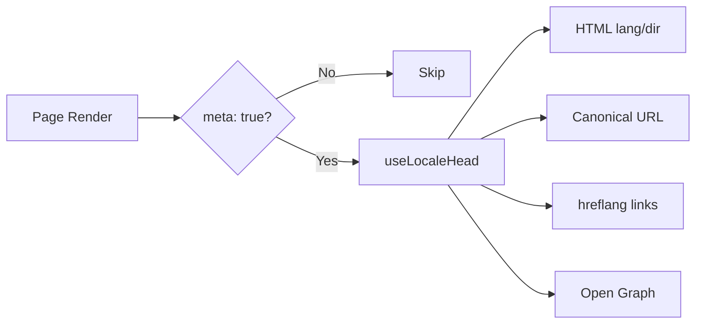

# 🌐 Nuxt I18n Micro の SEO ガイド

## 📖 はじめに

効果的な SEO(検索エンジン最適化)は、多言語サイトが検索エンジンを通じて世界中のユーザーにアクセス可能かつ発見可能であるために不可欠です。`Nuxt I18n Micro` は、サイトの構造やコンテンツを検索エンジンに伝える主要なメタタグや属性を自動生成することで、多言語サイトの SEO 管理プロセスを簡素化します。

このガイドでは、追加の設定なしで `Nuxt I18n Micro` がサイトの可視性とユーザー体験を向上させるために SEO をどのように扱うかを説明します。

## ⚙️ 自動 SEO 処理

### SEO メタ生成のフロー



**生成されるタグ:**

| タグ             | 例                                                  |
| --------------- | -------------------------------------------------------- |
| HTML 属性 | `<html lang="en" dir="ltr">`                             |
| Canonical       | `<link rel="canonical" href="...">`                      |
| hreflang        | `<link rel="alternate" hreflang="en" href="...">`        |
| x-default       | `<link rel="alternate" hreflang="x-default" href="...">` |
| Open Graph      | `<meta property="og:locale" content="en_US">`            |

#### ロケールごとの `og`(`og:locale` と BCP 47)

`<html lang>` と `hreflang` は `locale.iso` を通じて **BCP 47**(例: `ar-AE`)を使用します。  
Open Graph は [OG プロトコル](https://ogp.me/) に従い、**アンダースコア**付きの **`language_TERRITORY`**(`ar_AE`)を必要とします。

デフォルトでは、`og:locale` はマッピングが曖昧でない場合に `iso` から派生します(`en-US` → `en_US`)。  
カスタム値が必要な場合(例: `zh-Hans` → `zh_CN`)は、明示的な **`og`** 文字列を設定してください。  
`og` も変換可能な `iso` も利用できない場合、`og:locale` タグは生成されません。開発時にはコンソール警告が出ます(`missingWarn` を尊重します)。

```typescript
i18n: {
  meta: true,
  locales: [
    { code: 'ar', iso: 'ar-AE', og: 'ar_AE', dir: 'rtl' },
    { code: 'en', iso: 'en-US' }, // og:locale → en_US
    { code: 'zh', iso: 'zh-Hans', og: 'zh_CN' }, // script tags need explicit og
  ],
}
```

### 🔑 主な SEO 機能

`Nuxt I18n Micro` で `meta` オプションが有効になっていると、モジュールは次の SEO 面を自動で管理します:

1. **🌍 言語と方向属性**:
   - モジュールは、現在のロケールとテキスト方向(例: 英語なら `ltr`、アラビア語なら `rtl`)に応じて `<html>` タグに `lang` と `dir` 属性を設定します。

2. **🔗 Canonical URL**:
   - モジュールは各ページに Canonical リンク(`<link rel="canonical">`)を生成し、検索エンジンがコンテンツの主要バージョンを認識できるようにします。

3. **🌐 代替言語リンク(`hreflang`)**:
   - モジュールは利用可能なすべてのロケール向けに `<link rel="alternate" hreflang="">` タグを自動生成します。これにより、検索エンジンはコンテンツの言語版がどれか把握でき、グローバルなユーザー体験を向上させます。
   - 各ロケールは**1 つ**のタグを出力します: `hreflang = iso || code`。`iso` が設定されている場合、ルーティングの `code` は `hreflang` として使用されません(例: `mx` のような市場キーは無効な言語タグにはなりません)。
   - オプションの `hreflangBaseLanguage: true` を使うと、`iso` から派生した素の言語タグ(例: `es-ES` → `es`)も出力されます。これは `locales` 内の最初の地域ロケールが対象になります。

4. **🌏 `x-default` の hreflang**:
   - モジュールは、デフォルトロケールの URL を指す `<link rel="alternate" hreflang="x-default">` タグを自動生成します。これにより、検索エンジンは定義されたロケールのいずれとも言語が一致しないユーザーにどの URL を表示すべきかを知ることができます。追加の設定は不要 — `meta: true` を設定すれば自動で動作します。

5. **🔖 Open Graph メタデータ**:
   - モジュールは各ロケール向けに Open Graph メタタグ(`og:locale`、`og:url` など)を生成します。ソーシャルメディア共有や検索エンジンのインデックスに特に有用です。

### 🛠️ 設定

これらの SEO 機能を有効化するには、`nuxt.config.ts` で `meta` オプションを `true` に設定します:

```typescript
export default defineNuxtConfig({
  modules: ['nuxt-i18n-micro'],
  i18n: {
    locales: [
      { code: 'en', iso: 'en-US', dir: 'ltr' },
      { code: 'fr', iso: 'fr-FR', dir: 'ltr' },
      { code: 'ar', iso: 'ar-SA', dir: 'rtl' },
    ],
    defaultLocale: 'en',
    translationDir: 'locales',
    meta: true, // Enables automatic SEO management
  },
})
```

### 🌍 マルチドメインデプロイのための動的な `metaBaseUrl`

`metaBaseUrl` が未設定の場合、絶対 SEO URL は次の順序で解決されます(#240):

1. [`nuxt-site-config`](https://nuxtseo.com/docs/site-config) の `site.url`(そのモジュールが存在する場合。例: `@nuxtjs/seo` 経由で)
2. それ以外は、現在のリクエストのホスト名(`useRequestURL()` / `window.location.origin`)

リクエストオリジンのフォールバックはリバースプロキシヘッダー(`X-Forwarded-Host`、`X-Forwarded-Proto`)を尊重するため、nginx、Cloudflare、AWS ALB などのプロキシの背後でも正しく動作します。

つまり、すでにサイトマップ / robots / schema.org 用に `site.url` を設定しているアプリでは、**別途** `metaBaseUrl` を宣言する必要は**ありません**:

```typescript
export default defineNuxtConfig({
  site: {
    url: process.env.NUXT_SITE_URL, // also used by micro for canonical / og:url / hreflang
  },
  i18n: {
    meta: true,
    // metaBaseUrl omitted — picks up site.url, then request origin
  },
})
```

`site.url` がなくても、単一のアプリケーションインスタンスが**複数のドメイン**を提供し、リクエストオリジン経由でそれぞれ正しい SEO タグを生成できます:

```typescript
export default defineNuxtConfig({
  i18n: {
    meta: true,
    // metaBaseUrl is undefined by default — resolved dynamically from the request
  },
})
```

例えば、`https://site-a.com/en/about` へのリクエストは次を生成します:

```html
<link rel="canonical" href="https://site-a.com/en/about" /> <meta property="og:url" content="https://site-a.com/en/about" />
```

同じアプリが `https://site-b.com/en/about` を配信すると、次を生成します:

```html
<link rel="canonical" href="https://site-b.com/en/about" /> <meta property="og:url" content="https://site-b.com/en/about" />
```

`site.url` より常に優先される固定のベース URL が必要な場合は、静的な文字列を渡します:

```typescript
metaBaseUrl: 'https://example.com'
```

### 🔍 Canonical クエリのホワイトリスト

デフォルトでは、重複コンテンツを避けるために、クエリパラメーターは canonical と `og:url` から除去されます。保持すべき特定のクエリパラメーターをホワイトリスト化できます:

```typescript
i18n: {
  canonicalQueryWhitelist: ['page', 'sort', 'filter', 'search', 'q', 'query', 'tag']
}
```

`canonicalQueryWhitelist` に列挙されたパラメーターのみが canonical URL に表示されます。その他のクエリパラメーター(例: トラッキング、セッション ID)は削除されます。

### 🚫 ページごとのメタタグ無効化

`defineI18nRoute()` を使って、特定のページの SEO メタタグ生成を無効化できます:

```vue
<script setup>
// Disable all SEO meta tags for this page
defineI18nRoute({
  disableMeta: true,
})
</script>
```

特定のロケールについてのみメタを無効化することもできます:

```vue
<script setup>
// Disable meta tags only for English locale on this page
defineI18nRoute({
  disableMeta: ['en'],
})
</script>
```

`disableMeta` が有効になると、対象のページ/ロケールに対する `hreflang`、`canonical`、`og:locale`、`og:url`、`x-default` タグは生成されません。

### 🔇 無効化されたロケール

`disabled: true` のロケールは、すべての SEO タグ生成から自動的に除外されます — それらについて `hreflang`、`og:locale:alternate`、代替リンクは作成されません:

```typescript
i18n: {
  locales: [
    { code: 'en', iso: 'en-US' },
    { code: 'fr', iso: 'fr-FR', disabled: true }, // excluded from SEO tags
  ]
}
```

### 🙈 オプトアウトロケール(`seo: false`)

ルーティングと翻訳は残しつつ、クロスロケール発見用タグには表示したくないロケールには、`seo: false` を設定します。これらのロケールは `hreflang` 代替や `og:locale:alternate` から除外されます。設定された**デフォルト**ロケールが `seo: false` の場合、`x-default` リンクも出力されません。

```typescript
i18n: {
  locales: [
    { code: 'en', iso: 'en-US' },
    { code: 'ru', iso: 'ru-RU', seo: false }, // internal / non-indexed locale
  ]
}
```

### 📌 戦略ごとの挙動

| 戦略                | hreflang リンク   | x-default             | canonical      | og:url |
| ----------------------- | ---------------- | --------------------- | -------------- | ------ |
| `prefix`                | ✅ すべてのロケール   | ✅ デフォルトロケール URL | ✅ 現在の URL | ✅     |
| `prefix_except_default` | ✅ すべてのロケール   | ✅ プレフィックスなしの URL     | ✅ 現在の URL | ✅     |
| `prefix_and_default`    | ✅ すべてのロケール   | ✅ デフォルトロケール URL | ✅ 現在の URL | ✅     |
| `no_prefix`             | ❌ 生成されない | ❌ 生成されない      | ✅ 現在の URL | ✅     |

`no_prefix` 戦略の場合、`canonical`、`og:url`、`og:locale`、および `html` 属性(`lang`、`dir`)のみが生成されます。ロケール別に異なる URL が存在しないため、代替言語リンク(`hreflang`)と `x-default` は生成されません。

## ページレベルのオーバーライド(`useI18nHead`)

**記事、ガイド、または任意の CMS コンテンツ** で、すべてのロケールが存在しないか、URL が API から得られる場合、独自の i18n head プラグインではなく、ページで [`useI18nHead`](/api/composables/use-i18n-head) を使用してください。

### 部分翻訳の記事

```vue
<script setup lang="ts">
const article = await loadArticle()
// article.locales = { en: '...', de: '...' } — only translated locales

useI18nHead({
  meta: [{ property: 'og:title', content: article.title }],
  replace: {
    hreflang: Object.entries(article.locales).map(([locale, href]) => ({
      rel: 'alternate',
      hreflang: locale,
      href,
    })),
    ogAlternates: Object.keys(article.locales),
  },
})
</script>
```

### `$setI18nRouteParams` を使ったロケール別スラッグ

言語ごとにスラッグが異なる場合、まずルートパラメーターを設定し、次に実際の URL で代替を上書きします:

```vue
<script setup lang="ts">
const { $defineI18nRoute, $setI18nRouteParams } = useNuxtApp()
const { data: article } = await useFetch(`/api/articles/${slug}`)

$defineI18nRoute({
  localeRoutes: { en: '/blog/[slug]', de: '/de/blog/[slug]' },
})

$setI18nRouteParams({
  en: { slug: article.value.slugEn },
  de: { slug: article.value.slugDe },
})

useI18nHead({
  replace: {
    hreflang: ['en', 'de'].map((locale) => ({
      rel: 'alternate',
      hreflang: locale,
      href: article.value.urls[locale],
    })),
    ogAlternates: ['en', 'de'],
  },
})
</script>
```

### プロキシ配下の HTTPS オリジン

独自のオリジンコンポーザブルを使わずに SSR で正しい絶対 URL を得るには:

```ts
i18n: {
  meta: true,
  metaBaseUrl: undefined,
  metaTrustForwardedHost: true,
  metaTrustForwardedProto: true,
}
```

より多くの例(canonical のオーバーライド、`x-default`、リアクティブなフェッチ、共有ヘルパー): [useI18nHead コンポーザブル](/api/composables/use-i18n-head)。

### ⚠️ トレイリングスラッシュ

モジュールは `useRoute().fullPath` からの実際のパスに基づいて canonical と `hreflang` の URL を生成します。アプリケーションがトレイリングスラッシュを使用している場合(例: Nuxt の `router.options` 経由)、生成された URL はそれを反映します。ただし、`$switchLocalePath` はパスを正規化し、トレイリングスラッシュを除去する場合があります。SEO でトレイリングスラッシュの一貫性が重要な場合、生成された URL がアプリケーションの URL 構造と一致することを確認してください。

### 🎯 メリット

`meta` オプションを有効にすることで、次の恩恵を受けられます:

- **📈 検索エンジンランキングの向上**: 検索エンジンが異なる言語版間の関係を理解し、サイトをより適切にインデックスします。
- **👥 より良いユーザー体験**: ユーザーは好みに応じた正しい言語版を配信され、よりパーソナライズされた体験になります。
- **🔧 手動設定の削減**: モジュールが SEO タスクを自動で処理するため、SEO 関連のメタタグや属性を手動で追加する必要がなくなります。

## 🔗 Nuxt SEO(`@nuxtjs/seo`)

[`@nuxtjs/seo`](https://nuxtseo.com/) は、サイトマップ、robots、schema.org、OG 画像などの関連モジュールをまとめて提供します。[`nuxt-site-config`](https://nuxtseo.com/docs/site-config/guides/i18n)(v4+)を介して **nuxt-i18n-micro** と統合されます。

### 要件

- **`@nuxtjs/seo` 3+**(最新版は `nuxt-site-config` 4+ を使用し、micro 用の `nuxt-site-config:i18n` プラグインを登録します)
- **`i18n.meta: true`**(推奨 — micro がロケール対応の head タグを提供し、Nuxt SEO がサイトマップや schema.org などを追加します)

### モジュールの順序

サイト設定がロケール構成を読み取れるように、**nuxt-i18n-micro を `@nuxtjs/seo` の前**に列挙します:

```typescript
export default defineNuxtConfig({
  modules: ['nuxt-i18n-micro', '@nuxtjs/seo'],
  site: {
    url: 'https://example.com',
    name: 'My Site',
  },
  i18n: {
    meta: true,
    defaultLocale: 'en',
    locales: [
      { code: 'en', iso: 'en-US' },
      { code: 'de', iso: 'de-DE' },
    ],
  },
})
```

### 翻訳されたサイト名と説明

Nuxt Site Config は、ロケールファイルからオプションの翻訳キーを読み取ります:

```json
{
  "nuxtSiteConfig": {
    "name": "My Site",
    "description": "My site description"
  }
}
```

`locales/en.json`、`locales/de.json` などのロケール別の値が自動的に取得されます。

### トラブルシューティング

`Plugin nuxt-seo:defaults depends on nuxt-site-config:i18n but they are not registered` が表示される場合、**`@nuxtjs/seo` を 3+** にアップグレードしてください([issue #133](https://github.com/s00d/nuxt-i18n-micro/issues/133) 参照)。古い `nuxt-site-config` 3.x は i18n を `@nuxtjs/i18n` 用にしか接続しておらず、micro 用ではありませんでした。

詳細: [Sitemap i18n ガイド](https://nuxtseo.com/docs/sitemap/guides/i18n)、[Site Config i18n ガイド](https://nuxtseo.com/docs/site-config/guides/i18n)。
