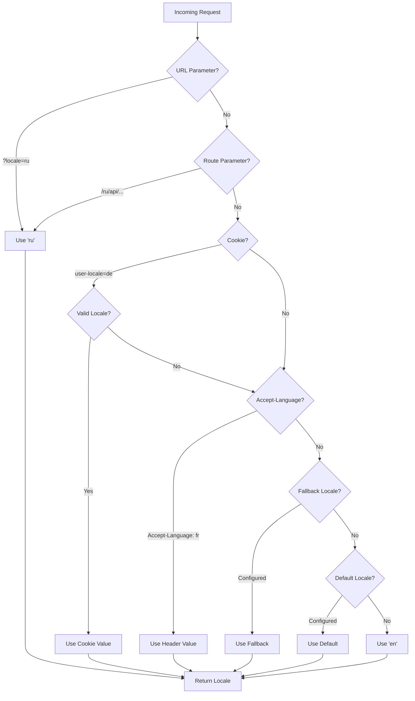

# 🌍 Nuxt I18n Micro のサーバーサイド翻訳とロケール情報

## 📖 概要

Nuxt I18n Micro はサーバーサイドの翻訳とロケール情報をサポートしており、サーバー上でコンテンツを翻訳したりロケールの詳細にアクセスしたりできます。これは、クライアントに到達する前にローカライズが必要な API やサーバーレンダリングアプリケーションで特に有用です。

翻訳は Nuxt I18n の設定で定義されたロケールメッセージを使用し、検出されたロケールに基づいて動的に解決されます。

デフォルト(`translationPayloads.mode: 'premerged'`)では、ルートレベルのファイルはビルド時に `\{page\}/\{locale\}/data.json` として各ページのペイロードに焼き込まれます。サーバーは、クライアントが `/\{apiBaseUrl\}/...` 経由で取得するのと同じ事前ビルドファイルを読み込むため、サーバーハンドラー内ですべてのキー(共有とページ固有の両方)を利用できます。

`translationPayloads.mode: 'source'` では、`loadTranslationsFromServer()`(または `/_locales` ルート)が呼ばれたときに、コンパクトなソースファイルがランタイムでマージされます — **Edge** では Nitro `serverAssets` 経由、**Node** ではオプションの public コピーから。詳細は [パフォーマンスガイド — サーバーレスペイロード出力](/guides/performance#serverless-payload-output) および [キャッシュとストレージのアーキテクチャ](/api/cache) を参照してください。

ランタイムおよびサーバー API の統合されたリストは、[API リファレンス](/api/overview) を参照してください。

## 🛠️ サーバーサイドミドルウェアのセットアップ

サーバーサイドの翻訳とロケール情報を有効化するには、提供されるミドルウェア関数を使用します:

- `useTranslationServerMiddleware` — コンテンツの翻訳用
- `useLocaleServerMiddleware` — ロケール情報へのアクセス用

両方のミドルウェア関数はすべてのサーバールートで自動的に利用可能です。

ロケール検出ロジックは、モジュール全体での一貫性を確保するために、`detectCurrentLocale` ユーティリティ関数を通じて両方のミドルウェア関数で共有されています。

## ✨ サーバーハンドラーでの翻訳の使用

翻訳ミドルウェアを使用することで、任意の `eventHandler` 内でシームレスにコンテンツを翻訳できます。

### 例: 基本的な翻訳の使用

```typescript
import { defineEventHandler } from 'h3'

export default defineEventHandler(async (event) => {
  const t = await useTranslationServerMiddleware(event)
  return {
    message: t('greeting'), // Returns the translated value for the key "greeting"
  }
})
```

この例では:

- ユーザーのロケールがクエリパラメーター、クッキー、またはヘッダーから自動的に検出されます。
- `t` 関数は、検出されたロケールに対応する翻訳を取得します。

## 🌍 サーバーハンドラーでのロケール情報の使用

### 基本的なロケール情報の使用

```typescript
import { defineEventHandler } from 'h3'

export default defineEventHandler((event) => {
  const localeInfo = useLocaleServerMiddleware(event)

  return {
    success: true,
    data: localeInfo,
    timestamp: new Date().toISOString(),
  }
})
```

### カスタムロケールパラメーターの指定

```typescript
import { defineEventHandler } from 'h3'

export default defineEventHandler((event) => {
  // Force specific locale with custom default
  const localeInfo = useLocaleServerMiddleware(event, 'en', 'ru')

  return {
    success: true,
    data: localeInfo,
    timestamp: new Date().toISOString(),
  }
})
```

### レスポンス構造

ロケールミドルウェアは、次のプロパティを持つ `LocaleInfo` オブジェクトを返します:

```typescript
interface LocaleInfo {
  current: string // Current detected locale code
  default: string // Default locale code
  fallback: string // Fallback locale code
  available: string[] // Array of all available locale codes
  locale: Locale | null // Full locale configuration object
  isDefault: boolean // Whether current locale is the default
  isFallback: boolean // Whether current locale is the fallback
}
```

### レスポンスの例

```json
{
  "success": true,
  "data": {
    "current": "ru",
    "default": "en",
    "fallback": "en",
    "available": ["en", "ru", "de"],
    "locale": {
      "code": "ru",
      "iso": "ru-RU",
      "dir": "ltr",
      "displayName": "Русский"
    },
    "isDefault": false,
    "isFallback": false
  },
  "timestamp": "2024-01-15T10:30:00.000Z"
}
```

## 🌐 カスタムロケールを提供する

ロケールを手動で指定する必要がある場合(例: テストや特定のリクエスト用)、翻訳ミドルウェアに渡せます:

### 例: カスタムロケール

```typescript
import { defineEventHandler } from 'h3'

function detectLocale(event): string | null {
  const urlSearchParams = new URLSearchParams(event.node.req.url?.split('?')[1])
  const localeFromQuery = urlSearchParams.get('locale')
  if (localeFromQuery) return localeFromQuery

  return 'en'
}

export default defineEventHandler(async (event) => {
  const t = await useTranslationServerMiddleware(event, 'en', detectLocale(event)) // Force French local, en - default locale
  return {
    message: t('welcome'), // Returns the French translation for "welcome"
  }
})
```

## 📋 ロケール検出ロジック

両方のミドルウェア関数は、以下の優先順位でユーザーのロケールを自動的に判断します:



1. **URL パラメーター**: `?locale=ru`
2. **ルートパラメーター**: `/ru/api/endpoint`
3. **クッキー**: `user-locale` クッキー
4. **HTTP ヘッダー**: `Accept-Language` ヘッダー
5. **フォールバックロケール**: モジュールオプションで設定
6. **デフォルトロケール**: モジュールオプションで設定
7. **ハードコードされたフォールバック**: `'en'`

> **注意**: モジュール全体での一貫性を確保するため、ロケール検出ロジックは `useLocaleServerMiddleware` と `useTranslationServerMiddleware` の間で共有されています。

## 📋 応用的な使用例

### ロケールに基づく条件付きレスポンス

```typescript
import { defineEventHandler } from 'h3'

export default defineEventHandler((event) => {
  const { current, isDefault, locale } = useLocaleServerMiddleware(event)

  // Return different content based on locale
  if (current === 'ru') {
    return {
      message: 'Привет, мир!',
      locale: current,
      isDefault,
    }
  }

  if (current === 'de') {
    return {
      message: 'Hallo, Welt!',
      locale: current,
      isDefault,
    }
  }

  // Default English response
  return {
    message: 'Hello, World!',
    locale: current,
    isDefault,
  }
})
```

### カスタムロケール検出

```typescript
import { defineEventHandler } from 'h3'

export default defineEventHandler((event) => {
  // Force German locale with English as fallback
  const { current, isDefault, locale } = useLocaleServerMiddleware(event, 'en', 'de')

  return {
    message: 'Hallo, Welt!',
    locale: current,
    isDefault: false, // Will be false since we forced German
  }
})
```

### 検証付きのロケール対応 API

```typescript
import { defineEventHandler, createError } from 'h3'

export default defineEventHandler((event) => {
  const { current, available, locale } = useLocaleServerMiddleware(event)

  // Validate if the detected locale is supported
  if (!available.includes(current)) {
    throw createError({
      statusCode: 400,
      statusMessage: `Unsupported locale: ${current}. Available locales: ${available.join(', ')}`,
    })
  }

  // Return locale-specific configuration
  return {
    locale: current,
    direction: locale?.dir || 'ltr',
    displayName: locale?.displayName || current,
    availableLocales: available,
  }
})
```

### 翻訳ミドルウェアとの統合

包括的な国際化のために、ロケール情報を翻訳ミドルウェアと組み合わせられます:

```typescript
import { defineEventHandler } from 'h3'

export default defineEventHandler(async (event) => {
  const localeInfo = useLocaleServerMiddleware(event)
  const t = await useTranslationServerMiddleware(event)

  return {
    locale: localeInfo.current,
    message: t('welcome_message'),
    availableLocales: localeInfo.available,
    isDefault: localeInfo.isDefault,
  }
})
```

## 📝 ベストプラクティス

1. **必ずロケールを検証する**: 検出されたロケールが利用可能なロケールリストに含まれているか確認しましょう
2. **フォールバックロジックを使う**: ロケール検出が失敗した場合の適切なデフォルトを提供しましょう
3. **ロケール情報をキャッシュする**: パフォーマンス重視のアプリでは、ロケール検出結果のキャッシュを検討しましょう
4. **エッジケースに対応する**: サポートされていないロケールを考慮し、適切なエラーレスポンスを提供しましょう
5. **翻訳と組み合わせる**: 完全な i18n サポートのため、ロケール情報を翻訳ミドルウェアと併用しましょう

## 🚀 パフォーマンス上の考慮事項

- 両方のミドルウェア関数は軽量で、高速実行のために設計されています
- ロケール検出は効率的なフォールバックチェーンを使用します
- ロケール検出中に外部 API 呼び出しは行われません
- 結果は最適なパフォーマンスのため同期的に計算されます
