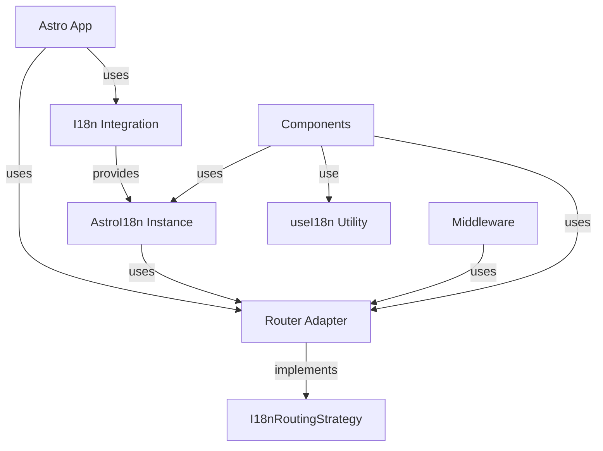

# Astro パッケージ(`@i18n-micro/astro`)

`@i18n-micro/astro` パッケージは、Astro アプリケーション向けの軽量かつ高性能な国際化ソリューションを提供します。Nuxt I18n Micro と同じコアロジックを共有し、SSR サポート、自動ロケール検出、Astro コンポーネント、完全な TypeScript サポートを備えています。

## 概要

`@i18n-micro/astro` は、サーバーサイドレンダリング対応の国際化を必要とする Astro アプリケーション向けに設計されています。以下を提供します:

- **軽量** - `@i18n-micro/core` の共有コアロジックを使用
- **SSR サポート** - 完全なサーバーサイドレンダリング互換性
- **自動ロケール検出** - URL パス、Cookie、ヘッダーからロケールを検出
- **複数形化** - 組み込みの複数形サポート
- **フォーマット** - 数値、日付、相対時刻のフォーマット
- **型安全** - 完全な TypeScript サポート
- **ルーター非依存** - 任意のルーティングストラテジー、またはルーティングなしで動作
- **DevTools 統合** - Vite プラグイン経由のオプションの開発ツール
- **SEO 最適化** - メタタグと hreflang を自動生成

## インストール

お好みのパッケージマネージャーでパッケージをインストールします:

<CodeGroup>
```bash npm
npm install @i18n-micro/astro
```

```bash yarn
yarn add @i18n-micro/astro
```

```bash pnpm
pnpm add @i18n-micro/astro
```

```bash bun
bun add @i18n-micro/astro
```
</CodeGroup>

### ピア依存関係

The package requires Astro 5:

```json
{
  "peerDependencies": {
    "astro": "^5.0.0"
  }
}
```

## クイックスタート

### 基本セットアップ(ルーターアダプターなし)

ルーティング機能が不要なアプリケーション向け:

```javascript
import { defineConfig } from 'astro/config'
import { i18nIntegration } from '@i18n-micro/astro'

export default defineConfig({
  integrations: [
    i18nIntegration({
      locale: 'en',
      fallbackLocale: 'en',
      locales: [
        { code: 'en', displayName: 'English', iso: 'en-US' },
        { code: 'fr', displayName: 'Français', iso: 'fr-FR' },
      ],
      translationDir: 'src/locales',
    }),
  ],
})
```

### ルーターアダプターありのセットアップ

ルーティングを使うアプリケーション向け:

```javascript
import { defineConfig } from 'astro/config'
import { i18nIntegration, createAstroRouterAdapter } from '@i18n-micro/astro'

const localesConfig = [
  { code: 'en', displayName: 'English', iso: 'en-US' },
  { code: 'fr', displayName: 'Français', iso: 'fr-FR' },
  { code: 'de', displayName: 'Deutsch', iso: 'de-DE' },
]

const defaultLocale = 'en'

export default defineConfig({
  integrations: [
    i18nIntegration({
      locale: defaultLocale,
      fallbackLocale: defaultLocale,
      locales: localesConfig,
      translationDir: 'src/locales',
      routingStrategy: createAstroRouterAdapter(localesConfig, defaultLocale),
    }),
  ],
})
```

**注:** `createAstroRouterAdapter` はパッケージからエクスポートされるため、独自のルーターアダプターファイルを作成する必要はありません。ただし、必要に応じてカスタムアダプターを作成することもできます。

### Setup Middleware

Create `src/middleware.ts`:

#### オプション 1: 手動設定(どこでも動作)

```typescript
import { createI18nMiddleware, createI18n, createAstroRouterAdapter } from '@i18n-micro/astro'

const localesConfig = [
  { code: 'en', displayName: 'English', iso: 'en-US' },
  { code: 'fr', displayName: 'Français', iso: 'fr-FR' },
]

const defaultLocale = 'en'

// Create global i18n instance with inline messages
const globalI18n = createI18n({
  locale: defaultLocale,
  fallbackLocale: defaultLocale,
  messages: {
    en: {
      welcome: 'Welcome',
      greeting: 'Hello, {name}!',
    },
    fr: {
      welcome: 'Bienvenue',
      greeting: 'Bonjour, {name}!',
    },
  },
})

// Create router adapter
const routingStrategy = createAstroRouterAdapter(localesConfig, defaultLocale)

export const onRequest = createI18nMiddleware({
  i18n: globalI18n,
  defaultLocale,
  locales: ['en', 'fr'],
  localeObjects: localesConfig,
  routingStrategy,
})
```

#### オプション 2: 統合コンフィグの使用(Node.js ランタイム限定)

統合を `translationDir` とともに使用している場合、仮想モジュールから設定をインポートできます:

```typescript
import { createI18nMiddleware, createI18n, createAstroRouterAdapter, loadTranslationsIntoI18n } from '@i18n-micro/astro'
import { config } from 'virtual:i18n-micro/config'

// Use config from integration to avoid duplication
const globalI18n = createI18n({
  locale: config.defaultLocale,
  fallbackLocale: config.fallbackLocale,
  messages: {}, // Translations will be loaded explicitly below
})

// ⚠️ IMPORTANT: loadTranslationsIntoI18n uses node:fs and only works in Node.js runtime
// For Edge runtime (Cloudflare Workers, Vercel Edge), use import.meta.glob instead (see below)
if (config.translationDir) {
  loadTranslationsIntoI18n(globalI18n, {
    translationDir: config.translationDir,
    rootDir: process.cwd(), // Or use: resolve(dirname(fileURLToPath(import.meta.url)), '../..')
  })
}

const routingStrategy = createAstroRouterAdapter(config.locales, config.defaultLocale)

export const onRequest = createI18nMiddleware({
  i18n: globalI18n,
  defaultLocale: config.defaultLocale,
  locales: config.localeCodes,
  localeObjects: config.locales,
  routingStrategy,
})
```

#### オプション 3: エッジランタイム対応(Cloudflare Workers、Vercel Edge など)

エッジランタイム環境では、ビルド時に翻訳を読み込むために `import.meta.glob` を使用します:

```typescript
import { createI18nMiddleware, createI18n, createAstroRouterAdapter } from '@i18n-micro/astro'
import { config } from 'virtual:i18n-micro/config'

// Load translations using import.meta.glob (Edge-compatible)
const translationModules = import.meta.glob('/src/locales/**/*.json', { eager: true })

const globalI18n = createI18n({
  locale: config.defaultLocale,
  fallbackLocale: config.fallbackLocale,
  messages: {},
})

// Process loaded translations
for (const [path, module] of Object.entries(translationModules)) {
  const translations = (module as { default: Record<string, unknown> }).default

  // Extract locale and route from path
  // Example: /src/locales/pages/home/en.json -> locale: 'en', route: 'home'
  const match = path.match(/\/([^/]+)\.json$/)
  if (match) {
    const locale = match[1]
    const isPageTranslation = path.includes('/pages/')

    if (isPageTranslation) {
      const routeMatch = path.match(/\/pages\/([^/]+)\//)
      const routeName = routeMatch ? routeMatch[1] : 'index'
      globalI18n.addRouteTranslations(locale, routeName, translations, false)
    } else {
      globalI18n.addTranslations(locale, translations, false)
    }
  }
}

const routingStrategy = createAstroRouterAdapter(config.locales, config.defaultLocale)

export const onRequest = createI18nMiddleware({
  i18n: globalI18n,
  defaultLocale: config.defaultLocale,
  locales: config.localeCodes,
  localeObjects: config.locales,
  routingStrategy,
})
```

**⚠️ Runtime Compatibility Notes:**

- **Node.js ランタイム**(デフォルト): `loadTranslationsIntoI18n` はそのまま動作します
- **エッジランタイム**(Cloudflare Workers、Vercel Edge、Deno Deploy): `loadTranslationsIntoI18n` の代わりに `import.meta.glob` を使用します
- `virtual:i18n-micro/config` モジュールはすべての環境で動作します(ビルド時に生成されます)

### Usage in Astro Components

```astro
---
import { useI18n } from '@i18n-micro/astro'

const { t, locale } = useI18n(Astro)
---

<html lang={locale}>
  <body>
    <h1>{t('welcome')}</h1>
    <p>{t('greeting', { name: 'World' })}</p>
  </body>
</html>
```

### Using Components

```astro
---
import I18nT from '@i18n-micro/astro/i18n-t'
import I18nLink from '@i18n-micro/astro/i18n-link'
import I18nSwitcher from '@i18n-micro/astro/i18n-switcher'
---

<I18nT keypath="welcome" />
<I18nLink href="/about">About</I18nLink>
<I18nSwitcher />
```

## 中核概念

### ルーターアダプター抽象化

このパッケージは、i18n 機能を特定のルーティング実装から切り離すためにルーターアダプターパターンを採用しています。これにより、以下が可能になります:

- 任意のルーティングストラテジー(ファイルベースルーティング、カスタムルーティング、あるいはルーティングなし)を使える
- ルーティングロジックを i18n パッケージ内ではなくアプリケーション側で実装できる
- コアパッケージを軽量かつルーティング非依存に保てる

`I18nRoutingStrategy` インターフェースは、i18n とルーティングの間の契約を定義します:

```typescript
interface I18nRoutingStrategy {
  getCurrentPath: () => string
  resolvePath?: (to: string | { path?: string }, locale: string) => string | { path?: string }
  getRouteName?: (path: string, locales: string[]) => string
  getLocaleFromPath?: (path: string, defaultLocale: string, locales: string[]) => string
  switchLocalePath?: (path: string, newLocale: string, locales: string[], defaultLocale?: string) => string
  localizePath?: (path: string, locale: string, locales: string[], defaultLocale?: string) => string
  removeLocaleFromPath?: (path: string, locales: string[]) => string
  push?: (target: { path: string }) => void
  replace?: (target: { path: string }) => void
  getRoute?: () => { fullPath: string; query: Record<string, unknown> }
}
```

### アーキテクチャ



## セットアップと設定

### ルーターアダプターなしの基本セットアップ

ルーティング機能が不要なアプリケーション向け:

```typescript
import { defineConfig } from 'astro/config'
import { i18nIntegration } from '@i18n-micro/astro'

export default defineConfig({
  integrations: [
    i18nIntegration({
      locale: 'en',
      fallbackLocale: 'en',
      locales: [
        { code: 'en', displayName: 'English', iso: 'en-US' },
        { code: 'fr', displayName: 'Français', iso: 'fr-FR' },
      ],
      translationDir: 'src/locales',
    }),
  ],
})
```

### ルーターアダプターありのセットアップ

ルーティングを使うアプリケーション向け:

```typescript
import { defineConfig } from 'astro/config'
import { i18nIntegration, createAstroRouterAdapter } from '@i18n-micro/astro'
import { localesConfig, defaultLocale } from './app-config'

export default defineConfig({
  integrations: [
    i18nIntegration({
      locale: defaultLocale,
      fallbackLocale: defaultLocale,
      locales: localesConfig,
      translationDir: 'src/locales',
      routingStrategy: createAstroRouterAdapter(localesConfig, defaultLocale),
    }),
  ],
})
```

**注:** `createAstroRouterAdapter` は `@i18n-micro/astro` からエクスポートされるため、基本的なユースケースでは独自のアダプターファイルを作成する必要はありません。

### ミドルウェアでのルーターアダプター設定

ミドルウェアでルーティングストラテジーを設定できます:

```typescript
import { createI18nMiddleware, createI18n, createAstroRouterAdapter } from '@i18n-micro/astro'

const globalI18n = createI18n({
  locale: 'en',
  fallbackLocale: 'en',
  messages: { en: {} },
})

const routingStrategy = createAstroRouterAdapter(localesConfig, defaultLocale)

export const onRequest = createI18nMiddleware({
  i18n: globalI18n,
  defaultLocale: 'en',
  locales: ['en', 'fr'],
  localeObjects: localesConfig,
  routingStrategy, // Set here
})
```

## ルーター統合

### `I18nRoutingStrategy` インターフェース

`I18nRoutingStrategy` インターフェースは、i18n がルーティングとどのように連携するかを定義します:

```typescript
interface I18nRoutingStrategy {
  /**
   * Returns current path (without locale prefix if needed, or full path)
   * Used for determining active classes in links
   */
  getCurrentPath: () => string

  /**
   * Generate path for specific locale
   */
  resolvePath?: (to: string | { path?: string }, locale: string) => string | { path?: string }

  /**
   * Get route name from path (e.g., /en/about -> about)
   * Used in middleware to set route name
   */
  getRouteName?: (path: string, locales: string[]) => string

  /**
   * Get locale from path
   * Checks if first segment is a locale code
   */
  getLocaleFromPath?: (path: string, defaultLocale: string, locales: string[]) => string

  /**
   * Switch locale in path
   * Replaces or adds locale prefix to path
   */
  switchLocalePath?: (path: string, newLocale: string, locales: string[], defaultLocale?: string) => string

  /**
   * Localize path with locale prefix
   */
  localizePath?: (path: string, locale: string, locales: string[], defaultLocale?: string) => string

  /**
   * Remove locale from path
   */
  removeLocaleFromPath?: (path: string, locales: string[]) => string

  /**
   * (Optional) Function to navigate to another route/locale
   * Not used in SSR, but can be used in client-side islands
   */
  push?: (target: { path: string }) => void

  /**
   * (Optional) Function to replace current route
   * Not used in SSR, but can be used in client-side islands
   */
  replace?: (target: { path: string }) => void

  /**
   * (Optional) Get current route object for SEO/Meta tags
   */
  getRoute?: () => {
    fullPath: string
    query: Record<string, unknown>
  }
}
```

### 組み込みルーターアダプターの使い方

このパッケージは、標準の Astro ファイルベースルーティング用の `createAstroRouterAdapter` をエクスポートします:

```typescript
import { createAstroRouterAdapter } from '@i18n-micro/astro'

const routingStrategy = createAstroRouterAdapter(localesConfig, defaultLocale)
```

### カスタムルーターアダプターの作成

カスタムのルーティングロジックが必要な場合の、完全な例です:

```typescript
import type { I18nRoutingStrategy } from '@i18n-micro/astro'
import type { Locale } from '@i18n-micro/types'

export function createAstroRouterAdapter(locales: Locale[], defaultLocale: string, getCurrentUrl?: () => URL): I18nRoutingStrategy {
  const localeCodes = locales.map((loc) => loc.code)

  /**
   * Get route name from Astro path
   * Extracts route name from path (e.g., /en/about -> about)
   */
  const getRouteName = (path: string, locales: string[] = []): string => {
    const cleanPath = path.replace(/^\//, '').replace(/\/$/, '')

    if (!cleanPath) {
      return 'index'
    }

    const segments = cleanPath.split('/').filter(Boolean)

    // Remove locale from path if present
    const firstSegment = segments[0]
    if (firstSegment && locales.includes(firstSegment)) {
      segments.shift()
    }

    if (segments.length === 0) {
      return 'index'
    }

    return segments.join('-')
  }

  /**
   * Get locale from path
   * Checks if first segment is a locale code
   */
  const getLocaleFromPath = (path: string, defaultLocale: string = 'en', locales: string[] = []): string => {
    const segments = path.split('/').filter(Boolean)
    const firstSegment = segments[0]
    if (firstSegment && locales.includes(firstSegment)) {
      return firstSegment
    }

    return defaultLocale
  }

  /**
   * Switch locale in path
   * Replaces or adds locale prefix to path
   */
  const switchLocalePath = (path: string, newLocale: string, locales: string[] = [], defaultLocale?: string): string => {
    const segments = path.split('/').filter(Boolean)

    // Remove existing locale if present
    const firstSegment = segments[0]
    if (firstSegment && locales.includes(firstSegment)) {
      segments.shift()
    }

    // Add new locale if not default or if default should be included
    if (newLocale !== defaultLocale || defaultLocale === undefined) {
      segments.unshift(newLocale)
    }

    return `/${segments.join('/')}`
  }

  /**
   * Localize path with locale prefix
   */
  const localizePath = (path: string, locale: string, locales: string[] = [], defaultLocale?: string): string => {
    const cleanPath = path.replace(/^\//, '').replace(/\/$/, '') || ''
    const segments = cleanPath.split('/').filter(Boolean)

    // Remove existing locale if present
    const firstSegment = segments[0]
    if (firstSegment && locales.includes(firstSegment)) {
      segments.shift()
    }

    // Add locale if not default or if default should be included
    if (locale !== defaultLocale || defaultLocale === undefined) {
      segments.unshift(locale)
    }

    return `/${segments.join('/')}`
  }

  /**
   * Remove locale from path
   */
  const removeLocaleFromPath = (path: string, locales: string[] = []): string => {
    const segments = path.split('/').filter(Boolean)
    const firstSegment = segments[0]
    if (firstSegment && locales.includes(firstSegment)) {
      segments.shift()
    }
    return `/${segments.join('/')}`
  }

  /**
   * Resolve path for specific locale
   */
  const resolvePath = (to: string | { path?: string }, locale: string): string | { path?: string } => {
    const path = typeof to === 'string' ? to : to.path || '/'
    return localizePath(path, locale, localeCodes, defaultLocale)
  }

  return {
    getCurrentPath: () => {
      // Use provided URL getter (from Astro.url or context.url)
      if (getCurrentUrl) {
        return getCurrentUrl().pathname
      }
      // Fallback for client-side islands
      if (typeof window !== 'undefined') {
        return window.location.pathname
      }
      return '/'
    },
    getRouteName,
    getLocaleFromPath,
    switchLocalePath,
    localizePath,
    removeLocaleFromPath,
    resolvePath,
    getRoute: () => {
      // Use provided URL getter (from Astro.url or context.url)
      if (getCurrentUrl) {
        const url = getCurrentUrl()
        return {
          fullPath: url.pathname + url.search,
          query: Object.fromEntries(url.searchParams),
        }
      }
      // Fallback for client-side islands
      if (typeof window !== 'undefined') {
        const url = new URL(window.location.href)
        return {
          fullPath: url.pathname + url.search,
          query: Object.fromEntries(url.searchParams),
        }
      }
      return {
        fullPath: '/',
        query: {},
      }
    },
    // Optional: client-side navigation for islands
    push: (target: { path: string }) => {
      if (typeof window !== 'undefined') {
        window.location.assign(target.path)
      }
    },
    replace: (target: { path: string }) => {
      if (typeof window !== 'undefined') {
        window.location.replace(target.path)
      }
    },
  }
}
```

## カスタムルーターアダプターの作成

### Overview

ルーターアダプターは、`I18nRoutingStrategy` インターフェースの実装であり、i18n がルーティングシステムとどのように連携するかを定義します。これにより、以下が可能になります:

- 任意のルーティングストラテジー(ファイルベース、プログラム的、カスタム)をサポート
- ロケール検出とパス生成をカスタマイズ
- サードパーティのルーティングライブラリと統合
- ドメインベースまたはサブドメインベースのロケールルーティングを実装

### Interface Reference

`I18nRoutingStrategy` インターフェースは、以下のメソッドを定義します:

| Method                                                      | Required | Description                                                 |
| ----------------------------------------------------------- | -------- | ----------------------------------------------------------- |
| `getCurrentPath()`                                          | ✅       | Returns the current path (used for active link detection)   |
| `getRouteName(path, locales)`                               | ❌       | Extracts route name from path (e.g., `/en/about` → `about`) |
| `getLocaleFromPath(path, defaultLocale, locales)`           | ❌       | Detects locale from path                                    |
| `switchLocalePath(path, newLocale, locales, defaultLocale)` | ❌       | Switches locale in path                                     |
| `localizePath(path, locale, locales, defaultLocale)`        | ❌       | Adds locale prefix to path                                  |
| `removeLocaleFromPath(path, locales)`                       | ❌       | Removes locale from path                                    |
| `resolvePath(to, locale)`                                   | ❌       | Resolves path for specific locale                           |
| `getRoute()`                                                | ❌       | Returns current route object with query params              |
| `push(target)`                                              | ❌       | Client-side navigation (for islands)                        |
| `replace(target)`                                           | ❌       | Client-side navigation replacement (for islands)            |

### Step-by-Step Guide

#### ステップ 1: ルーティングストラテジーを理解する

アダプターを作成する前に、ルーティングがどのように機能するかを理解します:

- **URL のどこにロケールがあるか?**(プレフィックス、サフィックス、サブドメイン、クエリパラメータ)
- **ルートはどのように命名されているか?**(ファイルベース、プログラム的、カスタム)
- **デフォルトロケールの動作はどうか?**(プレフィックスを含める、プレフィックスを隠す)

#### ステップ 2: 必要なメソッドを実装する

最低限、`getCurrentPath()` を実装する必要があります。それ以外のメソッドはオプションですが、全機能を利用するには推奨されます。

#### Step 3: Handle Edge Cases

Consider:

- Empty paths (`/`)
- ルートロケール(デフォルトロケール - URL に含めるべきか?)
- Invalid locales
- クエリパラメータとハッシュフラグメント

### 例 1: サブドメインベースのロケールルーティング

この例は、サブドメイン(例: `en.example.com`、`fr.example.com`)を使ってロケールルーティングを実装する方法を示します:

```typescript
// src/router-adapter-subdomain.ts
import type { I18nRoutingStrategy } from '@i18n-micro/astro'
import type { Locale } from '@i18n-micro/types'

export function createSubdomainRouterAdapter(locales: Locale[], defaultLocale: string, getCurrentUrl?: () => URL): I18nRoutingStrategy {
  const localeCodes = locales.map((loc) => loc.code)
  const domain = 'example.com' // Your domain

  /**
   * Get current path without locale subdomain
   */
  const getCurrentPath = (): string => {
    if (getCurrentUrl) {
      return getCurrentUrl().pathname
    }
    if (typeof window !== 'undefined') {
      return window.location.pathname
    }
    return '/'
  }

  /**
   * Get locale from subdomain
   */
  const getLocaleFromPath = (path: string, defaultLocale: string, locales: string[]): string => {
    let hostname = ''
    if (getCurrentUrl) {
      hostname = getCurrentUrl().hostname
    } else if (typeof window !== 'undefined') {
      hostname = window.location.hostname
    }

    // Extract subdomain (e.g., 'en' from 'en.example.com')
    const subdomain = hostname.split('.')[0]
    if (subdomain && locales.includes(subdomain)) {
      return subdomain
    }

    return defaultLocale
  }

  /**
   * Get route name from path (no locale in path for subdomain routing)
   */
  const getRouteName = (path: string, locales: string[] = []): string => {
    const cleanPath = path.replace(/^\//, '').replace(/\/$/, '')
    if (!cleanPath) return 'index'
    return cleanPath.split('/').filter(Boolean).join('-')
  }

  /**
   * Switch locale by changing subdomain
   */
  const switchLocalePath = (path: string, newLocale: string, locales: string[] = [], defaultLocale?: string): string => {
    // For subdomain routing, we need to change the hostname
    // This is typically handled by your hosting/CDN configuration
    // Here we return the path as-is, subdomain switching happens at infrastructure level
    return path
  }

  /**
   * Localize path with subdomain (returns full URL)
   */
  const localizePath = (path: string, locale: string, locales: string[] = [], defaultLocale?: string): string => {
    const protocol = typeof window !== 'undefined' ? window.location.protocol : 'https:'
    const subdomain = locale !== defaultLocale ? `${locale}.` : ''
    return `${protocol}//${subdomain}${domain}${path}`
  }

  /**
   * Remove locale from path (no-op for subdomain routing)
   */
  const removeLocaleFromPath = (path: string, locales: string[] = []): string => {
    return path
  }

  /**
   * Resolve path for specific locale
   */
  const resolvePath = (to: string | { path?: string }, locale: string): string | { path?: string } => {
    const path = typeof to === 'string' ? to : to.path || '/'
    return localizePath(path, locale, localeCodes, defaultLocale)
  }

  return {
    getCurrentPath,
    getRouteName,
    getLocaleFromPath,
    switchLocalePath,
    localizePath,
    removeLocaleFromPath,
    resolvePath,
    getRoute: () => {
      const url = getCurrentUrl ? getCurrentUrl() : typeof window !== 'undefined' ? new URL(window.location.href) : new URL('http://localhost/')
      return {
        fullPath: url.pathname + url.search,
        query: Object.fromEntries(url.searchParams),
      }
    },
  }
}
```

**Usage:**

```typescript
// astro.config.mjs
import { i18nIntegration } from '@i18n-micro/astro'
import { createSubdomainRouterAdapter } from './src/router-adapter-subdomain'

export default defineConfig({
  integrations: [
    i18nIntegration({
      locale: 'en',
      locales: [
        { code: 'en', displayName: 'English', iso: 'en-US' },
        { code: 'fr', displayName: 'Français', iso: 'fr-FR' },
      ],
      routingStrategy: createSubdomainRouterAdapter(
        localesConfig,
        'en',
        () => new URL(Astro.url.href), // In components
      ),
    }),
  ],
})
```

### 例 2: クエリパラメータベースのロケールルーティング

この例では、ロケール(例: `/?locale=fr`)にクエリパラメータを使用します:

```typescript
// src/router-adapter-query.ts
import type { I18nRoutingStrategy } from '@i18n-micro/astro'
import type { Locale } from '@i18n-micro/types'

export function createQueryParamRouterAdapter(
  locales: Locale[],
  defaultLocale: string,
  getCurrentUrl?: () => URL,
  paramName: string = 'locale',
): I18nRoutingStrategy {
  const localeCodes = locales.map((loc) => loc.code)

  const getCurrentPath = (): string => {
    if (getCurrentUrl) {
      return getCurrentUrl().pathname
    }
    if (typeof window !== 'undefined') {
      return window.location.pathname
    }
    return '/'
  }

  /**
   * Get locale from query parameter
   */
  const getLocaleFromPath = (path: string, defaultLocale: string, locales: string[]): string => {
    let searchParams: URLSearchParams
    if (getCurrentUrl) {
      searchParams = getCurrentUrl().searchParams
    } else if (typeof window !== 'undefined') {
      searchParams = new URL(window.location.href).searchParams
    } else {
      return defaultLocale
    }

    const locale = searchParams.get(paramName)
    if (locale && locales.includes(locale)) {
      return locale
    }

    return defaultLocale
  }

  /**
   * Get route name from path
   */
  const getRouteName = (path: string, locales: string[] = []): string => {
    const cleanPath = path.replace(/^\//, '').replace(/\/$/, '')
    if (!cleanPath) return 'index'
    return cleanPath.split('/').filter(Boolean).join('-')
  }

  /**
   * Switch locale by adding/updating query parameter
   */
  const switchLocalePath = (path: string, newLocale: string, locales: string[] = [], defaultLocale?: string): string => {
    const url = new URL(path, 'http://localhost')
    if (newLocale === defaultLocale) {
      url.searchParams.delete(paramName)
    } else {
      url.searchParams.set(paramName, newLocale)
    }
    return url.pathname + url.search
  }

  /**
   * Localize path with query parameter
   */
  const localizePath = (path: string, locale: string, locales: string[] = [], defaultLocale?: string): string => {
    const url = new URL(path, 'http://localhost')
    if (locale !== defaultLocale) {
      url.searchParams.set(paramName, locale)
    } else {
      url.searchParams.delete(paramName)
    }
    return url.pathname + url.search
  }

  /**
   * Remove locale from path (remove query parameter)
   */
  const removeLocaleFromPath = (path: string, locales: string[] = []): string => {
    const url = new URL(path, 'http://localhost')
    url.searchParams.delete(paramName)
    return url.pathname + url.search
  }

  const resolvePath = (to: string | { path?: string }, locale: string): string | { path?: string } => {
    const path = typeof to === 'string' ? to : to.path || '/'
    return localizePath(path, locale, localeCodes, defaultLocale)
  }

  return {
    getCurrentPath,
    getRouteName,
    getLocaleFromPath,
    switchLocalePath,
    localizePath,
    removeLocaleFromPath,
    resolvePath,
    getRoute: () => {
      const url = getCurrentUrl ? getCurrentUrl() : typeof window !== 'undefined' ? new URL(window.location.href) : new URL('http://localhost/')
      return {
        fullPath: url.pathname + url.search,
        query: Object.fromEntries(url.searchParams),
      }
    },
  }
}
```

### 例 3: サフィックスベースのロケールルーティング

この例では、ロケールサフィックス(例: `/about.en`、`/about.fr`)を使用します:

```typescript
// src/router-adapter-suffix.ts
import type { I18nRoutingStrategy } from '@i18n-micro/astro'
import type { Locale } from '@i18n-micro/types'

export function createSuffixRouterAdapter(locales: Locale[], defaultLocale: string, getCurrentUrl?: () => URL): I18nRoutingStrategy {
  const localeCodes = locales.map((loc) => loc.code)

  const getCurrentPath = (): string => {
    if (getCurrentUrl) {
      return getCurrentUrl().pathname
    }
    if (typeof window !== 'undefined') {
      return window.location.pathname
    }
    return '/'
  }

  /**
   * Extract locale from path suffix (e.g., /about.en -> en)
   */
  const getLocaleFromPath = (path: string, defaultLocale: string, locales: string[]): string => {
    // Match pattern: /path/to/page.locale
    const match = path.match(/\.([^.]+)$/)
    if (match && locales.includes(match[1])) {
      return match[1]
    }
    return defaultLocale
  }

  /**
   * Get route name by removing locale suffix
   */
  const getRouteName = (path: string, locales: string[] = []): string => {
    let cleanPath = path.replace(/^\//, '').replace(/\/$/, '')

    // Remove locale suffix
    for (const locale of locales) {
      cleanPath = cleanPath.replace(new RegExp(`\\.${locale}$`), '')
    }

    if (!cleanPath) return 'index'
    return cleanPath.split('/').filter(Boolean).join('-')
  }

  /**
   * Switch locale by replacing suffix
   */
  const switchLocalePath = (path: string, newLocale: string, locales: string[] = [], defaultLocale?: string): string => {
    // Remove existing locale suffix
    let cleanPath = path
    for (const locale of locales) {
      cleanPath = cleanPath.replace(new RegExp(`\\.${locale}$`), '')
    }

    // Add new locale suffix if not default
    if (newLocale !== defaultLocale) {
      return `${cleanPath}.${newLocale}`
    }

    return cleanPath
  }

  /**
   * Localize path with suffix
   */
  const localizePath = (path: string, locale: string, locales: string[] = [], defaultLocale?: string): string => {
    // Remove existing locale suffix
    let cleanPath = path
    for (const localeCode of locales) {
      cleanPath = cleanPath.replace(new RegExp(`\\.${localeCode}$`), '')
    }

    // Add new locale suffix if not default
    if (locale !== defaultLocale) {
      return `${cleanPath}.${locale}`
    }

    return cleanPath
  }

  /**
   * Remove locale suffix from path
   */
  const removeLocaleFromPath = (path: string, locales: string[] = []): string => {
    let cleanPath = path
    for (const locale of locales) {
      cleanPath = cleanPath.replace(new RegExp(`\\.${locale}$`), '')
    }
    return cleanPath
  }

  const resolvePath = (to: string | { path?: string }, locale: string): string | { path?: string } => {
    const path = typeof to === 'string' ? to : to.path || '/'
    return localizePath(path, locale, localeCodes, defaultLocale)
  }

  return {
    getCurrentPath,
    getRouteName,
    getLocaleFromPath,
    switchLocalePath,
    localizePath,
    removeLocaleFromPath,
    resolvePath,
    getRoute: () => {
      const url = getCurrentUrl ? getCurrentUrl() : typeof window !== 'undefined' ? new URL(window.location.href) : new URL('http://localhost/')
      return {
        fullPath: url.pathname + url.search,
        query: Object.fromEntries(url.searchParams),
      }
    },
  }
}
```

### 例 4: サードパーティルーターとの統合

この例は、カスタムのルーティングライブラリと統合する方法を示します:

```typescript
// src/router-adapter-custom.ts
import type { I18nRoutingStrategy } from '@i18n-micro/astro'
import type { Locale } from '@i18n-micro/types'

// Example: Custom router interface
interface CustomRouter {
  getCurrentRoute(): { path: string; name: string }
  navigate(path: string): void
  replace(path: string): void
  getLocale(): string
  setLocale(locale: string): void
}

export function createCustomRouterAdapter(customRouter: CustomRouter, locales: Locale[], defaultLocale: string): I18nRoutingStrategy {
  const localeCodes = locales.map((loc) => loc.code)

  return {
    getCurrentPath: () => {
      return customRouter.getCurrentRoute().path
    },
    getRouteName: (path: string, locales: string[] = []) => {
      // Use custom router's route name
      return customRouter.getCurrentRoute().name
    },
    getLocaleFromPath: (path: string, defaultLocale: string, locales: string[]) => {
      // Use custom router's locale detection
      return customRouter.getLocale() || defaultLocale
    },
    switchLocalePath: (path: string, newLocale: string, locales: string[], defaultLocale?: string) => {
      // Delegate to custom router
      customRouter.setLocale(newLocale)
      return customRouter.getCurrentRoute().path
    },
    localizePath: (path: string, locale: string, locales: string[], defaultLocale?: string) => {
      // Use custom router's localization
      customRouter.setLocale(locale)
      return customRouter.getCurrentRoute().path
    },
    resolvePath: (to: string | { path?: string }, locale: string) => {
      const path = typeof to === 'string' ? to : to.path || '/'
      customRouter.setLocale(locale)
      return path
    },
    push: (target: { path: string }) => {
      customRouter.navigate(target.path)
    },
    replace: (target: { path: string }) => {
      customRouter.replace(target.path)
    },
    getRoute: () => {
      const route = customRouter.getCurrentRoute()
      return {
        fullPath: route.path,
        query: {}, // Extract from custom router if available
      }
    },
  }
}
```

### Best Practices

1. **常にデフォルトロケールを扱う**: デフォルトロケールを URL に表示するか隠すかを決定します。

2. **クエリパラメータとハッシュを保持する**: ロケールを切り替える際に、クエリパラメータとハッシュフラグメントを保持します:

```typescript
const switchLocalePath = (path: string, newLocale: string, locales: string[], defaultLocale?: string): string => {
  const url = new URL(path, 'http://localhost')
  // ... locale switching logic ...
  return url.pathname + url.search + url.hash
}
```

3. **エッジケースを処理する**: 空のパス、ルートパス、無効なロケールを考慮します:

```typescript
const getRouteName = (path: string, locales: string[] = []): string => {
  const cleanPath = path.replace(/^\//, '').replace(/\/$/, '')
  if (!cleanPath) return 'index' // Handle root path
  // ... rest of logic
}
```

4. **すべてのロケールでテストする**: 設定されたすべてのロケール、以下のようなエッジケースを含めてアダプターが正しく動作することを確認します:
   - Very short locale codes (`en`, `fr`)
   - Long locale codes (`zh-Hans`, `pt-BR`)
   - ルートセグメントと衝突する可能性のあるロケールコード

5. **SSR とクライアントサイドの両方をサポートする**: SSR には `getCurrentUrl` パラメータを使い、クライアントサイドには `window.location` をフォールバックとして使用します:

```typescript
const getCurrentPath = (): string => {
  if (getCurrentUrl) {
    return getCurrentUrl().pathname // SSR
  }
  if (typeof window !== 'undefined') {
    return window.location.pathname // Client-side
  }
  return '/'
}
```

### Testing Your Adapter

アダプターが正しく動作することを確認するためのテストファイルを作成します:

```typescript
// src/router-adapter.test.ts
import { describe, it, expect } from 'vitest'
import { createCustomRouterAdapter } from './router-adapter-custom'

describe('Custom Router Adapter', () => {
  const locales = [
    { code: 'en', displayName: 'English', iso: 'en-US' },
    { code: 'fr', displayName: 'Français', iso: 'fr-FR' },
  ]
  const defaultLocale = 'en'

  it('should extract route name correctly', () => {
    const adapter = createCustomRouterAdapter(locales, defaultLocale)
    expect(adapter.getRouteName?.('/en/about', ['en', 'fr'])).toBe('about')
    expect(adapter.getRouteName?.('/', ['en', 'fr'])).toBe('index')
  })

  it('should detect locale from path', () => {
    const adapter = createCustomRouterAdapter(locales, defaultLocale)
    expect(adapter.getLocaleFromPath?.('/fr/about', 'en', ['en', 'fr'])).toBe('fr')
    expect(adapter.getLocaleFromPath?.('/about', 'en', ['en', 'fr'])).toBe('en')
  })

  it('should switch locale correctly', () => {
    const adapter = createCustomRouterAdapter(locales, defaultLocale)
    expect(adapter.switchLocalePath?.('/en/about', 'fr', ['en', 'fr'], 'en')).toBe('/fr/about')
  })
})
```

### Common Patterns

#### パターン 1: 最小限のアダプター(必須メソッドのみ)

基本機能のみが必要な場合:

```typescript
export function createMinimalAdapter(): I18nRoutingStrategy {
  return {
    getCurrentPath: () => {
      return typeof window !== 'undefined' ? window.location.pathname : '/'
    },
  }
}
```

#### パターン 2: 組み込みアダプターの拡張

組み込みアダプターを拡張して、特定のメソッドをオーバーライドできます:

```typescript
import { createAstroRouterAdapter } from '@i18n-micro/astro'

export function createExtendedAdapter(locales: Locale[], defaultLocale: string) {
  const baseAdapter = createAstroRouterAdapter(locales, defaultLocale)

  return {
    ...baseAdapter,
    // Override specific method
    getRouteName: (path: string, locales: string[] = []): string => {
      // Custom logic
      const baseName = baseAdapter.getRouteName?.(path, locales) || 'index'
      return `custom-${baseName}`
    },
  }
}
```

### Troubleshooting

**問題**: ロケールが正しく検出されない

- **解決策**: `getLocaleFromPath` が URL 構造内のロケールセグメントを正しく識別していることを確認します

**問題**: ルート名が正しくない

- **解決策**: `getRouteName` がロケールプレフィックス/サフィックスを適切に削除し、パスを正規化していることを確認します

**問題**: リンクでロケールが切り替わらない

- **解決策**: `switchLocalePath` と `localizePath` が、ルーティングストラテジーに合わせて URL を正しく変更していることを確認します

**問題**: クライアントサイドのナビゲーションが動作しない

- **解決策**: 必要に応じて、クライアントサイドのアイランド用に `push` と `replace` メソッドを実装します

## Integration API

### `i18nIntegration(options: I18nIntegrationOptions)`

i18n-micro 用の Astro 統合を作成して設定します。

**パラメータ:**

| Property             | Type                                                       | Required | Default          | Description                                                                        |
| -------------------- | ---------------------------------------------------------- | -------- | ---------------- | ---------------------------------------------------------------------------------- |
| `locale`             | `string`                                                   | ✅       | -                | Default locale code (e.g., `'en'`)                                                 |
| `fallbackLocale`     | `string`                                                   | ❌       | Same as `locale` | Fallback locale when translation is missing                                        |
| `locales`            | `Locale[]`                                                 | ❌       | `[]`             | Array of locale objects                                                            |
| `messages`           | `Record<string, Translations>`                             | ❌       | `\{\}`             | Initial translation messages                                                       |
| `plural`             | `PluralFunc`                                               | ❌       | `defaultPlural`  | Custom pluralization function                                                      |
| `missingWarn`        | `boolean`                                                  | ❌       | `false`          | Show console warnings for missing translations                                     |
| `missingHandler`     | `(locale: string, key: string, routeName: string) => void` | ❌       | -                | Custom handler for missing translations                                            |
| `localeCookie`       | `string \| null`                                           | ❌       | `'i18n-locale'`  | Cookie name for storing locale. Set to `null` to disable cookie                    |
| `autoDetect`         | `boolean`                                                  | ❌       | `true`           | Enable automatic locale detection                                                  |
| `redirectToDefault`  | `boolean`                                                  | ❌       | `false`          | Redirect to default locale if not found                                            |
| `translationDir`     | `string`                                                   | ❌       | `'src/locales'`  | Directory path for translation files                                               |
| `disablePageLocales` | `boolean`                                                  | ❌       | `false`          | If `true`, ignores `pages/` folder and treats all files as root-level translations |
| `routingStrategy`    | `I18nRoutingStrategy`                                      | ❌       | -                | Router adapter for routing features                                                |

**Returns:** `AstroIntegration`

**例:**

```typescript
import { defineConfig } from 'astro/config'
import { i18nIntegration } from '@i18n-micro/astro'
import { createAstroRouterAdapter } from '@i18n-micro/astro'

const localesConfig = [
  { code: 'en', displayName: 'English', iso: 'en-US' },
  { code: 'fr', displayName: 'Français', iso: 'fr-FR' },
  { code: 'de', displayName: 'Deutsch', iso: 'de-DE' },
]

export default defineConfig({
  integrations: [
    i18nIntegration({
      locale: 'en',
      fallbackLocale: 'en',
      locales: localesConfig,
      translationDir: 'src/locales',
      routingStrategy: createAstroRouterAdapter(localesConfig, 'en'),
      missingWarn: true,
      missingHandler: (locale, key, routeName) => {
        console.warn(`Missing translation: ${key} in ${locale} for route ${routeName}`)
      },
    }),
  ],
})
```

### ディレクトリからの翻訳の読み込み

`translationDir` を指定すると、統合は設定を含む仮想モジュール `virtual:i18n-micro/config` を作成します。ただし、ミドルウェアで以下のいずれかを使って **明示的に翻訳を読み込む必要があります**:

1. **Node.js ランタイム**: `loadTranslationsIntoI18n()` 関数(`node:fs` を使用)
2. **エッジランタイム**: `import.meta.glob()`(ビルド時読み込み)

⚠️ **重要**: `loadTranslationsIntoI18n` 関数は Node.js のファイルシステム API を使用するため、エッジランタイム環境(Cloudflare Workers、Vercel Edge、Deno Deploy)では **動作しません**。これらの環境では、代わりに `import.meta.glob` を使用してください。

**Directory Structure:**

```
src/locales/
  en.json
  fr.json
  de.json
  pages/
    home/
      en.json
      fr.json
    about/
      en.json
      fr.json
```

**How it works:**

1. 統合は、設定を含む仮想モジュール `virtual:i18n-micro/config` を作成します(ビルド時に利用可能)
2. 設定の重複を避けるため、ミドルウェアで設定をインポートできます
3. ミドルウェアで **明示的に翻訳を読み込む必要があります**:
   - **Node.js ランタイムの場合**: `loadTranslationsIntoI18n` ユーティリティを使ってディレクトリから翻訳を読み込みます
   - **エッジランタイムの場合**: ビルド時に翻訳を読み込むために `import.meta.glob` を使用します(以下のエッジランタイム例を参照)

**⚠️ 重要: ランタイムの互換性**

`loadTranslationsIntoI18n` 関数は Node.js のファイルシステム API(`node:fs`)を使用するため、以下のようなエッジランタイム環境では **動作しません**:

- Cloudflare Workers
- Vercel Edge Functions
- Deno Deploy
- Netlify Edge Functions

これらの環境では、代わりに `import.meta.glob` を使用してください(セットアップミドルウェアセクションのエッジランタイム例を参照)。

**Example for Node.js Runtime:**

```typescript
// In middleware.ts (Node.js runtime only)
import { createI18nMiddleware, createI18n, createAstroRouterAdapter, loadTranslationsIntoI18n } from '@i18n-micro/astro'
import { config } from 'virtual:i18n-micro/config'

const globalI18n = createI18n({
  locale: config.defaultLocale,
  fallbackLocale: config.fallbackLocale,
  messages: {}, // Translations will be loaded explicitly below
})

// ⚠️ This only works in Node.js runtime!
// loadTranslationsIntoI18n uses node:fs which is not available in Edge runtime
if (config.translationDir) {
  loadTranslationsIntoI18n(globalI18n, {
    translationDir: config.translationDir,
    rootDir: process.cwd(), // Or use explicit path: resolve(dirname(fileURLToPath(import.meta.url)), '../..')
  })
}

const routingStrategy = createAstroRouterAdapter(config.locales, config.defaultLocale)

export const onRequest = createI18nMiddleware({
  i18n: globalI18n,
  defaultLocale: config.defaultLocale,
  locales: config.localeCodes,
  localeObjects: config.locales,
  routingStrategy,
})
```

**注:** デフォルトでは、`pages/` フォルダ内のファイルはルート固有の翻訳として扱われます。ユーティリティは、ディレクトリ構造に基づいて自動的にルート名にマッピングします。

## Core API: AstroI18n

### `AstroI18n` Class

すべての翻訳ロジックを扱う、i18n インスタンスのコアクラスです。

#### Constructor

```typescript
new AstroI18n(options: AstroI18nOptions)
```

**オプション:**

| Property         | Type                                                       | Required | Default          | Description                   |
| ---------------- | ---------------------------------------------------------- | -------- | ---------------- | ----------------------------- |
| `locale`         | `string`                                                   | ✅       | -                | Current locale code           |
| `fallbackLocale` | `string`                                                   | ❌       | Same as `locale` | Fallback locale               |
| `messages`       | `Record<string, Translations>`                             | ❌       | `\{\}`             | Initial translation messages  |
| `plural`         | `PluralFunc`                                               | ❌       | `defaultPlural`  | Custom pluralization function |
| `missingWarn`    | `boolean`                                                  | ❌       | `false`          | Show console warnings         |
| `missingHandler` | `(locale: string, key: string, routeName: string) => void` | ❌       | -                | Custom missing handler        |

#### プロパティ

- `locale: string` - 現在のロケール(getter/setter)
- `fallbackLocale: string` - フォールバックロケール(getter/setter)
- `currentRoute: string` - 現在のルート名(getter)
- `cache: TranslationCache` - 翻訳キャッシュ(読み取り専用)

#### メソッド

##### `t(key: string, params?: Params, defaultValue?: string | null, routeName?: string): CleanTranslation`

任意のパラメータとフォールバック値を指定してキーを翻訳します。

```typescript
const i18n = new AstroI18n({
  /* ... */
})

// Basic translation
i18n.t('welcome') // "Welcome"

// With parameters
i18n.t('greeting', { name: 'John' }) // "Hello, John!"

// With default value
i18n.t('missing', {}, 'Default text') // "Default text"

// Route-specific translation
i18n.t('title', {}, null, 'home') // Uses 'home' route translations
```

##### `ts(key: string, params?: Params, defaultValue?: string, routeName?: string): string`

`t()` と同じですが、常に文字列を返します。

##### `tc(key: string, count: number | Params, defaultValue?: string): string`

複数形対応の翻訳です。

```typescript
// With count number
i18n.tc('apples', 0) // "no apples"
i18n.tc('apples', 1) // "one apple"
i18n.tc('apples', 5) // "5 apples"

// With params object
i18n.tc('items', { count: 3, type: 'books' })
```

##### `tn(value: number, options?: Intl.NumberFormatOptions): string`

現在のロケールに従って数値をフォーマットします。

```typescript
i18n.tn(1234.56) // "1,234.56" (en) or "1 234,56" (fr)
i18n.tn(1234.56, { style: 'currency', currency: 'USD' }) // "$1,234.56"
```

##### `td(value: Date | number | string, options?: Intl.DateTimeFormatOptions): string`

現在のロケールに従って日付をフォーマットします。

```typescript
i18n.td(new Date()) // "12/31/2023" (en) or "31/12/2023" (fr)
i18n.td(new Date(), { dateStyle: 'full' }) // "Sunday, December 31, 2023"
```

##### `tdr(value: Date | number | string, options?: Intl.RelativeTimeFormatOptions): string`

相対時刻(例:「2 時間前」)をフォーマットします。

```typescript
const yesterday = new Date()
yesterday.setDate(yesterday.getDate() - 1)
i18n.tdr(yesterday) // "yesterday"
i18n.tdr(Date.now() - 3600000) // "1 hour ago"
```

##### `has(key: string, routeName?: string): boolean`

翻訳キーが存在するかどうかをチェックします。

```typescript
i18n.has('welcome') // true
i18n.has('missing') // false
```

##### `addTranslations(locale: string, translations: Translations, merge?: boolean): void`

ロケールに対して翻訳を追加またはマージします。

```typescript
// Add new translations
i18n.addTranslations('en', {
  newKey: 'New translation',
})

// Replace existing (merge = false)
i18n.addTranslations(
  'en',
  {
    welcome: 'New Welcome',
  },
  false,
)
```

##### `addRouteTranslations(locale: string, routeName: string, translations: Translations, merge?: boolean): void`

ルート固有の翻訳を追加します。

```typescript
i18n.addRouteTranslations('en', 'home', {
  title: 'Home Page',
  description: 'Welcome to our home page',
})
```

##### `mergeTranslations(locale: string, routeName: string, translations: Translations): void`

既存のルート翻訳に翻訳をマージします。

##### `clearCache(): void`

初期メッセージを保持したまま翻訳キャッシュをクリアします。

##### `setRoute(routeName: string): void`

ルート固有の翻訳のために現在のルート名を設定します。

##### `getRoute(): string`

現在のルート名を取得します。

##### `clone(newLocale?: string): AstroI18n`

同じキャッシュを共有しつつ、新しいロケールでインスタンスの軽量コピーを作成します。ミドルウェアでのリクエスト単位のインスタンスに有用です。

```typescript
const requestI18n = globalI18n.clone('fr')
```

## ミドルウェア

### `createI18nMiddleware(options: I18nMiddlewareOptions)`

自動ロケール検出と i18n インスタンスのセットアップのための Astro ミドルウェアを作成します。

**オプション:**

| Property            | Type                  | Required | Description                                                |
| ------------------- | --------------------- | -------- | ---------------------------------------------------------- |
| `i18n`              | `AstroI18n`           | ✅       | Global i18n instance (shared cache)                        |
| `defaultLocale`     | `string`              | ✅       | Default locale code                                        |
| `locales`           | `string[]`            | ✅       | Array of available locale codes                            |
| `localeObjects`     | `Locale[]`            | ❌       | Array of locale objects with metadata                      |
| `autoDetect`        | `boolean`             | ❌       | Enable automatic locale detection (default: `true`)        |
| `redirectToDefault` | `boolean`             | ❌       | Redirect to default locale if not found (default: `false`) |
| `routingStrategy`   | `I18nRoutingStrategy` | ❌       | Router adapter for routing features                        |

**Returns:** `MiddlewareHandler`

**例:**

```typescript
import { createI18nMiddleware, createI18n } from '@i18n-micro/astro'
import { createAstroRouterAdapter } from './router-adapter'

const globalI18n = createI18n({
  locale: 'en',
  fallbackLocale: 'en',
  messages: {
    en: { welcome: 'Welcome' },
    fr: { welcome: 'Bienvenue' },
  },
})

const localesConfig = [
  { code: 'en', displayName: 'English', iso: 'en-US' },
  { code: 'fr', displayName: 'Français', iso: 'fr-FR' },
]

const routingStrategy = createAstroRouterAdapter(localesConfig, 'en')

export const onRequest = createI18nMiddleware({
  i18n: globalI18n,
  defaultLocale: 'en',
  locales: ['en', 'fr'],
  localeObjects: localesConfig,
  routingStrategy,
  autoDetect: true,
  redirectToDefault: false,
})
```

### ロケール検出

ミドルウェアは、以下からロケールを自動的に検出します:

1. **URL パス** - 最初のパスセグメントがロケールコードかを確認します(例: `/fr/about`)
2. **Cookie** - `i18n-locale` Cookie(またはカスタム Cookie 名)を確認します
3. **Accept-Language ヘッダー** - ブラウザの言語設定を解析します
4. **デフォルトロケール** - 設定されたデフォルトロケールにフォールバックします

`routingStrategy` が提供されている場合、パスベースの検出には `getLocaleFromPath` を使用します。そうでない場合は、基本的なパスセグメントチェックにフォールバックします。

### `detectLocale(pathname, cookies, headers, defaultLocale, locales, localeCookie?, routingStrategy?): string`

カスタムのロケール検出ロジック用のユーティリティ関数。Cookie ベースの検出を無効にするには、`localeCookie` を `null` に設定します。

```typescript
import { detectLocale } from '@i18n-micro/astro'

const locale = detectLocale(
  '/fr/about',
  cookies,
  headers,
  'en',
  ['en', 'fr', 'de'],
  'i18n-locale', // or null to disable cookie
  routingStrategy, // Optional
)
```

## Utils: `useI18n`

### `useI18n(astro: AstroGlobal)`

Astro のコンポーネントやページでの翻訳とルーティング用のヘルパー関数を提供します。利用可能な場合、ユーティリティは `Astro.locals.routingStrategy` のルーティングストラテジーを自動的に使用し、提供されていない場合はフォールバック実装を使用します。

**戻り値:**

```typescript
{
  // Current locale info
  locale: string
  defaultLocale: string
  locales: Locale[]

  // Translation methods
  t(key: string, params?: Params, defaultValue?: string | null, routeName?: string): CleanTranslation
  ts(key: string, params?: Params, defaultValue?: string, routeName?: string): string
  tc(key: string, count: number | Params, defaultValue?: string): string
  tn(value: number, options?: Intl.NumberFormatOptions): string
  td(value: Date | number | string, options?: Intl.DateTimeFormatOptions): string
  tdr(value: Date | number | string, options?: Intl.RelativeTimeFormatOptions): string
  has(key: string, routeName?: string): boolean

  // Route management
  getRoute(): string
  getRouteName(path?: string): string
  getLocaleFromPath(path?: string): string

  // Path utilities (use routingStrategy if available, fallback otherwise)
  switchLocalePath(newLocale: string): string
  localizePath(path: string, targetLocale?: string): string
  removeLocaleFromPath(path: string): string
  getBasePath(url?: URL): string

  // Translation management
  addTranslations(locale: string, translations: Record<string, unknown>, merge?: boolean): void
  addRouteTranslations(locale: string, routeName: string, translations: Record<string, unknown>, merge?: boolean): void
  mergeTranslations(locale: string, routeName: string, translations: Record<string, unknown>): void
  clearCache(): void

  // Get i18n instance
  getI18n(): AstroI18n
}
```

**例:**

```astro
---
import { useI18n } from '@i18n-micro/astro'

const { t, locale, switchLocalePath, getRouteName } = useI18n(Astro)
---

<html lang={locale}>
  <body>
    <h1>{t('welcome')}</h1>
    <p>{t('greeting', { name: 'World' })}</p>
    <p>Current route: {getRouteName()}</p>
    <a href={switchLocalePath('fr')}>Switch to French</a>
  </body>
</html>
```

### Helper Functions

#### `getI18n(astro: AstroGlobal): AstroI18n`

Astro コンテキストから i18n インスタンスを取得します。

```typescript
import { getI18n } from '@i18n-micro/astro'

const i18n = getI18n(Astro)
```

#### `getLocale(astro: AstroGlobal): string`

Astro コンテキストから現在のロケールを取得します。

```typescript
import { getLocale } from '@i18n-micro/astro'

const locale = getLocale(Astro)
```

#### `getDefaultLocale(astro: AstroGlobal): string`

Astro コンテキストからデフォルトロケールを取得します。

#### `getLocales(astro: AstroGlobal): Locale[]`

Astro コンテキストから利用可能なすべてのロケールを取得します。

## コンポーネント

### `<I18nT>`

複数形化、フォーマット、HTML レンダリングをサポートする翻訳コンポーネントです。

#### Props

| Prop           | Type                       | Required | Default  | Description                      |
| -------------- | -------------------------- | -------- | -------- | -------------------------------- |
| `keypath`      | `string`                   | ✅       | -        | Translation key path             |
| `plural`       | `number \| string`         | ❌       | -        | Count for pluralization          |
| `params`       | `Params`                   | ❌       | `\{\}`     | Parameters for interpolation     |
| `defaultValue` | `string`                   | ❌       | `''`     | Default value if key not found   |
| `tag`          | `string`                   | ❌       | `'span'` | HTML tag to wrap content         |
| `html`         | `boolean`                  | ❌       | `false`  | Render as HTML                   |
| `number`       | `number \| string`         | ❌       | -        | Number to format and interpolate |
| `date`         | `Date \| string \| number` | ❌       | -        | Date to format and interpolate   |
| `relativeDate` | `Date \| string \| number` | ❌       | -        | Relative date to format          |

#### Examples

**Basic Usage:**

```astro
---
import I18nT from '@i18n-micro/astro/i18n-t'
---

<I18nT keypath="welcome" />
```

**With Parameters:**

```astro
<I18nT keypath="greeting" params={{ name: 'John' }} />
```

**Pluralization:**

```astro
<I18nT keypath="apples" plural={5} />
```

```json
{
  "apples": "no apples | one apple | {count} apples"
}
```

**Number Formatting:**

```astro
<I18nT keypath="price" number={1234.56} />
```

```json
{
  "price": "Price: {number}"
}
```

**Date Formatting:**

```astro
<I18nT keypath="date" date={new Date()} />
```

**Relative Date:**

```astro
<I18nT keypath="relative" relativeDate={yesterday} />
```

**HTML Rendering:**

```astro
<I18nT keypath="htmlContent" html />
```

**Custom Tag:**

```astro
<I18nT keypath="title" tag="h1" />
```

### `<I18nLink>`

利用可能な場合、`Astro.locals.routingStrategy` のルーティングストラテジーを使ってロケールプレフィックスを自動的に処理する、ローカライズされたリンクコンポーネントです。

#### Props

| Prop     | Type     | Required | Default        | Description                |
| -------- | -------- | -------- | -------------- | -------------------------- |
| `href`   | `string` | ✅       | -              | Link destination           |
| `locale` | `string` | ❌       | Current locale | Target locale for the link |
| `class`  | `string` | ❌       | -              | CSS class                  |

#### Examples

**Basic Usage:**

```astro
---
import I18nLink from '@i18n-micro/astro/i18n-link'
---

<I18nLink href="/about">About Us</I18nLink>
```

**With Custom Locale:**

```astro
<I18nLink href="/about" locale="fr">About Us (French)</I18nLink>
```

**With Class:**

```astro
<I18nLink href="/about" class="nav-link">About</I18nLink>
```

### `<I18nSwitcher>`

利用可能なすべてのロケールへのリンクを生成する言語切り替えコンポーネントです。パス生成には利用可能な場合、`Astro.locals.routingStrategy` のルーティングストラテジーを使用します。

#### Props

| Prop          | Type     | Required | Default    | Description                      |
| ------------- | -------- | -------- | ---------- | -------------------------------- |
| `class`       | `string` | ❌       | -          | CSS class for wrapper            |
| `activeClass` | `string` | ❌       | `'active'` | CSS class for active locale link |

#### Examples

**Basic Usage:**

```astro
---
import I18nSwitcher from '@i18n-micro/astro/i18n-switcher'
---

<I18nSwitcher />
```

**With Custom Classes:**

```astro
<I18nSwitcher class="locale-switcher" activeClass="current-locale" />
```

The component automatically:

- Filters out disabled locales
- 現在のロケールをハイライト
- ルーティングストラテジーを使って各ロケール用のローカライズされたパスを生成
- 設定からロケール表示名を使用

### `<I18nGroup>`

共通のプレフィックスで翻訳をグループ化するためのコンポーネントです。

#### Props

| プロパティ   | 型       | 必須     | デフォルト | 説明                             |
| ------------ | -------- | -------- | ------- | ----------------------------- |
| `prefix`     | `string` | ✅       | -       | Translation key prefix        |
| `groupClass` | `string` | ❌       | `''`    | CSS class for the wrapper div |

#### Examples

```astro
---
import I18nGroup from '@i18n-micro/astro/i18n-group'
---

<I18nGroup prefix="home">
  <slot />
</I18nGroup>
```

## Astro Islands Integration

Astro アイランドを使うと、Astro ページ内でインタラクティブなコンポーネント(Vue、React、Svelte)を使えます。`@i18n-micro/astro` パッケージは、アイランドでの i18n をシームレスに統合するためのフレームワーク固有のアダプターを提供します。

### Overview

各アイランドは props 経由で翻訳を受け取り、以下を保証します:

- **局所性**: 各アイランドは必要な翻訳だけを受け取ります
- **軽量**: グローバル状態なし、最小限のバンドルサイズ
- **フレームワーク固有**: 各フレームワークのネイティブ API(Vue の provide/inject、React の Context、Svelte のストア)

### Setup

まず、必要なフレームワーク統合がインストールされていることを確認します:

```bash
# For Vue
npm install @astrojs/vue vue

# For React
npm install @astrojs/react react react-dom

# For Svelte
npm install @astrojs/svelte svelte
```

`astro.config.mjs` に統合を追加します:

```javascript
import { defineConfig } from 'astro/config'
import vue from '@astrojs/vue'
import react from '@astrojs/react'
import svelte from '@astrojs/svelte'
import { i18nIntegration } from '@i18n-micro/astro'

export default defineConfig({
  integrations: [
    vue(),
    react(),
    svelte(),
    i18nIntegration({
      locale: 'en',
      fallbackLocale: 'en',
      locales: [
        { code: 'en', displayName: 'English', iso: 'en-US' },
        { code: 'fr', displayName: 'Français', iso: 'fr-FR' },
      ],
      translationDir: 'src/locales',
    }),
  ],
})
```

### アイランド用の翻訳の準備

アイランド用の翻訳を準備するには `getI18nProps()` を使用します。**重要**: バンドルサイズを最小化するために、アイランドが実際に必要とするキーだけを渡してください:

```astro
---
// src/pages/islands.astro
import { getI18nProps } from '@i18n-micro/astro'
import { useI18n } from '@i18n-micro/astro'
import VueCounter from '../components/islands/VueCounter.vue'
import ReactCard from '../components/islands/ReactCard'
import SvelteWidget from '../components/islands/SvelteWidget.svelte'

const { t } = useI18n(Astro)

// Collect only the keys needed for islands
const i18nProps = getI18nProps(Astro, [
  'islands.vue.title',
  'islands.vue.description',
  'islands.react.title',
  'islands.react.description',
  'islands.svelte.title',
  'islands.svelte.description',
  'islands.apples',
  'islands.number',
])
---

<Layout title={t('islands.title')}>
  <main>
    <h1>{t('islands.title')}</h1>
    <p>{t('islands.description')}</p>

    <section>
      <h2>{t('islands.vue.title')}</h2>
      <VueCounter client:load i18n={i18nProps} />
    </section>

    <section>
      <h2>{t('islands.react.title')}</h2>
      <ReactCard client:load i18n={i18nProps} />
    </section>

    <section>
      <h2>{t('islands.svelte.title')}</h2>
      <SvelteWidget client:load i18n={i18nProps} />
    </section>
  </main>
</Layout>
```

### Vue Islands

Vue コンポーネントでは `provideI18n` と `useAstroI18n` を使用します:

```vue
<!-- src/components/islands/VueCounter.vue -->
<script setup lang="ts">
import { ref, computed } from 'vue'
import { provideI18n } from '@i18n-micro/astro/client/vue'
import { translate } from '@i18n-micro/astro/client'
import { defaultPlural, FormatService } from '@i18n-micro/core'
import type { I18nClientProps } from '@i18n-micro/astro'
import type { Params, TranslationKey } from '@i18n-micro/types'

const props = defineProps<{
  i18n: I18nClientProps
}>()

// Initialize provider and get state directly
const state = provideI18n(props.i18n)
const formatter = new FormatService()

// Use state directly instead of inject
const t = (key: TranslationKey, params?: Params, defaultValue?: string | null, routeName?: string) => {
  return translate(state.value, key as string, params, defaultValue, routeName)
}

const tc = (key: TranslationKey, count: number | Params, defaultValue?: string) => {
  const { count: countValue, ...params } = typeof count === 'number' ? { count } : count

  if (countValue === undefined) {
    return defaultValue ?? (key as string)
  }

  const getter = (k: TranslationKey, p?: Params, dv?: string) => {
    return t(k, p, dv)
  }

  const result = defaultPlural(key, Number.parseInt(countValue.toString(), 10), params, state.value.locale, getter)

  return result ?? defaultValue ?? (key as string)
}

const tn = (value: number, options?: Intl.NumberFormatOptions): string => {
  return formatter.formatNumber(value, state.value.locale, options)
}

const locale = computed(() => state.value.locale)

const count = ref(0)
const increment = () => count.value++
</script>

<template>
  <div class="island-card vue-card">
    <h3>{{ t('islands.vue.title') }}</h3>
    <p>{{ t('islands.vue.description') }}</p>
    <div class="counter">
      <button @click="increment">+</button>
      <span>{{ count }}</span>
      <p>{{ tc('islands.apples', count) }}</p>
      <p>{{ t('islands.number', { number: tn(count) }) }}</p>
    </div>
    <p class="locale-info">Locale: {{ locale }}</p>
  </div>
</template>
```

### React Islands

React コンポーネントでは `I18nProvider` と `useAstroI18n` を使用します:

```tsx
// src/components/islands/ReactCard.tsx
import React, { useState } from 'react'
import { I18nProvider, useAstroI18n } from '@i18n-micro/astro/client/react'
import type { I18nClientProps } from '@i18n-micro/astro'
import './ReactCard.css'

interface ReactCardProps {
  i18n: I18nClientProps
}

function CardContent() {
  const { t, locale, tn, tc } = useAstroI18n()
  const [count, setCount] = useState(0)

  return (
    <div className="island-card react-card">
      <h3>{t('islands.react.title')}</h3>
      <p>{t('islands.react.description')}</p>
      <div className="counter">
        <button onClick={() => setCount(count + 1)}>+</button>
        <span>{count}</span>
        <p>{tc('islands.apples', count)}</p>
        <p>{t('islands.number', { number: tn(count) })}</p>
      </div>
      <p className="locale-info">Locale: {locale}</p>
    </div>
  )
}

export default function ReactCard({ i18n }: ReactCardProps) {
  return (
    <I18nProvider value={i18n}>
      <CardContent />
    </I18nProvider>
  )
}
```

### Svelte Islands

Svelte コンポーネントでは `createI18nStore` と `useAstroI18n` を使用します:

```svelte
<!-- src/components/islands/SvelteWidget.svelte -->
<script lang="ts">
  import { createI18nStore, useAstroI18n } from '@i18n-micro/astro/client/svelte'
  import type { I18nClientProps } from '@i18n-micro/astro'

  export let i18n: I18nClientProps

  // Create store and initialize hook
  const i18nStore = createI18nStore(i18n)
  const { t, locale, tn, tc, store } = useAstroI18n(i18nStore)

  let count = 0
  const increment = () => count++
</script>

<div class="island-card svelte-card">
  <h3>{t('islands.svelte.title')}</h3>
  <p>{t('islands.svelte.description')}</p>
  <div class="counter">
    <button on:click={increment}>+</button>
    <span>{count}</span>
    <p>{tc('islands.apples', count)}</p>
    <p>{t('islands.number', { number: tn(count) })}</p>
  </div>
  <p class="locale-info">Locale: {locale}</p>
</div>
```

### API Reference

#### `getI18nProps(astro: AstroGlobal, keys?: string[]): I18nClientProps`

アイランド用の翻訳 props を準備します。**重要:** バンドルサイズを最小化するため、常に具体的なキーを渡してください。

**パラメータ:**

- `astro`: Astro global object
- `keys`: **推奨** - 含める翻訳キーの配列(例: `['islands.vue.title', 'islands.apples']`)。省略した場合、ルート固有のすべての翻訳が含まれ、バンドルサイズが大きくなる可能性があります。

**戻り値:** 以下を持つ `I18nClientProps` オブジェクト:

- `locale`: Current locale
- `fallbackLocale`: フォールバックロケール
- `currentRoute`: 現在のルート名
- `translations`: リクエストされた翻訳のみを含むオブジェクト(キーが指定されていない場合はすべてのルート翻訳)

**例:**

```typescript
// ✅ Recommended: Include only specific keys your islands need
const i18nProps = getI18nProps(Astro, ['islands.vue.title', 'islands.apples'])

// ⚠️ Use with caution: Includes all route-specific translations
// This may increase bundle size if you have many translations
const i18nProps = getI18nProps(Astro)
```

**ベストプラクティス:** バンドルサイズを最小限に保つため、アイランドが実際に使うキーを常に指定してください。

#### Vue Adapter

**`provideI18n(props: I18nClientProps): Ref<I18nState>`**

Vue アイランド用の i18n プロバイダーを初期化します。リアクティブな state ref を返します。

**`useAstroI18n(): I18nHookReturn`**

Vue コンポーネントで i18n を使うためのフックです。`provideI18n` の後に呼び出す必要があります。

#### React Adapter

**`I18nProvider: React.FC<\{ children: React.ReactNode, value: I18nClientProps \}>`**

React アイランド用のプロバイダーコンポーネントです。コンポーネントの内容をこれでラップします。

**`useAstroI18n(): I18nHookReturn`**

React コンポーネントで i18n を使うためのフックです。`I18nProvider` 内で使用する必要があります。

#### Svelte Adapter

**`createI18nStore(props: I18nClientProps): Writable<I18nState>`**

i18n の状態用の Svelte ストアを作成します。

**`useAstroI18n(store: Writable<I18nState>): I18nHookReturn`**

Svelte コンポーネントで i18n を使うためのフックです。`createI18nStore` で作成したストアを渡します。

### Translation Keys in Islands

すべてのアダプターは同じ翻訳メソッドを提供します:

- `t(key, params?, defaultValue?, routeName?)` - 基本的な翻訳
- `ts(key, params?, defaultValue?, routeName?)` - 常に文字列を返す
- `tc(key, count | params, defaultValue?)` - 複数形化
- `tn(value, options?)` - 数値のフォーマット
- `td(value, options?)` - 日付のフォーマット
- `tdr(value, options?)` - 相対時刻のフォーマット
- `has(key, routeName?)` - 翻訳が存在するかチェック
- `locale` - 現在のロケール(リアクティブ)
- `fallbackLocale` - フォールバックロケール
- `currentRoute` - 現在のルート名

### Best Practices

1. **翻訳キーを最小化**: アイランドが実際に使うキーのみを渡します
2. **`client:load` または `client:only` を使用**: アイランドにはクライアントサイドのハイドレーションが必要です
3. **アイランドを分離**: 各アイランドは自己完結型にすべきです
4. **i18nProps の再利用**: 複数のアイランドが同じ翻訳を使う場合、props オブジェクトを再利用します
5. **型安全性**: IDE サポートと型チェックの向上のために TypeScript を使用します

### 例: 完全なアイランドページ

```astro
---
// src/pages/islands.astro
import { getI18nProps } from '@i18n-micro/astro'
import { useI18n } from '@i18n-micro/astro'
import Layout from '../layouts/Layout.astro'
import VueCounter from '../components/islands/VueCounter.vue'
import ReactCard from '../components/islands/ReactCard'
import SvelteWidget from '../components/islands/SvelteWidget.svelte'

const { t } = useI18n(Astro)

// Collect only the keys needed for islands
const i18nProps = getI18nProps(Astro, [
  'islands.vue.title',
  'islands.vue.description',
  'islands.react.title',
  'islands.react.description',
  'islands.svelte.title',
  'islands.svelte.description',
  'islands.apples',
  'islands.number',
])
---

<Layout title={t('islands.title')}>
  <main>
    <h1>{t('islands.title')}</h1>
    <p>{t('islands.description')}</p>

    <section>
      <h2>{t('islands.vue.title')}</h2>
      <VueCounter client:load i18n={i18nProps} />
    </section>

    <section>
      <h2>{t('islands.react.title')}</h2>
      <ReactCard client:load i18n={i18nProps} />
    </section>

    <section>
      <h2>{t('islands.svelte.title')}</h2>
      <SvelteWidget client:load i18n={i18nProps} />
    </section>
  </main>
</Layout>
```

## SEO and Meta Tags

### `useLocaleHead(astro: AstroGlobal, options?: LocaleHeadOptions)`

ロケール固有ページの SEO メタタグを生成します。利用可能な場合、代替リンクの生成には `Astro.locals.routingStrategy` のルーティングストラテジーを使用します。

**オプション:**

| Property           | Type      | Required | Default | Description                           |
| ------------------ | --------- | -------- | ------- | ------------------------------------- |
| `baseUrl`          | `string`  | ❌       | `'/'`   | Base URL for canonical/hreflang links |
| `addDirAttribute`  | `boolean` | ❌       | `true`  | Add `dir` attribute to HTML           |
| `addSeoAttributes` | `boolean` | ❌       | `true`  | Generate SEO meta tags                |

**戻り値:**

```typescript
{
  htmlAttrs: {
    lang?: string
    dir?: 'ltr' | 'rtl' | 'auto'
  }
  link: Array<{
    rel: string
    href: string
    hreflang?: string
  }>
  meta: Array<{
    property: string
    content: string
  }>
}
```

**例:**

```astro
---
import { useLocaleHead } from '@i18n-micro/astro'

const { htmlAttrs, link, meta } = useLocaleHead(Astro, {
  baseUrl: 'https://example.com',
  addSeoAttributes: true,
})
---

<html {...htmlAttrs}>
  <head>
    {link.map((l) => (
      <link rel={l.rel} href={l.href} hreflang={l.hreflang} />
    ))}
    {meta.map((m) => (
      <meta property={m.property} content={m.content} />
    ))}
  </head>
  <body>
    <slot />
  </body>
</html>
```

**Generated Meta Tags:**

- `html[lang]` - Language attribute
- `html[dir]` - テキストの方向(有効な場合)
- `link[rel="canonical"]` - Canonical URL
- `link[rel="alternate"][hreflang]` - 代替言語リンク(利用可能な場合、ルーティングストラテジーを使用)
- `link[rel="alternate"][hreflang="x-default"]` - マッチしないユーザー言語向けのデフォルト言語フォールバック
- `meta[property="og:locale"]` - Open Graph のロケール
- `meta[property="og:url"]` - Open Graph の URL
- `meta[property="og:locale:alternate"]` - 代替 Open Graph ロケール

## DevTools 統合

このパッケージは、`@i18n-micro/devtools-ui` Vite プラグイン経由での DevTools 統合をサポートします。詳細は [DevTools UI パッケージのドキュメント](/integrations/devtools-ui) を参照してください。

## 高度な使い方

### カスタムルーターアダプター

特定のルーティングニーズに合わせて、カスタムのルーターアダプターを作成できます:

```typescript
import type { I18nRoutingStrategy } from '@i18n-micro/astro'
import type { Locale } from '@i18n-micro/types'

export function createCustomRouterAdapter(customConfig: CustomConfig, locales: Locale[], defaultLocale: string): I18nRoutingStrategy {
  const localeCodes = locales.map((loc) => loc.code)

  return {
    getCurrentPath: () => {
      // Custom path extraction logic
      return customConfig.getCurrentPath()
    },
    getRouteName: (path, locales) => {
      // Custom route name extraction
      return customConfig.extractRouteName(path)
    },
    getLocaleFromPath: (path, defaultLocale, locales) => {
      // Custom locale detection
      return customConfig.detectLocale(path) || defaultLocale
    },
    switchLocalePath: (path, newLocale, locales, defaultLocale) => {
      // Custom locale switching logic
      return customConfig.switchLocale(path, newLocale)
    },
    localizePath: (path, locale, locales, defaultLocale) => {
      // Custom path localization
      return customConfig.localize(path, locale)
    },
    removeLocaleFromPath: (path, locales) => {
      // Custom locale removal
      return customConfig.removeLocale(path)
    },
    resolvePath: (to, locale) => {
      const path = typeof to === 'string' ? to : to.path || '/'
      return customConfig.localize(path, locale)
    },
  }
}
```

### ルート固有の翻訳

ルートに固有の翻訳を定義できます:

```typescript
// Add route-specific translations
i18n.addRouteTranslations('en', 'home', {
  title: 'Home Page',
  description: 'Welcome to our home page',
})

i18n.addRouteTranslations('en', 'about', {
  title: 'About Us',
  description: 'Learn more about us',
})

// Set current route
i18n.setRoute('home')

// Use route-specific translation
i18n.t('title') // "Home Page"
i18n.t('title', {}, null, 'about') // "About Us"
```

### 翻訳の動的読み込み

翻訳を動的に読み込みます:

```typescript
async function loadLocaleTranslations(locale: string) {
  const messages = await import(`./locales/${locale}.json`)
  i18n.addTranslations(locale, messages.default, false)
}

// Load on demand
await loadLocaleTranslations('fr')

// Preload in background
Promise.all([loadLocaleTranslations('de'), loadLocaleTranslations('es')]).catch(() => {
  // Handle errors
})
```

### Custom Pluralization

カスタムの複数形化ルールを定義します:

```typescript
import { createI18n, defaultPlural } from '@i18n-micro/astro'

const i18n = createI18n({
  locale: 'en',
  plural: (key, count, params, locale, getTranslation) => {
    // Custom logic for specific keys
    if (key === 'special') {
      return count === 0 ? 'none' : count === 1 ? 'one' : 'many'
    }

    // Use default for others
    return defaultPlural(key, count, params, locale, getTranslation)
  },
  messages: {
    en: {
      special: 'none | one | many',
    },
  },
})
```

### Missing Translation Handler

カスタムのロジックで欠落した翻訳を処理します:

```typescript
const i18n = createI18n({
  locale: 'en',
  missingHandler: (locale, key, routeName) => {
    // Send to error tracking service
    console.error(`Missing translation: ${key} in ${locale} for route ${routeName}`)

    // Or send to Sentry
    // Sentry.captureMessage(`Missing translation: ${key}`, {
    //   extra: { locale, routeName }
    // })
  },
})
```

### Translation Caching

このパッケージはインテリジェントなキャッシュシステムを使用します:

```typescript
const { clearCache } = useI18n(Astro)

// Clear cache when needed
clearCache()
```

`clone()` メソッドを使うと、同じキャッシュを共有するリクエスト単位のインスタンスを作成でき、SSR シナリオでのパフォーマンスを向上できます。

## TypeScript サポート

### Global Types (App.Locals)

この統合は、Astro の `injectTypes` フックを介して `App.Locals` の型を自動的に注入します。手動設定なしで、Astro のコンポーネントとミドルウェア内で `i18n`、`locale`、`defaultLocale`、`locales`、`currentUrl`、`routingStrategy` が利用可能になっているはずです。

**重要:** `astro.config.mjs` に統合を追加すると、型が自動的に利用可能になります。統合を使用せず(ミドルウェアのみ)の場合、手動での型参照追加が必要になることがあります(以下の「手動での型参照」を参照)。

**例:**

```typescript
// src/middleware.ts
import type { MiddlewareHandler } from 'astro'

export const onRequest: MiddlewareHandler = (context, next) => {
  // Types are automatically available
  const { i18n, locale, defaultLocale, locales, routingStrategy } = context.locals

  // Use i18n instance
  const translation = i18n.t('welcome')

  // Use routing strategy if available
  if (routingStrategy) {
    const routeName = routingStrategy.getRouteName?.(
      context.url.pathname,
      locales.map((l) => l.code),
    )
  }

  return next()
}
```

```astro
---
// src/pages/index.astro
const { i18n, locale, routingStrategy } = Astro.locals

// Types are automatically available
const translation = i18n.t('welcome')
---
<h1>{translation}</h1>
```

### 手動での型参照(フォールバック)

何らかの理由(例: カスタム TypeScript 設定や古い Astro バージョン)で型が自動的に表示されない場合、`src/env.d.ts` ファイルに手動で参照を追加できます:

```typescript
/// <reference path="../.astro/types.d.ts" />
/// <reference types="@i18n-micro/astro/env" />
```

### 型定義

すべての型はパッケージからエクスポートされます:

```typescript
import type {
  I18nIntegrationOptions,
  AstroI18nOptions,
  I18nMiddlewareOptions,
  LocaleHeadOptions,
  LocaleHeadResult,
  I18nRoutingStrategy,
  Translations,
  Params,
  PluralFunc,
  CleanTranslation,
  Locale,
  LocaleCode,
} from '@i18n-micro/astro'
```

### Type-Safe Translations

型安全な翻訳キーを作成できます:

```typescript
type TranslationKeys = 'welcome' | 'greeting' | 'apples'

function t(key: TranslationKeys, params?: Params): string {
  const { t } = useI18n(Astro)
  return t(key, params) as string
}
```

### Custom Types

Extend types for your use case:

```typescript
interface MyTranslations extends Translations {
  welcome: string
  greeting: {
    morning: string
    evening: string
  }
}

const messages: Record<string, MyTranslations> = {
  en: {
    welcome: 'Welcome',
    greeting: {
      morning: 'Good morning',
      evening: 'Good evening',
    },
  },
}
```

## Complete Examples

### Full Application Setup

**`astro.config.mjs`:**

```javascript
import { defineConfig } from 'astro/config'
import { i18nIntegration } from '@i18n-micro/astro'
import { createAstroRouterAdapter } from '@i18n-micro/astro'

const localesConfig = [
  { code: 'en', displayName: 'English', iso: 'en-US' },
  { code: 'fr', displayName: 'Français', iso: 'fr-FR' },
  { code: 'de', displayName: 'Deutsch', iso: 'de-DE' },
]

const defaultLocale = 'en'

export default defineConfig({
  integrations: [
    i18nIntegration({
      locale: defaultLocale,
      fallbackLocale: defaultLocale,
      locales: localesConfig,
      translationDir: 'src/locales',
      routingStrategy: createAstroRouterAdapter(localesConfig, defaultLocale),
      missingWarn: true,
    }),
  ],
})
```

**`src/middleware.ts`(翻訳読み込みあり):**

統合で `translationDir` を使用している場合、翻訳を明示的に読み込む必要があります:

```typescript
import { createI18nMiddleware, createI18n, createAstroRouterAdapter, loadTranslationsIntoI18n } from '@i18n-micro/astro'
import { config } from 'virtual:i18n-micro/config'

// Use config from virtual module to avoid duplication
const globalI18n = createI18n({
  locale: config.defaultLocale,
  fallbackLocale: config.fallbackLocale,
  messages: {}, // Translations will be loaded explicitly below
})

// ⚠️ IMPORTANT: loadTranslationsIntoI18n only works in Node.js runtime
// For Edge runtime, use import.meta.glob (see Setup Middleware section)
if (config.translationDir) {
  loadTranslationsIntoI18n(globalI18n, {
    translationDir: config.translationDir,
    rootDir: process.cwd(), // Or use explicit path: resolve(dirname(fileURLToPath(import.meta.url)), '../..')
  })
}

const routingStrategy = createAstroRouterAdapter(config.locales, config.defaultLocale)

export const onRequest = createI18nMiddleware({
  i18n: globalI18n,
  defaultLocale: config.defaultLocale,
  locales: config.localeCodes,
  localeObjects: config.locales,
  routingStrategy,
})
```

**代替: 手動のルーターアダプター(カスタムロジックが必要な場合):**

```typescript
import type { I18nRoutingStrategy } from '@i18n-micro/astro'
import type { Locale } from '@i18n-micro/types'

export function createAstroRouterAdapter(locales: Locale[], defaultLocale: string): I18nRoutingStrategy {
  const localeCodes = locales.map((loc) => loc.code)

  const getRouteName = (path: string, locales: string[] = []): string => {
    const cleanPath = path.replace(/^\//, '').replace(/\/$/, '')
    if (!cleanPath) return 'index'
    const segments = cleanPath.split('/').filter(Boolean)
    const firstSegment = segments[0]
    if (firstSegment && locales.includes(firstSegment)) {
      segments.shift()
    }
    return segments.length === 0 ? 'index' : segments.join('-')
  }

  const getLocaleFromPath = (path: string, defaultLocale: string = 'en', locales: string[] = []): string => {
    const segments = path.split('/').filter(Boolean)
    const firstSegment = segments[0]
    return firstSegment && locales.includes(firstSegment) ? firstSegment : defaultLocale
  }

  const switchLocalePath = (path: string, newLocale: string, locales: string[] = [], defaultLocale?: string): string => {
    const segments = path.split('/').filter(Boolean)
    const firstSegment = segments[0]
    if (firstSegment && locales.includes(firstSegment)) {
      segments.shift()
    }
    if (newLocale !== defaultLocale || defaultLocale === undefined) {
      segments.unshift(newLocale)
    }
    return `/${segments.join('/')}`
  }

  const localizePath = (path: string, locale: string, locales: string[] = [], defaultLocale?: string): string => {
    const cleanPath = path.replace(/^\//, '').replace(/\/$/, '') || ''
    const segments = cleanPath.split('/').filter(Boolean)
    const firstSegment = segments[0]
    if (firstSegment && locales.includes(firstSegment)) {
      segments.shift()
    }
    if (locale !== defaultLocale || defaultLocale === undefined) {
      segments.unshift(locale)
    }
    return `/${segments.join('/')}`
  }

  const removeLocaleFromPath = (path: string, locales: string[] = []): string => {
    const segments = path.split('/').filter(Boolean)
    const firstSegment = segments[0]
    if (firstSegment && locales.includes(firstSegment)) {
      segments.shift()
    }
    return `/${segments.join('/')}`
  }

  const resolvePath = (to: string | { path?: string }, locale: string): string | { path?: string } => {
    const path = typeof to === 'string' ? to : to.path || '/'
    return localizePath(path, locale, localeCodes, defaultLocale)
  }

  return {
    getCurrentPath: () => {
      if (typeof window !== 'undefined') {
        return window.location.pathname
      }
      return '/'
    },
    getRouteName,
    getLocaleFromPath,
    switchLocalePath,
    localizePath,
    removeLocaleFromPath,
    resolvePath,
    getRoute: () => {
      if (typeof window !== 'undefined') {
        const url = new URL(window.location.href)
        return {
          fullPath: url.pathname + url.search,
          query: Object.fromEntries(url.searchParams),
        }
      }
      return {
        fullPath: '/',
        query: {},
      }
    },
    push: (target: { path: string }) => {
      if (typeof window !== 'undefined') {
        window.location.assign(target.path)
      }
    },
    replace: (target: { path: string }) => {
      if (typeof window !== 'undefined') {
        window.location.replace(target.path)
      }
    },
  }
}
```

**`src/middleware.ts`(仮想モジュールなし、手動セットアップ):**

```typescript
import { createI18nMiddleware, createI18n } from '@i18n-micro/astro'
import { createAstroRouterAdapter } from './router-adapter'

const localesConfig = [
  { code: 'en', displayName: 'English', iso: 'en-US' },
  { code: 'fr', displayName: 'Français', iso: 'fr-FR' },
  { code: 'de', displayName: 'Deutsch', iso: 'de-DE' },
]

const defaultLocale = 'en'

// Create global i18n instance
const globalI18n = createI18n({
  locale: defaultLocale,
  fallbackLocale: defaultLocale,
  messages: {
    en: {
      welcome: 'Welcome',
      greeting: 'Hello, {name}!',
      apples: 'no apples | one apple | {count} apples',
    },
    fr: {
      welcome: 'Bienvenue',
      greeting: 'Bonjour, {name}!',
      apples: 'pas de pommes | une pomme | {count} pommes',
    },
    de: {
      welcome: 'Willkommen',
      greeting: 'Hallo, {name}!',
      apples: 'keine Äpfel | ein Apfel | {count} Äpfel',
    },
  },
})

// Create router adapter
const routingStrategy = createAstroRouterAdapter(localesConfig, defaultLocale)

export const onRequest = createI18nMiddleware({
  i18n: globalI18n,
  defaultLocale,
  locales: ['en', 'fr', 'de'],
  localeObjects: localesConfig,
  routingStrategy,
})
```

**`src/layouts/Layout.astro`:**

```astro
---
import { useLocaleHead } from '@i18n-micro/astro'
import I18nSwitcher from '@i18n-micro/astro/i18n-switcher'

const { htmlAttrs, link, meta } = useLocaleHead(Astro, {
  baseUrl: 'https://example.com',
})
---

<!DOCTYPE html>
<html {...htmlAttrs}>
  <head>
    <meta charset="UTF-8" />
    <meta name="viewport" content="width=device-width, initial-scale=1.0" />
    <title>My Astro Site</title>

    {link.map((l) => (
      <link rel={l.rel} href={l.href} hreflang={l.hreflang} />
    ))}
    {meta.map((m) => (
      <meta property={m.property} content={m.content} />
    ))}
  </head>
  <body>
    <nav>
      <I18nSwitcher />
    </nav>
    <slot />
  </body>
</html>
```

**`src/pages/index.astro`:**

```astro
---
import Layout from '../layouts/Layout.astro'
import { useI18n } from '@i18n-micro/astro'
import I18nT from '@i18n-micro/astro/i18n-t'
import I18nLink from '@i18n-micro/astro/i18n-link'

const { t, locale } = useI18n(Astro)
---

<Layout>
  <main>
    <h1><I18nT keypath="welcome" tag="h1" /></h1>

    <p>
      <I18nT keypath="greeting" params={{ name: 'World' }} />
    </p>

    <p>
      <I18nT keypath="apples" plural={5} />
    </p>

    <p>
      <I18nLink href="/about">
        <I18nT keypath="nav.about" />
      </I18nLink>
    </p>
  </main>
</Layout>
```

**`src/pages/about.astro`:**

```astro
---
import Layout from '../layouts/Layout.astro'
import { useI18n } from '@i18n-micro/astro'
import I18nT from '@i18n-micro/astro/i18n-t'
import I18nLink from '@i18n-micro/astro/i18n-link'

const { t } = useI18n(Astro)
---

<Layout>
  <main>
    <h1><I18nT keypath="about.title" tag="h1" /></h1>
    <p><I18nT keypath="about.description" /></p>
    <I18nLink href="/">Back to Home</I18nLink>
  </main>
</Layout>
```

### Translation Files Structure

**`src/locales/en.json`:**

```json
{
  "welcome": "Welcome",
  "greeting": "Hello, {name}!",
  "apples": "no apples | one apple | {count} apples",
  "nav": {
    "about": "About Us"
  },
  "about": {
    "title": "About Us",
    "description": "Learn more about our company"
  }
}
```

**`src/locales/fr.json`:**

```json
{
  "welcome": "Bienvenue",
  "greeting": "Bonjour, {name}!",
  "apples": "pas de pommes | une pomme | {count} pommes",
  "nav": {
    "about": "À propos"
  },
  "about": {
    "title": "À propos",
    "description": "En savoir plus sur notre entreprise"
  }
}
```

**`src/locales/de.json`:**

```json
{
  "welcome": "Willkommen",
  "greeting": "Hallo, {name}!",
  "apples": "keine Äpfel | ein Apfel | {count} Äpfel",
  "nav": {
    "about": "Über uns"
  },
  "about": {
    "title": "Über uns",
    "description": "Erfahren Sie mehr über unser Unternehmen"
  }
}
```

## ベストプラクティス

1. **ルーターアダプターを使用** - 適切なロケールパス処理のために、常にルーターアダプターを作成して提供します
2. **ロケール検出にミドルウェアを使用** - 自動ロケール検出のために、常にミドルウェアをセットアップします
3. **ルート別に翻訳を整理** - 保守性向上のためにルート固有の翻訳を使用します
4. **欠落した翻訳を処理** - 本番のエラー追跡のために missing ハンドラーをセットアップします
5. **SEO メタタグを使用** - 適切な SEO 最適化のために常に `useLocaleHead` を使用します
6. **翻訳を遅延読み込み** - 初期バンドルサイズを削減するために、翻訳をオンデマンドで読み込みます
7. **TypeScript を使用** - より良い IDE サポートのために型定義を活用します
8. **キャッシュ管理** - キャッシュを効率的に共有するために、リクエスト単位のインスタンスには `clone()` を使用します
9. **エラーハンドリング** - 翻訳の読み込みエラーは常に適切に処理します
10. **開発時の DevTools** - 開発中の翻訳管理を容易にするために Vite プラグインを使用します
11. **翻訳ファイル構造** - 翻訳ファイルを論理的に整理します(機能別、ルート別、またはコンポーネント別)
12. **ルーターアダプターの再利用性** - ルーターアダプターは一度作成し、統合とミドルウェアの両方で再利用します

## リソース

- **リポジトリ**: [https://github.com/s00d/nuxt-i18n-micro](https://github.com/s00d/nuxt-i18n-micro)
- **ドキュメント**: [https://s00d.github.io/nuxt-i18n-micro/](https://s00d.github.io/nuxt-i18n-micro/)

## ライセンス

MIT
