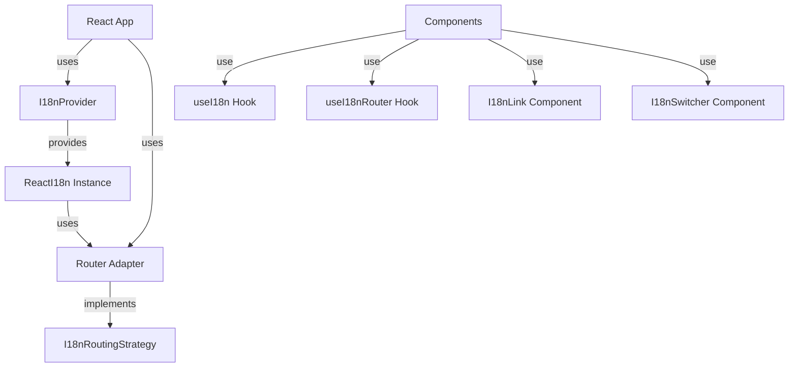

# React パッケージ(`@i18n-micro/react`)

`@i18n-micro/react` パッケージは、React アプリケーション向けの軽量かつ高性能な国際化ソリューションを提供します。Nuxt I18n Micro と同じコアロジックを共有し、リアクティブな翻訳、ルート固有のサポート、完全な TypeScript サポートを備えています。

## 概要

`@i18n-micro/react` は、Nuxt フレームワーク以外で国際化を必要とする React アプリケーション向けに設計されています。以下を提供します:

- **軽量** - `@i18n-micro/core` の共有コアロジックを使用
- **リアクティブ** - `useSyncExternalStore` により、翻訳が変わるとコンポーネントを自動更新
- **ルート固有の翻訳** - ページレベルの翻訳をサポート
- **複数形化** - 組み込みの複数形サポート
- **フォーマット** - 数値、日付、相対時刻のフォーマット
- **型安全** - 完全な TypeScript サポート
- **ルーター非依存** - 任意のルーター、またはルーターなしでも動作
- **DevTools 統合** - 開発中に翻訳を管理する Vite プラグイン

## インストール

お好みのパッケージマネージャーでパッケージをインストールします:

<CodeGroup>
```bash npm
npm install @i18n-micro/react
```

```bash yarn
yarn add @i18n-micro/react
```

```bash pnpm
pnpm add @i18n-micro/react
```

```bash bun
bun add @i18n-micro/react
```
</CodeGroup>

### ピア依存関係

このパッケージには React が必要で、React Router はオプションです:

```json
{
  "peerDependencies": {
    "react": "^16.8.0 || ^17.0.0 || ^18.0.0 || ^19.0.0",
    "react-router-dom": "^6.0.0"
  }
}
```

## クイックスタート

### 基本セットアップ(ルーターなし)

ルーティング機能が不要なアプリケーション向け:

```typescript
import React from 'react'
import ReactDOM from 'react-dom/client'
import { createI18n, I18nProvider } from '@i18n-micro/react'
import App from './App'

const i18n = createI18n({
  locale: 'en',
  fallbackLocale: 'en',
  messages: {
    en: {
      greeting: 'Hello, {name}!',
      apples: 'no apples | one apple | {count} apples',
    },
    fr: {
      greeting: 'Bonjour, {name}!',
      apples: 'pas de pommes | une pomme | {count} pommes',
    },
  },
})

const localesConfig = [
  { code: 'en', displayName: 'English', iso: 'en-US' },
  { code: 'fr', displayName: 'Français', iso: 'fr-FR' },
]

const root = ReactDOM.createRoot(document.getElementById('app')!)
root.render(
  <React.StrictMode>
    <I18nProvider
      i18n={i18n}
      locales={localesConfig}
      defaultLocale="en"
    >
      <App />
    </I18nProvider>
  </React.StrictMode>,
)
```

### ルーターアダプターありのセットアップ

ルーティングを使うアプリケーション向け:

```typescript
import React from 'react'
import ReactDOM from 'react-dom/client'
import { BrowserRouter, useLocation, useNavigate } from 'react-router-dom'
import { createI18n, I18nProvider } from '@i18n-micro/react'
import { createReactRouterAdapter } from '@i18n-micro/react'
import App from './App'
import type { Locale } from '@i18n-micro/types'

const localesConfig: Locale[] = [
  { code: 'en', displayName: 'English', iso: 'en-US' },
  { code: 'fr', displayName: 'Français', iso: 'fr-FR' },
  { code: 'de', displayName: 'Deutsch', iso: 'de-DE' },
]

const defaultLocale = 'en'

const i18n = createI18n({
  locale: defaultLocale,
  fallbackLocale: defaultLocale,
  messages: {
    en: {},
  },
})

// RouterRoot component that creates the adapter
function RouterRoot({ children }: { children?: React.ReactNode }) {
  const location = useLocation()
  const navigate = useNavigate()
  const routingStrategy = createReactRouterAdapter(localesConfig, defaultLocale, location, navigate)

  return (
    <I18nProvider
      i18n={i18n}
      locales={localesConfig}
      defaultLocale={defaultLocale}
      routingStrategy={routingStrategy}
    >
      {children}
    </I18nProvider>
  )
}

const root = ReactDOM.createRoot(document.getElementById('app')!)
root.render(
  <React.StrictMode>
    <BrowserRouter>
      <RouterRoot>
        <App />
      </RouterRoot>
    </BrowserRouter>
  </React.StrictMode>,
)
```

### コンポーネントでの使用

```tsx
import { useI18n } from '@i18n-micro/react'

function MyComponent() {
  const { t, tc, tn, locale, setLocale } = useI18n()

  return (
    <div>
      <p>{t('greeting', { name: 'World' })}</p>
      <p>{tc('apples', 5)}</p>
      <p>{tn(1234.56)}</p>
      <button onClick={() => setLocale('fr')}>Switch to French</button>
    </div>
  )
}
```

## 中核概念

### ルーターアダプター抽象化

このパッケージは、i18n 機能を特定のルーター実装から切り離すためにルーターアダプターパターンを採用しています。これにより、以下が可能になります:

- 任意のルーターライブラリ(React Router、カスタムルーター、あるいはルーターなし)を使える
- ルーティングロジックを i18n パッケージ内ではなくアプリケーション側で実装できる
- コアパッケージを軽量かつルーター非依存に保てる

`I18nRoutingStrategy` インターフェースは、i18n とルーターの間の契約を定義します:

```typescript
interface I18nRoutingStrategy {
  getCurrentPath: () => string
  linkComponent?:
    | string
    | React.ComponentType<{
        /* ... */
      }>
  push: (target: { path: string }) => void
  replace: (target: { path: string }) => void
  resolvePath?: (to: string | { path?: string }, locale: string) => string | { path?: string }
  getRoute?: () => { fullPath: string; query: Record<string, unknown> }
}
```

### アーキテクチャ



## セットアップと設定

### ルーターなしの基本セットアップ

ルーティング機能が不要なアプリケーション向け:

```typescript
import React from 'react'
import ReactDOM from 'react-dom/client'
import { createI18n, I18nProvider } from '@i18n-micro/react'
import App from './App'
import type { Locale } from '@i18n-micro/types'

const localesConfig: Locale[] = [
  { code: 'en', displayName: 'English', iso: 'en-US' },
  { code: 'fr', displayName: 'Français', iso: 'fr-FR' },
]

const i18n = createI18n({
  locale: 'en',
  fallbackLocale: 'en',
  messages: {
    en: { welcome: 'Welcome' },
    fr: { welcome: 'Bienvenue' },
  },
})

const root = ReactDOM.createRoot(document.getElementById('app')!)
root.render(
  <React.StrictMode>
    <I18nProvider
      i18n={i18n}
      locales={localesConfig}
      defaultLocale="en"
    >
      <App />
    </I18nProvider>
  </React.StrictMode>,
)
```

### ルーターアダプターありのセットアップ

ルーティングを使うアプリケーション向け:

```typescript
import React from 'react'
import ReactDOM from 'react-dom/client'
import { BrowserRouter, useLocation, useNavigate } from 'react-router-dom'
import { createI18n, I18nProvider } from '@i18n-micro/react'
import { createReactRouterAdapter } from '@i18n-micro/react'
import App from './App'
import type { Locale } from '@i18n-micro/types'

const localesConfig: Locale[] = [
  { code: 'en', displayName: 'English', iso: 'en-US' },
  { code: 'fr', displayName: 'Français', iso: 'fr-FR' },
  { code: 'de', displayName: 'Deutsch', iso: 'de-DE' },
]

const defaultLocale = 'en'

const i18n = createI18n({
  locale: defaultLocale,
  fallbackLocale: defaultLocale,
  messages: {
    en: {},
  },
})

// RouterRoot component that creates the adapter
function RouterRoot({ children }: { children?: React.ReactNode }) {
  const location = useLocation()
  const navigate = useNavigate()
  const routingStrategy = createReactRouterAdapter(localesConfig, defaultLocale, location, navigate)

  return (
    <I18nProvider
      i18n={i18n}
      locales={localesConfig}
      defaultLocale={defaultLocale}
      routingStrategy={routingStrategy}
    >
      {children}
    </I18nProvider>
  )
}

const root = ReactDOM.createRoot(document.getElementById('app')!)
root.render(
  <React.StrictMode>
    <BrowserRouter>
      <RouterRoot>
        <App />
      </RouterRoot>
    </BrowserRouter>
  </React.StrictMode>,
)
```

## コア API

### `createI18n(options: ReactI18nOptions)`

React アプリケーション用の新しい i18n インスタンスを作成します。

**パラメータ:** [共有の `createI18n` オプション](/integrations/overview#create-i18n-options) — `locale`、`fallbackLocale`、`messages`、`plural`、`missingWarn`、`missingHandler`。

**Returns:** `ReactI18n`

**例:**

```typescript
import { createI18n } from '@i18n-micro/react'

const i18n = createI18n({
  locale: 'en',
  fallbackLocale: 'en',
  messages: {
    en: {
      welcome: 'Welcome',
      greeting: 'Hello, {name}!',
    },
    fr: {
      welcome: 'Bienvenue',
      greeting: 'Bonjour, {name}!',
    },
  },
  missingWarn: true,
  missingHandler: (locale, key, routeName) => {
    console.warn(`Missing translation: ${key} in ${locale} for route ${routeName}`)
  },
})
```

### `ReactI18n` Class

すべての翻訳ロジックを扱う、i18n インスタンスのコアクラスです。

#### プロパティ

- `locale: string` - 現在のロケール(getter/setter、リアクティビティをトリガー)
- `fallbackLocale: string` - フォールバックロケール(getter/setter)
- `currentRoute: string` - 現在のルート名(getter)
- `cache: TranslationCache` - 翻訳キャッシュオブジェクト

#### メソッド

##### `t(key: string, params?: Params, defaultValue?: string | null, routeName?: string): CleanTranslation`

任意のパラメータとフォールバック値を指定してキーを翻訳します。

```typescript
const i18n = createI18n({
  /* ... */
})

// Basic translation
i18n.t('welcome') // "Welcome"

// With parameters
i18n.t('greeting', { name: 'John' }) // "Hello, John!"

// With default value
i18n.t('missing', {}, 'Default text') // "Default text"

// Route-specific translation
i18n.t('title', {}, null, 'home') // Uses 'home' route translations
```

##### `ts(key: string, params?: Params, defaultValue?: string, routeName?: string): string`

`t()` と同じですが、常に文字列を返します。

##### `tc(key: string, count: number | Params, defaultValue?: string): string`

複数形対応の翻訳です。

```typescript
// With count number
i18n.tc('apples', 0) // "no apples"
i18n.tc('apples', 1) // "one apple"
i18n.tc('apples', 5) // "5 apples"

// With params object
i18n.tc('items', { count: 3, type: 'books' })
```

##### `tn(value: number, options?: Intl.NumberFormatOptions): string`

現在のロケールに従って数値をフォーマットします。

```typescript
i18n.tn(1234.56) // "1,234.56" (en) or "1 234,56" (fr)
i18n.tn(1234.56, { style: 'currency', currency: 'USD' }) // "$1,234.56"
```

##### `td(value: Date | number | string, options?: Intl.DateTimeFormatOptions): string`

現在のロケールに従って日付をフォーマットします。

```typescript
i18n.td(new Date()) // "12/31/2023" (en) or "31/12/2023" (fr)
i18n.td(new Date(), { dateStyle: 'full' }) // "Sunday, December 31, 2023"
```

##### `tdr(value: Date | number | string, options?: Intl.RelativeTimeFormatOptions): string`

相対時刻(例:「2 時間前」)をフォーマットします。

```typescript
const yesterday = new Date()
yesterday.setDate(yesterday.getDate() - 1)
i18n.tdr(yesterday) // "yesterday"
i18n.tdr(Date.now() - 3600000) // "1 hour ago"
```

##### `has(key: string, routeName?: string): boolean`

翻訳キーが存在するかどうかをチェックします。

```typescript
i18n.has('welcome') // true
i18n.has('missing') // false
```

##### `addTranslations(locale: string, translations: Translations, merge?: boolean): void`

ロケールに対して翻訳を追加またはマージします。

```typescript
// Add new translations
i18n.addTranslations('en', {
  newKey: 'New translation',
})

// Replace existing (merge = false)
i18n.addTranslations(
  'en',
  {
    welcome: 'New Welcome',
  },
  false,
)
```

##### `addRouteTranslations(locale: string, routeName: string, translations: Translations, merge?: boolean): void`

ルート固有の翻訳を追加します。

```typescript
i18n.addRouteTranslations('en', 'home', {
  title: 'Home Page',
  description: 'Welcome to our home page',
})
```

##### `setRoute(routeName: string): void`

ルート固有の翻訳のために現在のルート名を設定します。

##### `getRoute(): string`

現在のルート名を取得します。

##### `clearCache(): void`

翻訳キャッシュをクリアします。

## Hook: `useI18n`

`useI18n` フックは、React コンポーネント内で i18n 機能にアクセスするための手段を提供します。リアクティビティのために内部で `useSyncExternalStore` を使用し、翻訳やロケールの変更時にコンポーネントが確実に再レンダリングされるようにします。フックは、利用可能な場合は `I18nProvider` のルーティングストラテジーを自動的に使用します。

### 基本的な使い方

```tsx
import { useI18n } from '@i18n-micro/react'

function MyComponent() {
  const { t, locale, fallbackLocale } = useI18n()

  return <div>{t('welcome')}</div>
}
```

### Using Router Methods

`I18nProvider` 経由でルーティングストラテジーが提供されている場合、フックはルーター関連のメソッドを公開します:

```tsx
import { useI18n } from '@i18n-micro/react'

function Navigation() {
  const { t, locale, switchLocale, localeRoute, localePath } = useI18n()

  return (
    <nav>
      <a href={localePath('/')}>{t('nav.home')}</a>
      <a href={localePath('/about')}>{t('nav.about')}</a>
      <button onClick={() => switchLocale('fr')}>Switch to French</button>
    </nav>
  )
}
```

### API Reference

#### Reactive Properties

##### `locale: string`

現在のロケール(読み取り専用の getter。変更には `setLocale` を使用します)。

```typescript
const { locale, setLocale } = useI18n()

// Read
console.log(locale) // "en"

// Write
setLocale('fr')
```

##### `fallbackLocale: string`

Fallback locale (read-only).

##### `currentRoute: string`

Current route name (read-only).

#### Translation Methods

##### `t(key: string, params?: Params, defaultValue?: string | null, routeName?: string): CleanTranslation`

```typescript
const { t } = useI18n()

// Basic
t('welcome')

// With params
t('greeting', { name: 'John' })

// With default
t('missing', {}, 'Default')

// Route-specific
t('title', {}, null, 'home')
```

##### `ts(key: string, params?: Params, defaultValue?: string, routeName?: string): string`

Always returns a string.

##### `tc(key: string, count: number | Params, defaultValue?: string): string`

Pluralization.

```typescript
const { tc } = useI18n()
tc('apples', 5) // "5 apples"
```

##### `tn(value: number, options?: Intl.NumberFormatOptions): string`

Number formatting.

##### `td(value: Date | number | string, options?: Intl.DateTimeFormatOptions): string`

Date formatting.

##### `tdr(value: Date | number | string, options?: Intl.RelativeTimeFormatOptions): string`

Relative time formatting.

##### `has(key: string, routeName?: string): boolean`

Check if translation exists.

#### Locale Management

##### `setLocale(locale: string): void`

Change the current locale.

```typescript
const { setLocale, locale } = useI18n()

function handleLocaleChange(newLocale: string) {
  setLocale(newLocale)
}
```

#### Route Management

##### `setRoute(routeName: string): void`

Set current route.

##### `getRoute(): string`

Get current route.

#### ルーターメソッド(ルーティングストラテジーが提供されている場合)

##### `switchLocale(locale: string): void`

ロケールを切り替えて、ローカライズされたパスにナビゲートします。利用可能な場合、ルーティングストラテジーを使用します。

```typescript
const { switchLocale } = useI18n()

// Switch to French and navigate to /fr/about
switchLocale('fr')
```

##### `localeRoute(to: string | \{ path?: string \}, locale?: string): string | \{ path?: string \}`

特定のロケールに対するパスを解決します。ルーティングストラテジーを使ってローカライズされたパスを返します。

```typescript
const { localeRoute } = useI18n()

// Get localized path for current locale
const path = localeRoute('/about') // "/fr/about" if current locale is 'fr'

// Get localized path for specific locale
const enPath = localeRoute('/about', 'en') // "/about"
const frPath = localeRoute('/about', 'fr') // "/fr/about"
```

##### `localePath(to: string | \{ path?: string \}, locale?: string): string`

`localeRoute` と同じですが、常に文字列を返します。

```typescript
const { localePath } = useI18n()

const path = localePath('/about', 'fr') // "/fr/about"
```

#### Translation Management

##### `addTranslations(locale: string, translations: Translations, merge?: boolean): void`

Add translations.

##### `addRouteTranslations(locale: string, routeName: string, translations: Translations, merge?: boolean): void`

ルート固有の翻訳を追加します。

##### `clearCache(): void`

Clear translation cache.

### Complete Example

```tsx
import { useI18n } from '@i18n-micro/react'

function HomePage() {
  const { t, tc, tn, td, tdr, locale, setLocale } = useI18n()

  return (
    <div>
      <h1>{t('home.title')}</h1>
      <p>{t('greeting', { name: 'World' })}</p>
      <p>{tc('apples', 5)}</p>
      <p>{t('number', { number: tn(1234.56) })}</p>
      <p>{t('date', { date: td(new Date()) })}</p>
      <p>{t('relativeDate', { relativeDate: tdr(Date.now() - 86400000) })}</p>

      <button onClick={() => setLocale('fr')}>Switch to French</button>
    </div>
  )
}
```

## コンポーネント

### `<I18nProvider>`

i18n インスタンスをすべての子コンポーネントで利用可能にするコンテキストプロバイダーコンポーネントです。ロケール設定とルーティングストラテジーも提供します。

#### Props

| Prop              | Type                  | Required | Description                                 |
| ----------------- | --------------------- | -------- | ------------------------------------------- |
| `i18n`            | `ReactI18n`           | ✅       | The i18n instance created with `createI18n` |
| `locales`         | `Locale[]`            | ❌       | Array of locale objects                     |
| `defaultLocale`   | `string`              | ❌       | Default locale code                         |
| `routingStrategy` | `I18nRoutingStrategy` | ❌       | Router adapter for routing features         |
| `children`        | `React.ReactNode`     | ✅       | Child components                            |

#### Example

**Without Router:**

```tsx
import { createI18n, I18nProvider } from '@i18n-micro/react'

const i18n = createI18n({
  locale: 'en',
  messages: {
    /* ... */
  },
})

function App() {
  return (
    <I18nProvider i18n={i18n} locales={localesConfig} defaultLocale="en">
      <YourApp />
    </I18nProvider>
  )
}
```

**With Router Adapter:**

```tsx
import { useLocation, useNavigate } from 'react-router-dom'
import { createI18n, I18nProvider, createReactRouterAdapter } from '@i18n-micro/react'

function RouterRoot({ children }: { children?: React.ReactNode }) {
  const location = useLocation()
  const navigate = useNavigate()
  const routingStrategy = createReactRouterAdapter(localesConfig, defaultLocale, location, navigate)

  return (
    <I18nProvider i18n={i18n} locales={localesConfig} defaultLocale={defaultLocale} routingStrategy={routingStrategy}>
      {children}
    </I18nProvider>
  )
}
```

### DevTools 統合(Vite プラグイン)

このパッケージは、`@i18n-micro/devtools-ui` Vite プラグイン経由での DevTools 統合をサポートします。詳細は [DevTools UI パッケージのドキュメント](/integrations/devtools-ui) を参照してください。

### `<I18nT>`

複数形化、フォーマット、HTML レンダリングをサポートする翻訳コンポーネントです。利用可能な場合、`I18nProvider` のルーティングストラテジーを自動的に使用します。

#### Props

| Prop           | Type                       | Required | Default  | Description                      |
| -------------- | -------------------------- | -------- | -------- | -------------------------------- |
| `keypath`      | `string`                   | ✅       | -        | Translation key path             |
| `params`       | `Params`                   | ❌       | `\{\}`     | Parameters for interpolation     |
| `plural`       | `number \| string`         | ❌       | -        | Count for pluralization          |
| `defaultValue` | `string`                   | ❌       | `''`     | Default value if key not found   |
| `tag`          | `string`                   | ❌       | `'span'` | HTML tag to wrap content         |
| `html`         | `boolean`                  | ❌       | `false`  | Render as HTML                   |
| `number`       | `number \| string`         | ❌       | -        | Number to format and interpolate |
| `date`         | `Date \| string \| number` | ❌       | -        | Date to format and interpolate   |
| `relativeDate` | `Date \| string \| number` | ❌       | -        | Relative date to format          |

#### Examples

```tsx
import { I18nT } from '@i18n-micro/react'

// Basic usage
<I18nT keypath="welcome" />

// With parameters
<I18nT keypath="greeting" params={{ name: 'John' }} />

// Pluralization
<I18nT keypath="apples" plural={5} />

// Number formatting
<I18nT keypath="price" number={1234.56} />

// Date formatting
<I18nT keypath="date" date={new Date()} />

// HTML rendering
<I18nT keypath="htmlContent" html />

// Custom tag
<I18nT keypath="title" tag="h1" />
```

### `<I18nLink>`

利用可能な場合、`I18nProvider` のルーティングストラテジーを使ってロケールプレフィックスを自動的に処理する、ローカライズされたリンクコンポーネントです。

#### Props

| Prop           | Type                                                                                | Required | Default | Description                                                          |
| -------------- | ----------------------------------------------------------------------------------- | -------- | ------- | -------------------------------------------------------------------- |
| `to`           | `string \| \{ path?: string \}`                                                       | ✅       | -       | Link destination                                                     |
| `activeStyle`  | `React.CSSProperties`                                                               | ❌       | -       | Styles to apply when link is active                                  |
| `localeRoute`  | `(to: string \| \{ path?: string \}, locale?: string) => string \| \{ path?: string \}` | ❌       | -       | Custom locale route function (uses routing strategy if not provided) |
| `...restProps` | `React.AnchorHTMLAttributes<HTMLAnchorElement>`                                     | ❌       | -       | All standard anchor attributes                                       |

#### Examples

```tsx
import { I18nLink } from '@i18n-micro/react'

// Basic usage
<I18nLink to="/about">About Us</I18nLink>

// With active style
<I18nLink
  to="/"
  activeStyle={{ fontWeight: 'bold', backgroundColor: '#e8f5e9' }}
>
  Home
</I18nLink>

// With custom locale route
<I18nLink
  to="/about"
  localeRoute={(to, locale) => `/${locale}${to}`}
>
  About
</I18nLink>
```

The component automatically:

- 利用可能な場合、ルーティングストラテジーの `linkComponent` を使用します(例: `react-router-dom` の `Link`)
- `linkComponent` が提供されていない場合、`onClick` ハンドラー付きのネイティブ `<a>` タグにフォールバックします
- ルーティングストラテジーの `getCurrentPath()` を使ってアクティブ状態の検出を扱います
- 外部リンクをサポートします(自動検出)

### `<I18nSwitcher>`

利用可能なすべてのロケールへのリンクを生成する言語切り替えコンポーネントです。パス生成には利用可能な場合、`I18nProvider` のルーティングストラテジーを使用します。

#### Props

| Prop            | Type                                                                                | Required | Default | Description                                                          |
| --------------- | ----------------------------------------------------------------------------------- | -------- | ------- | -------------------------------------------------------------------- |
| `locales`       | `Locale[]`                                                                          | ❌       | -       | Array of locale objects (uses injected locales if not provided)      |
| `currentLocale` | `string \| (() => string)`                                                          | ❌       | -       | Current locale (uses injected locale if not provided)                |
| `getLocaleName` | `() => string \| null`                                                              | ❌       | -       | Function to get locale display name                                  |
| `switchLocale`  | `(locale: string) => void`                                                          | ❌       | -       | Function to switch locale (uses routing strategy if not provided)    |
| `localeRoute`   | `(to: string \| \{ path?: string \}, locale?: string) => string \| \{ path?: string \}` | ❌       | -       | Custom locale route function (uses routing strategy if not provided) |
| `customLabels`  | `Record<string, string>`                                                            | ❌       | `\{\}`    | Custom labels for locales                                            |
| `...restProps`  | `React.HTMLAttributes<HTMLDivElement>`                                              | ❌       | -       | All standard div attributes                                          |

#### Examples

```tsx
import { I18nSwitcher } from '@i18n-micro/react'

// Basic usage (uses injected locales and routing strategy)
<I18nSwitcher />

// With custom props
<I18nSwitcher
  locales={localesConfig}
  currentLocale={locale}
  getLocaleName={() => getLocaleName()}
  switchLocale={switchLocale}
  localeRoute={localeRoute}
/>
```

The component automatically:

- Filters out disabled locales
- 現在のロケールをハイライト
- ルーティングストラテジーを使って各ロケール用のローカライズされたパスを生成
- 設定からロケール表示名を使用
- ロケール選択用のドロップダウンインターフェースを提供

### `<I18nGroup>`

共通のプレフィックスで翻訳をグループ化するためのコンポーネントです。

#### Props

| Prop         | Type              | Required | Default | Description                   |
| ------------ | ----------------- | -------- | ------- | ----------------------------- |
| `prefix`     | `string`          | ✅       | -       | Translation key prefix        |
| `groupClass` | `string`          | ❌       | `''`    | CSS class for the wrapper div |
| `children`   | `React.ReactNode` | ✅       | -       | Child components              |

#### Examples

```tsx
import { I18nGroup, I18nT } from '@i18n-micro/react'
;<I18nGroup prefix="home">
  <I18nT keypath="title" /> {/* Uses "home.title" */}
  <I18nT keypath="description" /> {/* Uses "home.description" */}
</I18nGroup>
```

## ルーター統合

### `I18nRoutingStrategy` インターフェース

`I18nRoutingStrategy` インターフェースは、i18n がルーターとどのように連携するかを定義します:

```typescript
interface I18nRoutingStrategy {
  /**
   * Returns current path (without locale prefix if needed, or full path)
   * Used for determining active classes in links
   */
  getCurrentPath: () => string

  /**
   * Component to use for rendering links (e.g., Link from react-router-dom)
   */
  linkComponent?:
    | string
    | React.ComponentType<{
        href: string
        children?: React.ReactNode
        style?: React.CSSProperties
        className?: string
        [key: string]: unknown
      }>

  /**
   * Function to navigate to another route/locale
   */
  push: (target: { path: string }) => void

  /**
   * Function to replace current route
   */
  replace: (target: { path: string }) => void

  /**
   * Generate path for specific locale
   */
  resolvePath?: (to: string | { path?: string }, locale: string) => string | { path?: string }

  /**
   * (Optional) Get current route object for SEO/Meta tags
   */
  getRoute?: () => {
    fullPath: string
    query: Record<string, unknown>
  }
}
```

### 組み込みルーターアダプターの使い方

このパッケージは、React Router 統合用の `createReactRouterAdapter` をエクスポートします:

```typescript
import { createReactRouterAdapter } from '@i18n-micro/react'

// In your RouterRoot component
function RouterRoot({ children }: { children?: React.ReactNode }) {
  const location = useLocation()
  const navigate = useNavigate()
  const routingStrategy = createReactRouterAdapter(localesConfig, defaultLocale, location, navigate)

  // ... rest of your code
}
```

### ルーティングストラテジーの設定

ルーティングストラテジーは、`I18nProvider` に渡すことで設定します:

```typescript
function RouterRoot({ children }: { children?: React.ReactNode }) {
  const location = useLocation()
  const navigate = useNavigate()
  const routingStrategy = createReactRouterAdapter(localesConfig, defaultLocale, location, navigate)

  return (
    <I18nProvider
      i18n={i18n}
      locales={localesConfig}
      defaultLocale={defaultLocale}
      routingStrategy={routingStrategy}
    >
      {children}
    </I18nProvider>
  )
}
```

## カスタムルーターアダプターの作成

### Overview

ルーターアダプターは、`I18nRoutingStrategy` インターフェースの実装であり、i18n がルーティングシステムとどのように連携するかを定義します。これにより、以下が可能になります:

- 任意のルーティングストラテジー(React Router、Next.js Router、TanStack Router、カスタム)をサポート
- ロケール検出とパス生成をカスタマイズ
- サードパーティのルーティングライブラリと統合
- ドメインベースまたはサブドメインベースのロケールルーティングを実装

### Interface Reference

`I18nRoutingStrategy` インターフェースは、以下のメソッドを定義します:

| Method                    | Required | Description                                                               |
| ------------------------- | -------- | ------------------------------------------------------------------------- |
| `getCurrentPath()`        | ✅       | Returns the current path (used for active link detection)                 |
| `linkComponent`           | ❌       | Component to use for rendering links (e.g., `Link` from react-router-dom) |
| `push(target)`            | ❌       | Function to navigate to another route/locale                              |
| `replace(target)`         | ❌       | Function to replace current route                                         |
| `resolvePath(to, locale)` | ❌       | Generate path for specific locale                                         |
| `getRoute()`              | ❌       | Returns current route object with query params                            |

### Step-by-Step Guide

#### ステップ 1: ルーティングストラテジーを理解する

アダプターを作成する前に、ルーティングがどのように機能するかを理解します:

- **URL のどこにロケールがあるか?**(プレフィックス、サフィックス、サブドメイン、クエリパラメータ)
- **ルートはどのように命名されているか?**(ファイルベース、プログラム的、カスタム)
- **デフォルトロケールの動作はどうか?**(プレフィックスを含める、プレフィックスを隠す)

#### ステップ 2: 必要なメソッドを実装する

最低限、`getCurrentPath()` を実装する必要があります。それ以外のメソッドはオプションですが、全機能を利用するには推奨されます。

#### Step 3: Handle Edge Cases

Consider:

- Empty paths (`/`)
- ルートロケール(デフォルトロケール - URL に含めるべきか?)
- Invalid locales
- クエリパラメータとハッシュフラグメント

### 例 1: Next.js Router アダプター

この例は、Next.js の App Router 用のアダプターを作成する方法を示します:

```typescript
// src/router-adapter-nextjs.tsx
import { usePathname, useRouter } from 'next/navigation'
import Link from 'next/link'
import type { I18nRoutingStrategy } from '@i18n-micro/react'
import type { Locale } from '@i18n-micro/types'
import type React from 'react'

export function createNextJsRouterAdapter(
  locales: Locale[],
  defaultLocale: string,
  pathname: string,
  router: ReturnType<typeof useRouter>,
): I18nRoutingStrategy {
  const localeCodes = locales.map((loc) => loc.code)

  const resolvePath = (to: string | { path?: string }, locale: string): string | { path?: string } => {
    const path = typeof to === 'string' ? to : to.path || '/'
    const pathSegments = path.split('/').filter(Boolean)

    // Remove existing locale if present
    if (pathSegments.length > 0 && localeCodes.includes(pathSegments[0])) {
      pathSegments.shift()
    }

    const cleanPath = '/' + pathSegments.join('/')

    // Next.js App Router uses locale prefix for all non-default locales
    if (locale === defaultLocale) {
      return cleanPath
    }

    return `/${locale}${cleanPath === '/' ? '' : cleanPath}`
  }

  return {
    linkComponent: ((props: {
      href: string
      children?: React.ReactNode
      className?: string
      style?: React.CSSProperties
      [key: string]: unknown
    }) => {
      const { href, children, className, style, ...restProps } = props
      return React.createElement(
        Link,
        {
          href,
          className,
          style,
          ...restProps,
        },
        children,
      )
    }) as React.ComponentType<{
      href: string
      children?: React.ReactNode
      style?: React.CSSProperties
      className?: string
      [key: string]: unknown
    }>,

    getCurrentPath: () => pathname,

    push: (target: { path: string }) => {
      router.push(target.path)
    },

    replace: (target: { path: string }) => {
      router.replace(target.path)
    },

    resolvePath: (to: string | { path?: string }, locale: string) => resolvePath(to, locale),

    getRoute: () => {
      const url = new URL(pathname, 'http://localhost')
      return {
        fullPath: pathname,
        query: Object.fromEntries(url.searchParams),
      }
    },
  }
}
```

**Usage:**

```typescript
// In your layout or root component
'use client'

import { usePathname, useRouter } from 'next/navigation'
import { createI18n, I18nProvider } from '@i18n-micro/react'
import { createNextJsRouterAdapter } from './router-adapter-nextjs'

function RouterRoot({ children }: { children: React.ReactNode }) {
  const pathname = usePathname()
  const router = useRouter()
  const routingStrategy = createNextJsRouterAdapter(localesConfig, defaultLocale, pathname, router)

  return (
    <I18nProvider
      i18n={i18n}
      locales={localesConfig}
      defaultLocale={defaultLocale}
      routingStrategy={routingStrategy}
    >
      {children}
    </I18nProvider>
  )
}
```

### 例 2: TanStack Router アダプター

この例は、TanStack Router 用のアダプターを作成する方法を示します:

```typescript
// src/router-adapter-tanstack.tsx
import { useRouter, useLocation, Link } from '@tanstack/react-router'
import type { I18nRoutingStrategy } from '@i18n-micro/react'
import type { Locale } from '@i18n-micro/types'
import type React from 'react'

export function createTanStackRouterAdapter(
  locales: Locale[],
  defaultLocale: string,
  router: ReturnType<typeof useRouter>,
  location: ReturnType<typeof useLocation>,
): I18nRoutingStrategy {
  const localeCodes = locales.map((loc) => loc.code)

  const resolvePath = (to: string | { path?: string }, locale: string): string | { path?: string } => {
    const path = typeof to === 'string' ? to : to.path || '/'
    const pathSegments = path.split('/').filter(Boolean)

    if (pathSegments.length > 0 && localeCodes.includes(pathSegments[0])) {
      pathSegments.shift()
    }

    const cleanPath = '/' + pathSegments.join('/')
    return locale === defaultLocale ? cleanPath : `/${locale}${cleanPath === '/' ? '' : cleanPath}`
  }

  return {
    linkComponent: ((props: {
      href: string
      children?: React.ReactNode
      className?: string
      style?: React.CSSProperties
      [key: string]: unknown
    }) => {
      const { href, children, className, style, ...restProps } = props
      return React.createElement(
        Link,
        {
          to: href,
          className,
          style,
          ...restProps,
        },
        children,
      )
    }) as React.ComponentType<{
      href: string
      children?: React.ReactNode
      style?: React.CSSProperties
      className?: string
      [key: string]: unknown
    }>,

    getCurrentPath: () => location.pathname,

    push: (target: { path: string }) => {
      router.navigate({ to: target.path })
    },

    replace: (target: { path: string }) => {
      router.navigate({ to: target.path, replace: true })
    },

    resolvePath: (to: string | { path?: string }, locale: string) => resolvePath(to, locale),

    getRoute: () => ({
      fullPath: location.pathname + location.search,
      query: Object.fromEntries(new URLSearchParams(location.search)),
    }),
  }
}
```

### 例 3: クエリパラメータベースのロケールルーティング

この例では、ロケール(例: `/?locale=fr`)にクエリパラメータを使用します:

```typescript
// src/router-adapter-query.tsx
import type { I18nRoutingStrategy } from '@i18n-micro/react'
import type { Locale } from '@i18n-micro/types'

export function createQueryParamRouterAdapter(
  locales: Locale[],
  defaultLocale: string,
  getCurrentPath: () => string,
  navigate: (path: string, options?: { replace?: boolean }) => void,
  paramName: string = 'locale',
): I18nRoutingStrategy {
  const localeCodes = locales.map((loc) => loc.code)

  const resolvePath = (to: string | { path?: string }, locale: string): string | { path?: string } => {
    const path = typeof to === 'string' ? to : to.path || '/'
    const url = new URL(path, 'http://localhost')

    if (locale !== defaultLocale) {
      url.searchParams.set(paramName, locale)
    } else {
      url.searchParams.delete(paramName)
    }

    return url.pathname + url.search
  }

  return {
    getCurrentPath,
    push: (target) => navigate(target.path),
    replace: (target) => navigate(target.path, { replace: true }),
    resolvePath: (to, locale) => resolvePath(to, locale),
    getRoute: () => {
      const url = new URL(getCurrentPath(), 'http://localhost')
      return {
        fullPath: url.pathname + url.search,
        query: Object.fromEntries(url.searchParams),
      }
    },
  }
}
```

### Best Practices

1. **常にデフォルトロケールを扱う**: デフォルトロケールを URL に表示するか隠すかを決定します。

2. **クエリパラメータとハッシュを保持する**: ロケールを切り替える際に、クエリパラメータとハッシュフラグメントを保持します:

```typescript
const resolvePath = (to: string | { path?: string }, locale: string): string | { path?: string } => {
  const path = typeof to === 'string' ? to : to.path || '/'
  const url = new URL(path, 'http://localhost')
  // ... locale switching logic ...
  return url.pathname + url.search + url.hash
}
```

3. **エッジケースを処理する**: 空のパス、ルートパス、無効なロケールを考慮します:

```typescript
const getCurrentPath = (): string => {
  // Handle empty path
  const path = location.pathname
  return path || '/'
}
```

4. **すべてのロケールでテストする**: 設定されたすべてのロケール、以下のようなエッジケースを含めてアダプターが正しく動作することを確認します:
   - Very short locale codes (`en`, `fr`)
   - Long locale codes (`zh-Hans`, `pt-BR`)
   - ルートセグメントと衝突する可能性のあるロケールコード

### Common Patterns

#### パターン 1: 最小限のアダプター(必須メソッドのみ)

基本機能のみが必要な場合:

```typescript
export function createMinimalAdapter(getCurrentPathFn: () => string): I18nRoutingStrategy {
  return {
    getCurrentPath: getCurrentPathFn,
  }
}
```

#### パターン 2: 組み込みアダプターの拡張

組み込みアダプターを拡張して、特定のメソッドをオーバーライドできます:

```typescript
import { createReactRouterAdapter } from '@i18n-micro/react'

export function createExtendedAdapter(locales: Locale[], defaultLocale: string, location: Location, navigate: NavigateFunction) {
  const baseAdapter = createReactRouterAdapter(locales, defaultLocale, location, navigate)

  return {
    ...baseAdapter,
    // Override specific method
    resolvePath: (to: string | { path?: string }, locale: string) => {
      const basePath = baseAdapter.resolvePath?.(to, locale)
      // Custom logic
      return typeof basePath === 'string' ? `/custom${basePath}` : basePath
    },
  }
}
```

### Troubleshooting

**問題**: ロケールが正しく検出されない

- **解決策**: `getCurrentPath` が現在のパスを正しく返し、`resolvePath` がロケールプレフィックスを適切に処理していることを確認します

**問題**: リンクでロケールが切り替わらない

- **解決策**: `push` と `replace` メソッドが、ルーターのナビゲーション API を使って URL を正しく更新していることを確認します

**問題**: アクティブ状態の検出が動作しない

- **解決策**: `getCurrentPath` が、ルーティングストラテジーに合致する正しいパス形式を返していることを確認します

## Async Translation Loading

### Loading from JSON Files

JSON ファイルから翻訳を動的に読み込みます:

```typescript
import { createI18n, I18nProvider } from '@i18n-micro/react'

const i18n = createI18n({
  locale: 'en',
  fallbackLocale: 'en',
  messages: {
    en: {}, // Start with empty, load async
  },
})

// Async load translations
async function loadTranslations(locale: string) {
  try {
    const messages = await import(`./locales/${locale}.json`)
    return messages.default
  } catch (error) {
    console.error(`Failed to load translations for locale: ${locale}`, error)
    return {}
  }
}

// Initialize app
async function initApp() {
  // Detect initial locale from URL
  const path = window.location.pathname
  const firstSegment = path.split('/')[1]
  const initialLocale = ['en', 'fr', 'de'].includes(firstSegment) ? firstSegment : 'en'

  // Load initial locale
  const translations = await loadTranslations(initialLocale)
  i18n.addTranslations(initialLocale, translations, false)
  if (initialLocale !== 'en') {
    i18n.locale = initialLocale
  }

  // Preload other locales in background
  const otherLocales = ['en', 'fr', 'de'].filter(c => c !== initialLocale)
  Promise.all(
    otherLocales.map(code =>
      loadTranslations(code).then(msgs => ({ code, msgs }))
    )
  ).then((results) => {
    results.forEach(({ code, msgs }) => {
      i18n.addTranslations(code, msgs, false)
    })
  }).catch(() => {
    // Ignore errors for preloading
  })
}

// Start loading translations
initApp()

function App() {
  return (
    <I18nProvider i18n={i18n}>
      <YourApp />
    </I18nProvider>
  )
}
```

### Loading from API

API エンドポイントから翻訳を読み込みます:

```typescript
async function loadTranslationsFromAPI(locale: string) {
  try {
    const response = await fetch(`/api/translations/${locale}`)
    const translations = await response.json()
    i18n.addTranslations(locale, translations, false)
  } catch (error) {
    console.error(`Failed to load translations: ${error}`)
  }
}

// Load on demand
function MyComponent() {
  const { locale, setLocale } = useI18n()

  useEffect(() => {
    loadTranslationsFromAPI(locale)
  }, [locale])
}
```

### Lazy Loading Strategy

必要なときだけ翻訳を読み込みます:

```typescript
const loadedLocales = new Set<string>()

async function ensureLocaleLoaded(locale: string) {
  if (loadedLocales.has(locale)) {
    return
  }

  await loadTranslations(locale)
  loadedLocales.add(locale)
}

// Use in component
function LocaleSwitcher() {
  const { locale, setLocale } = useI18n()

  async function handleLocaleSwitch(newLocale: string) {
    await ensureLocaleLoaded(newLocale)
    setLocale(newLocale)
  }

  return (
    <select value={locale} onChange={(e) => handleLocaleSwitch(e.target.value)}>
      <option value="en">English</option>
      <option value="fr">Français</option>
    </select>
  )
}
```

### Error Handling

読み込みエラーを適切に処理します:

```typescript
async function loadTranslationsWithFallback(locale: string) {
  try {
    const messages = await import(`./locales/${locale}.json`)
    i18n.addTranslations(locale, messages.default, false)
  } catch (error) {
    console.warn(`Failed to load ${locale}, using fallback`)
    // Load fallback locale
    if (locale !== 'en') {
      await loadTranslationsWithFallback('en')
    }
  }
}
```

## DevTools 統合

このパッケージは、`@i18n-micro/devtools-ui` Vite プラグイン経由での DevTools 統合をサポートします。詳細は [DevTools UI パッケージのドキュメント](/integrations/devtools-ui) を参照してください。

## Advanced Features

### Custom Pluralization

カスタムの複数形化ルールを定義します:

```typescript
import { createI18n, defaultPlural } from '@i18n-micro/react'

const i18n = createI18n({
  locale: 'en',
  plural: (key, count, params, locale, getTranslation) => {
    // Custom logic for specific keys
    if (key === 'special') {
      return count === 0 ? 'none' : count === 1 ? 'one' : 'many'
    }

    // Use default for others
    return defaultPlural(key, count, params, locale, getTranslation)
  },
  messages: {
    en: {
      special: 'none | one | many',
    },
  },
})
```

### Missing Translation Handler

カスタムのロジックで欠落した翻訳を処理します:

```typescript
const i18n = createI18n({
  locale: 'en',
  missingHandler: (locale, key, routeName) => {
    // Send to error tracking service
    console.error(`Missing translation: ${key} in ${locale} for route ${routeName}`)

    // Or send to Sentry
    // Sentry.captureMessage(`Missing translation: ${key}`, {
    //   extra: { locale, routeName }
    // })
  },
})
```

### Translation Caching

このパッケージはインテリジェントなキャッシュシステムを使用します:

```typescript
const { clearCache } = useI18n()

// Clear cache when needed
clearCache()
```

### ルート固有の翻訳とベース翻訳

`addTranslations` はベース翻訳(`index` として保存)を読み込みます。`addRouteTranslations` を呼び出すと、これらのベース翻訳が自動的にマージされます。ページ固有のキーはベースのキーを上書きします。

```typescript
// Base translations (index)
i18n.addTranslations('en', {
  title: 'Default Title',
})

// Route-specific translation (overrides root for this route)
i18n.addRouteTranslations('en', 'home', {
  title: 'Home Page Title',
})

i18n.setRoute('home')
i18n.t('title') // "Home Page Title" (route-specific)

i18n.setRoute('about')
i18n.t('title') // "Global Title" (global)
```

## TypeScript サポート

### 型定義

すべての型はパッケージからエクスポートされます:

```typescript
import type {
  ReactI18nOptions,
  ReactI18n,
  Translations,
  Params,
  PluralFunc,
  CleanTranslation,
  Locale,
  LocaleCode,
  TranslationKey,
  I18nProviderProps,
  UseI18nReturn,
  UseI18nOptions,
  I18nRoutingStrategy,
  I18nTProps,
  I18nLinkProps,
  I18nSwitcherProps,
  I18nGroupProps,
} from '@i18n-micro/react'
```

### Type-Safe Translations

型安全な翻訳キーを作成できます:

```typescript
type TranslationKeys = 'welcome' | 'greeting' | 'apples'

function t(key: TranslationKeys, params?: Params): string {
  const { t } = useI18n()
  return t(key, params) as string
}
```

### Custom Types

Extend types for your use case:

```typescript
interface MyTranslations extends Translations {
  welcome: string
  greeting: {
    morning: string
    evening: string
  }
}

const messages: Record<string, MyTranslations> = {
  en: {
    welcome: 'Welcome',
    greeting: {
      morning: 'Good morning',
      evening: 'Good evening',
    },
  },
}
```

## Complete Examples

### Full Application Setup

**`main.tsx`:**

```typescript
import React from 'react'
import ReactDOM from 'react-dom/client'
import { BrowserRouter } from 'react-router-dom'
import { createI18n, I18nProvider } from '@i18n-micro/react'
import type { Locale } from '@i18n-micro/types'
import App from './App'

const localesConfig: Locale[] = [
  { code: 'en', displayName: 'English', iso: 'en-US' },
  { code: 'fr', displayName: 'Français', iso: 'fr-FR' },
  { code: 'de', displayName: 'Deutsch', iso: 'de-DE' },
]

const defaultLocale = 'en'

// Async load translations
async function loadTranslations(locale: string) {
  try {
    const messages = await import(`./locales/${locale}.json`)
    return messages.default
  } catch (error) {
    console.error(`Failed to load translations for locale: ${locale}`, error)
    return {}
  }
}

// Create i18n instance
const i18n = createI18n({
  locale: defaultLocale,
  fallbackLocale: defaultLocale,
  messages: {
    en: {},
  },
})

// Initialize app
async function initApp() {
  // Detect initial locale from URL
  const path = window.location.pathname
  const firstSegment = path.split('/')[1]
  const initialLocale = localesConfig.some(l => l.code === firstSegment) ? firstSegment : defaultLocale

  // Load initial locale
  const translations = await loadTranslations(initialLocale)
  i18n.addTranslations(initialLocale, translations, false)
  if (initialLocale !== defaultLocale) {
    i18n.locale = initialLocale
  }

  // Preload other locales in background
  const otherLocales = localesConfig.map(l => l.code).filter(c => c !== initialLocale)
  Promise.all(
    otherLocales.map(code => loadTranslations(code).then(msgs => ({ code, msgs })))
  ).then((results) => {
    results.forEach(({ code, msgs }) => {
      i18n.addTranslations(code, msgs, false)
    })
  }).catch(() => {})

  const root = ReactDOM.createRoot(document.getElementById('app')!)
  root.render(
    <React.StrictMode>
      <BrowserRouter>
        <App />
      </BrowserRouter>
    </React.StrictMode>,
  )
}

// Start the app
initApp()
```

**`App.tsx`:**

```tsx
import React, { useEffect } from 'react'
import { Routes, Route, useParams, Outlet, useLocation, useNavigate } from 'react-router-dom'
import { createI18n, I18nProvider, useI18n, I18nLink, I18nSwitcher, createReactRouterAdapter } from '@i18n-micro/react'
import type { Locale } from '@i18n-micro/types'
import { Home } from './pages/Home'
import { About } from './pages/About'
import { Components } from './pages/Components'

const localesConfig: Locale[] = [
  { code: 'en', displayName: 'English', iso: 'en-US' },
  { code: 'fr', displayName: 'Français', iso: 'fr-FR' },
  { code: 'de', displayName: 'Deutsch', iso: 'de-DE' },
]

const defaultLocale = 'en'

// Create i18n instance (same as in main.tsx)
const i18n = createI18n({
  locale: defaultLocale,
  fallbackLocale: defaultLocale,
  messages: {
    en: {},
  },
})

// RouterRoot component that creates the adapter
function RouterRoot({ children }: { children?: React.ReactNode }) {
  const location = useLocation()
  const navigate = useNavigate()
  const routingStrategy = createReactRouterAdapter(localesConfig, defaultLocale, location, navigate)

  return (
    <I18nProvider i18n={i18n} locales={localesConfig} defaultLocale={defaultLocale} routingStrategy={routingStrategy}>
      {children}
    </I18nProvider>
  )
}

// Component to handle locale synchronization from URL
function LocaleHandler() {
  const { locale: urlLocale } = useParams<{ locale?: string }>()
  const { setLocale, locale: currentLocale } = useI18n({ locales: localesConfig, defaultLocale })

  useEffect(() => {
    const targetLocale = urlLocale || defaultLocale
    if (currentLocale !== targetLocale) {
      setLocale(targetLocale)
    }
  }, [urlLocale, currentLocale, setLocale])

  return <Outlet />
}

// Navigation component
function Navigation() {
  const { t, getLocales, locale, getLocaleName, switchLocale, localeRoute } = useI18n({ locales: localesConfig, defaultLocale })

  return (
    <nav style={{ marginBottom: '20px', display: 'flex', gap: '15px', alignItems: 'center' }}>
      <I18nLink to="/" localeRoute={localeRoute} activeStyle={{ fontWeight: 'bold', backgroundColor: '#e8f5e9' }}>
        {t('nav.home')}
      </I18nLink>
      <I18nLink to="/about" localeRoute={localeRoute} activeStyle={{ fontWeight: 'bold', backgroundColor: '#e8f5e9' }}>
        {t('nav.about')}
      </I18nLink>
      <I18nLink to="/components" localeRoute={localeRoute} activeStyle={{ fontWeight: 'bold', backgroundColor: '#e8f5e9' }}>
        {t('nav.components')}
      </I18nLink>

      <div style={{ marginLeft: 'auto' }}>
        <I18nSwitcher
          locales={getLocales()}
          currentLocale={locale}
          getLocaleName={() => getLocaleName()}
          switchLocale={switchLocale}
          localeRoute={localeRoute}
        />
      </div>
    </nav>
  )
}

function Layout() {
  return (
    <div style={{ padding: '20px', fontFamily: 'Arial, sans-serif' }}>
      <Navigation />
      <div style={{ padding: '20px', backgroundColor: '#f9f9f9', borderRadius: '8px' }}>
        <Outlet />
      </div>
    </div>
  )
}

function AppRoutes() {
  return (
    <Routes>
      <Route element={<Layout />}>
        {/* Default locale routes (en) */}
        <Route element={<LocaleHandler />}>
          <Route path="/" element={<Home />} />
          <Route path="/about" element={<About />} />
          <Route path="/components" element={<Components />} />
        </Route>

        {/* Localized routes */}
        <Route path="/:locale" element={<LocaleHandler />}>
          <Route index element={<Home />} />
          <Route path="about" element={<About />} />
          <Route path="components" element={<Components />} />
        </Route>
      </Route>
    </Routes>
  )
}

export default function App() {
  return (
    <RouterRoot>
      <AppRoutes />
    </RouterRoot>
  )
}
```

### Component Example

```tsx
// pages/Home.tsx
import { useI18n } from '@i18n-micro/react'

export function Home() {
  const { t, tc, tn, td, tdr, locale } = useI18n()

  return (
    <div>
      <h1>{t('home.title')}</h1>
      <p>{t('home.description')}</p>
      <p>{t('welcome')}</p>
      <p>{t('greeting', { name: 'World' })}</p>
      <p>{tc('apples', 0)}</p>
      <p>{tc('apples', 1)}</p>
      <p>{tc('apples', 5)}</p>
      <p>{t('number', { number: tn(1234.56) })}</p>
      <p>{t('date', { date: td(new Date()) })}</p>
      <p>{t('relativeDate', { relativeDate: tdr(Date.now() - 86400000) })}</p>
      <p>Current locale: {locale}</p>
    </div>
  )
}
```

### ルーター統合の例

アダプターパターンを使ったルーター統合の完全な例は、上記の「フルアプリケーションセットアップ」の例を参照してください。

## ベストプラクティス

1. **ルーターアダプターを使用**: 適切なロケールパス処理のために、常にルーターアダプターを作成して提供します
2. **RouterRoot 内でアダプターを作成**: ルーターフック(`useLocation`、`useNavigate`)にアクセスできるコンポーネント内でルーターアダプターを作成します
3. **翻訳を遅延読み込み**: 初期バンドルサイズを削減するために、翻訳をオンデマンドで読み込みます
4. **ルート固有の翻訳を使用**: 保守性向上のためにルート別に翻訳を整理します
5. **欠落した翻訳を処理**: 本番のエラー追跡のために missing ハンドラーをセットアップします
6. **一般的なロケールをプリロード**: よく使うロケールをバックグラウンドでプリロードします
7. **TypeScript を使用**: より良い IDE サポートのために型定義を活用します
8. **キャッシュ管理**: 必要なとき(特に更新後)にキャッシュをクリアします
9. **エラーハンドリング**: 翻訳の読み込みエラーは常に適切に処理します
10. **コンポーネントを使用**: 手動でのリンク生成よりも `I18nLink` と `I18nSwitcher` コンポーネントを優先します
11. **ルーターアダプターの再利用性**: ルーターアダプターは `RouterRoot` で一度作成し、アプリ全体で再利用します
12. **URL ベースのロケール検出**: より良い SEO とユーザー体験のために URL ベースのロケール検出を使用します

## リソース

- **リポジトリ**: [https://github.com/s00d/nuxt-i18n-micro](https://github.com/s00d/nuxt-i18n-micro)
- **ドキュメント**: [https://s00d.github.io/nuxt-i18n-micro/](https://s00d.github.io/nuxt-i18n-micro/)

## ライセンス

MIT
