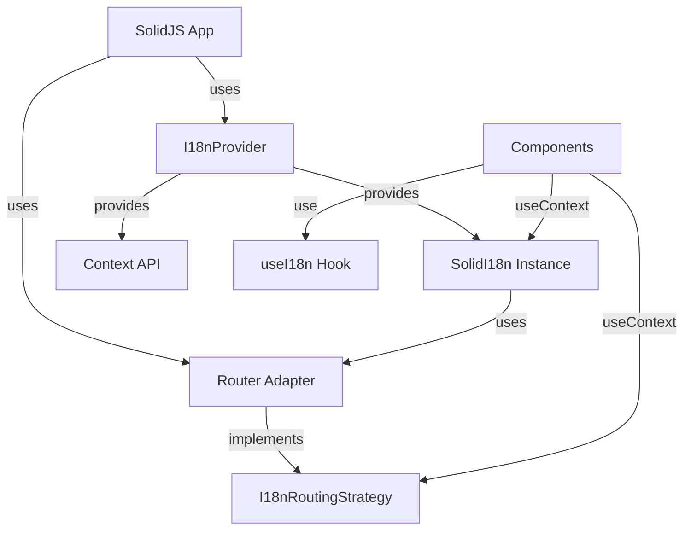

# Solid パッケージ(`@i18n-micro/solid`)

`@i18n-micro/solid` パッケージは、SolidJS アプリケーション向けの軽量かつ高性能な国際化ソリューションを提供します。Nuxt I18n Micro と同じコアロジックを共有し、リアクティブな翻訳、ルート固有のサポート、完全な TypeScript サポートを備えています。

## 概要

`@i18n-micro/solid` は、Nuxt フレームワーク以外で国際化を必要とする SolidJS アプリケーション向けに設計されています。以下を提供します:

- **軽量** - `@i18n-micro/core` の共有コアロジックを使用
- **リアクティブ** - SolidJS のシグナルにより、翻訳が変わるとコンポーネントを自動更新
- **ルート固有の翻訳** - ページレベルの翻訳をサポート
- **複数形化** - 組み込みの複数形サポート
- **フォーマット** - 数値、日付、相対時刻のフォーマット
- **型安全** - 完全な TypeScript サポート
- **ルーター非依存** - `I18nRoutingStrategy` インターフェースを介して、任意のルーター、またはルーターなしで動作
- **DevTools 統合** - 翻訳管理のための組み込み DevTools サポート

## インストール

お好みのパッケージマネージャーでパッケージをインストールします:

<CodeGroup>
```bash npm
npm install @i18n-micro/solid
```

```bash yarn
yarn add @i18n-micro/solid
```

```bash pnpm
pnpm add @i18n-micro/solid
```

```bash bun
bun add @i18n-micro/solid
```
</CodeGroup>

### ピア依存関係

The package requires SolidJS:

```json
{
  "peerDependencies": {
    "solid-js": "^1.8.0"
  }
}
```

## クイックスタート

### 基本セットアップ(ルーターなし)

```typescript
import { render } from 'solid-js/web'
import { createI18n, I18nProvider, useI18n } from '@i18n-micro/solid'
import type { Component } from 'solid-js'

const i18n = createI18n({
  locale: 'en',
  fallbackLocale: 'en',
  messages: {
    en: {
      greeting: 'Hello, {name}!',
      apples: 'no apples | one apple | {count} apples',
    },
    fr: {
      greeting: 'Bonjour, {name}!',
      apples: 'pas de pommes | une pomme | {count} pommes',
    },
  },
})

const App: Component = () => {
  const { t, tc } = useI18n()

  return (
    <div>
      <p>{t('greeting', { name: 'World' })}</p>
      <p>{tc('apples', 5)}</p>
    </div>
  )
}

const root = document.getElementById('root')!
if (root) {
  render(() => (
    <I18nProvider
      i18n={i18n}
      locales={[
        { code: 'en', displayName: 'English', iso: 'en-US' },
        { code: 'fr', displayName: 'Français', iso: 'fr-FR' },
      ]}
      defaultLocale="en"
    >
      <App />
    </I18nProvider>
  ), root)
}
```

### コンポーネントでの使用

```tsx
import { useI18n } from '@i18n-micro/solid'
import type { Component } from 'solid-js'

const MyComponent: Component = () => {
  const { t, tc, locale, switchLocale } = useI18n()

  return (
    <div>
      <p>{t('greeting', { name: 'World' })}</p>
      <p>{tc('apples', 5)}</p>
      <button onClick={() => switchLocale('fr')}>Switch to French</button>
    </div>
  )
}
```

## 中核概念

### ルーターアダプター抽象化

このパッケージは、i18n 機能を特定のルーター実装から切り離すためにルーターアダプターパターンを採用しています。これにより、以下が可能になります:

- 任意のルーターライブラリ(@solidjs/router、カスタムルーター、あるいはルーターなし)を使える
- ルーティングロジックを i18n パッケージ内ではなくアプリケーション側で実装できる
- コアパッケージを軽量かつルーター非依存に保てる

`I18nRoutingStrategy` インターフェースは、i18n とルーターの間の契約を定義します:

```typescript
interface I18nRoutingStrategy {
  getCurrentPath: () => string
  getCurrentPathAccessor?: () => Accessor<string> // For reactive path tracking
  linkComponent?: string | Component
  push: (target: { path: string }) => void
  replace: (target: { path: string }) => void
  resolvePath?: (to: string | { path?: string }, locale: string) => string | { path?: string }
  getRoute?: () => { fullPath: string; query: Record<string, unknown> }
}
```

### アーキテクチャ



## セットアップと設定

### ルーターなしの基本セットアップ

ルーティング機能が不要なアプリケーション向け:

```typescript
import { render } from 'solid-js/web'
import { createI18n, I18nProvider, useI18n } from '@i18n-micro/solid'
import type { Component } from 'solid-js'
import type { Locale } from '@i18n-micro/types'

const locales: Locale[] = [
  { code: 'en', displayName: 'English', iso: 'en-US' },
  { code: 'fr', displayName: 'Français', iso: 'fr-FR' },
]

const i18n = createI18n({
  locale: 'en',
  fallbackLocale: 'en',
  messages: {
    en: { welcome: 'Welcome' },
    fr: { welcome: 'Bienvenue' },
  },
})

const App: Component = () => {
  const { t } = useI18n()
  return <div>{t('welcome')}</div>
}

render(() => (
  <I18nProvider
    i18n={i18n}
    locales={locales}
    defaultLocale="en"
  >
    <App />
  </I18nProvider>
), document.getElementById('root'))
```

### ルーターアダプターありのセットアップ

ルーティングを使うアプリケーション向け(@solidjs/router を使用):

```typescript
import { render } from 'solid-js/web'
import { Router, Route, useNavigate, useLocation } from '@solidjs/router'
import { createI18n, I18nProvider, createSolidRouterAdapter } from '@i18n-micro/solid'
import type { Component } from 'solid-js'
import type { Locale } from '@i18n-micro/types'

const locales: Locale[] = [
  { code: 'en', displayName: 'English' },
  { code: 'fr', displayName: 'Français' },
]
const defaultLocale = 'en'

const i18n = createI18n({
  locale: defaultLocale,
  fallbackLocale: defaultLocale,
  messages: { [defaultLocale]: {} },
})

// Router root component with adapter setup
const RouterRoot: Component<{ children?: unknown }> = (props) => {
  const navigate = useNavigate()
  const location = useLocation()
  const routingStrategy = createSolidRouterAdapter(
    locales,
    defaultLocale,
    navigate,
    location,
  )

  return (
    <I18nProvider
      i18n={i18n}
      locales={locales}
      defaultLocale={defaultLocale}
      routingStrategy={routingStrategy}
    >
      {props.children as unknown}
    </I18nProvider>
  )
}

const root = document.getElementById('root')!
render(() => (
  <Router root={RouterRoot}>
    <Route path="/" component={Home} />
    <Route path="/about" component={About} />
  </Router>
), root)
```

### ロケール設定の提供

`useI18n` フックは、ロケール設定が `I18nProvider` 経由で提供されている必要があります。`locales` と `defaultLocale` の両方を渡す必要があります:

```typescript
import { I18nProvider } from '@i18n-micro/solid'
import type { Locale } from '@i18n-micro/types'

const locales: Locale[] = [
  { code: 'en', displayName: 'English', iso: 'en-US' },
  { code: 'fr', displayName: 'Français', iso: 'fr-FR' },
  { code: 'de', displayName: 'Deutsch', iso: 'de-DE' },
]

<I18nProvider
  i18n={i18n}
  locales={locales}
  defaultLocale="en"
>
  {/* Your app */}
</I18nProvider>
```

## ルーター統合

### `I18nRoutingStrategy` インターフェース

`I18nRoutingStrategy` インターフェースは、i18n がルーターとどのように連携するかを定義します:

```typescript
interface I18nRoutingStrategy {
  /**
   * Returns current path (without locale prefix if needed, or full path)
   * Used for determining active classes in links
   */
  getCurrentPath: () => string

  /**
   * (Optional) Returns reactive accessor for current path
   * Used for reactive path tracking in components
   */
  getCurrentPathAccessor?: () => Accessor<string>

  /**
   * Component to use for rendering links (e.g., A from @solidjs/router)
   */
  linkComponent?: string | Component

  /**
   * Function to navigate to another route/locale
   */
  push: (target: { path: string }) => void

  /**
   * Function to replace current route
   */
  replace: (target: { path: string }) => void

  /**
   * Generate path for specific locale
   */
  resolvePath?: (to: string | { path?: string }, locale: string) => string | { path?: string }

  /**
   * (Optional) Get current route object for SEO/Meta tags
   */
  getRoute?: () => {
    fullPath: string
    query: Record<string, unknown>
  }
}
```

### 組み込みルーターアダプターの使い方

このパッケージは、@solidjs/router 統合用の `createSolidRouterAdapter` をエクスポートします:

```typescript
import { createSolidRouterAdapter } from '@i18n-micro/solid'

// In your RouterRoot component
function RouterRoot({ children }: { children?: unknown }) {
  const navigate = useNavigate()
  const location = useLocation()
  const routingStrategy = createSolidRouterAdapter(localesConfig, defaultLocale, navigate, location)

  // ... rest of your code
}
```

**Important Notes:**

1. **コンポーネント内で呼び出す必要があります**: `createSolidRouterAdapter` は `createSignal` と `createEffect` を使用するため、リアクティブなコンテキストが必要です。**必ずコンポーネント関数の内部で呼び出してください**。モジュールレベルで呼び出さないでください。

2. **パッケージからエクスポート**: `createSolidRouterAdapter` は `@i18n-micro/solid` から直接エクスポートされるため、基本的なユースケースでは別のルーターアダプターファイルを作成する必要はありません。ただし、必要に応じてカスタムアダプターを作成することもできます(以下の「カスタムルーターアダプターの作成」セクションを参照)。

3. **リアクティビティ**: 組み込みアダプターは、SolidJS コンポーネントでの適切なリアクティビティのために `getCurrentPathAccessor()` を自動的に提供します。

### ルーティングストラテジーの設定

ルーティングストラテジーは `I18nProvider` 経由で設定します:

```typescript
const routingStrategy = createSolidRouterAdapter(locales, defaultLocale, navigate, location)

<I18nProvider
  i18n={i18n}
  locales={locales}
  defaultLocale={defaultLocale}
  routingStrategy={routingStrategy}
>
  {/* Your app */}
</I18nProvider>
```

## カスタムルーターアダプターの作成

### Overview

ルーターアダプターは、`I18nRoutingStrategy` インターフェースの実装であり、i18n がルーティングシステムとどのように連携するかを定義します。これにより、以下が可能になります:

- 任意のルーティングストラテジー(@solidjs/router、カスタムルーター、あるいはルーターなし)をサポート
- ロケール検出とパス生成をカスタマイズ
- サードパーティのルーティングライブラリと統合
- ドメインベースまたはサブドメインベースのロケールルーティングを実装

### Interface Reference

`I18nRoutingStrategy` インターフェースは、以下のメソッドを定義します:

| Method                     | Required                  | Description                                                                                                                                                                         |
| -------------------------- | ------------------------- | ----------------------------------------------------------------------------------------------------------------------------------------------------------------------------------- |
| `getCurrentPath()`         | ✅                        | Returns the current path (used for active link detection)                                                                                                                           |
| `getCurrentPathAccessor()` | ⚠️ **Highly Recommended** | Returns reactive accessor for current path (SolidJS-specific). **Required for proper reactivity** - without this, active link states and path-dependent UI won't update reactively. |
| `linkComponent`            | ❌                        | Component to use for rendering links (e.g., `A` from @solidjs/router)                                                                                                               |
| `push(target)`             | ❌                        | Function to navigate to another route/locale                                                                                                                                        |
| `replace(target)`          | ❌                        | Function to replace current route                                                                                                                                                   |
| `resolvePath(to, locale)`  | ❌                        | Generate path for specific locale                                                                                                                                                   |
| `getRoute()`               | ❌                        | Returns current route object with query params                                                                                                                                      |

### Step-by-Step Guide

#### ステップ 1: ルーティングストラテジーを理解する

アダプターを作成する前に、ルーティングがどのように機能するかを理解します:

- **URL のどこにロケールがあるか?**(プレフィックス、サフィックス、サブドメイン、クエリパラメータ)
- **ルートはどのように命名されているか?**(ファイルベース、プログラム的、カスタム)
- **デフォルトロケールの動作はどうか?**(プレフィックスを含める、プレフィックスを隠す)

#### ステップ 2: 必要なメソッドを実装する

最低限、`getCurrentPath()` を実装する必要があります。

**SolidJS では、`getCurrentPathAccessor()` も必ず実装する必要があります** — これは適切なリアクティビティのために不可欠です。これがないと、アクティブなリンク状態や、現在のパスに依存する任意の UI が、ナビゲーション発生時に更新されません。アクセサは、パス名の変化を追跡するシグナルを返す必要があります。

#### Step 3: Handle Edge Cases

Consider:

- Empty paths (`/`)
- ルートロケール(デフォルトロケール - URL に含めるべきか?)
- Invalid locales
- クエリパラメータとハッシュフラグメント

### 例 1: シグナルを使用するカスタムルーター

この例は、シグナルを使用するカスタムルーター用のアダプターを作成する方法を示します:

```typescript
// src/router-adapter-custom.tsx
import { createSignal, type Accessor, type Component, type JSX } from 'solid-js'
import type { I18nRoutingStrategy } from '@i18n-micro/solid'
import type { Locale } from '@i18n-micro/types'

// Example: Custom router interface
interface CustomRouter {
  getCurrentPath(): string
  navigate(path: string): void
  replace(path: string): void
  subscribe(callback: () => void): () => void
}

export function createCustomRouterAdapter(
  customRouter: CustomRouter,
  locales: Locale[],
  defaultLocale: string,
): I18nRoutingStrategy & { getCurrentPathAccessor: Accessor<string> } {
  const localeCodes = locales.map((loc) => loc.code)

  // Create signal to track pathname changes
  const [pathname, setPathname] = createSignal(customRouter.getCurrentPath())

  // Subscribe to router changes
  customRouter.subscribe(() => {
    setPathname(customRouter.getCurrentPath())
  })

  const resolvePath = (to: string | { path?: string }, locale: string): string | { path?: string } => {
    const path = typeof to === 'string' ? to : to.path || '/'
    const pathSegments = path.split('/').filter(Boolean)

    if (pathSegments.length > 0 && localeCodes.includes(pathSegments[0])) {
      pathSegments.shift()
    }

    const cleanPath = '/' + pathSegments.join('/')
    return locale === defaultLocale ? cleanPath : `/${locale}${cleanPath === '/' ? '' : cleanPath}`
  }

  return {
    getCurrentPath: () => pathname(),
    getCurrentPathAccessor: pathname, // Reactive accessor for SolidJS

    push: (target: { path: string }) => {
      customRouter.navigate(target.path)
    },

    replace: (target: { path: string }) => {
      customRouter.replace(target.path)
    },

    resolvePath: (to: string | { path?: string }, locale: string) => resolvePath(to, locale),

    getRoute: () => {
      const path = pathname()
      const url = new URL(path, 'http://localhost')
      return {
        fullPath: path + url.search,
        query: Object.fromEntries(url.searchParams),
      }
    },
  }
}
```

### 例 2: クエリパラメータベースのロケールルーティング

この例では、ロケール(例: `/?locale=fr`)にクエリパラメータを使用します:

```typescript
// src/router-adapter-query.tsx
import { createSignal, createEffect, type Accessor, type Component, type JSX } from 'solid-js'
import type { I18nRoutingStrategy } from '@i18n-micro/solid'
import type { Locale } from '@i18n-micro/types'

export function createQueryParamRouterAdapter(
  locales: Locale[],
  defaultLocale: string,
  paramName: string = 'locale',
): I18nRoutingStrategy & { getCurrentPathAccessor: Accessor<string> } {
  const localeCodes = locales.map((loc) => loc.code)

  const getCurrentPath = (): string => {
    if (typeof window !== 'undefined') {
      return window.location.pathname
    }
    return '/'
  }

  const [pathname, setPathname] = createSignal(getCurrentPath())

  // Track pathname changes
  if (typeof window !== 'undefined') {
    createEffect(() => {
      const updatePath = () => setPathname(window.location.pathname)
      window.addEventListener('popstate', updatePath)
      return () => window.removeEventListener('popstate', updatePath)
    })
  }

  const resolvePath = (to: string | { path?: string }, locale: string): string | { path?: string } => {
    const path = typeof to === 'string' ? to : to.path || '/'
    const url = new URL(path, 'http://localhost')

    if (locale !== defaultLocale) {
      url.searchParams.set(paramName, locale)
    } else {
      url.searchParams.delete(paramName)
    }

    return url.pathname + url.search
  }

  return {
    getCurrentPath,
    getCurrentPathAccessor: pathname,
    push: (target) => {
      if (typeof window !== 'undefined') {
        window.history.pushState({}, '', target.path)
        window.dispatchEvent(new Event('popstate'))
      }
    },
    replace: (target) => {
      if (typeof window !== 'undefined') {
        window.history.replaceState({}, '', target.path)
        window.dispatchEvent(new Event('popstate'))
      }
    },
    resolvePath: (to, locale) => resolvePath(to, locale),
    getRoute: () => {
      if (typeof window !== 'undefined') {
        const url = new URL(window.location.href)
        return {
          fullPath: url.pathname + url.search,
          query: Object.fromEntries(url.searchParams),
        }
      }
      return {
        fullPath: '/',
        query: {},
      }
    },
  }
}
```

### Best Practices

1. **SolidJS では必ず `getCurrentPathAccessor` を提供する**(リアクティビティのために必須): これにより、コンポーネントで適切なリアクティビティが保証されます。これがないと、アクティブなリンク状態やパス依存の UI が更新されません:

```typescript
return {
  getCurrentPath: () => pathname(), // For compatibility
  getCurrentPathAccessor: pathname, // For reactivity in SolidJS components
  // ... other methods
}
```

2. **リアクティブなパストラッキングにシグナルを使用する**: パス名の変化を追跡するために、アダプター内でシグナルを作成します:

```typescript
const [pathname, setPathname] = createSignal(location.pathname)

createEffect(() => {
  setPathname(location.pathname) // Track changes
})
```

3. **クエリパラメータとハッシュを保持する**: ロケールを切り替える際に、クエリパラメータとハッシュフラグメントを保持します:

```typescript
const resolvePath = (to: string | { path?: string }, locale: string): string | { path?: string } => {
  const path = typeof to === 'string' ? to : to.path || '/'
  const url = new URL(path, 'http://localhost')
  // ... locale switching logic ...
  return url.pathname + url.search + url.hash
}
```

4. **エッジケースを処理する**: 空のパス、ルートパス、無効なロケールを考慮します:

```typescript
const getCurrentPath = (): string => {
  if (typeof window !== 'undefined') {
    const path = window.location.pathname
    return path || '/' // Handle empty path
  }
  return '/'
}
```

### Common Patterns

#### パターン 1: 最小限のアダプター(必須メソッドのみ)

基本機能のみが必要な場合:

```typescript
export function createMinimalAdapter(): I18nRoutingStrategy {
  return {
    getCurrentPath: () => {
      return typeof window !== 'undefined' ? window.location.pathname : '/'
    },
  }
}
```

#### パターン 2: 組み込みアダプターの拡張

組み込みアダプターを拡張して、特定のメソッドをオーバーライドできます:

```typescript
import { createSolidRouterAdapter } from '@i18n-micro/solid'

export function createExtendedAdapter(locales: Locale[], defaultLocale: string, navigate: NavigateFunction, location: Location) {
  const baseAdapter = createSolidRouterAdapter(locales, defaultLocale, navigate, location)

  return {
    ...baseAdapter,
    // Override specific method
    resolvePath: (to: string | { path?: string }, locale: string) => {
      const basePath = baseAdapter.resolvePath?.(to, locale)
      // Custom logic
      return typeof basePath === 'string' ? `/custom${basePath}` : basePath
    },
  }
}
```

### Troubleshooting

**問題**: ロケールが正しく検出されない

- **解決策**: `getCurrentPath` が現在のパスを正しく返し、`resolvePath` がロケールプレフィックスを適切に処理していることを確認します

**問題**: リンクでロケールが切り替わらない

- **解決策**: `push` および `replace` メソッドが URL を正しく更新し、ルーターにイベントをディスパッチしていることを確認します

**問題**: アクティブ状態の検出が動作しない

- **解決策**: ルーターアダプターで **必ず `getCurrentPathAccessor` を提供する** 必要があります。実装され、シグナルアクセサを返していることを確認します。適切なリアクティビティのため、アクセサは `createMemo` 内で呼び出す必要があります。`getCurrentPathAccessor` がないと、アクティブ状態はリアクティブに更新されません。

**問題**: パス変更時にコンポーネントが更新されない

- **解決策**: ルーターアダプターで **必ず `getCurrentPathAccessor` を実装する** 必要があります。パス名の変更を追跡するシグナルアクセサを返す必要があります。コンポーネントは、リアクティブなコンテキスト(`createMemo`、`createEffect`、JSX)内でこれを呼び出す必要があります。`createSolidRouterAdapter` を使用している場合、`createSignal` と `createEffect` が正しく動作するよう、モジュールレベルではなくコンポーネント内で呼び出していることを確認してください。

## コア API

### `createI18n(options: SolidI18nOptions)`

Creates a SolidJS i18n instance.

**パラメータ:** [共有の `createI18n` オプション](/integrations/overview#create-i18n-options) — `locale`、`fallbackLocale`、`messages`、`plural`、`missingWarn`、`missingHandler`。

**Returns:** `SolidI18n`

**例:**

```typescript
import { createI18n } from '@i18n-micro/solid'

const i18n = createI18n({
  locale: 'en',
  fallbackLocale: 'en',
  messages: {
    en: {
      welcome: 'Welcome',
      greeting: 'Hello, {name}!',
    },
    fr: {
      welcome: 'Bienvenue',
      greeting: 'Bonjour, {name}!',
    },
  },
  missingWarn: true,
  missingHandler: (locale, key, routeName) => {
    console.warn(`Missing translation: ${key} in ${locale} for route ${routeName}`)
  },
})
```

### `SolidI18n` Class

すべての翻訳ロジックを扱う、i18n インスタンスのコアクラスです。

#### プロパティ

- `locale: string` - 現在のロケール(getter/setter、`localeAccessor()` 経由でリアクティブ)
- `localeAccessor: Accessor<string>` - 現在のロケール用のリアクティブアクセサ
- `fallbackLocale: string` - フォールバックロケール(getter)
- `currentRoute: string` - 現在のルート名(getter)
- `routeAccessor: Accessor<string>` - 現在のルート用のリアクティブアクセサ
- `cacheStore: \{ root: Record<string, Translations>, route: Record<string, Translations> \}` - 翻訳キャッシュ(リアクティブストア)

#### メソッド

##### `t(key: TranslationKey, params?: Params, defaultValue?: string | null, routeName?: string): CleanTranslation`

任意のパラメータとフォールバック値を指定してキーを翻訳します。

```typescript
const i18n = createI18n({
  /* ... */
})

// Basic translation
i18n.t('welcome') // "Welcome"

// With parameters
i18n.t('greeting', { name: 'John' }) // "Hello, John!"

// With default value
i18n.t('missing', {}, 'Default text') // "Default text"

// Route-specific translation
i18n.t('title', {}, null, 'home') // Uses 'home' route translations
```

##### `ts(key: TranslationKey, params?: Params, defaultValue?: string, routeName?: string): string`

`t()` と同じですが、常に文字列を返します。

##### `tc(key: TranslationKey, count: number | Params, defaultValue?: string): string`

複数形対応の翻訳です。

```typescript
// With count number
i18n.tc('apples', 0) // "no apples"
i18n.tc('apples', 1) // "one apple"
i18n.tc('apples', 5) // "5 apples"

// With params object
i18n.tc('items', { count: 3, type: 'books' })
```

##### `tn(value: number, options?: Intl.NumberFormatOptions): string`

現在のロケールに従って数値をフォーマットします。

```typescript
i18n.tn(1234.56) // "1,234.56" (en) or "1 234,56" (fr)
i18n.tn(1234.56, { style: 'currency', currency: 'USD' }) // "$1,234.56"
```

##### `td(value: Date | number | string, options?: Intl.DateTimeFormatOptions): string`

現在のロケールに従って日付をフォーマットします。

```typescript
i18n.td(new Date()) // "12/31/2023" (en) or "31/12/2023" (fr)
i18n.td(new Date(), { dateStyle: 'full' }) // "Sunday, December 31, 2023"
```

##### `tdr(value: Date | number | string, options?: Intl.RelativeTimeFormatOptions): string`

相対時刻(例:「2 時間前」)をフォーマットします。

```typescript
const yesterday = new Date()
yesterday.setDate(yesterday.getDate() - 1)
i18n.tdr(yesterday) // "yesterday"
i18n.tdr(Date.now() - 3600000) // "1 hour ago"
```

##### `has(key: TranslationKey, routeName?: string): boolean`

翻訳キーが存在するかどうかをチェックします。

```typescript
i18n.has('welcome') // true
i18n.has('missing') // false
```

##### `addTranslations(locale: string, translations: Translations, merge?: boolean): void`

ロケールに対して翻訳を追加またはマージします。

```typescript
// Add new translations
i18n.addTranslations('en', {
  newKey: 'New translation',
})

// Replace existing (merge = false)
i18n.addTranslations(
  'en',
  {
    welcome: 'New Welcome',
  },
  false,
)
```

##### `addRouteTranslations(locale: string, routeName: string, translations: Translations, merge?: boolean): void`

ルート固有の翻訳を追加します。

```typescript
i18n.addRouteTranslations('en', 'home', {
  title: 'Home Page',
  description: 'Welcome to our home page',
})
```

##### `clearCache(): void`

翻訳キャッシュをクリアします。

##### `setRoute(routeName: string): void`

ルート固有の翻訳のために現在のルート名を設定します。

##### `getRoute(): string`

現在のルート名を取得します。

##### `getLocale(): string`

Gets the current locale.

##### `getFallbackLocale(): string`

Gets the fallback locale.

##### `destroy(): void`

リアクティブルートを破棄します(テストでのクリーンアップに有用)。

## コンポーザブル

### `useI18n(options?: UseI18nOptions)`

`useI18n` フックは、SolidJS コンポーネント内で i18n 機能にアクセスするための手段を提供します。

**オプション:**

```typescript
interface UseI18nOptions {
  locales?: Locale[]
  defaultLocale?: string
}
```

**戻り値:**

```typescript
{
  // Direct access to instance
  instance: SolidI18n

  // Locale (reactive via createMemo)
  locale: Accessor<string>

  // Locale helpers
  getLocales: () => Locale[]
  defaultLocale: () => string
  getLocaleName: () => string | null

  // Routing helpers
  localeRoute: (to: string | { path?: string }, localeCode?: string) => string | { path?: string }
  localePath: (to: string | { path?: string }, locale?: string) => string
  switchLocale: (newLocale: string) => void

  // Translation methods
  t: (key: TranslationKey, params?: Params, defaultValue?: string | null, routeName?: string) => CleanTranslation
  ts: (key: TranslationKey, params?: Params, defaultValue?: string, routeName?: string) => string
  tc: (key: TranslationKey, count: number | Params, defaultValue?: string) => string
  tn: (value: number, options?: Intl.NumberFormatOptions) => string
  td: (value: Date | number | string, options?: Intl.DateTimeFormatOptions) => string
  tdr: (value: Date | number | string, options?: Intl.RelativeTimeFormatOptions) => string
  has: (key: TranslationKey, routeName?: string) => boolean

  // Route management
  setRoute: (routeName: string) => void
  getRoute: () => string
  getLocale: () => string

  // Translation management
  addTranslations: (locale: string, translations: Translations, merge?: boolean) => void
  addRouteTranslations: (locale: string, routeName: string, translations: Translations, merge?: boolean) => void
  clearCache: () => void
}
```

**例:**

```tsx
import { useI18n } from '@i18n-micro/solid'
import type { Component } from 'solid-js'

const MyComponent: Component = () => {
  const { t, tc, locale, switchLocale } = useI18n()

  return (
    <div>
      <p>{t('greeting', { name: 'World' })}</p>
      <p>{tc('apples', 5)}</p>
      <button onClick={() => switchLocale('fr')}>Switch to French</button>
    </div>
  )
}
```

## コンポーネント

### `I18nT`

翻訳されたテキストをレンダリングするための翻訳コンポーネントです。

**プロパティ:**

| プロパティ         | 型                                            | 必須     | デフォルト | 説明                                    |
| ------------------ | --------------------------------------------- | -------- | -------- | --------------------------------------- |
| `keypath`          | `TranslationKey`                              | ✅       | -        | Translation key                         |
| `plural`           | `number \| string`                            | ❌       | -        | Count for pluralization                 |
| `tag`              | `string`                                      | ❌       | `'span'` | HTML tag to render                      |
| `params`           | `Record<string, string \| number \| boolean>` | ❌       | `\{\}`     | Parameters for interpolation            |
| `defaultValue`     | `string`                                      | ❌       | `''`     | Default value if translation is missing |
| `html`             | `boolean`                                     | ❌       | `false`  | Render as HTML                          |
| `hideIfEmpty`      | `boolean`                                     | ❌       | `false`  | Hide component if translation is empty  |
| `customPluralRule` | `PluralFunc`                                  | ❌       | -        | Custom pluralization function           |
| `number`           | `number \| string`                            | ❌       | -        | Number to format and interpolate        |
| `date`             | `Date \| string \| number`                    | ❌       | -        | Date to format and interpolate          |
| `relativeDate`     | `Date \| string \| number`                    | ❌       | -        | Date for relative time formatting       |

**例:**

```tsx
import { I18nT } from '@i18n-micro/solid'
import { createMemo } from 'solid-js'

// Basic translation
<I18nT keypath="welcome" />

// With parameters
<I18nT
  keypath="greeting"
  params={{ name: 'SolidJS' }}
/>

// Pluralization
<I18nT keypath="apples" plural={0} />
<I18nT keypath="apples" plural={1} />
<I18nT keypath="apples" plural={5} />

// Number formatting
<I18nT
  keypath="number"
  number={1234.56}
/>

// Date formatting
<I18nT
  keypath="date"
  date={new Date()}
/>

// Relative date formatting
const oneHourAgo = createMemo(() => new Date(Date.now() - 3600000))
<I18nT
  keypath="relativeDate"
  relativeDate={oneHourAgo()}
/>

// HTML rendering
<I18nT
  keypath="htmlContent"
  html
  tag="div"
/>

// Custom tag
<I18nT
  keypath="title"
  tag="h1"
/>
```

### `I18nLink`

ルーターアダプターがあってもなくても動作する、ローカライズされたリンクコンポーネントです。

**プロパティ:**

| プロパティ    | 型                                                                                  | 必須     | デフォルト | 説明                                     |
| ------------- | ----------------------------------------------------------------------------------- | -------- | ------- | ----------------------------------- |
| `to`          | `string \| \{ path?: string \}`                                                       | ✅       | -       | Target path or route object         |
| `activeStyle` | `JSX.CSSProperties`                                                                 | ❌       | `\{\}`    | Styles to apply when link is active |
| `localeRoute` | `(to: string \| \{ path?: string \}, locale?: string) => string \| \{ path?: string \}` | ❌       | -       | Custom locale route resolver        |

**例:**

```tsx
import { I18nLink, useI18n } from '@i18n-micro/solid'

const MyComponent = () => {
  const { localeRoute } = useI18n()

  return (
    <>
      {/* Basic link */}
      <I18nLink to="/">Home</I18nLink>

      {/* With active style */}
      <I18nLink to="/about" activeStyle={{ color: 'red', fontWeight: 'bold' }}>
        About
      </I18nLink>

      {/* External link (automatically detected) */}
      <I18nLink to="https://example.com">External Link</I18nLink>

      {/* With custom locale route */}
      <I18nLink to="/products" localeRoute={localeRoute}>
        Products
      </I18nLink>
    </>
  )
}
```

### `I18nSwitcher`

ドロップダウンインターフェースを備えたロケール切り替えコンポーネントです。

**プロパティ:**

| Prop                    | Type                                                                                | Required | Default | Description                                         |
| ----------------------- | ----------------------------------------------------------------------------------- | -------- | ------- | --------------------------------------------------- |
| `locales`               | `Locale[]`                                                                          | ❌       | -       | Locales list (uses injected if not provided)        |
| `currentLocale`         | `string \| (() => string)`                                                          | ❌       | -       | Current locale (uses i18n instance if not provided) |
| `getLocaleName`         | `() => string \| null`                                                              | ❌       | -       | Function to get current locale name                 |
| `switchLocale`          | `(locale: string) => void`                                                          | ❌       | -       | Function to switch locale                           |
| `localeRoute`           | `(to: string \| \{ path?: string \}, locale?: string) => string \| \{ path?: string \}` | ❌       | -       | Function to resolve locale route                    |
| `customLabels`          | `Record<string, string>`                                                            | ❌       | `\{\}`    | Custom labels for locales                           |
| `customWrapperStyle`    | `JSX.CSSProperties`                                                                 | ❌       | `\{\}`    | Custom wrapper styles                               |
| `customButtonStyle`     | `JSX.CSSProperties`                                                                 | ❌       | `\{\}`    | Custom button styles                                |
| `customDropdownStyle`   | `JSX.CSSProperties`                                                                 | ❌       | `\{\}`    | Custom dropdown styles                              |
| `customItemStyle`       | `JSX.CSSProperties`                                                                 | ❌       | `\{\}`    | Custom item styles                                  |
| `customLinkStyle`       | `JSX.CSSProperties`                                                                 | ❌       | `\{\}`    | Custom link styles                                  |
| `customActiveLinkStyle` | `JSX.CSSProperties`                                                                 | ❌       | `\{\}`    | Custom styles for the current locale link           |
| `customIconStyle`       | `JSX.CSSProperties`                                                                 | ❌       | `\{\}`    | Custom icon styles                                  |

**例:**

```tsx
import { I18nSwitcher, useI18n } from '@i18n-micro/solid'

const MyComponent = () => {
  const { locale, getLocales, getLocaleName, switchLocale, localeRoute } = useI18n()
  const locales = getLocales()

  return (
    <>
      {/* Basic switcher */}
      <I18nSwitcher />

      {/* With custom props */}
      <I18nSwitcher locales={locales} currentLocale={locale} getLocaleName={getLocaleName} switchLocale={switchLocale} localeRoute={localeRoute} />

      {/* With custom styling */}
      <I18nSwitcher customButtonStyle={{ backgroundColor: '#007bff', color: 'white' }} customDropdownStyle={{ borderRadius: '8px' }} />

      {/* With custom labels */}
      <I18nSwitcher customLabels={{ en: 'English', fr: 'Français', de: 'Deutsch' }} />
    </>
  )
}
```

### `I18nGroup`

共通のプレフィックスで翻訳をグループ化するためのコンポーネントです。

**プロパティ:**

| プロパティ   | 型       | 必須     | デフォルト | 説明                             |
| ------------ | -------- | -------- | ------- | ----------------------------- |
| `prefix`     | `string` | ✅       | -       | Translation key prefix        |
| `groupClass` | `string` | ❌       | `''`    | CSS class for the wrapper div |

**スロット:**

- `default` - 子として渡す関数: `\{ prefix: string, t: (key: string, params?: Params) => string \}`

**例:**

```tsx
import { I18nGroup } from '@i18n-micro/solid'
;<I18nGroup prefix="home">
  {({ t: groupT }) => (
    <>
      <h1>{groupT('title')}</h1>
      <p>{groupT('description')}</p>
      <p>{groupT('greeting', { name: 'User' })}</p>
    </>
  )}
</I18nGroup>

{
  /* With custom class */
}
;<I18nGroup prefix="about" groupClass="about-section">
  {({ t }) => <div>{t('content')}</div>}
</I18nGroup>
```

## 高度な使い方

### ルート固有の翻訳

ルートに固有の翻訳を定義できます:

```typescript
// Add route-specific translations
i18n.addRouteTranslations('en', 'home', {
  title: 'Home Page',
  description: 'Welcome to our home page',
})

i18n.addRouteTranslations('en', 'about', {
  title: 'About Us',
  description: 'Learn more about us',
})

// Set current route
i18n.setRoute('home')

// Use route-specific translation
i18n.t('title') // "Home Page"
i18n.t('title', {}, null, 'about') // "About Us"
```

### 翻訳の動的読み込み

翻訳を動的に読み込みます:

```typescript
async function loadLocaleTranslations(locale: string) {
  const messages = await import(`./locales/${locale}.json`)
  i18n.addTranslations(locale, messages.default, false)
}

// Load on demand
await loadLocaleTranslations('fr')

// Preload in background
Promise.all([loadLocaleTranslations('de'), loadLocaleTranslations('es')]).catch(() => {
  // Handle errors
})
```

### 複数形化

複数形化はカウントに基づいて自動的に処理されます:

```typescript
// Translation key with plural forms
const messages = {
  en: {
    apples: 'no apples | one apple | {count} apples',
    items: 'no items | one item | {count} items',
  },
}

// Usage
i18n.tc('apples', 0) // "no apples"
i18n.tc('apples', 1) // "one apple"
i18n.tc('apples', 5) // "5 apples"

// With parameters
i18n.tc('items', { count: 3, type: 'books' })
```

### カスタム複数形関数

カスタムの複数形化関数を指定できます:

```typescript
import { createI18n } from '@i18n-micro/solid'

const i18n = createI18n({
  locale: 'ru',
  plural: (key, count, params, locale, t) => {
    // Russian plural rules
    const forms = key.split(' | ')
    if (count % 10 === 1 && count % 100 !== 11) {
      return forms[0] || key
    }
    if (count % 10 >= 2 && count % 10 <= 4 && (count % 100 < 10 || count % 100 >= 20)) {
      return forms[1] || key
    }
    return forms[2] || key
  },
})
```

### 数値フォーマット

ロケールに従って数値をフォーマットします:

```typescript
// Basic formatting
i18n.tn(1234.56) // "1,234.56" (en) or "1 234,56" (fr)

// Currency
i18n.tn(1234.56, { style: 'currency', currency: 'USD' }) // "$1,234.56"

// Percentage
i18n.tn(0.15, { style: 'percent' }) // "15%"
```

### 日付フォーマット

ロケールに従って日付をフォーマットします:

```typescript
const date = new Date('2023-12-31')

// Basic formatting
i18n.td(date) // "12/31/2023" (en) or "31/12/2023" (fr)

// Full date style
i18n.td(date, { dateStyle: 'full' }) // "Sunday, December 31, 2023"

// Custom format
i18n.td(date, { year: 'numeric', month: 'long', day: 'numeric' })
```

### 相対時刻のフォーマット

相対時刻をフォーマットします:

```typescript
const oneHourAgo = new Date(Date.now() - 3600000)

i18n.tdr(oneHourAgo) // "1 hour ago"

// With options
i18n.tdr(oneHourAgo, { numeric: 'auto' }) // "an hour ago"
```

### 欠落した翻訳の処理

欠落した翻訳を処理します:

```typescript
const i18n = createI18n({
  locale: 'en',
  missingWarn: true, // Show console warnings
  missingHandler: (locale, key, routeName) => {
    // Custom handler
    console.error(`Missing: ${key} in ${locale} for route ${routeName}`)
    // Send to error tracking service
  },
})
```

## DevTools 統合

このパッケージは、`@i18n-micro/devtools-ui` Vite プラグイン経由での DevTools 統合をサポートします。詳細は [DevTools UI パッケージのドキュメント](/integrations/devtools-ui) を参照してください。

## TypeScript サポート

### 型のエクスポート

このパッケージは必要な型をすべてエクスポートします:

```typescript
import type {
  SolidI18n,
  SolidI18nOptions,
  I18nProviderProps,
  I18nRoutingStrategy,
  UseI18nOptions,
  Locale,
  Translations,
  TranslationKey,
  Params,
  CleanTranslation,
} from '@i18n-micro/solid'
```

### 型安全性

すべての翻訳メソッドは型安全です:

```typescript
// Translation keys are typed
const key: TranslationKey = 'welcome' // ✅
const invalid: TranslationKey = 'missing' // ⚠️ Type error if key doesn't exist

// Parameters are typed
i18n.t('greeting', { name: 'John' }) // ✅
i18n.t('greeting', { invalid: 'value' }) // ⚠️ Type error
```

## 例とレシピ

### SPA の完全な例

完全に動作する例は、`packages/solid/playground/src/` の playground 実装を参照してください。

### ルーター統合の例

```typescript
// router-adapter.tsx
import { createSignal, createEffect, type Accessor, type Component, type JSX } from 'solid-js'
import { A, type NavigateFunction, type Location } from '@solidjs/router'
import type { I18nRoutingStrategy } from '@i18n-micro/solid'
import type { Locale } from '@i18n-micro/types'

export function createSolidRouterAdapter(
  locales: Locale[],
  defaultLocale: string,
  navigate: NavigateFunction,
  location: Location,
): I18nRoutingStrategy & { getCurrentPathAccessor: Accessor<string> } {
  const localeCodes = locales.map(loc => loc.code)
  const [pathname, setPathname] = createSignal(location.pathname)

  createEffect(() => {
    setPathname(location.pathname)
  })

  const resolvePath = (to: string | { path?: string }, locale: string): string | { path?: string } => {
    const path = typeof to === 'string' ? to : (to.path || '/')
    const pathSegments = path.split('/').filter(Boolean)

    if (pathSegments.length > 0 && localeCodes.includes(pathSegments[0])) {
      pathSegments.shift()
    }

    const cleanPath = '/' + pathSegments.join('/')
    return locale === defaultLocale ? cleanPath : `/${locale}${cleanPath === '/' ? '' : cleanPath}`
  }

  return {
    getCurrentPath: () => pathname(),
    getCurrentPathAccessor: pathname,
    push: (target) => navigate(target.path),
    replace: (target) => navigate(target.path, { replace: true }),
    resolvePath: (to, locale) => resolvePath(to, locale),
    getRoute: () => ({
      fullPath: pathname(),
      query: Object.fromEntries(new URLSearchParams(location.search)),
    }),
    linkComponent: ((props) => {
      const { href, children, class: className, style, ...restProps } = props
      return (
        <A href={href} class={className} style={style} {...restProps}>
          {children}
        </A>
      )
    }) as Component<{
      href: string
      children?: JSX.Element
      style?: JSX.CSSProperties
      class?: string
      [key: string]: unknown
    }>,
  }
}
```

### コンポーネント使用例

```tsx
import { useI18n, I18nLink, I18nSwitcher, I18nT } from '@i18n-micro/solid'
import type { Component } from 'solid-js'

const App: Component = () => {
  const { t, getLocales, locale, getLocaleName, localeRoute, switchLocale } = useI18n()
  const locales = getLocales()

  return (
    <div id="app">
      <nav>
        <I18nLink to="/" localeRoute={localeRoute} activeStyle={{ fontWeight: 'bold' }}>
          <I18nT keypath="nav.home" />
        </I18nLink>
        <I18nLink to="/about" localeRoute={localeRoute} activeStyle={{ fontWeight: 'bold' }}>
          <I18nT keypath="nav.about" />
        </I18nLink>
      </nav>

      <div class="locale-switcher">
        <I18nSwitcher locales={locales} currentLocale={locale} getLocaleName={getLocaleName} switchLocale={switchLocale} localeRoute={localeRoute} />
      </div>

      <main>{/* Your routes */}</main>
    </div>
  )
}
```

### ルーターとのロケール同期

```tsx
import { createEffect } from 'solid-js'
import { useParams } from '@solidjs/router'
import { useI18n } from '@i18n-micro/solid'

const LocaleHandler: Component<{ params: { locale?: string }; children?: unknown }> = (props) => {
  const { instance: i18n } = useI18n()
  const localeCodes = ['en', 'fr', 'de']
  const currentLocale = props.params.locale && localeCodes.includes(props.params.locale) ? props.params.locale : 'en'

  // Sync locale with i18n instance
  if (currentLocale !== i18n.getLocale()) {
    i18n.locale = currentLocale
  }

  return props.children as unknown
}
```

## リソース

- **リポジトリ**: [https://github.com/s00d/nuxt-i18n-micro](https://github.com/s00d/nuxt-i18n-micro)
- **ドキュメント**: [https://s00d.github.io/nuxt-i18n-micro/](https://s00d.github.io/nuxt-i18n-micro/)

## ライセンス

MIT
