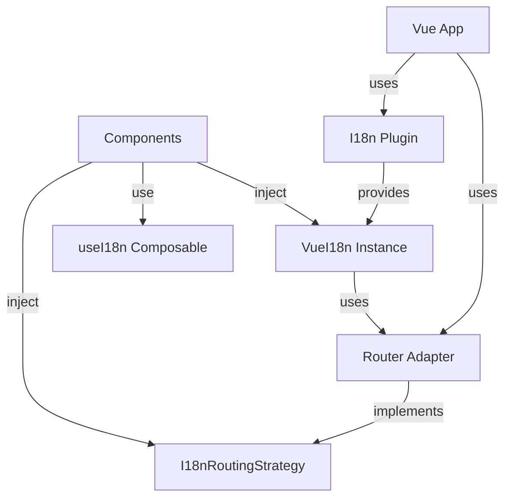

# Vue パッケージ(`@i18n-micro/vue`)

`@i18n-micro/vue` パッケージは、Vue 3 アプリケーション向けの軽量かつ高性能な国際化ソリューションを提供します。Nuxt I18n Micro と同じコアロジックを共有し、リアクティブな翻訳、ルート固有のサポート、完全な TypeScript サポートを備えています。

## 概要

`@i18n-micro/vue` は、Nuxt フレームワーク以外で国際化を必要とする Vue 3 アプリケーション向けに設計されています。以下を提供します:

- **軽量** - `@i18n-micro/core` の共有コアロジックを使用
- **リアクティブ** - 翻訳が変わるとコンポーネントを自動更新
- **ルート固有の翻訳** - ページレベルの翻訳をサポート
- **複数形化** - 組み込みの複数形サポート
- **フォーマット** - 数値、日付、相対時刻のフォーマット
- **型安全** - 完全な TypeScript サポート
- **ルーター非依存** - 任意のルーター、またはルーターなしでも動作
- **DevTools 統合** - 翻訳管理のための組み込み Vue DevTools サポート

## インストール

お好みのパッケージマネージャーでパッケージをインストールします:

<CodeGroup>
```bash npm
npm install @i18n-micro/vue
```

```bash yarn
yarn add @i18n-micro/vue
```

```bash pnpm
pnpm add @i18n-micro/vue
```

```bash bun
bun add @i18n-micro/vue
```
</CodeGroup>

### ピア依存関係

このパッケージには Vue 3 が必要で、Vue Router はオプションです:

```json
{
  "peerDependencies": {
    "vue": "^3.3.0",
    "vue-router": "^4.6.3 || ^5.0.0"
  }
}
```

## クイックスタート

### 基本セットアップ(ルーターなし)

```typescript
import { createApp } from 'vue'
import { createI18n } from '@i18n-micro/vue'
import App from './App.vue'

const app = createApp(App)

const i18n = createI18n({
  locale: 'en',
  fallbackLocale: 'en',
  // Automatically provided to the app - no need for manual provide calls
  locales: [
    { code: 'en', displayName: 'English', iso: 'en-US' },
    { code: 'fr', displayName: 'Français', iso: 'fr-FR' },
  ],
  defaultLocale: 'en',
  messages: {
    en: {
      greeting: 'Hello, {name}!',
      apples: 'no apples | one apple | {count} apples',
    },
    fr: {
      greeting: 'Bonjour, {name}!',
      apples: 'pas de pommes | une pomme | {count} pommes',
    },
  },
})

app.use(i18n)
app.mount('#app')
```

### コンポーネントでの使用

```vue
<template>
  <div>
    <p>{{ t('greeting', { name: 'World' }) }}</p>
    <p>{{ tc('apples', 5) }}</p>
  </div>
</template>

<script setup lang="ts">
import { useI18n } from '@i18n-micro/vue'

const { t, tc, locale } = useI18n()

// Change locale reactively
locale.value = 'fr'
</script>
```

## 中核概念

### ルーターアダプター抽象化

このパッケージは、i18n 機能を特定のルーター実装から切り離すためにルーターアダプターパターンを採用しています。これにより、以下が可能になります:

- 任意のルーターライブラリ(Vue Router、カスタムルーター、あるいはルーターなし)を使える
- ルーティングロジックを i18n パッケージ内ではなくアプリケーション側で実装できる
- コアパッケージを軽量かつルーター非依存に保てる

`I18nRoutingStrategy` インターフェースは、i18n とルーターの間の契約を定義します:

```typescript
interface I18nRoutingStrategy {
  getCurrentPath: () => string
  linkComponent?: string | Component
  push: (target: { path: string }) => void
  replace: (target: { path: string }) => void
  resolvePath?: (to: string | { path?: string }, locale: string) => string | { path?: string }
  getRoute?: () => { fullPath: string; query: Record<string, unknown> }
}
```

### アーキテクチャ



## セットアップと設定

### ルーターなしの基本セットアップ

ルーティング機能が不要なアプリケーション向け:

```typescript
import { createApp } from 'vue'
import { createI18n, I18nLocalesKey, I18nDefaultLocaleKey } from '@i18n-micro/vue'
import App from './App.vue'

const app = createApp(App)

const i18n = createI18n({
  locale: 'en',
  fallbackLocale: 'en',
  // Automatically provided to the app
  locales: [
    { code: 'en', displayName: 'English', iso: 'en-US' },
    { code: 'fr', displayName: 'Français', iso: 'fr-FR' },
  ],
  defaultLocale: 'en',
  messages: {
    en: { welcome: 'Welcome' },
    fr: { welcome: 'Bienvenue' },
  },
})

app.use(i18n)
app.mount('#app')
```

### ルーターアダプターありのセットアップ

ルーティングを使うアプリケーション向け:

```typescript
import { createApp } from 'vue'
import { createRouter, createWebHistory } from 'vue-router'
import { createI18n } from '@i18n-micro/vue'
import { createVueRouterAdapter } from '@i18n-micro/vue'
import App from './App.vue'
import { routes, localesConfig, defaultLocale } from './app-config'

const router = createRouter({
  history: createWebHistory(),
  routes,
})

// Create router adapter
const routingStrategy = createVueRouterAdapter(router, localesConfig, defaultLocale)

// Create i18n with routing strategy
const i18n = createI18n({
  locale: defaultLocale,
  fallbackLocale: defaultLocale,
  messages: { [defaultLocale]: {} },
  routingStrategy, // Pass adapter here
  // Automatically provided to the app - no need for manual provide calls
  locales: localesConfig,
  defaultLocale,
})

const app = createApp(App)
app.use(router)
app.use(i18n)

app.mount('#app')
```

### ロケール設定の提供

`useI18n` コンポーザブルは、Vue の依存性注入システムを介してロケール設定が提供されている必要があります。

**推奨アプローチ**: `locales` と `defaultLocale` を `createI18n` に直接渡します。これらは自動的に提供されます:

```typescript
import { createI18n } from '@i18n-micro/vue'
import type { Locale } from '@i18n-micro/types'

const locales: Locale[] = [
  { code: 'en', displayName: 'English', iso: 'en-US' },
  { code: 'fr', displayName: 'Français', iso: 'fr-FR' },
  { code: 'de', displayName: 'Deutsch', iso: 'de-DE' },
]

const i18n = createI18n({
  locale: 'en',
  fallbackLocale: 'en',
  locales, // Automatically provided
  defaultLocale: 'en', // Automatically provided
  messages: {
    /* ... */
  },
})

app.use(i18n)
```

**代替アプローチ**: 手動でロケールを提供する必要がある場合(例: 動的に提供する場合)は、injection キーを使用できます:

```typescript
import { I18nLocalesKey, I18nDefaultLocaleKey } from '@i18n-micro/vue'

app.provide(I18nLocalesKey, locales)
app.provide(I18nDefaultLocaleKey, 'en')
```

## ルーター統合

### `I18nRoutingStrategy` インターフェース

`I18nRoutingStrategy` インターフェースは、i18n がルーターとどのように連携するかを定義します:

```typescript
interface I18nRoutingStrategy {
  /**
   * Returns current path (without locale prefix if needed, or full path)
   * Used for determining active classes in links
   */
  getCurrentPath: () => string

  /**
   * Component to use for rendering links (e.g., RouterLink)
   */
  linkComponent?: string | Component

  /**
   * Function to navigate to another route/locale
   */
  push: (target: { path: string }) => void

  /**
   * Function to replace current route
   */
  replace: (target: { path: string }) => void

  /**
   * Generate path for specific locale
   */
  resolvePath?: (to: string | { path?: string }, locale: string) => string | { path?: string }

  /**
   * (Optional) Get current route object for SEO/Meta tags
   */
  getRoute?: () => {
    fullPath: string
    query: Record<string, unknown>
  }
}
```

### ルーターアダプターの作成

Vue Router アダプターを作成する完全な例です:

```typescript
import { RouterLink, type Router } from 'vue-router'
import type { I18nRoutingStrategy } from '@i18n-micro/vue'
import type { Locale } from '@i18n-micro/types'

export function createVueRouterAdapter(router: Router, locales: Locale[], defaultLocale: string): I18nRoutingStrategy {
  const localeCodes = locales.map((loc) => loc.code)

  /**
   * Path resolution logic (add prefix or not)
   */
  const resolvePath = (to: string | { path?: string }, locale: string): string => {
    const path = typeof to === 'string' ? to : to.path || '/'
    const pathSegments = path.split('/').filter(Boolean)

    // If path already starts with a locale, remove it
    if (pathSegments.length > 0 && localeCodes.includes(pathSegments[0])) {
      pathSegments.shift()
    }

    const cleanPath = '/' + pathSegments.join('/')

    // If default locale - return clean path
    if (locale === defaultLocale) {
      return cleanPath
    }

    // Otherwise add prefix
    return `/${locale}${cleanPath === '/' ? '' : cleanPath}`
  }

  return {
    linkComponent: RouterLink,

    getCurrentPath: () => {
      return router.currentRoute.value.path
    },

    push: (target: { path: string }) => {
      router.push(target.path).catch(() => {})
    },

    replace: (target: { path: string }) => {
      router.replace(target.path).catch(() => {})
    },

    resolvePath: (to: string | { path?: string }, locale: string) => resolvePath(to, locale),

    getRoute: () => ({
      fullPath: router.currentRoute.value.fullPath,
      query: router.currentRoute.value.query,
    }),
  }
}
```

### ルーティングストラテジーの設定

ルーティングストラテジーは 2 通りの方法で設定できます:

**1. プラグイン作成時に設定:**

```typescript
const routingStrategy = createVueRouterAdapter(router, locales, defaultLocale)

const i18n = createI18n({
  locale: 'en',
  routingStrategy, // Set here
})
```

**2. プラグイン作成後に設定:**

```typescript
const i18n = createI18n({
  locale: 'en',
})

// Later, when router is ready
i18n.setRoutingStrategy(createVueRouterAdapter(router, locales, defaultLocale))
```

### カスタムルーターアダプター

任意のルーターライブラリ向けにアダプターを作成できます。カスタムルーター用の例です:

```typescript
import type { I18nRoutingStrategy } from '@i18n-micro/vue'

function createCustomRouterAdapter(customRouter: CustomRouter): I18nRoutingStrategy {
  return {
    getCurrentPath: () => customRouter.getCurrentPath(),
    push: (target) => customRouter.navigate(target.path),
    replace: (target) => customRouter.replace(target.path),
    resolvePath: (to, locale) => {
      const path = typeof to === 'string' ? to : to.path || '/'
      return locale === 'en' ? path : `/${locale}${path}`
    },
  }
}
```

## コア API

### `createI18n(options: CreateI18nOptions)`

Vue アプリケーション用の i18n プラグインを作成してインストールします。

**パラメータ:**

| プロパティ        | 型                                                         | 必須     | デフォルト       | 説明                                           |
| ----------------- | ---------------------------------------------------------- | -------- | ---------------- | ---------------------------------------------- |
| `locale`          | `string`                                                   | ✅       | -                | 現在のロケールコード(例: `'en'`)              |
| `fallbackLocale`  | `string`                                                   | ❌       | `locale` と同じ  | 翻訳がない場合のフォールバックロケール         |
| `messages`        | `Record<string, Translations>`                             | ❌       | `\{\}`             | 初期翻訳メッセージ                             |
| `plural`          | `PluralFunc`                                               | ❌       | `defaultPlural`  | カスタム複数形化関数                           |
| `missingWarn`     | `boolean`                                                  | ❌       | `false`          | 翻訳が見つからない場合にコンソール警告を表示   |
| `missingHandler`  | `(locale: string, key: string, routeName: string) => void` | ❌       | -                | 翻訳が見つからない場合のカスタムハンドラー     |
| `routingStrategy` | `I18nRoutingStrategy`                                      | ❌       | -                | ルーティング機能用のルーターアダプター         |

**戻り値:** `I18nPlugin`

返されるオブジェクトには以下が含まれます:

- `global`: 直接アクセス用の `VueI18n` インスタンス
- `install`: Vue プラグインの install 関数
- `setRoutingStrategy`: 作成後にルーティングストラテジーを設定するメソッド

**例:**

```typescript
import { createApp } from 'vue'
import { createI18n } from '@i18n-micro/vue'

const i18n = createI18n({
  locale: 'en',
  fallbackLocale: 'en',
  messages: {
    en: {
      welcome: 'Welcome',
      greeting: 'Hello, {name}!',
    },
    fr: {
      welcome: 'Bienvenue',
      greeting: 'Bonjour, {name}!',
    },
  },
  missingWarn: true,
  missingHandler: (locale, key, routeName) => {
    console.warn(`Missing translation: ${key} in ${locale} for route ${routeName}`)
  },
})

const app = createApp(App)
app.use(i18n)
```

### `VueI18n` クラス

すべての翻訳ロジックを扱う、i18n インスタンスのコアクラスです。

#### プロパティ

- `locale: Ref<string>` - 現在のロケール(リアクティブ)
- `fallbackLocale: Ref<string>` - フォールバックロケール(リアクティブ)
- `currentRoute: Ref<string>` - 現在のルート名(リアクティブ)
- `cache: TranslationCache` - 翻訳キャッシュ(読み取り専用)

#### メソッド

##### `t(key: TranslationKey, params?: Params, defaultValue?: string | null, routeName?: string): CleanTranslation`

任意のパラメータとフォールバック値を指定してキーを翻訳します。

```typescript
const i18n = createI18n({
  /* ... */
})

// Basic translation
i18n.global.t('welcome') // "Welcome"

// With parameters
i18n.global.t('greeting', { name: 'John' }) // "Hello, John!"

// With default value
i18n.global.t('missing', {}, 'Default text') // "Default text"

// Route-specific translation
i18n.global.t('title', {}, null, 'home') // Uses 'home' route translations
```

##### `ts(key: TranslationKey, params?: Params, defaultValue?: string, routeName?: string): string`

`t()` と同じですが、常に文字列を返します。

##### `tc(key: TranslationKey, count: number | Params, defaultValue?: string): string`

複数形対応の翻訳です。

```typescript
// With count number
i18n.global.tc('apples', 0) // "no apples"
i18n.global.tc('apples', 1) // "one apple"
i18n.global.tc('apples', 5) // "5 apples"

// With params object
i18n.global.tc('items', { count: 3, type: 'books' })
```

##### `tn(value: number, options?: Intl.NumberFormatOptions): string`

現在のロケールに従って数値をフォーマットします。

```typescript
i18n.global.tn(1234.56) // "1,234.56" (en) or "1 234,56" (fr)
i18n.global.tn(1234.56, { style: 'currency', currency: 'USD' }) // "$1,234.56"
```

##### `td(value: Date | number | string, options?: Intl.DateTimeFormatOptions): string`

現在のロケールに従って日付をフォーマットします。

```typescript
i18n.global.td(new Date()) // "12/31/2023" (en) or "31/12/2023" (fr)
i18n.global.td(new Date(), { dateStyle: 'full' }) // "Sunday, December 31, 2023"
```

##### `tdr(value: Date | number | string, options?: Intl.RelativeTimeFormatOptions): string`

相対時刻(例: 「2 時間前」)をフォーマットします。

```typescript
const yesterday = new Date()
yesterday.setDate(yesterday.getDate() - 1)
i18n.global.tdr(yesterday) // "yesterday"
i18n.global.tdr(Date.now() - 3600000) // "1 hour ago"
```

##### `has(key: TranslationKey, routeName?: string): boolean`

翻訳キーが存在するかどうかをチェックします。

```typescript
i18n.global.has('welcome') // true
i18n.global.has('missing') // false
```

##### `addTranslations(locale: string, translations: Translations, merge?: boolean): void`

ロケールに対して翻訳を追加またはマージします。

```typescript
// Add new translations
i18n.global.addTranslations('en', {
  newKey: 'New translation',
})

// Replace existing (merge = false)
i18n.global.addTranslations(
  'en',
  {
    welcome: 'New Welcome',
  },
  false,
)
```

##### `addRouteTranslations(locale: string, routeName: string, translations: Translations, merge?: boolean): void`

ルート固有の翻訳を追加します。

```typescript
i18n.global.addRouteTranslations('en', 'home', {
  title: 'Home Page',
  description: 'Welcome to our home page',
})
```

##### `mergeTranslations(locale: string, routeName: string, translations: Translations): void`

既存のルート翻訳に翻訳をマージします。

##### `resolveTranslations(): Translations`

アクティブなロケールとルートの翻訳ツリー全体を返します。`t()` が読み取るのと同じ辞書です。

##### `setTranslation(key: TranslationKey, value: unknown): void`

アクティブな辞書内の `key` の値を置き換えます。これはマージではなく置換です。兄弟要素を残したい場合は `mergeTranslations` を使用してください。

読み込み済みのすべてのチャンクをダンプするには、代わりに `getStorage()` または `getRouteCache()` を使用してください。

##### `clearCache(): void`

翻訳キャッシュをクリアします。

##### `setRoute(routeName: string): void`

ルート固有の翻訳のために現在のルート名を設定します。

##### `getRoute(): string`

現在のルート名を取得します。

## コンポーザブル

### `useI18n(options?: UseI18nOptions)`

`useI18n` コンポーザブルは、Vue コンポーネント内で i18n 機能にアクセスするための手段を提供します。

**オプション:**

```typescript
interface UseI18nOptions {
  locales?: Locale[]
  defaultLocale?: string
}
```

**戻り値:**

```typescript
{
  // Direct access to instance
  instance: VueI18n

  // Locale (reactive)
  locale: ComputedRef<string>

  // Locale helpers
  getLocales: () => Locale[]
  defaultLocale: () => string
  getLocaleName: () => string | null

  // Routing helpers
  localeRoute: (to: string | { path?: string }, localeCode?: string) => string | { path?: string }
  localePath: (to: string | { path?: string }, locale?: string) => string
  switchLocale: (newLocale: string) => void

  // Translation methods
  t: (key: TranslationKey, params?: Params, defaultValue?: string | null, routeName?: string) => CleanTranslation
  ts: (key: TranslationKey, params?: Params, defaultValue?: string, routeName?: string) => string
  tc: (key: TranslationKey, count: number | Params, defaultValue?: string) => string
  tn: (value: number, options?: Intl.NumberFormatOptions) => string
  td: (value: Date | number | string, options?: Intl.DateTimeFormatOptions) => string
  tdr: (value: Date | number | string, options?: Intl.RelativeTimeFormatOptions) => string
  has: (key: TranslationKey, routeName?: string) => boolean
  resolveTranslations: () => Translations
  setTranslation: (key: TranslationKey, value: unknown) => void

  // Route management
  setRoute: (routeName: string) => void
  getRoute: () => string
  getLocale: () => string

  // Translation management
  addTranslations: (locale: string, translations: Translations, merge?: boolean) => void
  addRouteTranslations: (locale: string, routeName: string, translations: Translations, merge?: boolean) => void
  mergeTranslations: (locale: string, routeName: string, translations: Translations) => void
  clearCache: () => void
}
```

**例:**

```vue
<template>
  <div>
    <p>{{ t('greeting', { name: 'World' }) }}</p>
    <p>{{ tc('apples', count) }}</p>
    <button @click="switchLocale('fr')">Switch to French</button>
  </div>
</template>

<script setup lang="ts">
import { ref } from 'vue'
import { useI18n } from '@i18n-micro/vue'

const { t, tc, locale, switchLocale } = useI18n()
const count = ref(5)

// Change locale
locale.value = 'fr'

// Or use switchLocale (handles routing if adapter is provided)
switchLocale('fr')
</script>
```

### `useLocaleHead(options?: UseLocaleHeadOptions)`

ロケール切り替え用の SEO メタタグとリンクを生成します。canonical URL、すべてのロケールの `hreflang` 代替リンク、デフォルトロケール URL を指す `hreflang="x-default"` リンク、および Open Graph のロケールメタタグが含まれます。

**オプション:**

```typescript
interface UseLocaleHeadOptions {
  addDirAttribute?: boolean
  identifierAttribute?: string
  addSeoAttributes?: boolean
  baseUrl?: string | (() => string)
}
```

**戻り値:**

```typescript
{
  metaObject: Ref<MetaObject>
  updateMeta: (canonicalQueryWhitelist?: string[]) => void
}
```

**例:**

```vue
<template>
  <div>
    <Head>
      <Html :lang="metaObject.htmlAttrs.lang" :dir="metaObject.htmlAttrs.dir" />

      <Link v-for="link in metaObject.link" :key="link.rel" :rel="link.rel" :href="link.href" :hreflang="link.hreflang" />
      <Meta v-for="meta in metaObject.meta" :key="meta.property" :property="meta.property" :content="meta.content" />
    </Head>
  </div>
</template>

<script setup lang="ts">
import { onMounted, watch } from 'vue'
import { useLocaleHead } from '@i18n-micro/vue'
import { useRoute } from 'vue-router'

const { metaObject, updateMeta } = useLocaleHead({
  baseUrl: 'https://example.com',
})

const route = useRoute()

// Update meta when route changes
watch(
  () => route.path,
  () => {
    updateMeta()
  },
)

onMounted(() => {
  updateMeta()
})
</script>
```

## コンポーネント

### `I18nT`

翻訳されたテキストをレンダリングするための翻訳コンポーネントです。

**プロパティ:**

| プロパティ         | 型                                            | 必須     | デフォルト | 説明                                    |
| ------------------ | --------------------------------------------- | -------- | ---------- | --------------------------------------- |
| `keypath`          | `TranslationKey`                              | ✅       | -          | 翻訳キー                                |
| `plural`           | `number \| string`                            | ❌       | -          | 複数形化用のカウント                    |
| `tag`              | `string`                                      | ❌       | `'span'`   | レンダリングする HTML タグ              |
| `params`           | `Record<string, string \| number \| boolean>` | ❌       | `\{\}`       | 補間用のパラメータ                      |
| `defaultValue`     | `string`                                      | ❌       | `''`       | 翻訳が見つからない場合のデフォルト値    |
| `html`             | `boolean`                                     | ❌       | `false`    | HTML としてレンダリング                 |
| `hideIfEmpty`      | `boolean`                                     | ❌       | `false`    | 翻訳が空のときにコンポーネントを非表示  |
| `customPluralRule` | `PluralFunc`                                  | ❌       | -          | カスタム複数形化関数                    |
| `number`           | `number \| string`                            | ❌       | -          | フォーマットして補間する数値            |
| `date`             | `Date \| string \| number`                    | ❌       | -          | フォーマットして補間する日付            |
| `relativeDate`     | `Date \| string \| number`                    | ❌       | -          | 相対時刻フォーマット用の日付            |

**スロット:**

- `default` - 翻訳テキスト付きのスロット: `\{ translation: string \}`

**例:**

```vue
<template>
  <!-- Basic translation -->
  <I18nT keypath="welcome" />

  <!-- With parameters -->
  <I18nT keypath="greeting" :params="{ name: 'Vue' }" />

  <!-- Pluralization -->
  <I18nT keypath="apples" :plural="0" />
  <I18nT keypath="apples" :plural="1" />
  <I18nT keypath="apples" :plural="5" />

  <!-- Number formatting -->
  <I18nT keypath="number" :number="1234.56" />

  <!-- Date formatting -->
  <I18nT keypath="date" :date="new Date()" />

  <!-- Relative date formatting -->
  <I18nT keypath="relativeDate" :relative-date="oneHourAgo" />

  <!-- HTML rendering -->
  <I18nT keypath="htmlContent" html tag="div" />

  <!-- Custom tag -->
  <I18nT keypath="title" tag="h1" />

  <!-- With slot -->
  <I18nT keypath="message">
    <template #default="{ translation }">
      <strong>{{ translation }}</strong>
    </template>
  </I18nT>
</template>

<script setup lang="ts">
import { computed } from 'vue'
import { I18nT } from '@i18n-micro/vue'

const oneHourAgo = computed(() => new Date(Date.now() - 3600000))
</script>
```

### `I18nLink`

ルーターアダプターがあってもなくても動作する、ローカライズされたリンクコンポーネントです。

**プロパティ:**

| プロパティ    | 型                                                                                  | 必須     | デフォルト | 説明                                     |
| ------------- | ----------------------------------------------------------------------------------- | -------- | ---------- | ---------------------------------------- |
| `to`          | `string \| \{ path?: string \}`                                                       | ✅       | -          | ターゲットパスまたはルートオブジェクト   |
| `activeStyle` | `CSSProperties`                                                                     | ❌       | `\{\}`       | リンクがアクティブなときに適用するスタイル |
| `localeRoute` | `(to: string \| \{ path?: string \}, locale?: string) => string \| \{ path?: string \}` | ❌       | -          | カスタムロケールルートリゾルバ           |

**スロット:**

- `default` - リンクの内容

**例:**

```vue
<template>
  <!-- Basic link -->
  <I18nLink to="/"> Home </I18nLink>

  <!-- With active style -->
  <I18nLink to="/about" :active-style="{ color: 'red', fontWeight: 'bold' }"> About </I18nLink>

  <!-- External link (automatically detected) -->
  <I18nLink to="https://example.com"> External Link </I18nLink>

  <!-- With custom locale route -->
  <I18nLink to="/products" :locale-route="(to) => localeRoute(to, locale)"> Products </I18nLink>
</template>

<script setup lang="ts">
import { computed } from 'vue'
import { I18nLink, useI18n } from '@i18n-micro/vue'

const { locale, localeRoute } = useI18n()
</script>
```

### `I18nSwitcher`

ドロップダウンインターフェースを備えたロケール切り替えコンポーネントです。

**プロパティ:**

| プロパティ              | 型                                                                                  | 必須     | デフォルト | 説明                                                       |
| ----------------------- | ----------------------------------------------------------------------------------- | -------- | ---------- | ---------------------------------------------------------- |
| `locales`               | `Locale[]`                                                                          | ❌       | -          | ロケール一覧(指定しない場合は注入されたものを使用)      |
| `currentLocale`         | `string \| (() => string)`                                                          | ❌       | -          | 現在のロケール(指定しない場合は i18n インスタンスを使用) |
| `getLocaleName`         | `() => string \| null`                                                              | ❌       | -          | 現在のロケール名を取得する関数                             |
| `switchLocale`          | `(locale: string) => void`                                                          | ❌       | -          | ロケールを切り替える関数                                   |
| `localeRoute`           | `(to: string \| \{ path?: string \}, locale?: string) => string \| \{ path?: string \}` | ❌       | -          | ロケールルートを解決する関数                               |
| `customLabels`          | `Record<string, string>`                                                            | ❌       | `\{\}`       | ロケール向けのカスタムラベル                               |
| `customWrapperStyle`    | `CSSProperties`                                                                     | ❌       | `\{\}`       | カスタムラッパースタイル                                   |
| `customButtonStyle`     | `CSSProperties`                                                                     | ❌       | `\{\}`       | カスタムボタンスタイル                                     |
| `customDropdownStyle`   | `CSSProperties`                                                                     | ❌       | `\{\}`       | カスタムドロップダウンスタイル                             |
| `customItemStyle`       | `CSSProperties`                                                                     | ❌       | `\{\}`       | カスタム項目スタイル                                       |
| `customLinkStyle`       | `CSSProperties`                                                                     | ❌       | `\{\}`       | カスタムリンクスタイル                                     |
| `customActiveLinkStyle` | `CSSProperties`                                                                     | ❌       | `\{\}`       | 現在のロケールリンク用のカスタムスタイル                   |
| `customIconStyle`       | `CSSProperties`                                                                     | ❌       | `\{\}`       | カスタムアイコンスタイル                                   |

**スロット:**

- `before-button` - ボタンの前の内容
- `before-selected-locale` - ボタン内の選択ロケールの前の内容
- `after-selected-locale` - ボタン内の選択ロケールの後の内容
- `before-dropdown` - ドロップダウンの前の内容
- `before-dropdown-items` - ドロップダウン項目の前の内容
- `before-item` - 各ロケール項目の前の内容: `\{ locale: Locale \}`
- `before-link-content` - リンク内容の前の内容: `\{ locale: Locale \}`
- `after-link-content` - リンク内容の後の内容: `\{ locale: Locale \}`
- `after-item` - 各ロケール項目の後の内容: `\{ locale: Locale \}`
- `after-dropdown-items` - ドロップダウン項目の後の内容
- `after-dropdown` - ドロップダウンの後の内容

**例:**

```vue
<template>
  <!-- Basic switcher -->
  <I18nSwitcher />

  <!-- With custom props -->
  <I18nSwitcher
    :locales="locales"
    :current-locale="locale"
    :get-locale-name="() => getLocaleName()"
    :switch-locale="switchLocale"
    :locale-route="localeRoute"
  />

  <!-- With custom styling -->
  <I18nSwitcher :custom-button-style="{ backgroundColor: '#007bff', color: 'white' }" :custom-dropdown-style="{ borderRadius: '8px' }" />

  <!-- With custom labels -->
  <I18nSwitcher :custom-labels="{ en: 'English', fr: 'Français', de: 'Deutsch' }" />

  <!-- With slots -->
  <I18nSwitcher>
    <template #before-button>
      <span>Language: </span>
    </template>
    <template #after-item="{ locale }">
      <span class="flag">{{ getFlag(locale.code) }}</span>
    </template>
  </I18nSwitcher>
</template>

<script setup lang="ts">
import { I18nSwitcher, useI18n } from '@i18n-micro/vue'

const { locale, getLocales, getLocaleName, switchLocale, localeRoute } = useI18n()
const locales = getLocales()
</script>
```

### `I18nGroup`

共通のプレフィックスで翻訳をグループ化するためのコンポーネントです。

**プロパティ:**

| プロパティ   | 型       | 必須     | デフォルト | 説明                             |
| ------------ | -------- | -------- | ---------- | -------------------------------- |
| `prefix`     | `string` | ✅       | -          | 翻訳キーのプレフィックス         |
| `groupClass` | `string` | ❌       | `''`       | ラッパー div 用の CSS クラス     |

**スロット:**

- `default` - スコープ付きスロット: `\{ prefix: string, t: (key: string, params?: Params) => string \}`

**例:**

```vue
<template>
  <I18nGroup prefix="home">
    <template #default="{ t: groupT }">
      <h1>{{ groupT('title') }}</h1>
      <p>{{ groupT('description') }}</p>
      <p>{{ groupT('greeting', { name: 'User' }) }}</p>
    </template>
  </I18nGroup>

  <!-- With custom class -->
  <I18nGroup prefix="about" group-class="about-section">
    <template #default="{ t }">
      <div>{{ t('content') }}</div>
    </template>
  </I18nGroup>
</template>

<script setup lang="ts">
import { I18nGroup } from '@i18n-micro/vue'
</script>
```

## 高度な使い方

### ルート固有の翻訳

ルートに固有の翻訳を定義できます:

```typescript
// Add route-specific translations
i18n.global.addRouteTranslations('en', 'home', {
  title: 'Home Page',
  description: 'Welcome to our home page',
})

i18n.global.addRouteTranslations('en', 'about', {
  title: 'About Us',
  description: 'Learn more about us',
})

// Set current route
i18n.global.setRoute('home')

// Use route-specific translation
i18n.global.t('title') // "Home Page"
i18n.global.t('title', {}, null, 'about') // "About Us"
```

### 翻訳の動的読み込み

翻訳を動的に読み込みます:

```typescript
async function loadLocaleTranslations(locale: string) {
  const messages = await import(`./locales/${locale}.json`)
  i18n.global.addTranslations(locale, messages.default, false)
}

// Load on demand
await loadLocaleTranslations('fr')

// Preload in background
Promise.all([loadLocaleTranslations('de'), loadLocaleTranslations('es')]).catch(() => {
  // Handle errors
})
```

### 複数形化

複数形化はカウントに基づいて自動的に処理されます:

```typescript
// Translation key with plural forms
const messages = {
  en: {
    apples: 'no apples | one apple | {count} apples',
    items: 'no items | one item | {count} items',
  },
}

// Usage
i18n.global.tc('apples', 0) // "no apples"
i18n.global.tc('apples', 1) // "one apple"
i18n.global.tc('apples', 5) // "5 apples"

// With parameters
i18n.global.tc('items', { count: 3, type: 'books' })
```

### カスタム複数形関数

カスタムの複数形化関数を指定できます:

```typescript
import { createI18n } from '@i18n-micro/vue'

const i18n = createI18n({
  locale: 'ru',
  plural: (key, count, params, locale, t) => {
    // Russian plural rules
    const forms = key.split(' | ')
    if (count % 10 === 1 && count % 100 !== 11) {
      return forms[0] || key
    }
    if (count % 10 >= 2 && count % 10 <= 4 && (count % 100 < 10 || count % 100 >= 20)) {
      return forms[1] || key
    }
    return forms[2] || key
  },
})
```

### 数値フォーマット

ロケールに従って数値をフォーマットします:

```typescript
// Basic formatting
i18n.global.tn(1234.56) // "1,234.56" (en) or "1 234,56" (fr)

// Currency
i18n.global.tn(1234.56, { style: 'currency', currency: 'USD' }) // "$1,234.56"

// Percentage
i18n.global.tn(0.15, { style: 'percent' }) // "15%"

// With locale override
i18n.global.tn(1234.56, { style: 'currency', currency: 'EUR' }) // "€1,234.56"
```

### 日付フォーマット

ロケールに従って日付をフォーマットします:

```typescript
const date = new Date('2023-12-31')

// Basic formatting
i18n.global.td(date) // "12/31/2023" (en) or "31/12/2023" (fr)

// Full date style
i18n.global.td(date, { dateStyle: 'full' }) // "Sunday, December 31, 2023"

// Custom format
i18n.global.td(date, { year: 'numeric', month: 'long', day: 'numeric' })
```

### 相対時刻のフォーマット

相対時刻をフォーマットします:

```typescript
const oneHourAgo = new Date(Date.now() - 3600000)

i18n.global.tdr(oneHourAgo) // "1 hour ago"

// With options
i18n.global.tdr(oneHourAgo, { numeric: 'auto' }) // "an hour ago"
```

### 欠落した翻訳の処理

欠落した翻訳を処理します:

```typescript
const i18n = createI18n({
  locale: 'en',
  missingWarn: true, // Show console warnings
  missingHandler: (locale, key, routeName) => {
    // Custom handler
    console.error(`Missing: ${key} in ${locale} for route ${routeName}`)
    // Send to error tracking service
  },
})
```

## SSR サポート

### サーバーサイドのセットアップ

```typescript
// entry-server.ts
import { renderToString } from 'vue/server-renderer'
import { createSSRApp } from 'vue'
import { createMemoryHistory, createRouter } from 'vue-router'
import { createI18n } from '@i18n-micro/vue'
import { createVueRouterAdapter } from '@i18n-micro/vue'
import App from './App.vue'
import { routes, localesConfig, defaultLocale } from './app-config'

export async function render(url: string) {
  // Create router with memory history for SSR
  const router = createRouter({
    history: createMemoryHistory(),
    routes,
  })

  router.push(url)
  await router.isReady()

  // Determine current locale from URL
  const route = router.currentRoute.value
  const localeParam = route.params.locale as string | undefined
  const localeCodes = localesConfig.map((locale) => locale.code)
  const currentLocale = localeParam && localeCodes.includes(localeParam) ? localeParam : defaultLocale

  // Create router adapter
  const routingStrategy = createVueRouterAdapter(router, localesConfig, defaultLocale)

  // Create i18n instance
  const i18n = createI18n({
    locale: currentLocale,
    fallbackLocale: defaultLocale,
    messages: { [currentLocale]: {} },
    routingStrategy,
    // Automatically provided to the app
    locales: localesConfig,
    defaultLocale,
  })

  // Load translations
  await loadTranslations(i18n.global, currentLocale)

  // Create app
  const app = createSSRApp(App)
  app.use(router)
  app.use(i18n)
  // locales and defaultLocale are automatically provided by the plugin

  // Render to string
  const html = await renderToString(app)

  // Return HTML and state
  return {
    html,
    state: {
      locale: i18n.global.locale.value,
      route: route.path,
    },
  }
}
```

### クライアントサイドのハイドレーション

```typescript
// entry-client.ts
import { createApp } from 'vue'
import { createRouter, createWebHistory } from 'vue-router'
import { createI18n, I18nLocalesKey, I18nDefaultLocaleKey } from '@i18n-micro/vue'
import { createVueRouterAdapter } from '@i18n-micro/vue'
import App from './App.vue'
import { routes, localesConfig, defaultLocale } from './app-config'

const router = createRouter({
  history: createWebHistory(),
  routes,
})

async function initApp() {
  // Get initial state from SSR
  const initialState = (window as { __INITIAL_STATE__?: { locale?: string } }).__INITIAL_STATE__
  const initialLocale = typeof initialState?.locale === 'string' ? initialState.locale : defaultLocale

  // Create router adapter
  const routingStrategy = createVueRouterAdapter(router, localesConfig, defaultLocale)

  // Create i18n instance
  const i18n = createI18n({
    locale: initialLocale,
    fallbackLocale: defaultLocale,
    messages: { [initialLocale]: {} },
    routingStrategy,
    // Automatically provided to the app
    locales: localesConfig,
    defaultLocale,
  })

  // Load translations
  await loadTranslations(i18n.global, initialLocale)

  // Preload other locales
  await preloadTranslations(i18n.global, initialLocale)

  // Create app
  const app = createApp(App)
  app.use(router)
  app.use(i18n)
  // locales and defaultLocale are automatically provided by the plugin

  await router.isReady()
  app.mount('#app')
}

initApp().catch(console.error)
```

### 状態のシリアライズ

サーバーテンプレート内:

```html
<!DOCTYPE html>
<html>
  <head>
    <title>My App</title>
  </head>
  <body>
    <div id="app"><!--ssr-outlet--></div>
    <script>
      window.__INITIAL_STATE__ = <!--ssr-state-->;
    </script>
    <script type="module" src="/src/entry-client.ts"></script>
  </body>
</html>
```

## DevTools 統合

このパッケージは、`@i18n-micro/devtools-ui` Vite プラグイン経由での DevTools 統合をサポートします。詳細は [DevTools UI パッケージのドキュメント](/integrations/devtools-ui) を参照してください。

## TypeScript サポート

### 型のエクスポート

このパッケージは必要な型をすべてエクスポートします:

```typescript
import type {
  VueI18n,
  VueI18nOptions,
  I18nPlugin,
  I18nRoutingStrategy,
  UseI18nOptions,
  UseLocaleHeadOptions,
  Locale,
  Translations,
  TranslationKey,
  Params,
  CleanTranslation,
} from '@i18n-micro/vue'
```

### 型安全性

すべての翻訳メソッドは型安全です:

```typescript
// Translation keys are typed
const key: TranslationKey = 'welcome' // ✅
const invalid: TranslationKey = 'missing' // ⚠️ Type error if key doesn't exist

// Parameters are typed
i18n.t('greeting', { name: 'John' }) // ✅
i18n.t('greeting', { invalid: 'value' }) // ⚠️ Type error
```

## 例とレシピ

### SPA の完全な例

完全に動作する例は、`packages/vue/playground/src/` の playground 実装を参照してください。

### ルーター統合の例

```typescript
// router-adapter.ts
import { RouterLink, type Router } from 'vue-router'
import type { I18nRoutingStrategy } from '@i18n-micro/vue'
import type { Locale } from '@i18n-micro/types'

export function createVueRouterAdapter(router: Router, locales: Locale[], defaultLocale: string): I18nRoutingStrategy {
  const localeCodes = locales.map((loc) => loc.code)

  const resolvePath = (to: string | { path?: string }, locale: string): string => {
    const path = typeof to === 'string' ? to : to.path || '/'
    const pathSegments = path.split('/').filter(Boolean)

    if (pathSegments.length > 0 && localeCodes.includes(pathSegments[0])) {
      pathSegments.shift()
    }

    const cleanPath = '/' + pathSegments.join('/')
    return locale === defaultLocale ? cleanPath : `/${locale}${cleanPath === '/' ? '' : cleanPath}`
  }

  return {
    linkComponent: RouterLink,
    getCurrentPath: () => router.currentRoute.value.path,
    push: (target) => router.push(target.path).catch(() => {}),
    replace: (target) => router.replace(target.path).catch(() => {}),
    resolvePath: (to, locale) => resolvePath(to, locale),
    getRoute: () => ({
      fullPath: router.currentRoute.value.fullPath,
      query: router.currentRoute.value.query,
    }),
  }
}
```

### コンポーネント使用例

```vue
<template>
  <div id="app">
    <nav>
      <I18nLink to="/">
        {{ t('nav.home') }}
      </I18nLink>
      <I18nLink to="/about">
        {{ t('nav.about') }}
      </I18nLink>
    </nav>

    <div class="locale-switcher">
      <I18nSwitcher
        :locales="getLocales()"
        :current-locale="locale"
        :get-locale-name="() => getLocaleName()"
        :switch-locale="switchLocale"
        :locale-route="localeRoute"
      />
    </div>

    <main>
      <router-view />
    </main>
  </div>
</template>

<script setup lang="ts">
import { watch, computed } from 'vue'
import { useRoute } from 'vue-router'
import { I18nLink, I18nSwitcher, useI18n } from '@i18n-micro/vue'
import { defaultLocale } from './app-config'

const route = useRoute()
const { t, getLocales, locale, getLocaleName, localeRoute: baseLocaleRoute, switchLocale: baseSwitchLocale } = useI18n()

const localeRoute = computed(() => {
  return (to: string | { path?: string }) => {
    return baseLocaleRoute(to, locale.value)
  }
})

const switchLocale = (newLocale: string) => {
  baseSwitchLocale(newLocale)
}

// Sync locale from URL
watch(
  () => route.params.locale,
  (newLocale) => {
    const targetLocale = (typeof newLocale === 'string' ? newLocale : defaultLocale) || defaultLocale
    if (locale.value !== targetLocale) {
      locale.value = targetLocale
    }
  },
  { immediate: true },
)
</script>
```

## リソース

- **リポジトリ**: [https://github.com/s00d/nuxt-i18n-micro](https://github.com/s00d/nuxt-i18n-micro)
- **ドキュメント**: [https://s00d.github.io/nuxt-i18n-micro/](https://s00d.github.io/nuxt-i18n-micro/)

## ライセンス

MIT
