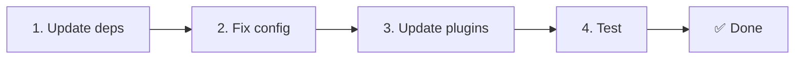

# 📦 v2.x から v3.x へのアップグレード

<Tip>
[nuxt-i18n からの移行](/migration/from-nuxtjs-i18n) は、nuxt-i18n-micro v2 からではなく、vue-i18n エコシステムからの移行を扱います。
</Tip>

v3.0.0 は根本的なアーキテクチャの変更を導入します。ストラテジーパッケージ、新しいキャッシュシステム、`useI18nLocale()` による集中的なロケール管理、再設計されたリダイレクトパイプラインです。このセクションではすべての破壊的変更と、コードを更新する方法について説明します。

## 移行手順



## 破壊的変更の概要

- **ロケール状態** — 手動の `useState` / `useCookie` → `useI18nLocale()` コンポーザブル
- **設定へのアクセス** — `useRuntimeConfig().public.i18nConfig` → `#build/i18n.strategy.mjs` からの `getI18nConfig()`
- **リダイレクトコンポーネント** — `fallbackRedirectComponentPath` オプション → サーバーリダイレクトプラグイン + クライアントルートミドルウェア(自動)
- **`includeDefaultLocaleRoute`** — サポート(非推奨)→ 削除。代わりに `strategy` オプションを使用します。
- **`experimental.hmr`** — `experimental` 配下 → ルートレベルのオプション
- **`previousPageFallback`** — 完全に削除(累積マージ戦略が自動的にこれを処理します)
- **キャッシュ** — `useStorage('cache')` → `TranslationStorage` シングルトン(`globalThis` 上の `Symbol.for`)
- **SSR 転送** — ランタイム設定 → Nuxt ペイロード(v3 では `useState` を使用していましたが、現在はチャンクが `payload.data` に配置されます。[パフォーマンス](/guides/performance#server-side-payload-transfer) を参照)
- **ストラテジークラス** — 内部 → 個別のパッケージ (`@i18n-micro/route-strategy`、`@i18n-micro/path-strategy`)

## 削除: `fallbackRedirectComponentPath`

`fallbackRedirectComponentPath` オプションと `locale-redirect.vue` フォールバックコンポーネントは削除されました。リダイレクトロジックは以下によって処理されるようになりました。

1. **サーバーミドルウェア** (`i18n.global.ts`) — `event.context.i18n.locale` を設定
2. **サーバーリダイレクトプラグイン** (`06.redirect.ts`、サーバー専用) — レンダリング前の 302 リダイレクト
3. **クライアントルートミドルウェア** (`i18n-redirect.global.ts`) — ハイドレーション後の SPA リダイレクト

```diff
 i18n: {
   strategy: 'prefix_except_default',
-  fallbackRedirectComponentPath: '~/components/MyRedirect.vue',
 }
```

フォールバックコンポーネントにカスタムリダイレクトロジックがあった場合は、代わりにサーバープラグインに実装します。

```ts
// plugins/i18n-loader.server.ts
export default defineNuxtPlugin({
  name: 'i18n-custom-redirect',
  enforce: 'pre',
  order: -10,
  setup() {
    const { setLocale } = useI18nLocale()
    // 独自の検出ロジック
    setLocale(detectedLocale)
  },
})
```

## 削除: `includeDefaultLocaleRoute`

代わりに `strategy` オプションを使用します。

- `includeDefaultLocaleRoute: true` → `strategy: 'prefix'`
- `includeDefaultLocaleRoute: false` → `strategy: 'prefix_except_default'`(デフォルト)

```diff
 i18n: {
-  includeDefaultLocaleRoute: true,
+  strategy: 'prefix',
 }
```

## 設定アクセス: `getI18nConfig()` が `useRuntimeConfig` を置き換え

```diff
- const config = useRuntimeConfig()
- const cookieName = config.public.i18nConfig?.localeCookie || 'user-locale'
+ import { getI18nConfig } from '#build/i18n.strategy.mjs'
+ const { localeCookie: configCookie } = getI18nConfig()
+ const cookieName = configCookie ?? 'user-locale'
```

## ロケール管理: `useI18nLocale()` が手動状態を置き換え

v2 では `useState('i18n-locale')` や `useCookie('user-locale')` を直接使用していたかもしれません。v3 では、集中管理された `useI18nLocale()` コンポーザブルを使用します。

```diff
- const locale = useState('i18n-locale')
- const cookie = useCookie('user-locale')
- locale.value = 'fr'
- cookie.value = 'fr'
+ const { setLocale } = useI18nLocale()
+ setLocale('fr') // state と cookie の両方をアトミックに更新
```

詳しい例は [カスタム言語検出](/guides/custom-language-detection) を参照してください。

## 実験的オプションの移動 / 削除

`hmr` は `experimental` からルートレベルに移動しました。`previousPageFallback` は完全に削除されました。モジュールは累積的なディープマージ戦略(2 レベル深度)を使用するようになり、ページが重複するネストキーを共有している場合でも、遷移アニメーション中に前のページの翻訳を自動的に保持します。遷移アニメーションが完了すると、`page:transition:finish` フックがメモリから古いページのキーを消去します。

```diff
 i18n: {
-  experimental: {
-    hmr: true,
-    previousPageFallback: true
-  }
+  hmr: true,
+  // previousPageFallback は削除されました。自動的に処理されます。
 }
```

## リダイレクトアーキテクチャ (v3)

リダイレクトは 2 つのコンポーネントによって自動的に処理されるようになりました。

1. **サーバーサイド** (`06.redirect.ts`、サーバー専用): SSR 中に実行され、ページレンダリングの前に 302 リダイレクトを発行します。「エラーフラッシュ」はありません。
2. **クライアントサイド** (`i18n-redirect.global.ts`): SPA ナビゲーション時のグローバルルートミドルウェア。クエリ文字列とハッシュを保持します。

リダイレクトのロケール優先度:

1. `useState('i18n-locale')` — `useI18nLocale().setLocale()` で設定される
2. Cookie — `localeCookie` が設定されている場合
3. `Accept-Language` ヘッダー — `autoDetectLanguage: true` の場合
4. `defaultLocale` — フォールバック

標準的なセットアップではコード変更は不要です。

<Warning>
`redirects: true` を伴う `prefix` および `prefix_except_default` 戦略の場合、ページ再読み込み間でロケールを永続化するために `localeCookie: 'user-locale'` を設定してください。これがないと、リダイレクトは `Accept-Language` または `defaultLocale` のみを使用します。
</Warning>

## TypeScript: 内部モジュールの型(オプション)

`#i18n-internal/plural`、`#i18n-internal/strategy`、`#i18n-internal/config` などの内部インポートに関連する型エラーが発生した場合は、プロジェクトの `package.json` に `imports` セクションを追加します。

```json
{
  "imports": {
    "#i18n-internal/plural": "nuxt-i18n-micro/internals",
    "#i18n-internal/strategy": "nuxt-i18n-micro/internals",
    "#i18n-internal/config": "nuxt-i18n-micro/internals"
  }
}
```
