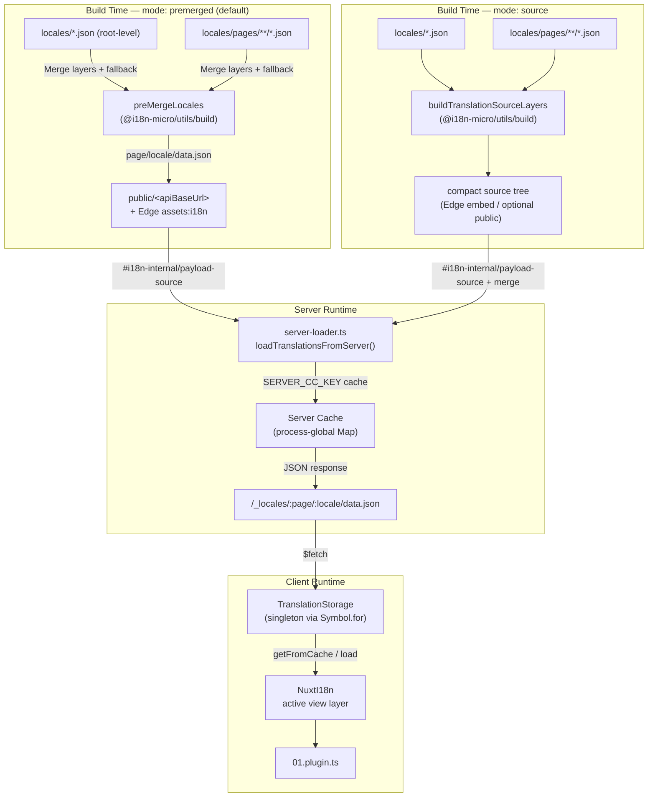

# 🗄️ 翻訳キャッシュとストレージのアーキテクチャ

## 📖 概要

Nuxt I18n Micro v3 は、翻訳向けに多層構造のキャッシングアーキテクチャを使用しています。ペイロードの読み込みは `translationPayloads.mode` に依存します:

- **`premerged`**（デフォルト） — ルート、ページ、フォールバック、レイヤーの各ファイルが、`@i18n-micro/utils/build` によってビルド時に `\{page\}/\{locale\}/data.json` へマージされます。
- **`source`** — コンパクトなソースファイルが保持され、`@i18n-micro/utils/source-loader` と `@i18n-micro/utils/merge-source` によりランタイムでマージされます（Edge では Nitro `serverAssets` に埋め込まれ、Node ではコピーされた場合 `public/` から読み込まれます）。

このページでは、組み込みのキャッシュがどのように機能するか、そして管理ツール・外部 API・キャッシュ無効化といったカスタム用途向けにどのように拡張できるかを説明します。

## 📊 アーキテクチャ概要

### データフロー



## 🧱 コアコンポーネント

### 1. `TranslationStorage`（クライアント + サーバー）

**ファイル**: `src/runtime/utils/storage.ts`

クライアントとサーバー双方向けの統一された翻訳ストレージを提供するシングルトンクラスです。複数のバンドルが読み込まれても唯一のインスタンスが存在することを保証するために、`globalThis` 上で `Symbol.for('__NUXT_I18N_STORAGE_CACHE__')` を使用します。

**主なメソッド:**

| メソッド                              | 説明                                                            |
| ----------------------------------- | ---------------------------------------------------------------------- |
| `getFromCache(locale, routeName?)`  | 同期チェック: キャッシュ済みのメモリ内データを返す、なければ `null`            |
| `load(locale, routeName?, options)` | キャッシング付き非同期読み込み: 先にキャッシュを確認し、なければ `$fetch` で取得 |
| `clear()`                           | キャッシュ全体をクリアする                                                |

**キャッシュキー形式**: `\{locale\}:\{routeName\}`（例: `en:index`、`fr:about`）

```typescript
import { translationStorage } from '../utils/storage'

// Synchronous cache check
const cached = translationStorage.getFromCache('en', 'index')

// Async load (with automatic caching)
const result = await translationStorage.load('en', 'index', {
  apiBaseUrl: '_locales',
  baseURL: '/',
  dateBuild: '2024-01-01',
})
// result.data — merged translations
// result.cacheKey — cache key used
```

### ⚙️ 決定的なキャッシュバスティング（`i18n.dateBuild`）

デフォルトでは、このモジュールはビルド時に `Date.now()` を使って `dateBuild` を生成します。生成された値は `#build/i18n.strategy.mjs` に埋め込まれ、リビルド後に翻訳フェッチキャッシュを無効化するためのクエリパラメータ（`?v=...`）として利用されます。

再現可能なビルドが必要な場合（例: ローリングデプロイでチャンクのキャッシュヒット率を上げたい場合）は、`nuxt.config` に安定した値を設定してください:

```ts
export default defineNuxtConfig({
  i18n: {
    // Any stable string/number (git SHA, CI build number, release tag, etc.)
    dateBuild: process.env.GIT_SHA ?? 'local-dev',
  },
})
```

### 2. `loadTranslationsFromServer()`（サーバー専用）

**ファイル**: `src/runtime/server/utils/server-loader.ts`

ロケール / ページ用の翻訳を読み込み、マージ結果を `@i18n-micro/hmr/cache-keys`（`SERVER_CC_KEY`）でキー付けされたプロセスグローバルな `CacheControl` マップにキャッシュします。

動作: SSR は `#i18n-internal/payload-source` から読み込みます — **Node** では `public/<apiBaseUrl>` 配下の `readFile`（premerged モードでは `\{page\}/\{locale\}/data.json`）、**Edge** では `assets:i18n`。`premerged` は 1 ファイルを読み、`source` は `@i18n-micro/utils/source-loader` 経由でルート / ページ / フォールバックをマージします。

```typescript
import { loadTranslationsFromServer } from '../server/utils/server-loader'

// Returns { data: Translations, json: string }
const { data, json } = await loadTranslationsFromServer('en', 'index')
```

### 3. クライアント読み込み（HTML への埋め込みなし）

辞書は `nuxtApp.payload` に **書き込まれません**。サーバーは SSR レンダリング用にメモリ内で保持し、クライアント側プラグインは `switchContext` を `await` して `/\{apiBaseUrl\}/:page/:locale/data.json` を読み込みます（`@nuxtjs/i18n` の `experimental.preload: false` と同じデフォルトの姿勢）。

`NuxtI18n` は、`$t()` や `$has()` が利用するアクティブなビュー層辞書を保持します。`NuxtTranslationLoader` はロケール / ルートコンテキストを切り替え、チャンクをその層にマージします。

### 4. サーバー API ルート

**ルート**: `/_locales/\{page\}/\{locale\}/data.json`

**ファイル**: `src/runtime/server/routes/i18n.ts`

この Nitro ルートは、アクティブなペイロードモードに応じたマージ済み翻訳を配信します。内部で `loadTranslationsFromServer()` を呼び出し、結果を JSON として返します。

本番では以下も設定します:

```http
Cache-Control: public, max-age={httpCacheDuration}, immutable
```

デフォルトの `httpCacheDuration` は `31536000`（1 年）です。クライアントは `?v=\{dateBuild\}` のキャッシュバスティング付きでペイロードを要求するため、この設定は安全です。ヘッダーを出力しない場合は `httpCacheDuration: 0` を設定します。開発モードではこのヘッダーは適用されません。

## 📥 拡張: カスタム翻訳読み込み

### キャッシュから読み取る（サーバールート）

```ts
// server/api/i18n/load-cache.[post].ts
import { defineEventHandler, readBody } from 'h3'
import { loadTranslationsFromServer } from '#imports'

export default defineEventHandler(async (event) => {
  const { page, locale } = await readBody<{ page: string; locale: string }>(event)
  const { data } = await loadTranslationsFromServer(locale, page)
  return { locale, page, data }
})
```

### 翻訳の更新（ファイル + キャッシュ無効化）

```ts
// server/api/i18n/update.[post].ts
import { defineEventHandler, readBody, createError } from 'h3'
import { join } from 'node:path'
import { readFile, writeFile } from 'node:fs/promises'
import { deepMergeTranslations } from '@i18n-micro/utils/deep-merge'

export default defineEventHandler(async (event) => {
  const { path, updates } = await readBody<{ path: string; updates: Record<string, unknown> }>(event)

  if (!path || !updates) {
    throw createError({ statusCode: 400, statusMessage: 'Missing path or updates' })
  }

  const fullPath = join('locales', path)
  let existing: Record<string, unknown> = {}

  try {
    const content = await readFile(fullPath, 'utf-8')
    existing = JSON.parse(content) as Record<string, unknown>
  } catch {
    // File does not exist — create new
  }

  const merged = deepMergeTranslations(existing, updates)
  await writeFile(fullPath, JSON.stringify(merged, null, 2), 'utf-8')

  return { success: true, path, updated: merged }
})
```

<Tip>

</Tip>

## 🧹 キャッシュのクリア

### プログラマティックなキャッシュクリア（クライアント）

組み込みの `$clearCache` メソッドを使用します:

```vue
<script setup>
const { $clearCache } = useNuxtApp()

// Clears both TranslationStorage and plugin-level cache
$clearCache()
</script>
```

### サーバーキャッシュの挙動

サーバー側キャッシュ（`loadTranslationsFromServer`）はプロセスグローバルで、以下のいずれかまで保持されます:

- サーバープロセスが再起動する
- 新しいデプロイが検出される（`dateBuild` の値が異なる）

サーバーレス環境では、コールドスタートごとに新しいキャッシュが生成されます。

## ⚙️ サーバーレス構成

サーバーレス環境（Cloudflare Workers、AWS Lambda）では、組み込みキャッシュはインメモリの `Map` オブジェクトを使用します。翻訳キャッシュ自体に外部ストレージの設定は不要です。

ただし、ソース翻訳ファイル用の Nitro ストレージには設定が必要な場合があります:

```ts
export default defineNuxtConfig({
  nitro: {
    storage: {
      // Only needed if default file-system storage is unavailable
      'assets:server': {
        driver: 'cloudflare-kv-binding',
        binding: 'MY_KV_NAMESPACE',
      },
    },
  },
})
```

## 💡 v2 からの主な違い

| 観点             | v2                            | v3                                                                       |
| ---------------- | ----------------------------- | ------------------------------------------------------------------------ |
| クライアントキャッシュ     | `useStorage('cache')`         | `TranslationStorage` シングルトン（globalThis 上の Symbol.for）                |
| SSR 転送     | ランタイム設定                | 完全なチャンクを `payload.data` 経由で（v3.0 は `useState` を使用）                    |
| サーバーキャッシュ     | Nitro キャッシュストレージ           | `Symbol.for` によるプロセスグローバル `Map`                                    |
| マージロジック      | クライアントサイド                   | ビルド時（`premerged`）またはランタイム（`source`）で `@i18n-micro/utils/*` 経由 |
| キャッシュキー形式 | `i18n:merged:\{page\}:\{locale\}` | `\{locale\}:\{routeName\}`                                                   |

## 📚 関連項目

- [パフォーマンスガイド](/guides/performance) — キャッシングがパフォーマンスに与える影響
- [サーバーサイド翻訳](/guides/server-side-translations) — サーバールートでの翻訳利用
- [Firebase デプロイ](/guides/firebase) — デプロイに固有のキャッシュ考慮事項
