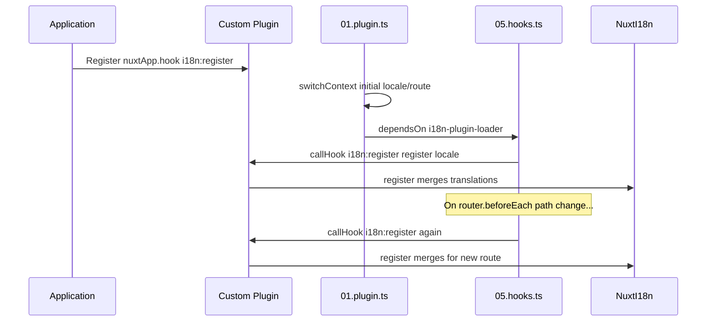

# 📢 イベント

## 🔄 `i18n:register`

`Nuxt I18n Micro` の `i18n:register` イベントを利用すると、アプリケーションの i18n コンテキストへ翻訳を動的に追加でき、国際化のプロセスをシームレスかつ柔軟にできます。このイベントを通じて必要に応じて新しい翻訳を組み込み、アプリケーションのローカライズ機能を強化できます。

### 📝 イベントの詳細

- **目的**:
  - 特定のロケール向けの既存翻訳セットに、追加の翻訳を動的に統合します。

- **ペイロード**:
  - **`register`**:
    - イベントから提供される関数で、2 つの引数を取ります:
      - **`translations`** (`Translations`):
        - `Translations` インターフェースに従って構成された、翻訳を表すキー・値ペアを含むオブジェクト。
      - **`locale`** (`string`、オプション):
        - 翻訳を登録する対象のロケールコード（例: `'en'`、`'ru'`）。指定がない場合は、イベントで提供されたロケールがデフォルトになります。

- **動作**:
  - トリガーされると、`register` 関数は新しい翻訳を指定ロケールの現在のコンテキストにマージし、アプリケーション全体で利用可能な翻訳を更新します。

### ⏱️ 発火タイミング

モジュールのフックプラグイン（`05.hooks.ts`、`dependsOn: ['i18n-plugin-loader']`）が `nuxtApp.callHook('i18n:register', …)` を呼び出します:

1. **起動時に一度** — メイン i18n プラグイン（`01.plugin.ts`）が初回ルートの翻訳を読み込んだ後
2. **ナビゲーション時** — パスが変わったときの `router.beforeEach` 内、または `strategy: 'no_prefix'` の場合はすべてのナビゲーション時

リスナーは通常の Nuxt プラグイン内で `nuxtApp.hook('i18n:register', …)` を使って登録してください。フックプラグインはローダーの準備完了後に実行されるため、翻訳の拡張が必要なタイミングでコールバックが呼び出されます。

`nuxt.config` で `hooks: false` を設定すると、`i18n:register` の自動呼び出しを無効化できます（[設定 — `hooks`](/guides/configuration#hooks) を参照）。

### 💡 使用例

以下は、`i18n:register` イベントを使って翻訳を動的に追加する例です:

```typescript
nuxt.hook('i18n:register', async (register: (translations: unknown, locale?: string) => void, locale: string) => {
  register(
    {
      greeting: 'Hello',
      farewell: 'Goodbye',
    },
    locale,
  )
})
```

### 🛠️ 解説



- **イベントのトリガー**:
  - フックプラグイン（`05.hooks.ts`）は、メインローダーが準備完了になった後および関連するナビゲーション時に `i18n:register` を発火します。

- **翻訳の追加**:
  - この例では `"greeting"` と `"farewell"` の英語訳を登録しています。
  - `register` 関数はこれらの翻訳を、指定ロケールの既存セットにマージします。

### 🔗 主なメリット

- **動的な更新**:
  - アプリケーション全体を再デプロイすることなく、翻訳を簡単に更新・追加できます。

- **ローカライズの柔軟性**:
  - ユーザーやアプリケーションのニーズに応じた、リアルタイムのローカライズ調整をサポートします。

`i18n:register` イベントを使うことで、アプリケーションのローカライズ戦略を柔軟かつ適応性の高いものに保ち、全体的なユーザー体験を向上させることができます。

---

## 🛠️ プラグインによる翻訳の変更

Nuxt アプリケーションで翻訳を動的に変更するには、プラグインの利用を推奨します。プラグインは、モジュールや外部翻訳ファイルを扱う際にも、ローカライズ更新を構造化された形で処理できる方法を提供します。

### **プラグインの登録**

モジュールを使用している場合、翻訳の変更を行うプラグインをモジュール設定に追加して登録します:

```javascript
addPlugin({
  src: resolve('./plugins/extend_locales'),
})
```

これは `./plugins/extend_locales` に配置されたプラグインを登録します。このプラグインが、翻訳の動的な読み込みと登録を担います。

### **プラグインの実装**

プラグイン内でロケールの変更を管理できます。以下は Nuxt プラグインの実装例です:

```typescript
import { defineNuxtPlugin } from '#app'

export default defineNuxtPlugin(async (nuxtApp) => {
  // Function to load translations from JSON files and register them
  const loadTranslations = async (lang: string) => {
    try {
      const translations = await import(`../locales/${lang}.json`)
      return translations.default
    } catch (error) {
      console.error(`Error loading translations for language: ${lang}`, error)
      return null
    }
  }

  // Hook into the 'i18n:register' event to dynamically add translations
  // eslint-disable-next-line @typescript-eslint/ban-ts-comment
  // @ts-expect-error
  nuxtApp.hook('i18n:register', async (register: (translations: unknown, locale?: string) => void, locale: string) => {
    const translations = await loadTranslations(locale)
    if (translations) {
      register(translations, locale)
    }
  })
})
```

### 📝 詳細な解説

1. **翻訳の読み込み**:

- `loadTranslations` 関数は、ロケールに応じて翻訳ファイルを動的にインポートします。ファイルは `locales` ディレクトリに、ロケールコード（例: `en.json`、`de.json`）で命名されている前提です。
- 読み込みが成功すれば翻訳を返し、失敗した場合はエラーをログ出力します。

2. **翻訳の登録**:

- プラグインは `nuxtApp.hook` を用いて `i18n:register` イベントにフックします。
- イベントがトリガーされると、`register` 関数が読み込んだ翻訳と対応するロケールとともに呼び出されます。
- これにより新しい翻訳が指定ロケールの i18n コンテキストにマージされ、アプリケーション全体で利用可能な翻訳が更新されます。

### 🔗 プラグインを使うメリット

- **関心の分離**:
  - ローカライズロジックをメインアプリケーションコードから分離してカプセル化でき、管理と保守が容易になります。

- **動的でスケーラブル**:
  - 翻訳を動的に読み込み・登録することで、アプリケーション全体の再デプロイなしにコンテンツを更新できます。頻繁に更新される多言語コンテンツを扱うアプリで特に有効です。

- **ローカライズ柔軟性の強化**:
  - プラグインを使えば必要に応じて翻訳を変更・拡張でき、ユーザーの好みやビジネス要件に応じた、より柔軟で応答性の高いローカライズ戦略を実現できます。

このアプローチを採用することで、プラグインを通じて構造化された保守可能な方法でアプリケーションのローカライズを効率的に拡張・変更でき、変化するニーズに国際化を適応させ、全体的なユーザー体験を向上できます。
