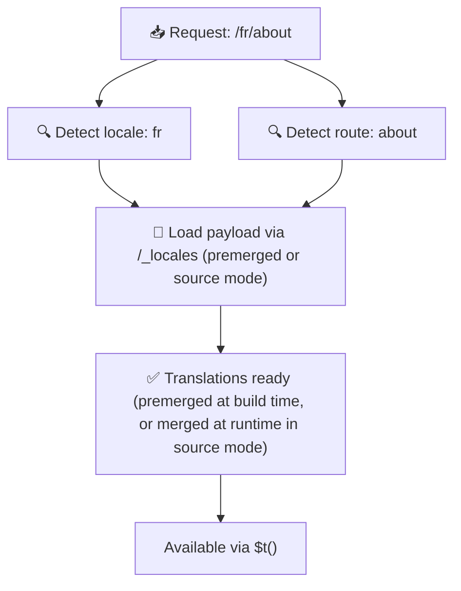

# 📂 フォルダ構成ガイド

## 📖 はじめに

翻訳ファイルを効率的に整理することは、スケーラブルで効率的な国際化（i18n）システムを維持する上で不可欠です。`Nuxt I18n Micro` は、ルートレベルとページ固有の翻訳を管理する明確なアプローチによってこのプロセスを簡素化します。このガイドでは、推奨されるフォルダ構造を紹介し、`Nuxt I18n Micro` がこれらの翻訳をどう扱うかを解説します。

## 🗂️ 推奨フォルダ構成

`Nuxt I18n Micro` は、翻訳を `pages` ディレクトリ配下のルートレベルファイルとページ固有ファイルに整理します。`translationPayloads.mode: 'premerged'`（デフォルト）の場合、ルートレベルの翻訳はビルド時に各ページファイルへ自動的にマージされるため、ランタイムでのマージオーバーヘッドなしに、各ページが完全な翻訳セットを持ちます。

`mode: 'source'` では、ソースファイルは Nitro アセット内で分離されたまま保持され、`/_locales` ルート経由でランタイムにマージされます。[サーバーレスペイロード出力](/guides/performance#serverless-payload-output) を参照してください。

### 🔧 基本構成

以下は、従うべきフォルダ構成の基本例です:

```text
locales/
├── pages/
│   ├── index/
│   │   ├── en.json
│   │   ├── fr.json
│   │   └── ar.json
│   ├── about/
│   │   ├── en.json
│   │   ├── fr.json
│   │   └── ar.json
├── en.json
├── fr.json
└── ar.json

```

### 📄 構成の解説

#### 1. 🌍 ルートレベルの翻訳ファイル

- **パス:** `/locales/\{locale\}.json`（例: `/locales/en.json`）
- **目的:** アプリケーション全体で共有される翻訳（ナビゲーションメニュー、ヘッダー、フッターなど）を格納します。`mode: 'premerged'`（デフォルト）では、ビルド時に各ページ固有ファイルへ自動的にマージされ、サーバーは各ページに対して事前ビルドされた 1 つのファイルを返します。

  **内容例（`/locales/en.json`）:**

  ```json
  {
    "menu": {
      "home": "Home",
      "about": "About Us",
      "contact": "Contact"
    },
    "footer": {
      "copyright": "© 2024 Your Company"
    }
  }
  ```

#### 2. 📄 ページ固有の翻訳ファイル

- **パス:** `/locales/pages/\{routeName\}/\{locale\}.json`（例: `/locales/pages/index/en.json`）
- **目的:** 個別のページ専用の翻訳を格納します。`mode: 'premerged'`（デフォルト）では、ビルド時にルートレベル翻訳がベースとしてマージされ、各ページファイルが自己完結型になります。

  **内容例（`/locales/pages/index/en.json`）:**

  ```json
  {
    "title": "Welcome to Our Website",
    "description": "We offer a wide range of products and services to meet your needs."
  }
  ```

  **内容例（`/locales/pages/about/en.json`）:**

  ```json
  {
    "title": "About Us",
    "description": "Learn more about our mission, vision, and values."
  }
  ```

### 📂 動的ルートおよびネストされたパスの扱い

`Nuxt I18n Micro` は、ルート内の動的セグメントやネストされたパスを、独自の改名規則に基づき自動的にフラットなフォルダ構造へ変換します。これにより、翻訳が一貫した、アクセスしやすい形式で保存されます。

#### 動的ルートの翻訳フォルダ構成

`/products/[id]` のような動的ルートを扱う場合、モジュールは動的セグメント `[id]` をファイル構造内で静的な形式に変換します。

**動的ルートのフォルダ構成例:**

`/products/[id]` のようなルートに対して、翻訳ファイルは `products-id` という名前のフォルダに格納されます:

```text
locales/pages/
├── products-id/
│   ├── en.json
│   ├── fr.json
│   └── ar.json

```

**ネストされた動的ルートのフォルダ構成例:**

`/products/key/[id]` のようなネストされたルートに対しては、翻訳ファイルは `products-key-id` という名前のフォルダに格納されます:

```text
locales/pages/
├── products-key-id/
│   ├── en.json
│   ├── fr.json
│   └── ar.json

```

**多階層のネストされたルートのフォルダ構成例:**

`/products/category/[id]/details` のようなより複雑なネストルートでは、翻訳ファイルは `products-category-id-details` という名前のフォルダに格納されます:

```text
locales/pages/
├── products-category-id-details/
│   ├── en.json
│   ├── fr.json
│   └── ar.json

```

### 🛠 ディレクトリ構造のカスタマイズ

異なるディレクトリに翻訳を置きたい場合、`Nuxt I18n Micro` は翻訳ファイル格納ディレクトリのカスタマイズを許可しています。`nuxt.config.ts` で設定できます。

**例: 翻訳ディレクトリのカスタマイズ**

```typescript
export default defineNuxtConfig({
  i18n: {
    translationDir: 'i18n', // Custom directory path
  },
})
```

これにより、`Nuxt I18n Micro` はデフォルトの `/locales` の代わりに `/i18n` ディレクトリで翻訳ファイルを探すようになります。

## ⚙️ 翻訳の読み込みの仕組み

### 🌍 動的なロケールルート

`Nuxt I18n Micro` は、翻訳を効率的に読み込むために動的なロケールルートを使用します。ユーザーがページを訪れると、モジュールは適切なロケールを判定し、現在のルートとロケールに基づいて対応する翻訳ファイルを読み込みます。



例:

- `/en/index` を訪れると `/locales/pages/index/en.json` から翻訳が読み込まれます。
- `/fr/about` を訪れると `/locales/pages/about/fr.json` から翻訳が読み込まれます。

この方式により、必要な翻訳のみが読み込まれ、サーバー負荷とクライアント性能の両方が最適化されます。

### 💾 キャッシングとプリレンダリング

さらなるパフォーマンス向上のため、`Nuxt I18n Micro` は翻訳ファイルのキャッシングとプリレンダリングをサポートします:

- **キャッシング**: 一度読み込まれた翻訳ファイルは以降のリクエスト向けにキャッシュされ、同じデータを繰り返し取得する必要がなくなります。
- **プリレンダリング**: ビルド時に、設定済みのすべてのロケールとルート向けに翻訳ファイルをプリレンダリングでき、ランタイムの遅延なしにサーバーから直接配信可能になります。

## 📝 ベストプラクティス

### 📂 ページ固有ファイルを賢く使う

ページ固有ファイルを活用して翻訳を整理しましょう。これにより各ページの翻訳が軽量かつ高速に読み込めるようになり、コンテンツが複雑または大量のページで特に重要です。

### 🔑 翻訳キーを一貫させる

ファイル全体で翻訳キーに一貫した命名規則を使用してください。これにより明確さが保たれ、アプリケーションが拡大するにつれて翻訳を管理する際の問題を防げます。

### 🗂️ コンテキストごとに翻訳を整理

関連する翻訳をファイル内でまとめて配置しましょう。たとえば、ボタンラベルはすべて `buttons` キー配下に、フォーム関連のテキストは `forms` キー配下にまとめます。これは可読性を高めるだけでなく、異なるロケール間の翻訳管理も容易にします。

### ⚠️ ネストの深さ制限（2 レベル推奨）

クライアントサイドのナビゲーション中、`Nuxt I18n Micro` は最適化された 2 レベルのディープマージを使って、離れるページと入るページの翻訳を結合します。これにより、重複するネストキー（例: 両方のページに `common.*` 配下のキーがある場合）が遷移アニメーション中に保持されます。

**これは、標準的な `セクション → キー → 値` 構造（2 レベル）で正しく動作します:**

```json
// Page A translations
{ "common": { "fromA": "Text A" } }

// Page B translations
{ "common": { "fromB": "Text B" } }

// During transition, both are available:
// { "common": { "fromA": "Text A", "fromB": "Text B" } }
```

**ただし、3 レベル以上のネストを使うと、より深いキーが遷移中に上書きされることがあります:**

```json
// Page A translations
{ "auth": { "form": { "login": "Login" } } }

// Page B translations
{ "auth": { "form": { "register": "Register" } } }

// During transition: "login" key is lost
// { "auth": { "form": { "register": "Register" } } }
```

<Tip>

</Tip>

### 🧹 未使用翻訳の定期的なクリーンアップ

時間が経つと、機能の削除や再構成により、使われない翻訳キーが蓄積することがあります。翻訳ファイルを定期的に見直し、軽量で保守しやすい状態に保ちましょう。
