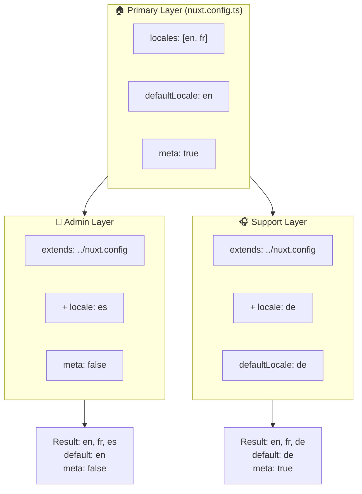

# 🗂️ `Nuxt I18n Micro` のレイヤー

## 📖 レイヤーの概要

`Nuxt I18n Micro` のレイヤーを使えば、アプリケーションのさまざまな部分でローカライズ設定を柔軟に管理・カスタマイズできます。異なるレイヤーを定義することで、サイトの特定セクション向けに設定を上書きしたり、他の箇所から拡張可能な再利用可能なベース設定を作成するなど、コンテキストに応じた設定変更が可能です。

### レイヤー継承のフロー



## 🛠️ プライマリ設定レイヤー

**プライマリ設定レイヤー** は、アプリケーション全体のデフォルトのローカライズ設定を行う場所です。サポートするロケール、デフォルト言語、その他の重要な i18n 設定を含むグローバル構成を定義するため、必須のレイヤーです。

### 📄 例: プライマリ設定レイヤーの定義

以下は、`nuxt.config.ts` でプライマリ設定レイヤーを定義する例です:

```typescript
export default defineNuxtConfig({
  i18n: {
    locales: [
      { code: 'en', iso: 'en-EN', dir: 'ltr' },
      { code: 'fr', iso: 'fr-FR', dir: 'ltr' },
      { code: 'ar', iso: 'ar-SA', dir: 'rtl' },
    ],
    defaultLocale: 'en', // The default locale for the entire app
    translationDir: 'locales', // Directory where translations are stored
    meta: true, // Automatically generate SEO-related meta tags like `alternate`
    autoDetectLanguage: true, // Automatically detect and use the user's preferred language
  },
})
```

## 🌱 子レイヤー

子レイヤーは、アプリケーションの特定部分向けにプライマリ設定を拡張・上書きするために使います。たとえば、追加のロケールを導入したり、特定セクションのデフォルトロケールを変更したい場面などです。子レイヤーは、モジュラーなアプリで各部分が異なるローカライズ要件を持つ場合に特に有用です。

### 📄 例: 子レイヤーでプライマリレイヤーを拡張する

追加のロケールをサポートしたいセクションや、特定のコンテキストで特定ロケールを無効化したい場合は、プライマリ設定レイヤーを拡張して以下のように実現できます:

```typescript
// basic/nuxt.config.ts (Primary Layer)
export default defineNuxtConfig({
  i18n: {
    locales: [
      { code: 'en', iso: 'en-EN', dir: 'ltr' },
      { code: 'fr', iso: 'fr-FR', dir: 'ltr' },
    ],
    defaultLocale: 'en',
    meta: true,
    translationDir: 'locales',
  },
})
```

```typescript
// extended/nuxt.config.ts (Child Layer)
export default defineNuxtConfig({
  extends: '../basic', // Inherit the base configuration from the 'basic' layer
  i18n: {
    locales: [
      { code: 'en', iso: 'en-EN', dir: 'ltr' }, // Inherited from the base layer
      { code: 'fr', iso: 'fr-FR', dir: 'ltr' }, // Inherited from the base layer
      { code: 'de', iso: 'de-DE', dir: 'ltr' }, // Added in the child layer
    ],
    defaultLocale: 'fr', // Override the default locale to French for this section
    autoDetectLanguage: false, // Disable automatic language detection in this section
  },
})
```

### 🌐 モジュラーアプリケーションでのレイヤー活用

より大規模でモジュラーな Nuxt アプリケーションでは、複数のセクションがそれぞれ独自の i18n 設定を必要とする場合があります。レイヤーを活用することで、クリーンでスケーラブルな構成構造を維持できます。

### 📄 例: モジュラーアプリケーションでのレイヤー構成

EC サイトを想像してみてください。メインサイト、管理パネル、カスタマーサポートポータルといった別々のセクションを持ち、それぞれ異なるロケールセットやその他の i18n 設定を必要とするかもしれません。

#### **プライマリレイヤー（グローバル設定）:**

```typescript
// nuxt.config.ts
export default defineNuxtConfig({
  i18n: {
    locales: [
      { code: 'en', iso: 'en-EN', dir: 'ltr' },
      { code: 'fr', iso: 'fr-FR', dir: 'ltr' },
    ],
    defaultLocale: 'en',
    meta: true,
    translationDir: 'locales',
    autoDetectLanguage: true,
  },
})
```

#### **管理パネル用の子レイヤー:**

```typescript
// admin/nuxt.config.ts
export default defineNuxtConfig({
  extends: '../nuxt.config', // Inherit the global settings
  i18n: {
    locales: [
      { code: 'en', iso: 'en-EN', dir: 'ltr' }, // Inherited
      { code: 'fr', iso: 'fr-FR', dir: 'ltr' }, // Inherited
      { code: 'es', iso: 'es-ES', dir: 'ltr' }, // Specific to the admin panel
    ],
    defaultLocale: 'en',
    meta: false, // Disable automatic meta generation in the admin panel
  },
})
```

#### **カスタマーサポートポータル用の子レイヤー:**

```typescript
// support/nuxt.config.ts
export default defineNuxtConfig({
  extends: '../nuxt.config', // Inherit the global settings
  i18n: {
    locales: [
      { code: 'en', iso: 'en-EN', dir: 'ltr' }, // Inherited
      { code: 'fr', iso: 'fr-FR', dir: 'ltr' }, // Inherited
      { code: 'de', iso: 'de-DE', dir: 'ltr' }, // Specific to the support portal
    ],
    defaultLocale: 'de', // Default to German in the support portal
    autoDetectLanguage: false, // Disable automatic language detection
  },
})
```

このモジュラー例では:

- 各セクション（admin、support）が独自の i18n 設定を持ちつつ、いずれもベース設定を継承します。
- 管理パネルはスペイン語（`es`）を追加ロケールとし、メタタグ生成を無効化します。
- サポートポータルはドイツ語（`de`）を追加ロケールとし、UI のデフォルトをドイツ語にします。

## 📝 レイヤー利用のベストプラクティス

- **🔧 プライマリレイヤーはシンプルに:** アプリ全体に共通する最も一般的な設定をプライマリレイヤーに置き、一貫性を保つためにシンプルに保ちましょう。
- **⚙️ 子レイヤーは特定のカスタマイズに:** 必要な場合にのみ、子レイヤーで設定を上書き・拡張してください。こうすることで構成の複雑化を避けられます。
- **📚 レイヤーをドキュメント化:** プロジェクト内の各レイヤーの目的と詳細を明確にドキュメント化しましょう。これにより明確さが保たれ、他の人（あるいは未来の自分）が設定を理解しやすくなります。
