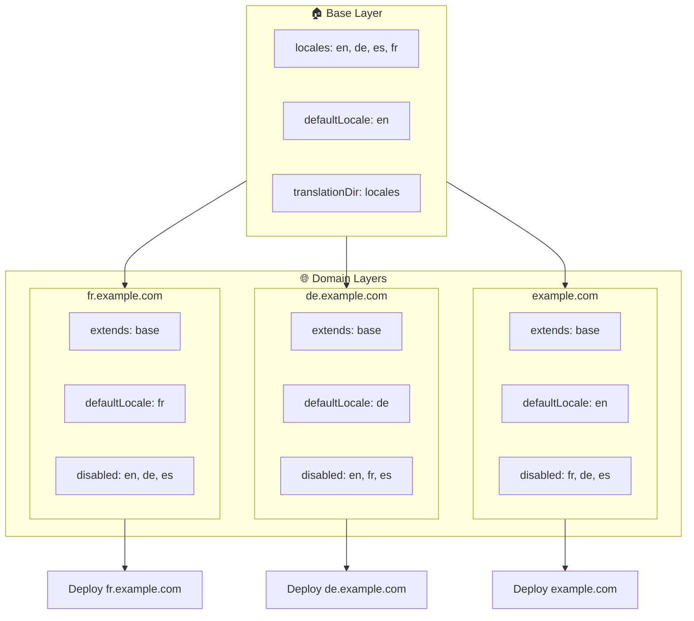

# 🌍 レイヤーを使った `Nuxt I18n Micro` のマルチドメインロケール設定

## 📝 はじめに

`Nuxt I18n Micro` のレイヤーを活用することで、柔軟で保守しやすいマルチドメインローカライズ環境を構築できます。このアプローチは複雑な機能を排してドメイン管理を簡素化するだけでなく、負荷分散を効率的に行い、プロジェクトの複雑性を減らすことにも役立ちます。ロケールごとに個別のプロジェクトを走らせることで、アプリケーションは複数ドメインをまたぐ異なるロケール要件に応じて容易にスケール・適応でき、グローバルアプリケーション向けの堅牢でスケーラブルなソリューションとなります。

## 🎯 目的

子レイヤーで設定をカスタマイズし、ドメインごとに特定のロケールを配信する構成を作成します。Nuxt のレイヤーシステムを活用し、ベース設定を維持しつつドメインごとに拡張・変更できます。

### マルチドメインアーキテクチャ



## 🛠 マルチドメインロケールの実装手順

### 1. **ベースレイヤーの作成**

まず、アプリケーションに共通するロケール設定をすべて含むベース設定レイヤーを作成します。これは他のドメイン固有設定の基盤となります。

#### **ベースレイヤーの設定**

ベース設定ファイル `base/nuxt.config.ts` を作成します:

```typescript
// base/nuxt.config.ts

export default defineNuxtConfig({
  i18n: {
    locales: [
      { code: 'en', iso: 'en-US', dir: 'ltr' },
      { code: 'de', iso: 'de-DE', dir: 'ltr' },
      { code: 'es', iso: 'es-ES', dir: 'ltr' },
    ],
    defaultLocale: 'en',
    translationDir: 'locales',
    meta: true,
    autoDetectLanguage: true,
  },
})
```

### 2. **ドメイン固有の子レイヤーを作成**

各ドメインについて、ベース設定を修正してそのドメイン固有の要件を満たす子レイヤーを作成します。特定ドメインで不要なロケールを無効化できます。

#### **例: フランスドメインの設定**

`fr/nuxt.config.ts` にフランスドメイン用の子レイヤー設定を作成します:

```typescript
// fr/nuxt.config.ts

export default defineNuxtConfig({
  extends: '../base', // Inherit from the base configuration

  i18n: {
    locales: [
      { code: 'en', iso: 'en-US', dir: 'ltr', disabled: true }, // Disable English
      { code: 'fr', iso: 'fr-FR', dir: 'ltr' }, // Add and enable the French locale
      { code: 'de', iso: 'de-DE', dir: 'ltr', disabled: true }, // Disable German
      { code: 'es', iso: 'es-ES', dir: 'ltr', disabled: true }, // Disable Spanish
    ],
    defaultLocale: 'fr', // Set French as the default locale
    autoDetectLanguage: false, // Disable automatic language detection
  },
})
```

#### **例: ドイツドメインの設定**

同様に、`de/nuxt.config.ts` にドイツドメイン用の子レイヤー設定を作成します:

```typescript
// de/nuxt.config.ts

export default defineNuxtConfig({
  extends: '../base', // Inherit from the base configuration

  i18n: {
    locales: [
      { code: 'en', iso: 'en-US', dir: 'ltr', disabled: true }, // Disable English
      { code: 'fr', iso: 'fr-FR', dir: 'ltr', disabled: true }, // Disable French
      { code: 'de', iso: 'de-DE', dir: 'ltr' }, // Use the German locale
      { code: 'es', iso: 'es-ES', dir: 'ltr', disabled: true }, // Disable Spanish
    ],
    defaultLocale: 'de', // Set German as the default locale
    autoDetectLanguage: false, // Disable automatic language detection
  },
})
```

### 3. **ドメインごとにアプリケーションをデプロイ**

各ドメインに対して適切な設定でアプリケーションをデプロイします。例:

- `fr` レイヤー設定を `fr.example.com` にデプロイ。
- `de` レイヤー設定を `de.example.com` にデプロイ。

### 4. **ロケールごとに複数プロジェクトを用意する**

各ロケール・ドメインについて、アプリケーションの個別インスタンスを走らせる必要があります。これにより、各ドメインが正しいロケール設定を配信し、負荷分散を最適化しつつプロジェクト構造を単純化できます。ロケールごとにカスタマイズされた複数プロジェクトを走らせることで、設定間の明確な分離を維持し、全体構成の複雑性を減らせます。

### 5. **ドメインに基づくルーティングの設定**

ユーザーがアクセスしているドメインに応じて、正しいプロジェクトへ誘導するようルーティングを構成します。これにより、各ドメインが適切なロケールを配信し、地域間で一貫したユーザー体験が得られます。

### 6. **デプロイと検証**

レイヤーを設定し各ドメインへデプロイした後、各ドメインが正しいロケールを配信していることを確認します。ドメインに応じて正しいロケールが読み込まれることを、アプリケーションを徹底的にテストして検証してください。

## 📝 ベストプラクティス

- **ベース設定は汎用的に**: ベース設定は、すべてのドメインに適用可能な一般設定に留めるべきです。
- **ドメイン固有ロジックの分離**: ドメイン固有の設定はそれぞれのレイヤーに閉じ込め、関心の分離と明確さを維持しましょう。

## 🎉 結論

`Nuxt I18n Micro` のレイヤーを活用することで、柔軟で保守しやすいマルチドメインローカライズを構築できます。このアプローチは、複雑なドメイン管理機能を不要にするだけでなく、負荷を効率的に分散し、プロジェクトの複雑性を減らすことにも役立ちます。ロケールごとに個別のプロジェクトを走らせることで、アプリケーションを容易にスケールさせ、多様なドメインをまたぐ異なるロケール要件に適応させることができ、グローバルアプリケーション向けの堅牢でスケーラブルなソリューションを提供します。
