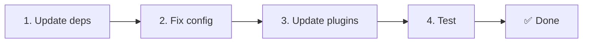

# 📦 v2.x から v3.x へのアップグレード

<Tip>
[nuxt-i18n からの移行](/migration/from-nuxtjs-i18n) も参照してください — こちらのガイドは vue-i18n エコシステムからの移行を扱っており、nuxt-i18n-micro の v2 からの移行ではありません。
</Tip>

v3.0.0 では、根本的なアーキテクチャ変更が導入されています: ストラテジーパッケージ、新しいキャッシングシステム、`useI18nLocale()` による集中化されたロケール管理、そして再設計されたリダイレクトパイプラインです。このセクションでは、すべての破壊的変更とコードの更新方法について解説します。

## 移行手順



## 破壊的変更のまとめ

- **ロケール状態** — 手動での `useState` / `useCookie` → `useI18nLocale()` コンポーザブル
- **設定へのアクセス** — `useRuntimeConfig().public.i18nConfig` → `#build/i18n.strategy.mjs` からの `getI18nConfig()`
- **リダイレクトコンポーネント** — `fallbackRedirectComponentPath` オプション → サーバーリダイレクトプラグイン + クライアントルートミドルウェア（自動）
- **`includeDefaultLocaleRoute`** — サポート（非推奨）→ 削除、代わりに `strategy` オプションを使用
- **`experimental.hmr`** — `experimental` 配下 → ルートレベルのオプション
- **`previousPageFallback`** — 完全に削除（累積マージ戦略が自動的に処理）
- **キャッシング** — `useStorage('cache')` → `TranslationStorage` シングルトン（`globalThis` 上の `Symbol.for`）
- **SSR 転送** — ランタイム設定 → Nuxt ペイロード（v3 では `useState` を使用していましたが、現在チャンクは `payload.data` に配置されます。[パフォーマンス](/guides/performance#server-side-payload-transfer) を参照）
- **ストラテジークラス** — 内部 → 別パッケージ化（`@i18n-micro/route-strategy`、`@i18n-micro/path-strategy`）

## 削除: `fallbackRedirectComponentPath`

`fallbackRedirectComponentPath` オプションと `locale-redirect.vue` フォールバックコンポーネントは削除されました。リダイレクトロジックは、現在以下によって処理されます:

1. **サーバーミドルウェア**（`i18n.global.ts`） — `event.context.i18n.locale` を設定
2. **サーバーリダイレクトプラグイン**（`06.redirect.ts`、サーバー専用） — レンダリング前に 302 リダイレクト
3. **クライアントルートミドルウェア**（`i18n-redirect.global.ts`） — ハイドレーション後の SPA リダイレクト

```diff
 i18n: {
   strategy: 'prefix_except_default',
-  fallbackRedirectComponentPath: '~/components/MyRedirect.vue',
 }
```

フォールバックコンポーネントにカスタムのリダイレクトロジックがあった場合は、代わりにサーバープラグインとして実装してください:

```ts
// plugins/i18n-loader.server.ts
export default defineNuxtPlugin({
  name: 'i18n-custom-redirect',
  enforce: 'pre',
  order: -10,
  setup() {
    const { setLocale } = useI18nLocale()
    // Your custom detection logic
    setLocale(detectedLocale)
  },
})
```

## 削除: `includeDefaultLocaleRoute`

代わりに `strategy` オプションを使用してください:

- `includeDefaultLocaleRoute: true` → `strategy: 'prefix'`
- `includeDefaultLocaleRoute: false` → `strategy: 'prefix_except_default'`（デフォルト）

```diff
 i18n: {
-  includeDefaultLocaleRoute: true,
+  strategy: 'prefix',
 }
```

## 設定アクセス: `getI18nConfig()` が `useRuntimeConfig` を置き換え

```diff
- const config = useRuntimeConfig()
- const cookieName = config.public.i18nConfig?.localeCookie || 'user-locale'
+ import { getI18nConfig } from '#build/i18n.strategy.mjs'
+ const { localeCookie: configCookie } = getI18nConfig()
+ const cookieName = configCookie ?? 'user-locale'
```

## ロケール管理: `useI18nLocale()` が手動状態管理を置き換え

v2 では、`useState('i18n-locale')` や `useCookie('user-locale')` を直接使用していたかもしれません。v3 では、集中化された `useI18nLocale()` コンポーザブルを利用します:

```diff
- const locale = useState('i18n-locale')
- const cookie = useCookie('user-locale')
- locale.value = 'fr'
- cookie.value = 'fr'
+ const { setLocale } = useI18nLocale()
+ setLocale('fr') // Updates both state and cookie atomically
```

詳細な例については [カスタム言語検出](/guides/custom-language-detection) を参照してください。

## 実験的オプションの移動 / 削除

`hmr` は `experimental` からルートレベルに移動しました。`previousPageFallback` は完全に削除されました — モジュールは現在、累積的なディープマージ戦略（2 レベルの深さ）を使用しており、ページ間で重複するネストされたキーがあっても、遷移アニメーション中に前のページの翻訳を自動的に保持します。遷移アニメーションが完了すると、`page:transition:finish` フックが古いページのキーをメモリから削除します。

```diff
 i18n: {
-  experimental: {
-    hmr: true,
-    previousPageFallback: true
-  }
+  hmr: true,
+  // previousPageFallback removed — handled automatically
 }
```

## リダイレクトアーキテクチャ（v3）

リダイレクトは、以下の 2 つのコンポーネントによって自動的に処理されるようになりました:

1. **サーバーサイド**（`06.redirect.ts`、サーバー専用）: SSR 中に実行され、ページのレンダリング前に 302 リダイレクトを発行します — 「エラーの一瞬の表示」はありません。
2. **クライアントサイド**（`i18n-redirect.global.ts`）: SPA ナビゲーション時のグローバルルートミドルウェア。クエリ文字列とハッシュを保持します。

リダイレクトにおけるロケール優先度:

1. `useState('i18n-locale')` — `useI18nLocale().setLocale()` により設定される
2. Cookie — `localeCookie` が設定されている場合
3. `Accept-Language` ヘッダー — `autoDetectLanguage: true` の場合
4. `defaultLocale` — フォールバック

標準的な構成ではコード変更は不要です。

<Warning>
`redirects: true` を伴う `prefix` および `prefix_except_default` 戦略では、ページリロード間でロケールを永続化するために `localeCookie: 'user-locale'` を設定してください。設定しない場合、リダイレクトは `Accept-Language` または `defaultLocale` のみを利用します。
</Warning>

## TypeScript: 内部モジュールの型（任意）

`#i18n-internal/plural`、`#i18n-internal/strategy`、`#i18n-internal/config` のような内部インポートに関する型エラーが発生した場合は、プロジェクトの `package.json` に `imports` セクションを追加してください:

```json
{
  "imports": {
    "#i18n-internal/plural": "nuxt-i18n-micro/internals",
    "#i18n-internal/strategy": "nuxt-i18n-micro/internals",
    "#i18n-internal/config": "nuxt-i18n-micro/internals"
  }
}
```

<Tip>

</Tip>
