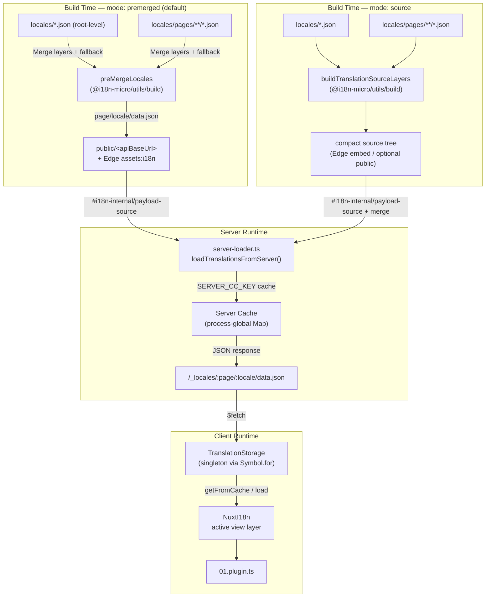

# 🗄️ 번역 캐시 및 저장소 아키텍처

## 📖 개요

Nuxt I18n Micro v3는 번역을 위해 다층 캐싱 아키텍처를 사용합니다. 페이로드 로딩은 `translationPayloads.mode`에 따라 다릅니다:

- **`premerged`** (기본값) — 루트, 페이지, 대체(fallback), 레이어 파일이 빌드 시 `@i18n-micro/utils/build`를 통해 `\{page\}/\{locale\}/data.json`으로 병합됩니다.
- **`source`** — 컴팩트 소스 파일이 런타임 병합을 위해 유지됩니다 (`@i18n-micro/utils/source-loader`와 `@i18n-micro/utils/merge-source` 사용; Edge는 Nitro `serverAssets`에 임베드하고, Node는 복사된 경우 `public/`에서 읽음).

이 페이지는 내장 캐시가 작동하는 방식과 사용자 정의 유스케이스(관리 도구, 외부 API, 캐시 무효화)를 위해 이를 확장하는 방법을 설명합니다.

## 📊 아키텍처 개요

### 데이터 흐름



## 🧱 핵심 컴포넌트

### 1. `TranslationStorage` (클라이언트 + 서버)

**파일**: `src/runtime/utils/storage.ts`

클라이언트와 서버 모두에 통합된 번역 저장소를 제공하는 싱글턴 클래스입니다. `globalThis`에서 `Symbol.for('__NUXT_I18N_STORAGE_CACHE__')`를 사용하여 여러 번들이 로드되더라도 인스턴스가 하나만 존재하도록 보장합니다.

**주요 메서드:**

| 메서드                                | 설명                                                                     |
| ----------------------------------- | ---------------------------------------------------------------------- |
| `getFromCache(locale, routeName?)`  | 동기 검사: 캐시된 메모리 내 데이터를 반환하거나 `null` 반환                                 |
| `load(locale, routeName?, options)` | 캐싱을 사용한 비동기 로드: 캐시를 먼저 확인한 다음 `$fetch`를 통해 페칭                          |
| `clear()`                           | 전체 캐시 지우기                                                              |

**캐시 키 형식**: `\{locale\}:\{routeName\}` (예: `en:index`, `fr:about`)

```typescript
import { translationStorage } from '../utils/storage'

// Synchronous cache check
const cached = translationStorage.getFromCache('en', 'index')

// Async load (with automatic caching)
const result = await translationStorage.load('en', 'index', {
  apiBaseUrl: '_locales',
  baseURL: '/',
  dateBuild: '2024-01-01',
})
// result.data — merged translations
// result.cacheKey — cache key used
```

### ⚙️ 결정론적 캐시 무효화 (`i18n.dateBuild`)

기본적으로 이 모듈은 빌드 타임에 `Date.now()`를 사용해 `dateBuild`를 생성합니다. 그런 다음 생성된 `#build/i18n.strategy.mjs`에 임베드되어 재빌드 후 번역 페치 캐시를 무효화하기 위한 쿼리 매개변수(`?v=...`)로 사용됩니다.

재현 가능한 빌드가 필요한 경우(예: 롤링 배포에서 청크 캐시 적중률을 개선하기 위해), `nuxt.config`에 안정적인 값을 설정하세요:

```ts
export default defineNuxtConfig({
  i18n: {
    // Any stable string/number (git SHA, CI build number, release tag, etc.)
    dateBuild: process.env.GIT_SHA ?? 'local-dev',
  },
})
```

### 2. `loadTranslationsFromServer()` (서버 전용)

**파일**: `src/runtime/server/utils/server-loader.ts`

로케일/페이지에 대한 번역을 로드하고, 병합된 결과를 `@i18n-micro/hmr/cache-keys`(`SERVER_CC_KEY`)로 키가 지정된 프로세스 전역 `CacheControl` 맵에 캐시합니다.

동작: SSR은 `#i18n-internal/payload-source`에서 로드됩니다 — **Node**는 `public/<apiBaseUrl>` 아래의 `readFile`(premerged 모드에서 `\{page\}/\{locale\}/data.json`), **Edge**는 `assets:i18n`. `premerged`는 하나의 파일을 읽습니다. `source`는 `@i18n-micro/utils/source-loader`를 통해 루트/페이지/대체를 병합합니다.

```typescript
import { loadTranslationsFromServer } from '../server/utils/server-loader'

// Returns { data: Translations, json: string }
const { data, json } = await loadTranslationsFromServer('en', 'index')
```

### 3. 클라이언트 로드 (HTML 임베드 없음)

사전은 `nuxtApp.payload`에 **작성되지 않습니다**. 서버는 SSR 렌더링을 위해 메모리에 유지하며, 클라이언트 플러그인은 `switchContext`를 `await`합니다. 이는 `/\{apiBaseUrl\}/:page/:locale/data.json`을 로드합니다 (`@nuxtjs/i18n`의 `experimental.preload: false`와 동일한 기본 자세).

`NuxtI18n`은 `$t()`와 `$has()`가 사용하는 활성 뷰 레이어 사전을 보유합니다. `NuxtTranslationLoader`는 로케일/라우트 컨텍스트를 전환하고 청크를 해당 레이어에 병합합니다.

### 4. 서버 API 라우트

**라우트**: `/_locales/\{page\}/\{locale\}/data.json`

**파일**: `src/runtime/server/routes/i18n.ts`

이 Nitro 라우트는 활성 페이로드 모드에 대해 병합된 번역을 제공합니다. `loadTranslationsFromServer()`를 호출하고 결과를 JSON으로 반환합니다.

프로덕션에서는 다음도 설정합니다:

```http
Cache-Control: public, max-age={httpCacheDuration}, immutable
```

기본 `httpCacheDuration`은 `31536000`(1년)입니다. 클라이언트가 `?v=\{dateBuild\}` 캐시 무효화로 페이로드를 요청하기 때문에 안전합니다. 헤더를 생략하려면 `httpCacheDuration: 0`으로 설정하세요. 개발 중에는 헤더가 적용되지 않습니다.

## 📥 확장: 사용자 정의 번역 로딩

### 캐시에서 읽기 (서버 라우트)

```ts
// server/api/i18n/load-cache.[post].ts
import { defineEventHandler, readBody } from 'h3'
import { loadTranslationsFromServer } from '#imports'

export default defineEventHandler(async (event) => {
  const { page, locale } = await readBody<{ page: string; locale: string }>(event)
  const { data } = await loadTranslationsFromServer(locale, page)
  return { locale, page, data }
})
```

### 번역 업데이트 (파일 + 캐시 무효화)

```ts
// server/api/i18n/update.[post].ts
import { defineEventHandler, readBody, createError } from 'h3'
import { join } from 'node:path'
import { readFile, writeFile } from 'node:fs/promises'
import { deepMergeTranslations } from '@i18n-micro/utils/deep-merge'

export default defineEventHandler(async (event) => {
  const { path, updates } = await readBody<{ path: string; updates: Record<string, unknown> }>(event)

  if (!path || !updates) {
    throw createError({ statusCode: 400, statusMessage: 'Missing path or updates' })
  }

  const fullPath = join('locales', path)
  let existing: Record<string, unknown> = {}

  try {
    const content = await readFile(fullPath, 'utf-8')
    existing = JSON.parse(content) as Record<string, unknown>
  } catch {
    // File does not exist — create new
  }

  const merged = deepMergeTranslations(existing, updates)
  await writeFile(fullPath, JSON.stringify(merged, null, 2), 'utf-8')

  return { success: true, path, updated: merged }
})
```


## 🧹 캐시 지우기

### 프로그래매틱 캐시 지우기 (클라이언트)

내장 `$clearCache` 메서드를 사용하세요:

```vue
<script setup>
const { $clearCache } = useNuxtApp()

// Clears both TranslationStorage and plugin-level cache
$clearCache()
</script>
```

### 서버 캐시 동작

서버 사이드 캐시(`loadTranslationsFromServer`)는 프로세스 전역이며 다음까지 지속됩니다:

- 서버 프로세스가 재시작됨
- 새 배포가 감지됨 (다른 `dateBuild` 값)

서버리스 환경의 경우 각 콜드 스타트마다 캐시가 비어 있습니다.

## ⚙️ 서버리스 설정

서버리스 환경(Cloudflare Workers, AWS Lambda)의 경우, 내장 캐시는 메모리 내 `Map` 객체를 사용합니다. 번역 캐시 자체에는 외부 저장소 설정이 필요하지 않습니다.

그러나 소스 번역 파일용 Nitro 저장소는 설정이 필요할 수 있습니다:

```ts
export default defineNuxtConfig({
  nitro: {
    storage: {
      // Only needed if default file-system storage is unavailable
      'assets:server': {
        driver: 'cloudflare-kv-binding',
        binding: 'MY_KV_NAMESPACE',
      },
    },
  },
})
```

## 💡 v2와의 주요 차이점

| 측면              | v2                            | v3                                                                       |
| ---------------- | ----------------------------- | ------------------------------------------------------------------------ |
| 클라이언트 캐시    | `useStorage('cache')`         | `TranslationStorage` 싱글턴 (globalThis의 Symbol.for)                     |
| SSR 전송          | 런타임 설정                     | `payload.data`를 통한 전체 청크 (v3.0은 `useState` 사용)                 |
| 서버 캐시         | Nitro 캐시 저장소               | `Symbol.for`를 통한 프로세스 전역 `Map`                                  |
| 병합 로직         | 클라이언트 사이드              | 빌드 타임(`premerged`) 또는 런타임(`source`) via `@i18n-micro/utils/*` |
| 캐시 키 형식      | `i18n:merged:\{page\}:\{locale\}` | `\{locale\}:\{routeName\}`                                                   |

## 📚 관련 항목

- [성능 가이드](/guides/performance) — 캐싱이 성능에 미치는 영향
- [서버 사이드 번역](/guides/server-side-translations) — 서버 라우트에서 번역 사용
- [Firebase 배포](/guides/firebase) — 배포별 캐시 고려사항
