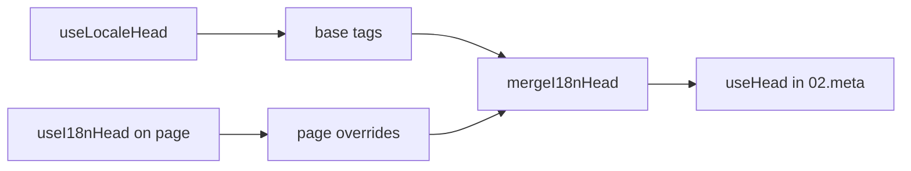

# `useI18nHead` 컴포저블

`useI18nHead`를 사용하면 사용자 정의 메타 플러그인 없이도 **페이지별로** i18n SEO 태그를 사용자 정의할 수 있습니다. `meta: true`인 경우, 모듈은 [`useLocaleHead`](/api/composables/use-locale-head) 출력 위에 입력을 병합합니다.

일반적인 경우:

- **CMS / 블로그 기사** — 일부 로케일만 번역됨; 대체 URL이 언어마다 다름 (다른 슬러그나 경로).
- **동적 canonical** — canonical URL이 `$switchLocalePath`가 아닌 API의 기사 URL과 일치해야 함.
- **추가 Open Graph** — 자동 생성된 `og:locale` / `og:url`과 함께 `og:title`, `og:description`, `og:image`.
- **부분 제어** — 모듈 생성 canonical과 `og:url`을 유지하되 `hreflang`과 `og:locale:alternate`만 대체.

---

## 시그니처

{/* generated:symbol:useI18nHead — do not edit; run `pnpm run docs:generate` */}

```ts
useI18nHead(input?: MaybeRefOrGetter<I18nHeadInput | null>): { pageHead: any; resetPageHead: () => void }
```

i18n SEO head 태그에 대한 페이지 수준 재정의를 등록합니다.
`02.meta` 플러그인이 `useLocaleHead` 출력 위에 병합합니다.

| 매개변수 | 유형 | 설명 |
| --- | --- | --- |
| `input` *(선택)* | `MaybeRefOrGetter<I18nHeadInput \| null>` |  |

{/* /generated:symbol:useI18nHead */}

## 파이프라인에서의 위치



페이지 컴포넌트에서 `useI18nHead`를 호출합니다. `02.meta` 플러그인은 각 `updateMeta()` 후에 재정의를 적용합니다(라우트 변경, `$setI18nRouteParams`, 클라이언트의 `page:finish`).

---

## 예제 1 — 일부 로케일에만 번역이 있는 기사

일반적인 패턴: API가 어떤 로케일이 존재하는지와 절대 또는 상대 URL을 반환합니다.

```ts
interface Article {
  title: string
  slug: string
  /** Locale code → page URL (absolute or site-relative) */
  locales: Record<string, string>
}
```

```vue
<script setup lang="ts">
const route = useRoute()
const { data: article } = await useFetch<Article>(`/api/articles/${route.params.slug}`)

const localeCodes = computed(() => Object.keys(article.value?.locales ?? {}))

useI18nHead(() => {
  if (!article.value) return null

  return {
    meta: [
      { property: 'og:title', content: article.value.title },
      { property: 'og:type', content: 'article' },
    ],
    replace: {
      hreflang: localeCodes.value.map((locale) => ({
        rel: 'alternate',
        hreflang: locale,
        href: article.value!.locales[locale]!,
      })),
      ogAlternates: localeCodes.value,
    },
  }
})
</script>
```

`ogAlternates`는 `i18n.locales` 설정에서 **로케일 코드**를 받습니다. `og:locale:alternate`의 값은 `locale.og` 또는 `iso`를 통해 해결됩니다 (Open Graph `en_US` 형식).

---

## 예제 2 — 로케일별 슬러그가 있는 기사 (`$defineI18nRoute` + `$setI18nRouteParams`)

URL이 지역화된 라우트 템플릿과 동적 매개변수에서 구성될 때:

```vue
<script setup lang="ts">
const { $defineI18nRoute, $setI18nRouteParams } = useNuxtApp()
const route = useRoute()

const { data: article } = await useFetch(`/api/articles/${route.params.slug}`)

$defineI18nRoute({
  localeRoutes: {
    en: '/blog/[slug]',
    de: '/de/blog/[slug]',
    fr: '/fr/blog/[slug]',
  },
})

if (article.value) {
  $setI18nRouteParams({
    en: { slug: article.value.slugEn },
    de: { slug: article.value.slugDe },
    fr: { slug: article.value.slugFr },
  })

  const availableLocales = article.value.availableLocales as string[]

  useI18nHead({
    meta: [{ property: 'og:title', content: article.value.title }],
    replace: {
      hreflang: availableLocales.map((locale) => ({
        rel: 'alternate',
        hreflang: locale,
        href: article.value!.urls[locale],
      })),
      ogAlternates: availableLocales,
    },
  })
}
</script>
```

모듈 생성 대체는 설정된 **모든** 로케일을 나열합니다. `replace.hreflang`은 실제 번역이 있는 로케일로 태그를 제한합니다.

---

## 예제 3 — 기본 로케일 기사 URL에 대한 사용자 정의 `x-default`

기본적으로 `x-default`는 `$switchLocalePath`의 기본 로케일 URL을 가리킵니다. 기사에서는 이를 기본 번역 URL로 향하게 합니다:

```vue
<script setup lang="ts">
const { $defaultLocale } = useNuxtApp()
const article = await loadArticle()

const defaultLocale = $defaultLocale() ?? 'en'
const defaultHref = article.locales[defaultLocale]

useI18nHead({
  replace: {
    hreflang: Object.entries(article.locales).map(([locale, href]) => ({
      rel: 'alternate',
      hreflang: locale,
      href,
    })),
    xDefault: defaultHref ? { rel: 'alternate', hreflang: 'x-default', href: defaultHref } : false,
    ogAlternates: Object.keys(article.locales),
  },
})
</script>
```

---

## 예제 4 — API 데이터에서 canonical과 `og:url` 대체

canonical이 CMS 제공 URL과 일치해야 할 때 (다중 도메인, 사용자 정의 경로 또는 사전 빌드된 절대 URL):

```vue
<script setup lang="ts">
const article = await loadArticle()
const canonical = article.canonicalUrl // e.g. https://www.example.com/en/blog/my-post

useI18nHead({
  replace: {
    canonical,
    ogUrl: canonical,
    hreflang: buildAlternateLinks(article),
    ogAlternates: Object.keys(article.locales),
  },
  meta: [
    { property: 'og:title', content: article.title },
    { name: 'description', content: article.excerpt },
  ],
})
</script>
```

---

## 예제 5 — 자동 canonical / `og:url` 유지, 대체만 대체

`$switchLocalePath` + `$setI18nRouteParams`가 이미 올바른 canonical과 `og:url`을 생성하는 경우, 검색 태그만 대체하세요:

```vue
<script setup lang="ts">
const article = await loadArticle()

useI18nHead({
  replace: {
    hreflang: buildAlternateLinks(article),
    ogAlternates: Object.keys(article.locales),
  },
})
</script>
```

---

## 예제 6 — 콘텐츠 상세 페이지의 전체 head (meta + 링크)

"페이지 메타"와 "대체 링크"를 별도의 헬퍼로 분리하는 것과 유사한 패턴. 한 번의 호출로 결합됩니다:

```vue
<script setup lang="ts">
const article = await loadArticle()
const alternates = Object.entries(article.locales).map(([locale, href]) => ({
  rel: 'alternate' as const,
  hreflang: locale,
  href: normalizeSeoUrl(href), // strip ?query and #hash if needed
}))

useI18nHead({
  meta: [
    { property: 'og:title', content: article.title },
    { property: 'og:description', content: article.description },
    { property: 'og:image', content: article.imageUrl },
    { name: 'twitter:card', content: 'summary_large_image' },
    { name: 'twitter:title', content: article.title },
  ],
  replace: {
    canonical: article.canonicalUrl,
    ogUrl: article.canonicalUrl,
    hreflang: alternates,
    ogAlternates: Object.keys(article.locales),
  },
})
</script>
```

```ts
/** Remove query and hash — useful when CMS URLs must be clean for SEO */
function normalizeSeoUrl(href: string): string {
  try {
    const url = new URL(href, 'https://placeholder.local')
    url.search = ''
    url.hash = ''
    return href.startsWith('http') ? url.href : `${url.pathname}`
  } catch {
    return href.split(/[?#]/)[0] ?? href
  }
}
```

---

## 예제 7 — 동일한 패턴의 두 가지 콘텐츠 유형 (뉴스 vs 가이드)

동일한 API 형태, 다른 라우트 이름 — 작은 헬퍼를 재사용:

```ts
// composables/useArticleHead.ts
import type { I18nHeadInput } from '@i18n-micro/types'

interface LocalizedContent {
  title: string
  locales: Record<string, string>
  canonicalUrl?: string
}

export function buildArticleHead(content: LocalizedContent): I18nHeadInput {
  const localeCodes = Object.keys(content.locales)
  const canonical = content.canonicalUrl ?? content.locales.en

  return {
    meta: [{ property: 'og:title', content: content.title }],
    replace: {
      canonical,
      ogUrl: canonical,
      hreflang: localeCodes.map((locale) => ({
        rel: 'alternate',
        hreflang: locale,
        href: content.locales[locale]!,
      })),
      ogAlternates: localeCodes,
    },
  }
}
```

```vue
<!-- pages/blog/[slug].vue -->
<script setup lang="ts">
const article = await loadArticle()
useI18nHead(buildArticleHead(article))
</script>
```

```vue
<!-- pages/guides/[slug].vue -->
<script setup lang="ts">
const guide = await loadGuide()
useI18nHead(buildArticleHead(guide))
</script>
```

---

## 예제 8 — 내장 대체 비활성화, 자체 목록 제공

모듈의 hreflang 생성기를 비활성화하고 사용자 정의 목록을 전달하는 것과 동일 (대체 세트가 중복되지 않음):

```vue
<script setup lang="ts">
const article = await loadArticle()

useI18nHead({
  disable: ['hreflang', 'x-default', 'og-alternates'],
  link: Object.entries(article.locales).map(([locale, href]) => ({
    rel: 'alternate',
    hreflang: locale,
    href,
  })),
  replace: {
    ogAlternates: Object.keys(article.locales),
  },
})
</script>
```

또는 `disable` 없이 `replace.hreflang`을 선호하세요 — 이는 모든 `rel="alternate"` 링크를 한 단계로 대체합니다.

---

## 예제 9 — 랜딩 페이지: 추가 OG만, 모든 i18n 태그 유지

```vue
<script setup lang="ts">
const { t } = useI18n()

useI18nHead({
  meta: [
    { property: 'og:title', content: t('landing.ogTitle') },
    { property: 'og:description', content: t('landing.ogDescription') },
  ],
})
</script>
```

---

## 예제 10 — 제품 페이지: 단일 로케일 실험을 위해 hreflang 비활성화

```vue
<script setup lang="ts">
useI18nHead({
  disable: ['hreflang', 'x-default'],
  // canonical, og:locale, og:url still generated
})
</script>
```

---

## 예제 11 — 클라이언트 사이드 페치 후 반응형 업데이트

```vue
<script setup lang="ts">
const article = ref<Article | null>(null)

onMounted(async () => {
  article.value = await $fetch('/api/articles/latest')
})

useI18nHead(() => {
  if (!article.value) return null
  return {
    meta: [{ property: 'og:title', content: article.value.title }],
    replace: {
      hreflang: Object.entries(article.value.locales).map(([locale, href]) => ({
        rel: 'alternate',
        hreflang: locale,
        href,
      })),
    },
  }
})
</script>
```

Head는 `page:finish`와 `pageHead` 상태가 변경될 때 새로 고쳐집니다.

---

## 예제 12 — 리버스 프록시 뒤의 HTTPS 원본

canonical / 대체 절대 URL을 위해 이전에 "공용 원본" 컴포저블을 해결했다면, 대신 모듈 설정을 사용하세요:

```ts
// nuxt.config.ts
export default defineNuxtConfig({
  i18n: {
    meta: true,
    // undefined = origin from current request (multi-domain friendly)
    metaBaseUrl: undefined,
    metaTrustForwardedHost: true,
    metaTrustForwardedProto: true,
  },
})
```

그런 다음 `replace.hreflang` / `replace.canonical`에 **경로 또는 전체 URL**을 전달합니다. 모듈은 SSR에서 `X-Forwarded-Host` / `X-Forwarded-Proto`와 함께 `useRequestURL`을 사용합니다.

---

## API 레퍼런스

### `meta`

추가 `<meta>` 태그. `id`, `property` 또는 `name`으로 중복 제거됩니다.

### `link`

추가 `<link>` 태그. `id` 또는 `rel` + `hreflang`으로 중복 제거됩니다.

### `htmlAttrs`

`useLocaleHead`(`lang`, `dir`)의 `<html>` 속성에 병합됩니다.

### `replace`

| 키              | 유형                       | 효과                                             |
| -------------- | ------------------------- | ---------------------------------------------- |
| `canonical`    | `string \| false`         | canonical 링크 대체 또는 제거                   |
| `hreflang`     | `I18nHeadLink[] \| false` | 모든 `rel="alternate"` 링크 대체 또는 제거      |
| `xDefault`     | `I18nHeadLink \| false`   | `hreflang="x-default"` 대체 또는 제거           |
| `ogLocale`     | `string \| false`         | `og:locale` 대체 또는 제거                     |
| `ogUrl`        | `string \| false`         | `og:url` 대체 또는 제거                        |
| `ogAlternates` | `string[] \| false`       | 로케일 코드에 대해 `og:locale:alternate` 재구성 |

### `disable`

| 값              | 제거됨                                     |
| --------------- | ---------------------------------------- |
| `hreflang`      | 로케일 대체 링크 (`x-default` 아님)         |
| `x-default`     | `hreflang="x-default"` 링크                |
| `canonical`     | canonical 링크                            |
| `og`            | `og:locale` 및 `og:url`                   |
| `og-alternates` | `og:locale:alternate` 태그                |
| `html`          | `<html>`의 `lang` / `dir`                 |

---

## `useLocaleHead` vs `useI18nHead`

| 컴포저블         | 범위                    | 사용 시점                                     |
| --------------- | -------------------- | ------------------------------------------ |
| `useLocaleHead` | 전역 / 수동 head       | `meta: false`, 완전한 사용자 정의 `useHead` 설정 |
| `useI18nHead`   | 페이지별 재정의         | `meta: true`, 특정 페이지 사용자 정의            |

`meta: true`인 경우, `useI18nHead`만 사용하는 페이지에서는 `useLocaleHead`가 **필요하지 않습니다**.

---

## 사용자 정의 i18n head 플러그인에서 마이그레이션

많은 프로젝트가 다음을 수행하는 사용자 정의 플러그인을 유지합니다:

- 공유 상태에서 페이지별 대체 링크 병합;
- 중복 지역 `hreflang` 항목 필터링;
- `og:locale` 값 정규화;
- SEO URL에서 쿼리 문자열 제거.

각 콘텐츠 페이지에서 `useI18nHead`와 모듈 기본값으로 대체할 수 있습니다.

| 이전 접근 방식                                            | `useI18nHead`로                                        |
| ----------------------------------------------------- | ---------------------------------------------------- |
| 공유 상태 + "이 기사에 어떤 로케일이 존재하는지"                | `replace: \{ ogAlternates: localeCodes \}`             |
| `rel="alternate"` 링크를 구축하는 별도의 헬퍼                 | `replace: \{ hreflang: links \}`                       |
| 페이지 상태를 head에 병합하는 사용자 정의 플러그인               | `02.meta`에 내장된 병합                                 |
| 절대 URL을 위한 사용자 정의 "공용 원본"                       | `metaBaseUrl` + 전달된 헤더 (예제 12 참고)              |
| 짧은 `og:locale` (`en_US` 대신 `en`)                    | `locale.og` 설정 또는 `iso` → `en_US` 사용 (OG 프로토콜) |

**`iso`에서의 `hreflang`:** 각 로케일은 `hreflang = iso || code`인 하나의 대체를 방출합니다. `iso`가 설정되었을 때 라우팅 `code`는 절대 사용되지 않습니다 (`hreflang="mx"` 같은 잘못된 태그를 방지). `hreflangBaseLanguage: true`를 사용하여 순수 언어 대체 (`es-ES` → `es`도 함께)를 옵트인할 수 있습니다 — `code`가 아닌 `iso`에서 파생됩니다. 완전한 사용자 정의 목록을 원하면 `replace.hreflang`을 사용하세요.

**JSON-LD:** `useI18nHead`는 구조화된 데이터를 생성하지 않습니다. 함께 사용하는 `useHead(\{ script: [...] \})` 또는 전용 JSON-LD 헬퍼를 유지하세요.

---

## 참고

- [SEO 가이드](/guides/seo) — 자동 메타 생성과 페이지 수준 재정의
- [`useLocaleHead`](/api/composables/use-locale-head) — 저수준 head API
