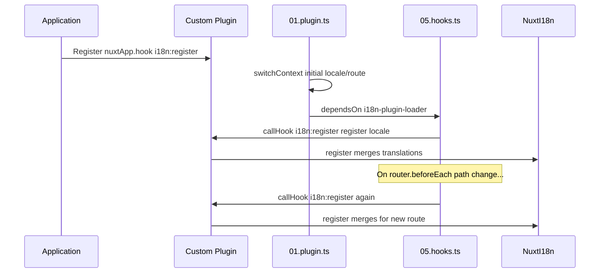

# 📢 이벤트

## 🔄 `i18n:register`

`Nuxt I18n Micro`의 `i18n:register` 이벤트는 애플리케이션의 i18n 컨텍스트에 번역을 동적으로 추가할 수 있게 하여 국제화 프로세스를 원활하고 유연하게 만들어 줍니다. 이 이벤트를 통해 필요에 따라 새 번역을 통합하여 애플리케이션의 지역화 기능을 향상시킬 수 있습니다.

### 📝 이벤트 세부 사항

- **목적**:
  - 특정 로케일에 대해 기존 번역 집합에 추가 번역을 동적으로 통합할 수 있게 합니다.

- **페이로드**:
  - **`register`**:
    - 이벤트가 제공하는 함수로 두 개의 인수를 받습니다:
      - **`translations`** (`Translations`):
        - `Translations` 인터페이스에 따라 구성된 번역을 나타내는 키-값 쌍이 포함된 객체.
      - **`locale`** (`string`, 선택 사항):
        - 번역이 등록되는 로케일 코드(예: `'en'`, `'ru'`). 지정하지 않으면 이벤트에서 제공된 로케일이 기본값이 됩니다.

- **동작**:
  - 트리거되면 `register` 함수는 지정된 로케일의 현재 컨텍스트에 새 번역을 병합하여 애플리케이션 전체에서 사용 가능한 번역을 업데이트합니다.

### ⏱️ 발생 시점

모듈의 훅 플러그인(`05.hooks.ts`, `dependsOn: ['i18n-plugin-loader']`)이 `nuxtApp.callHook('i18n:register', …)`을 호출합니다:

1. **시작 시 한 번** — 메인 i18n 플러그인(`01.plugin.ts`)이 초기 라우트에 대한 번역을 로드한 후
2. **내비게이션 시** — 경로가 변경될 때 `router.beforeEach`에서, 또는 `strategy: 'no_prefix'`일 때 모든 내비게이션에서

`nuxtApp.hook('i18n:register', …)`을 사용하여 일반 Nuxt 플러그인에서 리스너를 등록하세요. 훅 플러그인은 로더가 준비된 후에 실행되므로, 번역을 확장해야 할 때 콜백이 호출됩니다.

`nuxt.config`에서 `hooks: false`를 설정하면 자동 `i18n:register` 호출을 비활성화할 수 있습니다([Configuration — `hooks`](/guides/configuration#hooks) 참조).

### 💡 사용 예제

다음 예제는 `i18n:register` 이벤트를 사용하여 번역을 동적으로 추가하는 방법을 보여줍니다:

```typescript
nuxt.hook('i18n:register', async (register: (translations: unknown, locale?: string) => void, locale: string) => {
  register(
    {
      greeting: 'Hello',
      farewell: 'Goodbye',
    },
    locale,
  )
})
```

### 🛠️ 설명



- **이벤트 트리거**:
  - 훅 플러그인(`05.hooks.ts`)은 메인 로더가 준비된 후 및 관련된 내비게이션에서 `i18n:register`를 발생시킵니다.

- **번역 추가**:
  - 이 예제는 `"greeting"`과 `"farewell"`에 대한 영어 번역을 등록합니다.
  - `register` 함수는 제공된 로케일의 기존 집합에 이러한 번역을 병합합니다.

### 🔗 주요 이점

- **동적 업데이트**:
  - 전체 애플리케이션을 재배포할 필요 없이 번역을 쉽게 업데이트하거나 추가할 수 있습니다.

- **지역화 유연성**:
  - 사용자 또는 애플리케이션 요구 사항에 따라 실시간 지역화 조정을 지원합니다.

`i18n:register` 이벤트를 사용하면 애플리케이션의 지역화 전략이 유연하고 적응 가능한 상태로 유지되어 전반적인 사용자 경험을 향상시킬 수 있습니다.

---

## 🛠️ 플러그인으로 번역 수정하기

Nuxt 애플리케이션에서 번역을 동적으로 수정하려면 플러그인을 사용하는 것이 권장됩니다. 플러그인은 특히 모듈이나 외부 번역 파일로 작업할 때 지역화 업데이트를 처리하는 구조화된 방법을 제공합니다.

### **플러그인 등록**

모듈을 사용하는 경우, 번역 수정이 발생할 플러그인을 모듈의 구성에 추가하여 등록하세요:

```javascript
addPlugin({
  src: resolve('./plugins/extend_locales'),
})
```

이렇게 하면 번역의 동적 로드 및 등록을 처리할 `./plugins/extend_locales`에 있는 플러그인이 등록됩니다.

### **플러그인 구현**

플러그인에서 로케일 수정을 관리할 수 있습니다. 다음은 Nuxt 플러그인에서의 구현 예제입니다:

```typescript
import { defineNuxtPlugin } from '#app'

export default defineNuxtPlugin(async (nuxtApp) => {
  // Function to load translations from JSON files and register them
  const loadTranslations = async (lang: string) => {
    try {
      const translations = await import(`../locales/${lang}.json`)
      return translations.default
    } catch (error) {
      console.error(`Error loading translations for language: ${lang}`, error)
      return null
    }
  }

  // Hook into the 'i18n:register' event to dynamically add translations
  // eslint-disable-next-line @typescript-eslint/ban-ts-comment
  // @ts-expect-error
  nuxtApp.hook('i18n:register', async (register: (translations: unknown, locale?: string) => void, locale: string) => {
    const translations = await loadTranslations(locale)
    if (translations) {
      register(translations, locale)
    }
  })
})
```

### 📝 자세한 설명

1. **번역 로드**:

- `loadTranslations` 함수는 로케일을 기반으로 번역 파일을 동적으로 import합니다. 파일은 `locales` 디렉터리에 있고 로케일 코드에 따라 명명될 것으로 예상됩니다(예: `en.json`, `de.json`).
- 로드에 성공하면 번역이 반환되며, 그렇지 않으면 오류가 기록됩니다.

2. **번역 등록**:

- 플러그인은 `nuxtApp.hook`을 사용하여 `i18n:register` 이벤트에 훅합니다.
- 이벤트가 트리거되면 로드된 번역과 해당 로케일로 `register` 함수가 호출됩니다.
- 이는 지정된 로케일의 i18n 컨텍스트에 새 번역을 병합하여 애플리케이션 전체에서 사용 가능한 번역을 업데이트합니다.

### 🔗 번역 수정에 플러그인을 사용하는 이점

- **관심사의 분리**:
  - 지역화 로직을 메인 애플리케이션 코드와 별도로 캡슐화하여 관리와 유지 관리를 더 쉽게 만듭니다.

- **동적이고 확장 가능**:
  - 번역을 동적으로 로드하고 등록함으로써 전체 애플리케이션 재배포 없이 콘텐츠를 업데이트할 수 있으며, 이는 자주 업데이트되거나 다국어 콘텐츠가 있는 애플리케이션에 특히 유용합니다.

- **향상된 지역화 유연성**:
  - 플러그인을 사용하면 필요에 따라 번역을 수정하거나 확장할 수 있어 사용자 환경 설정이나 비즈니스 요구 사항을 충족하는 보다 적응력 있고 반응이 좋은 지역화 전략을 제공합니다.

이러한 접근 방식을 채택하면 플러그인을 사용한 구조화되고 유지 관리 가능한 프로세스를 통해 애플리케이션의 지역화를 효율적으로 확장하고 수정할 수 있으며, 국제화를 변화하는 요구 사항에 적응하고 전반적인 사용자 경험을 향상시킬 수 있습니다.
