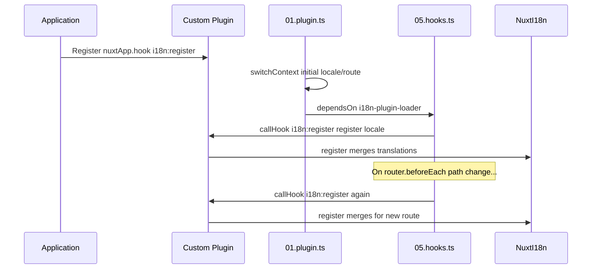

# 📢 이벤트

## 🔄 `i18n:register`

`Nuxt I18n Micro`의 `i18n:register` 이벤트를 사용하면 애플리케이션의 i18n 컨텍스트에 번역을 동적으로 추가할 수 있어, 국제화 프로세스를 매끄럽고 유연하게 만듭니다. 이 이벤트를 사용하면 필요에 따라 새 번역을 통합할 수 있어 애플리케이션의 지역화 기능을 강화할 수 있습니다.

### 📝 이벤트 세부 정보

- **목적**:
  - 특정 로케일에 대해 기존 번역 집합에 추가 번역을 동적으로 통합할 수 있게 합니다.

- **페이로드**:
  - **`register`**:
    - 이벤트에서 제공하는 함수로, 두 개의 인수를 받습니다:
      - **`translations`** (`Translations`):
        - `Translations` 인터페이스에 따라 조직된, 번역을 나타내는 키-값 쌍이 포함된 객체.
      - **`locale`** (`string`, 선택 사항):
        - 번역이 등록되는 로케일 코드 (예: `'en'`, `'ru'`). 지정하지 않으면 이벤트가 제공하는 로케일이 기본값으로 사용됩니다.

- **동작**:
  - 트리거되면 `register` 함수는 새 번역을 지정된 로케일에 대한 현재 컨텍스트에 병합하여, 애플리케이션 전체에서 사용 가능한 번역을 업데이트합니다.

### ⏱️ 발생 시점

모듈의 훅 플러그인(`05.hooks.ts`, `dependsOn: ['i18n-plugin-loader']`)이 `nuxtApp.callHook('i18n:register', …)`를 호출합니다:

1. **시작 시 한 번** — 메인 i18n 플러그인(`01.plugin.ts`)이 초기 라우트의 번역을 로드한 후.
2. **탐색 시** — 경로가 변경될 때 `router.beforeEach`에서, `strategy: 'no_prefix'`인 경우에는 모든 탐색에서.

일반적인 Nuxt 플러그인에서 `nuxtApp.hook('i18n:register', …)`로 리스너를 등록하세요. 훅 플러그인은 로더 준비가 완료된 후 실행되므로, 번역을 확장해야 할 때 콜백이 호출됩니다.

자동 `i18n:register` 호출을 비활성화하려면 `nuxt.config`에서 `hooks: false`로 설정하세요([설정 — `hooks`](/guides/configuration#hooks) 참고).

### 💡 사용 예제

다음 예제는 `i18n:register` 이벤트를 사용해 번역을 동적으로 추가하는 방법을 보여줍니다:

```typescript
nuxt.hook('i18n:register', async (register: (translations: unknown, locale?: string) => void, locale: string) => {
  register(
    {
      greeting: 'Hello',
      farewell: 'Goodbye',
    },
    locale,
  )
})
```

### 🛠️ 설명



- **이벤트 트리거링**:
  - 훅 플러그인(`05.hooks.ts`)은 메인 로더 준비가 완료된 후와 관련 탐색 시에 `i18n:register`를 발생시킵니다.

- **번역 추가**:
  - 예제는 `"greeting"`과 `"farewell"`에 대한 영어 번역을 등록합니다.
  - `register` 함수는 이러한 번역을 제공된 로케일의 기존 집합에 병합합니다.

### 🔗 주요 이점

- **동적 업데이트**:
  - 전체 애플리케이션을 재배포할 필요 없이 번역을 쉽게 업데이트하거나 추가할 수 있습니다.

- **지역화 유연성**:
  - 사용자 또는 애플리케이션의 요구에 기반한 실시간 지역화 조정을 지원합니다.

`i18n:register` 이벤트를 사용하면 애플리케이션의 지역화 전략을 유연하고 적응 가능하게 유지하여 전반적인 사용자 경험을 향상시킬 수 있습니다.

---

## 🛠️ 플러그인으로 번역 수정

Nuxt 애플리케이션에서 번역을 동적으로 수정하려면 플러그인 사용을 권장합니다. 플러그인은 특히 모듈이나 외부 번역 파일로 작업할 때 지역화 업데이트를 처리하는 구조적인 방법을 제공합니다.

### **플러그인 등록**

모듈을 사용하는 경우, 번역 수정이 발생할 플러그인을 모듈 설정에 추가하여 등록합니다:

```javascript
addPlugin({
  src: resolve('./plugins/extend_locales'),
})
```

이렇게 하면 `./plugins/extend_locales`에 위치한 플러그인이 등록되며, 이 플러그인이 번역의 동적 로딩과 등록을 처리합니다.

### **플러그인 구현**

플러그인에서 로케일 수정을 관리할 수 있습니다. 다음은 Nuxt 플러그인 구현 예제입니다:

```typescript
import { defineNuxtPlugin } from '#app'

export default defineNuxtPlugin(async (nuxtApp) => {
  // Function to load translations from JSON files and register them
  const loadTranslations = async (lang: string) => {
    try {
      const translations = await import(`../locales/${lang}.json`)
      return translations.default
    } catch (error) {
      console.error(`Error loading translations for language: ${lang}`, error)
      return null
    }
  }

  // Hook into the 'i18n:register' event to dynamically add translations
  // eslint-disable-next-line @typescript-eslint/ban-ts-comment
  // @ts-expect-error
  nuxtApp.hook('i18n:register', async (register: (translations: unknown, locale?: string) => void, locale: string) => {
    const translations = await loadTranslations(locale)
    if (translations) {
      register(translations, locale)
    }
  })
})
```

### 📝 상세 설명

1. **번역 로딩**:

- `loadTranslations` 함수는 로케일에 따라 번역 파일을 동적으로 임포트합니다. 파일은 `locales` 디렉터리에 있고 로케일 코드에 따라 이름이 지정되어야 합니다 (예: `en.json`, `de.json`).
- 성공적으로 로드되면 번역이 반환되며, 그렇지 않으면 오류가 로그됩니다.

2. **번역 등록**:

- 플러그인은 `nuxtApp.hook`을 사용해 `i18n:register` 이벤트에 훅합니다.
- 이벤트가 트리거되면 로드된 번역과 해당 로케일로 `register` 함수가 호출됩니다.
- 이는 새 번역을 지정된 로케일의 i18n 컨텍스트에 병합하여 애플리케이션 전체에서 사용 가능한 번역을 업데이트합니다.

### 🔗 번역 수정을 위해 플러그인을 사용하는 이점

- **관심사의 분리**:
  - 지역화 로직을 메인 애플리케이션 코드와 별도로 캡슐화하여 관리 및 유지 보수를 쉽게 합니다.

- **동적이고 확장 가능**:
  - 번역을 동적으로 로드하고 등록함으로써 전체 애플리케이션 재배포 없이 콘텐츠를 업데이트할 수 있으며, 이는 자주 업데이트되거나 다국어 콘텐츠가 있는 애플리케이션에 특히 유용합니다.

- **향상된 지역화 유연성**:
  - 플러그인을 사용하면 필요에 따라 번역을 수정하거나 확장할 수 있어, 사용자 선호도나 비즈니스 요구 사항을 충족하는 더 적응력 있고 반응적인 지역화 전략을 제공합니다.

이 접근 방식을 채택하면 플러그인을 사용해 구조적이고 유지 보수 가능한 프로세스를 통해 애플리케이션의 지역화를 효율적으로 확장하고 수정할 수 있어, 국제화가 변화하는 요구에 적응하고 전반적인 사용자 경험이 향상됩니다.
