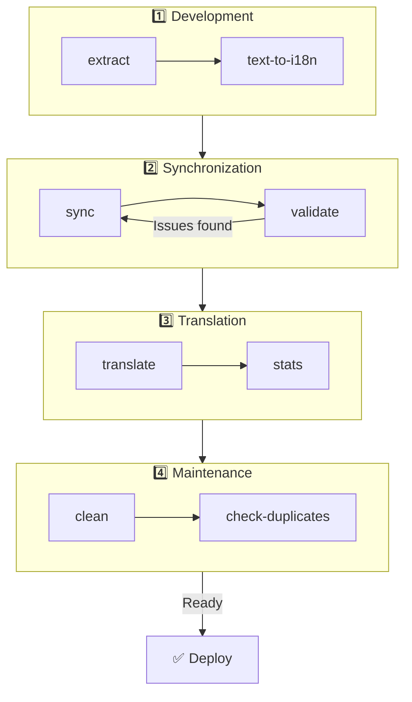

# 🌐 nuxt-i18n-micro-cli 가이드

## 📖 소개

`nuxt-i18n-micro-cli`는 `nuxt-i18n-micro` 모듈(Nuxt I18n Micro)을 사용하는 Nuxt.js 프로젝트에서 지역화 및 국제화 프로세스를 간소화하기 위해 설계된 명령줄 도구입니다. 코드베이스에서 번역 키를 추출하고, 번역 파일을 관리하며, 로케일 간 번역을 동기화하고, 외부 번역 서비스를 사용하여 번역 프로세스를 자동화하는 유틸리티를 제공합니다.

이 가이드는 `nuxt-i18n-micro-cli`를 설치, 구성 및 사용하여 프로젝트의 번역을 효과적으로 관리하는 방법을 안내합니다. 패키지는 [npmjs.com](https://www.npmjs.com/package/nuxt-i18n-micro-cli)에서 확인하세요.

## 🔧 설치 및 설정

### 📦 nuxt-i18n-micro-cli 설치

Nuxt 프로젝트에 전역으로 또는 개발 의존성으로 설치합니다(CI에 권장):

```bash
# global
npm install -g nuxt-i18n-micro-cli

# or per project
pnpm add -D nuxt-i18n-micro-cli
pnpm exec i18n-micro text-to-i18n --dryRun
```

프로젝트가 Nuxt 4 `app/` 디렉터리(`app/pages`, `app/components` 등)를 사용하는 경우 **`nuxt-i18n-micro-cli` ≥ 2.1.1**을 사용하세요. 이전 CLI 버전은 프로젝트 루트의 `pages/`만 스캔했습니다.

### 🛠 프로젝트에서 초기화

설치 후 Nuxt.js 프로젝트 디렉터리에서 `i18n-micro` 명령을 실행할 수 있습니다.

프로젝트에 `nuxt-i18n-micro`가 설정되어 있고 `nuxt.config.ts`(또는 `nuxt.config.js`)에 필요한 구성이 있는지 확인하세요.

### 📄 공통 인수

- `--cwd`: 현재 작업 디렉터리를 지정합니다(기본값: `.`).
- `--logLevel`: 로그 레벨을 설정합니다(`silent`, `info`, `verbose`).
- `--translationDir`: JSON 번역 파일이 포함된 디렉터리(기본값: `locales`).

## 📊 CLI 워크플로우 개요



### 워크플로우 단계

| 단계           | 명령                    | 목적                           |
| --------------- | --------------------------- | --------------------------------- |
| **개발** | `extract`, `text-to-i18n`   | 번역 키 찾기 및 추출 |
| **동기화**        | `sync`, `validate`          | 모든 로케일이 동일한 키를 갖도록 보장 |
| **번역**   | `translate`, `stats`        | 누락된 키 자동 번역       |
| **유지 관리** | `clean`, `check-duplicates` | 번역을 깔끔하게 유지            |

## 📋 명령어

### 🔄 `text-to-i18n` 명령

CLI 패키지: [`nuxt-i18n-micro-cli`](https://www.npmjs.com/package/nuxt-i18n-micro-cli)

**설명**: 하드코딩된 사용자 대상 문자열에 대해 Vue/TS/JS 파일을 스캔하고, `$t('...')`로 대체한 후 새 키를 JSON 번역 파일에 병합합니다. **Nuxt 프로젝트 루트**(`nuxt.config`이 있는 위치)에서 실행하세요.

**사용법**:

```bash
i18n-micro text-to-i18n [options]
```

**옵션**:

| 옵션                  | 기본값           | 설명                                                           |
| ----------------------- | ----------------- | --------------------------------------------------------------------- |
| `--translationFile`     | `locales/en.json` | 새 키를 위한 JSON 파일(프로젝트 루트 상대).                    |
| `--path`                | —                 | 단일 파일 또는 디렉터리만 처리(예: `app/pages/about.vue`).      |
| `--context`             | —                 | 키 접두사(예: `auth` → `auth.*`).                                  |
| `--dryRun`              | `false`           | 파일에 쓰지 않고 미리보기.                                        |
| `--verbose`             | `false`           | 추가 로깅.                                                        |
| `--interactive`         | `false`           | 적용 전에 각 키를 확인하거나 편집.                             |
| `--extractOnlyDirs`     | `plugins`         | 키가 추출되지만 소스 파일은 **재작성되지 않는** 디렉터리. |
| `--extractOnlyPatterns` | —                 | glob 형식의 추출 전용 패턴(예: `**/*.plugin.ts`).              |

**예제**:

```bash
i18n-micro text-to-i18n --translationFile locales/en.json --context auth --dryRun
```

#### 어떤 폴더가 스캔되나요?

<Info>
CLI **v2.1.1**부터 `text-to-i18n`은 클래식 루트 폴더와 `app/*` 등가물을 모두 스캔합니다. **프로젝트 루트**에서 명령을 실행하세요 — `cd app`을 하지 마세요.
</Info>

다음 디렉터리 아래에서 `*.vue`, `*.js`, `*.ts`를 수집합니다:

| Nuxt 3 (프로젝트 루트) | Nuxt 4 (`app/` 디렉터리) |
| --------------------- | ------------------------- |
| `pages/`              | `app/pages/`              |
| `components/`         | `app/components/`         |
| `plugins/`            | `app/plugins/`            |
| `layouts/`            | `app/layouts/`            |

`--path`를 사용하지 않으면 다른 폴더(`server/`, `composables/`, `middleware/`, …)는 건너뜁니다. Nuxt 4의 경우 프로젝트 루트에서 실행하세요(`cd app` 불필요). `--translationFile`이 `locales/`가 아닌 경우 `i18n.translationDir`과 일치시키세요.

```bash
i18n-micro text-to-i18n --path app/pages
```

#### 동작 방식

1. 위의 디렉터리(또는 `--path`)에서 파일을 수집합니다.
2. 리터럴 / 템플릿 텍스트를 `$t('generated.key')`로 대체합니다(`plugins/`는 기본적으로 추출 전용).
3. 기존 항목을 제거하지 않고 새 키를 `--translationFile`에 병합합니다.

**예제 변환**:

전:

```vue
<template>
  <div>
    <h1>Welcome to our site</h1>
    <p>Please sign in to continue</p>
  </div>
</template>
```

후:

```vue
<template>
  <div>
    <h1>{{ $t('pages.home.welcome_to_our_site') }}</h1>
    <p>{{ $t('pages.home.please_sign_in') }}</p>
  </div>
</template>
```

**모범 사례**: 먼저 dry run으로 실행; 전체 실행 전 커밋; `nuxt.config`에서 `i18n.translationDir`과 `--translationFile`을 맞춤; 부트스트랩 코드를 위해 `--extractOnlyDirs plugins` 유지.

**제한 사항**: 별도의 npm 패키지(모듈과 함께 번들되지 않음); `nuxt.config`을 자동으로 읽지 않음; `$t(...)`를 출력; 복잡한 동적 문자열은 대신 `extract` / `search`가 필요할 수 있음.

### 📊 `stats` 명령

**설명**: `stats` 명령은 Nuxt.js 프로젝트의 각 로케일에 대한 번역 통계를 표시하는 데 사용됩니다. 사용 가능한 총 키 수 대비 번역된 키 수를 표시하여 번역의 진행 상황을 이해하는 데 도움이 됩니다.

**사용법**:

```bash
i18n-micro stats [options]
```

**옵션**:

- `--full`: 결합된 번역 통계만 표시합니다(기본값: `false`).

**예제**:

```bash
i18n-micro stats --full
```

### 🌍 `translate` 명령

**설명**: `translate` 명령은 외부 번역 서비스를 사용하여 누락된 키를 자동으로 번역합니다. 이 명령은 Google Translate, DeepL 등의 서비스 API를 활용하여 누락된 번역을 채워 번역 프로세스를 단순화합니다.

**사용법**:

```bash
i18n-micro translate [options]
```

**옵션**:

- `--service`: 사용할 번역 서비스(예: `google`, `deepl`, `yandex`). 지정하지 않으면 명령이 하나를 선택하라고 프롬프트합니다.
- `--token`: 선택한 번역 서비스에 해당하는 API 키. 제공하지 않으면 입력하라는 프롬프트가 표시됩니다.
- `--options`: 번역 서비스에 대한 추가 옵션으로, 쉼표로 구분된 key:value 쌍으로 제공됩니다(예: `model:gpt-3.5-turbo,max_tokens:1000`).
- `--replace`: 기존 번역을 대체하여 모든 키를 번역합니다(기본값: `false`).

**예제**:

```bash
i18n-micro translate --service deepl --token YOUR_DEEPL_API_KEY
```

#### 🌐 지원되는 번역 서비스

`translate` 명령은 여러 번역 서비스를 지원합니다. 지원되는 서비스 중 일부:

- **Google Translate** (`google`)
- **DeepL** (`deepl`)
- **Yandex Translate** (`yandex`)
- **OpenAI** (`openai`)
- **Azure Translator** (`azure`)
- **IBM Watson** (`ibm`)
- **Baidu Translate** (`baidu`)
- **LibreTranslate** (`libretranslate`)
- **MyMemory** (`mymemory`)
- **Lingva Translate** (`lingvatranslate`)
- **Papago** (`papago`)
- **Tencent Translate** (`tencent`)
- **Systran Translate** (`systran`)
- **Yandex Cloud Translate** (`yandexcloud`)
- **ModernMT** (`modernmt`)
- **Lilt** (`lilt`)
- **Unbabel** (`unbabel`)
- **Reverso Translate** (`reverso`)

#### ⚙️ 서비스 구성

일부 서비스에는 특정 구성 또는 API 키가 필요합니다. `translate` 명령을 사용할 때 서비스를 지정하고 필요한 `--token`(API 키)과 추가 `--options`를 필요에 따라 제공할 수 있습니다.

예를 들어:

```bash
i18n-micro translate --service openai --token YOUR_OPENAI_API_KEY --options openaiModel:gpt-3.5-turbo,max_tokens:1000
```

### 🛠️ `extract` 명령

**설명**: 코드베이스에서 번역 키를 추출하고 범위별로 구성합니다.

**사용법**:

```bash
i18n-micro extract [options]
```

**옵션**:

- `--prod, -p`: 프로덕션 모드에서 실행합니다.

**예제**:

```bash
i18n-micro extract
```

### 🔄 `sync` 명령

**설명**: 로케일 간에 번역 파일을 동기화하여 모든 로케일이 동일한 키를 갖도록 합니다.

**사용법**:

```bash
i18n-micro sync [options]
```

**예제**:

```bash
i18n-micro sync
```

### ✅ `validate` 명령

**설명**: 참조 로케일과 비교하여 누락되거나 추가된 키에 대해 번역 파일을 검증합니다.

**사용법**:

```bash
i18n-micro validate [options]
```

**예제**:

```bash
i18n-micro validate
```

### 🧹 `clean` 명령

**설명**: 번역 파일에서 사용되지 않는 번역 키를 제거합니다.

**사용법**:

```bash
i18n-micro clean [options]
```

**예제**:

```bash
i18n-micro clean
```

### 📤 `import` 명령

**설명**: PO 파일을 JSON 형식으로 다시 변환하고 번역 디렉터리에 저장합니다.

**사용법**:

```bash
i18n-micro import [options]
```

**옵션**:

- `--potsDir`: PO 파일이 포함된 디렉터리(기본값: `pots`).

**예제**:

```bash
i18n-micro import --potsDir pots
```

### 📥 `export` 명령

**설명**: 외부 번역 관리를 위해 번역을 PO 파일로 내보냅니다.

**사용법**:

```bash
i18n-micro export [options]
```

**옵션**:

- `--potsDir`: PO 파일을 저장할 디렉터리(기본값: `pots`).

**예제**:

```bash
i18n-micro export --potsDir pots
```

### 🗂️ `export-csv` 명령

**설명**: `export-csv` 명령은 JSON 파일에서 번역 키와 값을 파일 경로와 함께 CSV 형식으로 내보냅니다. 이 명령은 스프레드시트 소프트웨어에서 번역 데이터를 다루는 것을 선호하는 팀에 유용합니다.

**사용법**:

```bash
i18n-micro export-csv [options]
```

**옵션**:

- `--csvDir`: 내보낸 CSV 파일이 저장될 디렉터리.
- `--delimiter`: CSV 파일에 대한 구분자를 지정합니다(기본값: `,`).

**예제**:

```bash
i18n-micro export-csv --csvDir csv_files
```

### 📑 `import-csv` 명령

**설명**: `import-csv` 명령은 CSV 파일에서 번역 데이터를 가져와 해당 JSON 파일을 업데이트합니다. 스프레드시트에서 대량 번역 업데이트를 적용하는 데 유용합니다.

**사용법**:

```bash
i18n-micro import-csv [options]
```

**옵션**:

- `--csvDir`: 가져올 CSV 파일이 포함된 디렉터리.
- `--delimiter`: CSV 파일에서 사용되는 구분자를 지정합니다(기본값: `,`).

**예제**:

```bash
i18n-micro import-csv --csvDir csv_files
```

### 🧾 `diff` 명령

**설명**: 동일한 디렉터리(하위 디렉터리 포함) 내의 기본 로케일과 다른 로케일 간의 번역 파일을 비교합니다. 이 명령은 다른 로케일과 비교하여 기본 로케일에 누락된 키와 값을 식별하여 번역 진행 상황이나 불일치를 쉽게 추적할 수 있게 합니다.

**사용법**:

```bash
i18n-micro diff [options]
```

**예제**:

```bash
i18n-micro diff
```

### 🔍 `check-duplicates` 명령

**설명**: `check-duplicates` 명령은 루트 레벨 및 페이지별 번역을 포함한 모든 번역 파일 전체에서 각 로케일 내 중복 번역 값을 확인합니다. 이는 동일한 언어 내에서 서로 다른 키가 동일한 번역 값을 공유하지 않도록 보장하여 번역의 명확성과 일관성을 유지하는 데 도움이 됩니다.

**사용법**:

```bash
i18n-micro check-duplicates [options]
```

**예제**:

```bash
i18n-micro check-duplicates
```

**동작 방식**:

- 이 명령은 각 로케일에 대해 루트 레벨 및 페이지별 번역 파일을 모두 확인합니다.
- 번역 값이 여러 위치(루트 레벨 번역 내에서 또는 다른 페이지 간에)에 나타나면, 발견된 파일 및 키와 함께 중복 값을 보고합니다.
- 중복이 발견되지 않으면 명령은 해당 로케일에 중복된 번역 값이 없음을 확인합니다.

이 명령은 번역 키가 고유한 값을 유지하도록 보장하여 동일한 로케일 내에서 우발적인 반복을 방지하는 데 도움이 됩니다.

### 🔄 `replace-values` 명령

**설명**: `replace-values` 명령을 사용하면 모든 로케일에 걸쳐 번역 값의 대량 대체를 수행할 수 있습니다. 단순 텍스트 대체와 정규 표현식(regex)을 사용한 고급 대체를 모두 지원합니다. 정규식 패턴에서 캡처 그룹을 사용하고 대체 문자열에서 참조할 수도 있어 더 복잡한 대체 시나리오에 이상적입니다.

**사용법**:

```bash
i18n-micro replace-values [options]
```

**옵션**:

- `--search`: 번역에서 검색할 텍스트 또는 정규식 패턴. 이는 필수 옵션입니다.
- `--replace`: 발견된 번역에 사용될 대체 텍스트. 이는 필수 옵션입니다.
- `--useRegex`: 정규 표현식 패턴을 사용한 검색을 활성화합니다(기본값: `false`).

**예제 1**: 단순 대체

모든 로케일에서 문자열 "Hello"를 "Hi"로 대체합니다:

```bash
i18n-micro replace-values --search "Hello" --replace "Hi"
```

**예제 2**: 정규식 대체

정규식 검색을 활성화하고 "Hello" 뒤에 숫자가 오는(예: "Hello123") 모든 문자열을 모든 로케일에서 "Hi"로 대체합니다:

```bash
i18n-micro replace-values --search "Hello\\d+" --replace "Hi" --useRegex
```

**예제 3**: 정규식 캡처 그룹 사용

캡처 그룹을 사용하여 일치된 문자열의 일부를 대체에 동적으로 삽입합니다. 예를 들어, "Hello [name]"을 "Hi [name]"으로 대체하면서 이름을 그대로 유지합니다:

```bash
i18n-micro replace-values --search "Hello (\\w+)" --replace "Hi $1" --useRegex
```

이 경우 `$1`은 "Hello" 뒤의 `[name]` 부분과 일치하는 첫 번째 캡처 그룹을 나타냅니다. 대체는 원래 문자열의 이름을 유지합니다.

**동작 방식**:

- 이 명령은 모든 번역 파일(전역 및 페이지별)을 스캔합니다.
- 검색 문자열 또는 정규식 패턴을 기반으로 일치가 발견되면 일치된 텍스트를 제공된 대체 텍스트로 바꿉니다.
- 정규식을 사용할 때는 캡처 그룹을 `$1`, `$2` 등으로 참조하여 대체 문자열에서 사용할 수 있습니다.
- 모든 변경 사항은 파일 경로, 번역 키, 번역 값의 이전/이후 상태를 표시하여 기록됩니다.

**로깅**:
각 대체에 대해 명령은 다음을 포함한 세부 정보를 기록합니다:

- 로케일 및 파일 경로
- 수정 중인 번역 키
- 이전 값과 대체 후의 새 값
- 캡처 그룹이 있는 정규식을 사용할 때는 로그가 그룹 일치와 대체 방법을 표시합니다.

이를 통해 대체 작업 중에 어디에서 어떤 변경이 이루어졌는지 정확하게 추적할 수 있으며, 번역 파일 전체에 걸쳐 수정 사항의 명확한 이력을 제공합니다.

## 🛠 예제

- **번역 추출**:

  ```bash
  i18n-micro extract
  ```

- **Google Translate를 사용하여 누락된 키 번역**:

  ```bash
  i18n-micro translate --service google --token YOUR_GOOGLE_API_KEY
  ```

- **기존 번역을 대체하여 모든 키 번역**:

  ```bash
  i18n-micro translate --service deepl --token YOUR_DEEPL_API_KEY --replace
  ```

- **번역 파일 검증**:

  ```bash
  i18n-micro validate
  ```

- **사용되지 않는 번역 키 정리**:

  ```bash
  i18n-micro clean
  ```

- **번역 파일 동기화**:

  ```bash
  i18n-micro sync
  ```

## ⚙️ 구성 가이드

`nuxt-i18n-micro-cli`는 `nuxt.config.ts`(또는 `nuxt.config.js`)의 Nuxt.js i18n 구성에 의존합니다. `nuxt-i18n-micro` 모듈이 설치되어 구성되어 있는지 확인하세요.

### 🔑 nuxt.config.js 예제

```ts
export default defineNuxtConfig({
  modules: ['nuxt-i18n-micro'],
  i18n: {
    locales: [
      { code: 'en', iso: 'en-US' },
      { code: 'fr', iso: 'fr-FR' },
    ],
    defaultLocale: 'en',
    fallbackLocale: 'en',
    translationDir: 'locales', // or 'app/locales' for Nuxt 4 colocation
  },
})
```

`translationDir`이 `nuxt-i18n-micro-cli`에서 사용하는 디렉터리와 일치하는지 확인하세요(기본값은 `locales`).

## 📝 모범 사례

### 🔑 일관된 키 명명

혼란과 중복을 방지하기 위해 번역 키를 일관되고 서술적으로 유지하세요.

### 🧹 정기적인 유지 관리

사용되지 않는 번역 키를 제거하고 번역 파일을 깔끔하게 유지하기 위해 `clean` 명령을 정기적으로 사용하세요.

### 🛠 번역 워크플로우 자동화

`nuxt-i18n-micro-cli` 명령을 개발 워크플로우 또는 CI/CD 파이프라인에 통합하여 번역 파일의 추출, 번역, 검증, 동기화를 자동화하세요.

### 🛡️ API 키 보안

API 키가 필요한 번역 서비스를 사용할 때는 키를 안전하게 유지하고 버전 관리 시스템에 커밋되지 않도록 하세요. 환경 변수 또는 안전한 키 관리 솔루션을 사용하는 것을 고려하세요.

## 📞 지원 및 기여

문제가 발생하거나 개선을 위한 제안이 있는 경우, 프로젝트에 기여하거나 프로젝트 저장소에 이슈를 열어주세요.

---

이 가이드를 따르면 `nuxt-i18n-micro-cli`를 사용하여 Nuxt.js 프로젝트의 번역을 효과적으로 관리하고, 국제화 노력을 간소화하며, 다양한 로케일의 사용자에게 원활한 경험을 보장할 수 있습니다.
