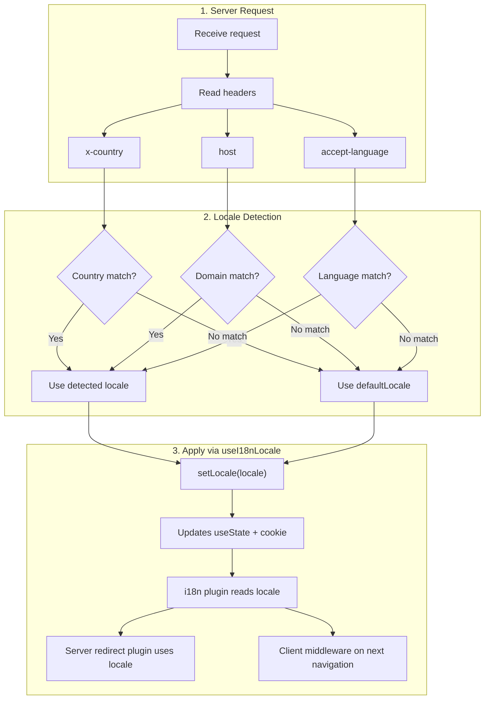

# 🔧 Nuxt I18n Micro의 사용자 정의 언어 감지

## 📖 개요

Nuxt I18n Micro v3는 모든 로케일 관리를 위한 중앙 집중식 컴포저블 — `useI18nLocale()` — 을 제공합니다. 이는 v2의 수동 `useState`/`useCookie` 패턴을 대체합니다. 서버 플러그인에서 `useI18nLocale().setLocale()`을 사용하여 모듈의 리디렉션 및 쿠키 시스템과의 완전한 호환성을 유지하면서 모든 사용자 정의 감지 로직을 구현할 수 있습니다.

## 🏗️ 아키텍처

```mermaid
flowchart TB
    subgraph Plugins["Plugin Execution Order"]
        A["Your plugin<br/>order: -10"] -->|setLocale()| B["01.plugin.ts<br/>order: -5"]
        B --> C["06.redirect.ts server<br/>order: 10"]
    end

    subgraph Client["Client SPA Navigation"]
        D["i18n-redirect.global.ts<br/>route middleware"]
    end

    subgraph State["Locale State"]
        E["useState('i18n-locale')"]
        F["localeCookie"]
    end

    A -->|"setLocale() updates both"| E
    A -->|"setLocale() updates both"| F
    B -->|reads| E
    C -->|reads| E
    C -->|reads| F
    D -->|reads target route +| E
```

**핵심 원칙**: `order: -10`인 서버 플러그인에서 `useI18nLocale().setLocale()`을 호출하세요. 이는 `useState('i18n-locale')`과 로케일 쿠키를 원자적으로 업데이트하므로, i18n 플러그인(`order: -5`)과 서버 리디렉션 플러그인(`order: 10`)이 첫 번째 SSR 요청에서 올바른 로케일을 보게 됩니다. 클라이언트 사이드 자동 리디렉션은 후속 탐색에서 전역 라우트 미들웨어에서 실행됩니다.

## 🛠️ 내장 자동 감지 비활성화

로케일 감지에 대한 완전한 제어를 원한다면 내장 메커니즘을 비활성화하세요:

```ts
export default defineNuxtConfig({
  i18n: {
    autoDetectLanguage: false,
  },
})
```

## ✨ 예제: `useI18nLocale`을 사용한 서버 사이드 감지

이는 모든 전략에 대해 **권장되는 접근 방식**입니다.

### 1단계: `nuxt.config.ts` 구성

```ts
export default defineNuxtConfig({
  modules: ['nuxt-i18n-micro'],
  i18n: {
    strategy: 'no_prefix', // Works with ANY strategy
    defaultLocale: 'en',
    localeCookie: 'user-locale',
    autoDetectLanguage: false,
    locales: [
      { code: 'en', iso: 'en-US' },
      { code: 'de', iso: 'de-DE' },
      { code: 'ja', iso: 'ja-JP' },
    ],
  },
})
```

### 2단계: `plugins/i18n-loader.server.ts` 생성

```ts
import { defineNuxtPlugin, useRequestHeaders } from '#imports'

export default defineNuxtPlugin({
  name: 'i18n-custom-loader',
  enforce: 'pre',
  order: -10, // Execute BEFORE the i18n plugin (which has order -5)

  setup() {
    const { setLocale } = useI18nLocale()
    const headers = useRequestHeaders(['host', 'x-country', 'accept-language'])
    let detectedLocale = 'en'

    // --- YOUR DETECTION LOGIC ---

    // Example 1: By domain
    const host = headers['host']
    if (host?.includes('example.de')) {
      detectedLocale = 'de'
    }
    // Example 2: By custom header
    else if (headers['x-country'] === 'JP') {
      detectedLocale = 'ja'
    }
    // Example 3: By Accept-Language header
    else if (headers['accept-language']?.includes('de')) {
      detectedLocale = 'de'
    }

    // --- APPLY THE LOCALE ---
    setLocale(detectedLocale)
  },
})
```

### 작동 방식



1. **플러그인이 먼저 실행됨** (`order: -10`) — 헤더, 도메인 또는 다른 소스에서 로케일을 감지합니다.
2. **`setLocale()`이 둘 다 업데이트** — `useState('i18n-locale')`과 쿠키 — 모든 후속 플러그인에 즉시 표시되도록 보장합니다.
3. **i18n 플러그인** (`order: -5`)은 로케일을 읽고 올바른 번역을 로드합니다.
4. **서버 리디렉션 플러그인** (`order: 10`)은 SSR에서 리디렉션 결정을 위해 로케일을 사용합니다.
5. **클라이언트 라우트 미들웨어** (`i18n-redirect`)는 URL 로케일이 기본 설정과 일치하지 않을 때 SPA 탐색에서 리디렉션을 적용합니다.

## 🌐 전략별 동작

`useI18nLocale().setLocale()`은 **모든 전략**과 함께 작동합니다. 리디렉션 동작은 전략에 따라 다릅니다:

<Tip>
| 전략 | `setLocale('de')`의 효과 |
|----------|---------------------------|
| `no_prefix` | 독일어로 렌더링, URL 변경 없음 |
| `prefix` | 302 → `/de/` (서버 사이드 리디렉션) |
| `prefix_except_default` | `de` ≠ default인 경우 302 → `/de/`; `de` = default인 경우 리디렉션 없음 |
| `prefix_and_default` | 리디렉션 없음 (`/`와 `/de/` 둘 다 유효) |
</Tip>

**중요 참고 사항:**

- 쿠키 기반 로케일 감지는 기본적으로 비활성화되어 있습니다 (`localeCookie: null`).
- 쿠키 지속성을 활성화하려면 `localeCookie: 'user-locale'`을 설정하세요.
- 쿠키/상태 값이 `locales` 목록에 없으면 `defaultLocale`로 대체됩니다.

## 🏢 고급: 도메인 기반 감지

각 도메인이 다른 로케일을 제공하는 다중 도메인 설정의 경우:

```ts
import { defineNuxtPlugin, useRequestHeaders } from '#imports'

export default defineNuxtPlugin({
  name: 'i18n-domain-loader',
  enforce: 'pre',
  order: -10,

  setup() {
    const { setLocale } = useI18nLocale()
    const headers = useRequestHeaders(['host'])
    const host = headers['host'] || ''

    let detectedLocale = 'en'

    if (host.endsWith('.de') || host.includes('german.')) {
      detectedLocale = 'de'
    } else if (host.endsWith('.fr') || host.includes('french.')) {
      detectedLocale = 'fr'
    } else if (host.endsWith('.jp') || host.includes('japanese.')) {
      detectedLocale = 'ja'
    }

    setLocale(detectedLocale)
  },
})
```

## 🔄 고급: 사용자 기본 설정 존중

사용자가 수동으로 언어를 전환할 수 있다면, 자동 감지보다 그들의 선택을 존중하세요:

```ts
import { defineNuxtPlugin, useRequestHeaders } from '#imports'

export default defineNuxtPlugin({
  name: 'i18n-smart-loader',
  enforce: 'pre',
  order: -10,

  setup() {
    const { getLocale, setLocale } = useI18nLocale()

    // If user already has a preference (from cookie), respect it
    if (getLocale()) {
      return
    }

    // Otherwise, detect locale from headers
    const headers = useRequestHeaders(['accept-language'])
    let detectedLocale = 'en'

    const acceptLanguage = headers['accept-language'] || ''
    if (acceptLanguage.includes('de')) {
      detectedLocale = 'de'
    } else if (acceptLanguage.includes('ja')) {
      detectedLocale = 'ja'
    }

    setLocale(detectedLocale)
  },
})
```

## ⚙️ 서버 전용 또는 클라이언트 전용 플러그인

플러그인이 실행되는 위치를 제어하려면 [Nuxt 파일 이름 규칙](https://nuxt.com/docs/getting-started/directory-structure#plugins)을 사용하세요:

- **서버 전용**: `i18n-loader.server.ts` — SSR 중에만 실행됩니다 (헤더 기반 감지에 권장).
- **클라이언트 전용**: `i18n-loader.client.ts` — 브라우저에서만 실행됩니다 (`localStorage` 또는 DOM 기반 감지용).


## ✅ 요약

| 기능                                     | 설명                                                                 |
| -------------------------------------- | ----------------------------------------------------------------- |
| `useI18nLocale().setLocale()`          | `useState` + 쿠키를 원자적으로 업데이트; 모든 전략과 함께 작동합니다.          |
| `useI18nLocale().getLocale()`          | 상태 또는 쿠키에서 현재 로케일을 반환합니다.                                 |
| `useI18nLocale().getPreferredLocale()` | 선호 로케일을 반환합니다 (`locales` 목록에 대해 검증됨).                    |
| 플러그인 `order: -10`                     | 플러그인이 i18n 초기화 전에 실행되도록 보장합니다.                            |
| `enforce: 'pre'`                       | "pre" 플러그인 그룹에서 실행됩니다.                                        |

**다음을 하지 마세요:**

- `useCookie('user-locale')`을 직접 사용하지 마세요 — `useI18nLocale()`이 내부적으로 쿠키를 관리합니다.
- `useState('i18n-locale')`을 직접 사용하지 마세요 — 대신 `useI18nLocale().setLocale()`을 사용하세요.
- `order` >= -5를 설정하지 마세요 — 플러그인은 i18n 플러그인 전에 실행되어야 합니다.
