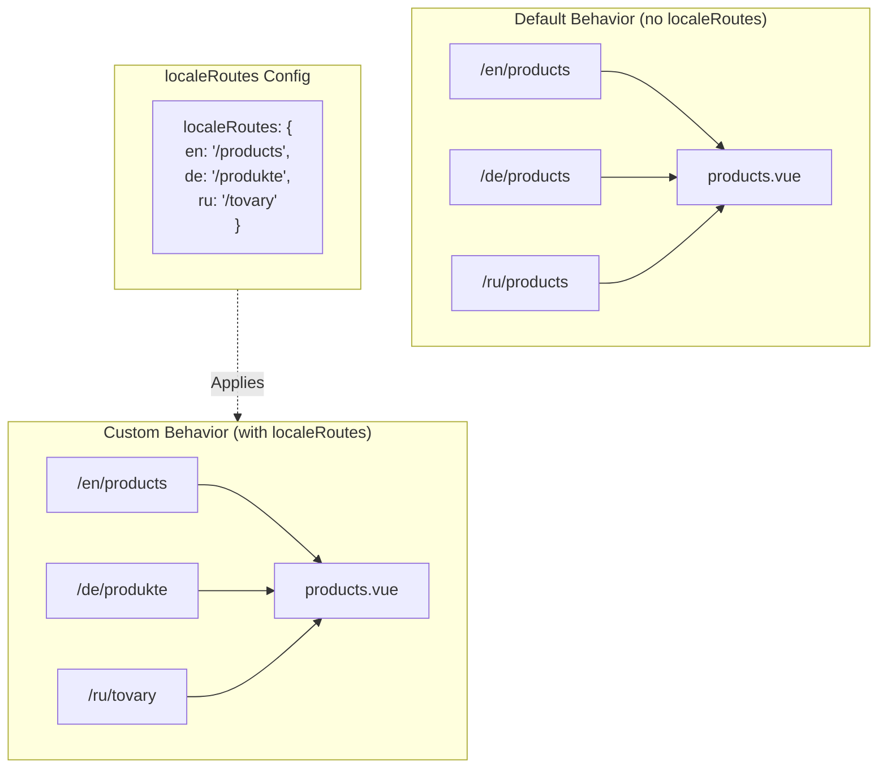

# 🔗 `Nuxt I18n Micro`에서 `localeRoutes`를 사용한 사용자 정의 로케일 라우트

## 📖 `localeRoutes` 소개

`Nuxt I18n Micro`의 `localeRoutes` 기능을 사용하면 특정 로케일에 대한 사용자 정의 라우트를 정의할 수 있어, 애플리케이션 라우팅 구조에 대한 유연성과 제어를 제공합니다. 이 기능은 특정 로케일이 다른 URL 구조, 맞춤 경로가 필요하거나 특정 지역적/언어적 규칙을 따라야 할 때 특히 유용합니다.

## 🚀 `localeRoutes`의 주요 사용 사례

`localeRoutes`의 주요 사용 사례는 다른 로케일에 대해 별개의 라우트를 제공하여, URL이 대상 청중에 직관적이고 관련성 있게 함으로써 사용자 경험을 향상시키는 것입니다. 예를 들어, 러시아어 로케일이 지역화된 URL 형식을 따르는 영어와 러시아어 버전의 페이지에 대해 다른 경로를 가질 수 있습니다.

### 📄 예제: `$defineI18nRoute`에서 `localeRoutes` 정의

`$defineI18nRoute` 함수에서 `localeRoutes`를 사용하여 특정 로케일에 대한 사용자 정의 라우트를 정의하는 방법의 예제:

```typescript
import { useNuxtApp } from '#imports'

const { $defineI18nRoute } = useNuxtApp()

$defineI18nRoute({
  localeRoutes: {
    ru: '/localesubpage', // Custom route path for the Russian locale
    de: '/lokaleseite', // Custom route path for the German locale
  },
})
```

> [!IMPORTANT]
> `$defineI18nRoute`는 전역 함수가 아닙니다. `script setup`에서 먼저 `useNuxtApp()`에서 가져온 후 호출하세요.

### 🔄 `localeRoutes` 작동 방식



- **기본 동작**: `localeRoutes` 없이 모든 로케일은 기본 경로에 의해 정의된 공통 라우트 구조를 사용합니다.
- **사용자 정의 동작**: `localeRoutes`를 사용하면 특정 로케일이 구성에 정의된 로케일별 라우트로 기본 경로를 재정의하여 자체 라우트를 가질 수 있습니다.

## 🌱 `localeRoutes` 사용 사례

### 📄 예제: 페이지에서 `localeRoutes` 사용

다음은 `localeRoutes`와 함께 `$defineI18nRoute`의 사용을 보여주는 간단한 Vue 컴포넌트입니다:

```vue
<template>
  <div>
    <!-- Display greeting message based on the current locale -->
    <p>{{ $t('greeting') }}</p>

    <!-- Navigation links -->
    <div>
      <NuxtLink :to="$localeRoute({ name: 'index' })"> Go to Index </NuxtLink>
      |
      <NuxtLink :to="$localeRoute({ name: 'about' })"> Go to About Page </NuxtLink>
    </div>
  </div>
</template>

<script setup>
import { useNuxtApp } from '#imports'

const { $getLocale, $switchLocale, $getLocales, $localeRoute, $t, $defineI18nRoute } = useNuxtApp()

// Define translations and custom routes for specific locales
$defineI18nRoute({
  localeRoutes: {
    ru: '/localesubpage', // Custom route path for Russian locale
  },
})
</script>
```

### 🛠️ 다양한 컨텍스트에서 `localeRoutes` 사용

- **랜딩 페이지**: 사용자 정의 라우트를 사용하여 랜딩 페이지의 URL을 지역화하고 마케팅 캠페인과 일치하도록 하세요.
- **문서 사이트**: 지역화된 콘텐츠 구조와 더 잘 일치하도록 각 로케일에 대한 별개의 라우트를 제공하세요.
- **전자상거래 사이트**: SEO와 사용자 경험 향상을 위해 로케일별로 제품 또는 카테고리 URL을 맞춤화하세요.

## `localeRoutes`와 함께 탐색 사용

지역화된 라우트가 페이지 디렉터리의 파일 이름과 직접 일치하지 않기 때문에, 이름이 아닌 객체로 탐색을 참조해야 합니다.

```vue
<template>
  /**
   * Exemple page: /pages/about-us.vue
   * EN /about-us
   * ES /sobre-nosotros
   * FR /a-propos
   */

  // Using NuxtLink
  <NuxtLink :to="$localeRoute({ name: 'about-us' })">
    Go to About Page
  </NuxtLink>

  // Using I18nLink
  <I18nLink :to="{ name: 'about-us' }">
    Go to About Page
  </NuxtLink>

  // The string literal navigation wouldn't work for any locale but english
  <I18nLink to="/about-us">
    Go to About Page
  </NuxtLink>
</template>
```

### 중첩 페이지 명명

기본적으로 페이지는 파일과 경로 이름을 기반으로 이름이 지정됩니다. 이는 다음을 의미합니다:

- `/pages/about-us.vue`는 `$localeRoute(\{ name: 'about-us' \})`로 접근할 수 있습니다.
- `/pages/about-us/physical-stores.vue`는 `$localeRoute(\{ name: 'about-us-physical-stores' \})`로 접근할 수 있습니다.

이 동작을 재정의하려면 `definePageMeta`로 페이지 이름을 명시적으로 지정하세요.

```vue
// /pages/about-us/physical-stores.vue
<script setup>
definePageMeta({
  name: 'our-stores'
})
```

이제 이 페이지는 `$localeRoute` 또는 `I18nLink`로 이름 `:to='\{ name: "our-stores" \}'`에 의해 참조될 수 있습니다.

## 🎯 슬러그와 `$setI18nRouteParams`를 사용한 동적 라우트

슬러그나 매개변수가 포함된 동적 라우트로 작업할 때, 각 로케일에 대한 로케일별 슬러그를 제공하기 위해 동적 세그먼트가 있는 `localeRoutes`와 `$setI18nRouteParams`를 사용할 수 있습니다.

### `localeRoutes`의 동적 라우트 매개변수

Nuxt의 라우트 매개변수 구문(catch-all 라우트의 경우 `[...slug]`, 단일 매개변수의 경우 `[param]`, 또는 명명된 매개변수의 경우 `:param()`)을 사용하여 동적 라우트를 정의할 수 있습니다:

```vue
<script setup lang="ts">
import { useNuxtApp, useRoute, useFetch, createError } from '#imports'

const { $defineI18nRoute, $setI18nRouteParams } = useNuxtApp()

// Define custom routes with dynamic segments
$defineI18nRoute({
  localeRoutes: {
    en: '/our-products/[...slug]',
    es: '/nuestros-productos/[...slug]',
  },
})
</script>
```

### 로케일별 라우트 매개변수 설정

`$setI18nRouteParams` 함수를 사용하면 각 로케일에 대해 다른 매개변수 값(예: 슬러그)을 설정할 수 있습니다. 이는 콘텐츠에 로케일별 URL이 있을 때 특히 유용합니다.

**중요**: `$setI18nRouteParams`는 로케일별 슬러그를 포함하는 데이터를 페치한 후, 일반적으로 `useFetch` 또는 `useAsyncData` 내에서 호출해야 합니다.

```vue
<script setup lang="ts">
import { useNuxtApp, useRoute, useFetch, createError } from '#imports'

interface Product {
  title: string
  price: string
  urlEn: string // English slug
  urlEs: string // Spanish slug
}

const { $defineI18nRoute, $setI18nRouteParams } = useNuxtApp()

const route = useRoute()
const slug = Array.isArray(route.params.slug) ? route.params.slug[0] : route.params.slug

// Fetch product data that includes locale-specific slugs
const { data: product, error } = await useFetch<Product>(`/api/product/${slug}`)
if (error.value)
  throw createError({
    statusCode: error.value?.statusCode,
    statusMessage: error.value?.statusMessage,
    fatal: true,
  })

// Define custom routes with dynamic segments
$defineI18nRoute({
  localeRoutes: {
    en: '/our-products/[...slug]',
    es: '/nuestros-productos/[...slug]',
  },
})

// Set different slugs for different locales
if (product.value) {
  $setI18nRouteParams({
    en: { slug: product.value.urlEn },
    es: { slug: product.value.urlEs },
  })
}
</script>
```

### 전체 예제: 로케일별 슬러그가 있는 제품 페이지

다음은 제품 상세 페이지에 대해 `localeRoutes`와 `$setI18nRouteParams`를 함께 사용하는 완전한 예제입니다:

```vue
<template>
  <div v-if="product">
    <h1>{{ product.title }}</h1>
    <p>{{ $t('price') }}: {{ product.price }}</p>
    <div class="locale-switcher">
      <a :href="$switchLocalePath('en')">English</a>
      <a :href="$switchLocalePath('es')">Español</a>
    </div>
  </div>
</template>

<script setup lang="ts">
import { useNuxtApp, useRoute, useFetch, createError } from '#imports'

interface Product {
  title: string
  price: string
  urlEn: string
  urlEs: string
}

const { $t, $defineI18nRoute, $setI18nRouteParams, $switchLocalePath } = useNuxtApp()

// Set page name for easier navigation
definePageMeta({ name: 'product-slug' })

const route = useRoute()
const slug = Array.isArray(route.params.slug) ? route.params.slug[0] : route.params.slug

// Fetch product data
const { data: product, error } = await useFetch<Product>(`/api/product/${slug}`)
if (error.value)
  throw createError({
    statusCode: error.value?.statusCode,
    statusMessage: error.value?.statusMessage,
    fatal: true,
  })

// Define locale-specific routes with dynamic segments
$defineI18nRoute({
  localeRoutes: {
    en: '/our-products/[...slug]',
    es: '/nuestros-productos/[...slug]',
  },
})

// Set locale-specific slugs so $switchLocalePath works correctly
if (product.value) {
  $setI18nRouteParams({
    en: { slug: product.value.urlEn },
    es: { slug: product.value.urlEs },
  })
}
</script>
```

### 예제: 제품 목록 페이지

목록 페이지에서 동적 라우트로 링크할 때는 매개변수와 함께 라우트 이름을 사용하세요:

```vue
<template>
  <div>
    <h1>{{ $t('title') }}</h1>
    <ul>
      <li v-for="product in products?.[$getLocale()] || []" :key="product.id">
        <I18nLink :to="{ name: 'product-slug', params: { slug: product.url } }"> {{ product.title }} – {{ product.price }} </I18nLink>
      </li>
    </ul>
  </div>
</template>

<script setup lang="ts">
import { useNuxtApp, useFetch, createError } from '#imports'

interface Product {
  id: string
  title: string
  price: string
  url: string
}

type ProductsByLocale = Record<string, Product[]>

const { $t, $defineI18nRoute, $getLocale } = useNuxtApp()

const { data: products, error } = await useFetch<ProductsByLocale>('/api/product')
if (error.value)
  throw createError({
    statusCode: error.value?.statusCode,
    statusMessage: error.value?.statusMessage,
    fatal: true,
  })

$defineI18nRoute({
  locales: {
    en: {
      title: 'Our Product Range',
      description: 'Discover our collection of high-quality products.',
    },
    es: {
      title: 'Nuestra Gama de Productos',
      description: 'Descubra nuestra colección de productos de alta calidad.',
    },
  },
  localeRoutes: {
    en: '/our-products',
    es: '/nuestros-productos',
  },
})
</script>
```

### 작동 방식

1. **라우트 정의**: `localeRoutes`는 `[...slug]`나 `[id]` 같은 동적 세그먼트를 포함하여 각 로케일에 대한 기본 경로 구조를 정의합니다.

2. **매개변수 설정**: `$setI18nRouteParams`는 각 로케일에 대한 실제 매개변수 값을 설정합니다. 사용자가 `$switchLocalePath`를 사용하여 로케일을 전환할 때, 모듈은 이러한 매개변수를 사용하여 올바른 URL을 구성합니다.

3. **매개변수 형식**: 매개변수 객체는 다음 구조와 일치해야 합니다:

   ```typescript
   {
     [localeCode]: {
       [paramName]: paramValue
     }
   }
   ```

4. **탐색**: 동적 라우트의 지역화된 버전 간 탐색을 위해 라우트 이름과 매개변수와 함께 `I18nLink` 또는 `$localeRoute`를 사용하세요.

### 중요 참고 사항

- **타이밍**: `$setI18nRouteParams`는 로케일별 슬러그를 포함하는 데이터를 페치한 후, 일반적으로 `useFetch` 또는 `useAsyncData` 내에서 호출해야 합니다.

- **매개변수 이름**: `$setI18nRouteParams`의 매개변수 이름은 라우트 매개변수 이름(예: `[...slug]`의 `slug` 또는 `[id]`의 `id`)과 일치해야 합니다.

- **라우트 이름**: `definePageMeta(\{ name: 'route-name' \})`을 사용할 때, `I18nLink` 또는 `$localeRoute`로 라우트에 링크할 때 이 이름을 사용하세요.

- **Catch-all 라우트**: catch-all 라우트(`[...slug]`)의 경우, 슬러그 매개변수는 배열이거나 배열로 변환될 문자열이어야 합니다.

## 🧩 프로그래매틱 라우트 (`pages:extend`) — #244

`pages:extend`에서 만든 라우트에는 `defineI18nRoute()`를 위한 공간이 없고, 여러 라우트가 종종 하나의 래퍼 SFC를 공유합니다. 파일 키 스캔은 이를 단일 항목으로 축소합니다.

지역화된 경로를 `route.meta`에 넣지 **마세요** (클라이언트 라우트 테이블에 배송됨). 하나의 레지스트리를 유지하고 두 번 투영하세요:

1. `pages:extend`로 (Nuxt 라우트 생성)
2. 라우트 **이름**(파일 경로 아님)으로 키가 지정된 `i18n.globalLocaleRoutes`로

`@i18n-micro/utils/split-locale-routes`의 `splitLocaleRoutes`를 사용하세요:

```typescript
import { splitLocaleRoutes } from '@i18n-micro/utils/split-locale-routes'

const dynamic = splitLocaleRoutes([
  {
    name: 'products_tag',
    path: '/products/:tag',
    file: '~/pages/_dynamic.vue',
    paths: { fr: '/produits/:tag', de: '/produkte/:tag' },
  },
  {
    name: 'products_category',
    path: '/products/category/:category',
    file: '~/pages/_dynamic.vue',
    paths: { fr: '/produits/categorie/:category' },
  },
  // Disable localization for a programmatic route:
  // { name: 'internal', path: '/internal', file: '~/pages/_dynamic.vue', paths: false },
])

export default defineNuxtConfig({
  hooks: {
    'pages:extend'(pages) {
      pages.push(...dynamic.pages)
    },
  },
  i18n: {
    globalLocaleRoutes: dynamic.globalLocaleRoutes,
  },
})
```

양쪽 절반이 동기화 상태를 유지하며, 공유 래퍼가 더 이상 서로 덮어쓰지 않습니다. `globalLocaleRoutes`만으로는 충분하지 않습니다 — Nuxt 페이지 테이블에 이미 존재하는 라우트의 경로만 사용자 정의합니다.

## 📝 `localeRoutes` 사용 모범 사례

- **🚀 관련 로케일에 사용**: URL 구조가 사용자 경험이나 SEO에 큰 영향을 미치는 곳에 주로 `localeRoutes`를 적용하세요. 사소한 차이에 대한 과도한 사용은 피하세요.
- **🔧 일관성 유지**: 벗어날 강한 이유가 없다면 로케일 간 일관된 라우팅 패턴을 유지하세요. 이 접근 방식은 명료성을 유지하고 복잡성을 줄이는 데 도움이 됩니다.
- **📚 사용자 정의 라우트 문서화**: `localeRoutes`로 정의한 사용자 정의 라우트를 특히 모듈식 애플리케이션에서 명확하게 문서화하여 팀 구성원이 라우팅 로직을 이해할 수 있도록 하세요.
