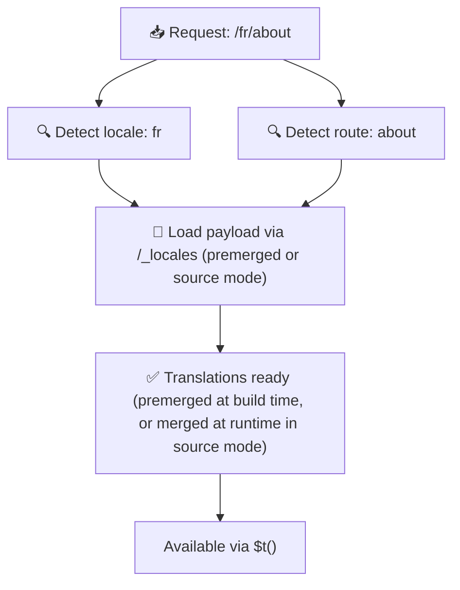

# 📂 폴더 구조 가이드

## 📖 소개

번역 파일을 효과적으로 정리하는 것은 확장 가능하고 효율적인 국제화(i18n) 시스템을 유지하는 데 필수적입니다. `Nuxt I18n Micro`는 루트 레벨 및 페이지별 번역을 관리하는 명확한 접근 방식을 제공하여 이 프로세스를 단순화합니다. 이 가이드는 권장 폴더 구조를 안내하고 `Nuxt I18n Micro`가 이러한 번역을 처리하는 방식을 설명합니다.

## 🗂️ 권장 폴더 구조

`Nuxt I18n Micro`는 번역을 `pages` 디렉터리 내의 루트 레벨 파일과 페이지별 파일로 정리합니다. `translationPayloads.mode: 'premerged'`(기본값)에서 루트 레벨 번역은 빌드 시 모든 페이지 파일에 자동으로 병합되므로, 런타임 병합 오버헤드 없이 각 페이지가 완전한 번역 집합을 가집니다.

`mode: 'source'`에서는 소스 파일이 Nitro 자산에 별도로 유지되고 `/_locales` 라우트를 통해 런타임에 병합됩니다. [서버리스 페이로드 출력](/guides/performance#serverless-payload-output)을 참고하세요.

### 🔧 기본 구조

다음은 따라야 할 폴더 구조의 기본 예제입니다:

```text
locales/
├── pages/
│   ├── index/
│   │   ├── en.json
│   │   ├── fr.json
│   │   └── ar.json
│   ├── about/
│   │   ├── en.json
│   │   ├── fr.json
│   │   └── ar.json
├── en.json
├── fr.json
└── ar.json

```

### 📄 구조 설명

#### 1. 🌍 루트 레벨 번역 파일

- **경로:** `/locales/\{locale\}.json` (예: `/locales/en.json`)
- **목적:** 이러한 파일에는 애플리케이션 전체에서 공유되는 번역이 포함되어 있습니다 (탐색 메뉴, 헤더, 푸터 등). `mode: 'premerged'`(기본값)에서는 빌드 시 모든 페이지별 파일에 자동으로 병합되므로, 서버는 페이지당 단일 사전 빌드 파일을 반환합니다.

  **예제 내용 (`/locales/en.json`):**

  ```json
  {
    "menu": {
      "home": "Home",
      "about": "About Us",
      "contact": "Contact"
    },
    "footer": {
      "copyright": "© 2024 Your Company"
    }
  }
  ```

#### 2. 📄 페이지별 번역 파일

- **경로:** `/locales/pages/\{routeName\}/\{locale\}.json` (예: `/locales/pages/index/en.json`)
- **목적:** 이러한 파일에는 개별 페이지에 특정한 번역이 포함되어 있습니다. `mode: 'premerged'`(기본값)에서는 빌드 시 루트 레벨 번역이 기반으로 병합되므로 각 페이지 파일은 자체 완결적이 됩니다.

  **예제 내용 (`/locales/pages/index/en.json`):**

  ```json
  {
    "title": "Welcome to Our Website",
    "description": "We offer a wide range of products and services to meet your needs."
  }
  ```

  **예제 내용 (`/locales/pages/about/en.json`):**

  ```json
  {
    "title": "About Us",
    "description": "Learn more about our mission, vision, and values."
  }
  ```

### 📂 동적 라우트 및 중첩 경로 처리

`Nuxt I18n Micro`는 특정 이름 변경 규칙을 사용하여 라우트의 동적 세그먼트와 중첩 경로를 자동으로 평평한 폴더 구조로 변환합니다. 이는 모든 번역이 일관되고 쉽게 접근 가능한 방식으로 저장되도록 합니다.

#### 동적 라우트 번역 폴더 구조

`/products/[id]` 같은 동적 라우트를 처리할 때, 모듈은 파일 구조 내에서 동적 세그먼트 `[id]`를 정적 형식으로 변환합니다.

**동적 라우트용 예제 폴더 구조:**

`/products/[id]` 같은 라우트의 경우, 번역 파일은 `products-id`라는 폴더에 저장됩니다:

```text
locales/pages/
├── products-id/
│   ├── en.json
│   ├── fr.json
│   └── ar.json

```

**중첩된 동적 라우트용 예제 폴더 구조:**

`/products/key/[id]` 같은 중첩 라우트의 경우, 번역 파일은 `products-key-id`라는 폴더에 저장됩니다:

```text
locales/pages/
├── products-key-id/
│   ├── en.json
│   ├── fr.json
│   └── ar.json

```

**다단계 중첩 라우트용 예제 폴더 구조:**

`/products/category/[id]/details` 같은 더 복잡한 중첩 라우트의 경우, 번역 파일은 `products-category-id-details`라는 폴더에 저장됩니다:

```text
locales/pages/
├── products-category-id-details/
│   ├── en.json
│   ├── fr.json
│   └── ar.json

```

### 🛠 디렉터리 구조 사용자 정의

다른 디렉터리에 번역을 저장하려면, `Nuxt I18n Micro`가 번역 파일이 저장되는 디렉터리를 사용자 정의할 수 있게 합니다. `nuxt.config.ts` 파일에서 이를 구성할 수 있습니다.

**예제: 번역 디렉터리 사용자 정의**

```typescript
export default defineNuxtConfig({
  i18n: {
    translationDir: 'i18n', // Custom directory path
  },
})
```

이렇게 하면 `Nuxt I18n Micro`가 기본 `/locales` 디렉터리 대신 `/i18n` 디렉터리에서 번역 파일을 찾도록 지시합니다.

## ⚙️ 번역 로드 방식

### 🌍 동적 로케일 라우트

`Nuxt I18n Micro`는 동적 로케일 라우트를 사용하여 번역을 효율적으로 로드합니다. 사용자가 페이지를 방문하면 모듈은 적절한 로케일을 결정하고 현재 라우트와 로케일에 따라 해당 번역 파일을 로드합니다.



예를 들어:

- `/en/index` 방문 시 `/locales/pages/index/en.json`에서 번역을 로드합니다.
- `/fr/about` 방문 시 `/locales/pages/about/fr.json`에서 번역을 로드합니다.

이 방법은 필요한 번역만 로드하도록 하여 서버 부하와 클라이언트 사이드 성능을 모두 최적화합니다.

### 💾 캐싱과 사전 렌더링

성능을 더욱 향상시키기 위해 `Nuxt I18n Micro`는 번역 파일의 캐싱과 사전 렌더링을 지원합니다:

- **캐싱**: 번역 파일이 한 번 로드되면 후속 요청을 위해 캐시되어 동일한 데이터를 반복해서 페치할 필요를 줄입니다.
- **사전 렌더링**: 빌드 프로세스 중에 설정된 모든 로케일과 라우트에 대해 번역 파일을 사전 렌더링할 수 있어, 런타임 지연 없이 서버에서 직접 제공될 수 있습니다.

## 📝 모범 사례

### 📂 페이지별 파일을 현명하게 사용

번역을 정리된 상태로 유지하기 위해 페이지별 파일을 활용하세요. 이는 각 페이지의 번역을 가볍고 로드하기 빠르게 유지하며, 이는 특히 복잡하거나 큰 콘텐츠가 있는 페이지에 중요합니다.

### 🔑 번역 키를 일관되게 유지

파일 간 번역 키에 대해 일관된 명명 규칙을 사용하세요. 이는 명료성을 유지하고 애플리케이션이 성장함에 따라 번역을 관리할 때 문제를 방지합니다.

### 🗂️ 컨텍스트별로 번역 정리

파일 내에서 관련 번역을 함께 그룹화하세요. 예를 들어, 모든 버튼 레이블을 `buttons` 키 아래에 그룹화하고 모든 폼 관련 텍스트를 `forms` 키 아래에 그룹화하세요. 이는 가독성을 향상시킬 뿐만 아니라 다른 로케일 간 번역을 관리하기 쉽게 만듭니다.

### ⚠️ 중첩 깊이 제한 (2 수준 권장)

클라이언트 사이드 탐색 중, `Nuxt I18n Micro`는 나가는 페이지와 들어오는 페이지의 번역을 결합하기 위해 최적화된 2 수준 깊은 병합을 사용합니다. 이는 겹치는 중첩 키(예: 두 페이지 모두 `common.*` 아래에 키가 있음)가 전환 애니메이션 중에 보존되도록 합니다.

**이는 표준 `Section → Key → Value` 구조(2 수준)에 대해 올바르게 작동합니다:**

```json
// Page A translations
{ "common": { "fromA": "Text A" } }

// Page B translations
{ "common": { "fromB": "Text B" } }

// During transition, both are available:
// { "common": { "fromA": "Text A", "fromB": "Text B" } }
```

**그러나 3+ 수준의 중첩을 사용하면 전환 중 더 깊은 키가 덮어쓰기될 수 있습니다:**

```json
// Page A translations
{ "auth": { "form": { "login": "Login" } } }

// Page B translations
{ "auth": { "form": { "register": "Register" } } }

// During transition: "login" key is lost
// { "auth": { "form": { "register": "Register" } } }
```


### 🧹 사용하지 않는 번역 정기적으로 정리

시간이 지남에 따라 애플리케이션은 특히 기능이 제거되거나 재구성될 때 사용하지 않는 번역 키를 축적할 수 있습니다. 번역 파일을 가볍고 유지 관리 가능하게 유지하기 위해 주기적으로 검토하고 정리하세요.
