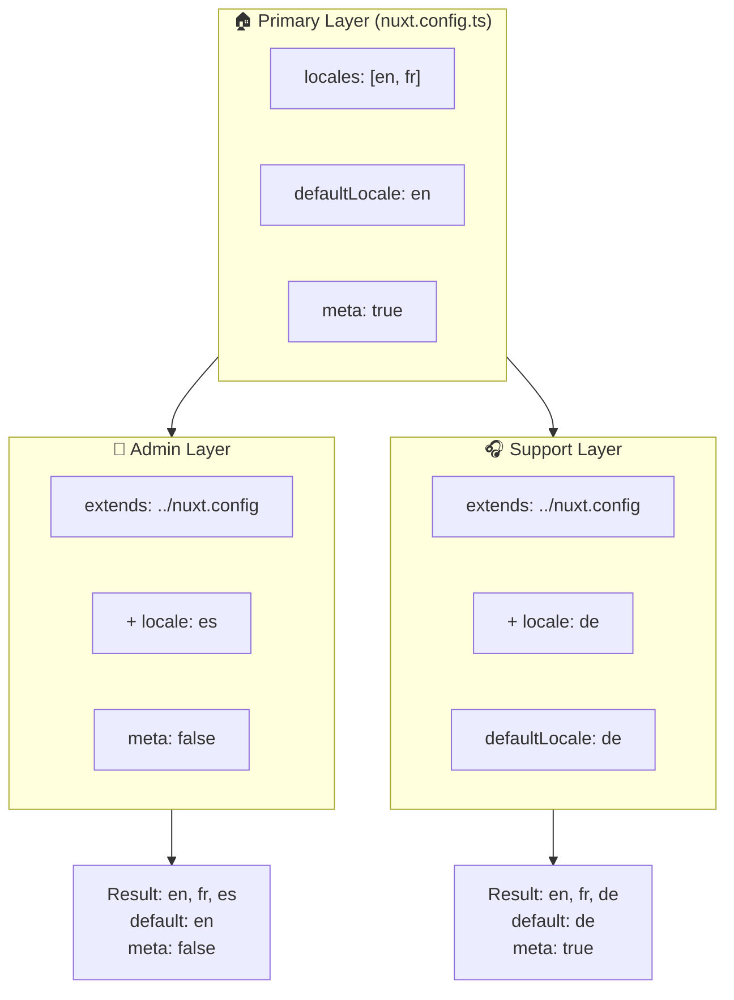

# 🗂️ `Nuxt I18n Micro`의 레이어

## 📖 레이어 소개

`Nuxt I18n Micro`의 레이어를 사용하면 애플리케이션의 여러 부분에서 지역화 설정을 유연하게 관리하고 맞춤화할 수 있습니다. 다양한 레이어를 정의함으로써 사이트의 특정 섹션에 대한 설정을 재정의하거나 다른 부분에서 확장할 수 있는 재사용 가능한 기본 구성을 만드는 등 다양한 컨텍스트에 맞게 구성을 조정할 수 있습니다.

### 레이어 상속 흐름



## 🛠️ 기본 구성 레이어

**기본 구성 레이어**는 애플리케이션 전체에 대한 기본 지역화 설정을 구성하는 곳입니다. 이 레이어는 지원되는 로케일, 기본 언어 및 기타 중요한 i18n 설정을 포함한 전역 구성을 정의하므로 필수적입니다.

### 📄 예제: 기본 구성 레이어 정의

`nuxt.config.ts` 파일에서 기본 구성 레이어를 정의하는 예제입니다:

```typescript
export default defineNuxtConfig({
  i18n: {
    locales: [
      { code: 'en', iso: 'en-EN', dir: 'ltr' },
      { code: 'fr', iso: 'fr-FR', dir: 'ltr' },
      { code: 'ar', iso: 'ar-SA', dir: 'rtl' },
    ],
    defaultLocale: 'en', // The default locale for the entire app
    translationDir: 'locales', // Directory where translations are stored
    meta: true, // Automatically generate SEO-related meta tags like `alternate`
    autoDetectLanguage: true, // Automatically detect and use the user's preferred language
  },
})
```

## 🌱 자식 레이어

자식 레이어는 애플리케이션의 특정 부분에 대해 기본 구성을 확장하거나 재정의하는 데 사용됩니다. 예를 들어, 추가 로케일을 지원하거나 사이트의 특정 섹션에서 기본 로케일을 수정하고 싶을 수 있습니다. 자식 레이어는 애플리케이션의 여러 부분이 서로 다른 지역화 요구 사항을 가질 수 있는 모듈식 애플리케이션에서 특히 유용합니다.

### 📄 예제: 자식 레이어에서 기본 레이어 확장하기

추가 로케일을 지원해야 하는 섹션이 있거나 특정 컨텍스트에서 특정 로케일을 비활성화하려는 경우가 있다고 가정해보겠습니다. 기본 구성 레이어를 확장하여 이를 수행하는 방법은 다음과 같습니다:

```typescript
// basic/nuxt.config.ts (Primary Layer)
export default defineNuxtConfig({
  i18n: {
    locales: [
      { code: 'en', iso: 'en-EN', dir: 'ltr' },
      { code: 'fr', iso: 'fr-FR', dir: 'ltr' },
    ],
    defaultLocale: 'en',
    meta: true,
    translationDir: 'locales',
  },
})
```

```typescript
// extended/nuxt.config.ts (Child Layer)
export default defineNuxtConfig({
  extends: '../basic', // Inherit the base configuration from the 'basic' layer
  i18n: {
    locales: [
      { code: 'en', iso: 'en-EN', dir: 'ltr' }, // Inherited from the base layer
      { code: 'fr', iso: 'fr-FR', dir: 'ltr' }, // Inherited from the base layer
      { code: 'de', iso: 'de-DE', dir: 'ltr' }, // Added in the child layer
    ],
    defaultLocale: 'fr', // Override the default locale to French for this section
    autoDetectLanguage: false, // Disable automatic language detection in this section
  },
})
```

### 🌐 모듈식 애플리케이션에서 레이어 사용하기

더 크고 모듈식인 Nuxt 애플리케이션에서는 각 섹션마다 고유한 i18n 설정이 필요한 여러 섹션이 있을 수 있습니다. 레이어를 활용하면 깔끔하고 확장 가능한 구성 구조를 유지할 수 있습니다.

### 📄 예제: 모듈식 애플리케이션의 계층화된 구성

메인 웹사이트, 관리자 패널, 고객 지원 포털과 같은 별개의 섹션이 있는 전자상거래 사이트를 상상해보세요. 각 섹션에는 다른 로케일 집합이나 다른 i18n 설정이 필요할 수 있습니다.

#### **기본 레이어 (전역 구성):**

```typescript
// nuxt.config.ts
export default defineNuxtConfig({
  i18n: {
    locales: [
      { code: 'en', iso: 'en-EN', dir: 'ltr' },
      { code: 'fr', iso: 'fr-FR', dir: 'ltr' },
    ],
    defaultLocale: 'en',
    meta: true,
    translationDir: 'locales',
    autoDetectLanguage: true,
  },
})
```

#### **관리자 패널용 자식 레이어:**

```typescript
// admin/nuxt.config.ts
export default defineNuxtConfig({
  extends: '../nuxt.config', // Inherit the global settings
  i18n: {
    locales: [
      { code: 'en', iso: 'en-EN', dir: 'ltr' }, // Inherited
      { code: 'fr', iso: 'fr-FR', dir: 'ltr' }, // Inherited
      { code: 'es', iso: 'es-ES', dir: 'ltr' }, // Specific to the admin panel
    ],
    defaultLocale: 'en',
    meta: false, // Disable automatic meta generation in the admin panel
  },
})
```

#### **고객 지원 포털용 자식 레이어:**

```typescript
// support/nuxt.config.ts
export default defineNuxtConfig({
  extends: '../nuxt.config', // Inherit the global settings
  i18n: {
    locales: [
      { code: 'en', iso: 'en-EN', dir: 'ltr' }, // Inherited
      { code: 'fr', iso: 'fr-FR', dir: 'ltr' }, // Inherited
      { code: 'de', iso: 'de-DE', dir: 'ltr' }, // Specific to the support portal
    ],
    defaultLocale: 'de', // Default to German in the support portal
    autoDetectLanguage: false, // Disable automatic language detection
  },
})
```

이 모듈식 예제에서:

- 각 섹션(admin, support)에는 고유한 i18n 설정이 있지만 모두 기본 구성을 상속합니다.
- 관리자 패널은 스페인어(`es`)를 로케일로 추가하고 메타 태그 생성을 비활성화합니다.
- 지원 포털은 독일어(`de`)를 로케일로 추가하고 사용자 인터페이스의 기본값을 독일어로 설정합니다.

## 📝 레이어 사용을 위한 모범 사례

- **🔧 기본 레이어를 단순하게 유지하세요:** 기본 레이어에는 애플리케이션 전반에 적용되는 가장 일반적으로 사용되는 설정이 포함되어야 합니다. 일관성을 보장하기 위해 간단하게 유지하세요.
- **⚙️ 특정 커스터마이징에 자식 레이어를 사용하세요:** 필요한 경우에만 자식 레이어에서 설정을 재정의하거나 확장하세요. 이렇게 하면 구성의 불필요한 복잡성을 피할 수 있습니다.
- **📚 레이어를 문서화하세요:** 프로젝트의 각 레이어의 목적과 세부 사항을 명확하게 문서화하세요. 이는 명확성을 유지하는 데 도움이 되며, 다른 사람(또는 미래의 여러분)이 구성을 이해하는 데 도움이 됩니다.
