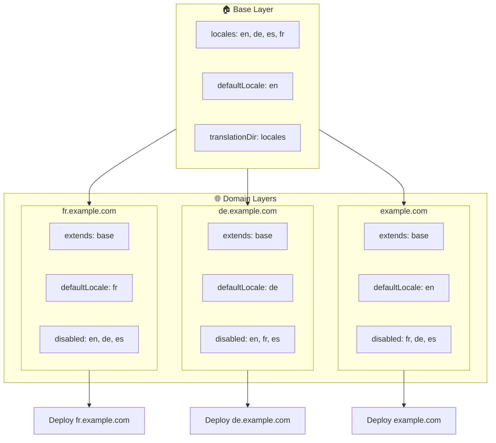

# 🌍 레이어를 사용하여 `Nuxt I18n Micro`로 다중 도메인 로케일 설정하기

## 📝 소개

`Nuxt I18n Micro`의 레이어를 활용하면 유연하고 유지 관리 가능한 다중 도메인 지역화 설정을 만들 수 있습니다. 이 접근 방식은 복잡한 기능이 필요 없이 도메인 관리를 단순화할 뿐만 아니라 효율적인 부하 분산과 프로젝트 복잡성 감소를 가능하게 합니다. 서로 다른 로케일에 대해 별도의 프로젝트를 실행함으로써 애플리케이션은 여러 도메인에 걸친 다양한 로케일 요구 사항에 쉽게 확장하고 적응할 수 있어, 글로벌 애플리케이션을 위한 강력하고 확장 가능한 솔루션을 제공합니다.

## 🎯 목표

자식 레이어에서 구성을 맞춤화하여 서로 다른 도메인이 특정 로케일을 제공하도록 설정을 만드는 것입니다. 이 방법은 Nuxt의 레이어링 시스템을 활용하여 기본 구성을 유지하면서 각 도메인에 맞게 확장하거나 수정할 수 있습니다.

### 다중 도메인 아키텍처



## 🛠 다중 도메인 로케일 구현 단계

### 1. **기본 레이어 만들기**

애플리케이션의 모든 공통 로케일 설정을 포함하는 기본 구성 레이어를 만드는 것으로 시작하세요. 이 구성은 다른 도메인별 구성의 기반이 됩니다.

#### **기본 레이어 구성**

기본 구성 파일 `base/nuxt.config.ts`를 만듭니다:

```typescript
// base/nuxt.config.ts

export default defineNuxtConfig({
  i18n: {
    locales: [
      { code: 'en', iso: 'en-US', dir: 'ltr' },
      { code: 'de', iso: 'de-DE', dir: 'ltr' },
      { code: 'es', iso: 'es-ES', dir: 'ltr' },
    ],
    defaultLocale: 'en',
    translationDir: 'locales',
    meta: true,
    autoDetectLanguage: true,
  },
})
```

### 2. **도메인별 자식 레이어 만들기**

각 도메인에 대해 기본 구성을 수정하여 해당 도메인의 특정 요구 사항을 충족하는 자식 레이어를 만듭니다. 특정 도메인에서 필요하지 않은 로케일을 비활성화할 수 있습니다.

#### **예제: 프랑스어 도메인 구성**

`fr/nuxt.config.ts`에서 프랑스어 도메인용 자식 레이어 구성을 만듭니다:

```typescript
// fr/nuxt.config.ts

export default defineNuxtConfig({
  extends: '../base', // Inherit from the base configuration

  i18n: {
    locales: [
      { code: 'en', iso: 'en-US', dir: 'ltr', disabled: true }, // Disable English
      { code: 'fr', iso: 'fr-FR', dir: 'ltr' }, // Add and enable the French locale
      { code: 'de', iso: 'de-DE', dir: 'ltr', disabled: true }, // Disable German
      { code: 'es', iso: 'es-ES', dir: 'ltr', disabled: true }, // Disable Spanish
    ],
    defaultLocale: 'fr', // Set French as the default locale
    autoDetectLanguage: false, // Disable automatic language detection
  },
})
```

#### **예제: 독일어 도메인 구성**

마찬가지로 `de/nuxt.config.ts`에서 독일어 도메인용 자식 레이어 구성을 만듭니다:

```typescript
// de/nuxt.config.ts

export default defineNuxtConfig({
  extends: '../base', // Inherit from the base configuration

  i18n: {
    locales: [
      { code: 'en', iso: 'en-US', dir: 'ltr', disabled: true }, // Disable English
      { code: 'fr', iso: 'fr-FR', dir: 'ltr', disabled: true }, // Disable French
      { code: 'de', iso: 'de-DE', dir: 'ltr' }, // Use the German locale
      { code: 'es', iso: 'es-ES', dir: 'ltr', disabled: true }, // Disable Spanish
    ],
    defaultLocale: 'de', // Set German as the default locale
    autoDetectLanguage: false, // Disable automatic language detection
  },
})
```

### 3. **각 도메인에 대해 애플리케이션 배포**

각 도메인에 대해 적절한 구성으로 애플리케이션을 배포합니다. 예를 들어:

- `fr` 레이어 구성을 `fr.example.com`에 배포합니다.
- `de` 레이어 구성을 `de.example.com`에 배포합니다.

### 4. **서로 다른 로케일에 대해 여러 프로젝트 설정**

각 로케일과 도메인에 대해 별도의 애플리케이션 인스턴스를 실행해야 합니다. 이는 각 도메인이 올바른 로케일 구성을 제공하도록 하여 부하 분산을 최적화하고 프로젝트 구조를 단순화합니다. 각 로케일에 맞춘 여러 프로젝트를 실행함으로써 구성 간의 깔끔한 분리를 유지하고 전체 설정의 복잡성을 줄일 수 있습니다.

### 5. **도메인 기반 라우팅 구성**

사용자가 접근하는 도메인에 따라 올바른 프로젝트로 안내되도록 라우팅을 구성해야 합니다. 이렇게 하면 각 도메인이 적절한 로케일을 제공하여 사용자 경험을 향상시키고 여러 지역 간의 일관성을 유지할 수 있습니다.

### 6. **배포 및 검증**

레이어를 구성하고 해당 도메인에 배포한 후, 각 도메인이 올바른 로케일을 제공하고 있는지 확인하세요. 도메인에 따라 올바른 로케일이 로드되는지 확인하기 위해 애플리케이션을 철저히 테스트하세요.

## 📝 모범 사례

- **기본 구성을 일반적으로 유지하세요**: 기본 구성은 모든 도메인에 적용 가능한 일반 설정을 포함해야 합니다.
- **도메인별 로직을 분리하세요**: 명확성과 관심사의 분리를 유지하기 위해 도메인별 구성을 해당 레이어에 유지하세요.

## 🎉 결론

`Nuxt I18n Micro`의 레이어를 활용하면 유연하고 유지 관리 가능한 다중 도메인 지역화 설정을 만들 수 있습니다. 이 접근 방식은 복잡한 도메인 관리 기능의 필요성을 없앨 뿐만 아니라 부하를 효율적으로 분산하고 프로젝트 복잡성을 줄일 수 있게 해줍니다. 서로 다른 로케일에 대해 별도의 프로젝트를 실행함으로써 애플리케이션은 다양한 도메인에 걸친 다양한 로케일 요구 사항에 쉽게 확장하고 적응할 수 있어, 글로벌 애플리케이션을 위한 강력하고 확장 가능한 솔루션을 제공합니다.
