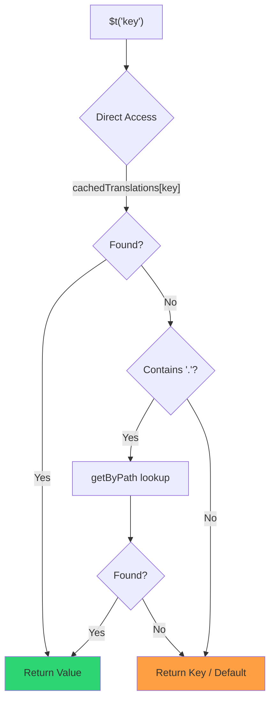

# 🚀 성능 가이드

## 📖 소개

`Nuxt I18n Micro`는 성능을 염두에 두고 설계되었으며, `nuxt-i18n`과 같은 전통적인 국제화(i18n) 모듈에 비해 상당한 개선을 제공합니다. 이 가이드는 `Nuxt I18n Micro` 사용의 성능 이점과 다른 솔루션과의 비교를 심도 있게 다룹니다.

## 🤔 왜 성능에 집중해야 할까요?

대규모 프로젝트와 트래픽이 많은 환경에서는 성능 병목이 느린 빌드 시간, 증가된 메모리 사용량, 열악한 서버 응답 시간을 초래할 수 있습니다. 이러한 문제는 대용량 번역 파일이 포함된 복잡한 i18n 설정에서 더욱 두드러집니다. `Nuxt I18n Micro`는 속도, 메모리 효율성, 애플리케이션 번들 크기에 대한 최소한의 영향에 최적화하여 이러한 과제를 정면으로 해결하기 위해 구축되었습니다.

## 📊 성능 비교

동일한 fixture에 대해 `pnpm test:performance`(`pnpm -C scripts cli performance`)를 통해 **`@nuxtjs/i18n@10.6.0`**과의 일련의 테스트를 수행했습니다. 전체 방법론과 차트: [성능 테스트 결과](/guides/performance-results).

기본 CLI 프로필: **4 로케일** × **2 페이지**(`index`, `page`) × 약 10k 인덱스 리프 키. 더 무거운 회귀 감지 부하를 위해 `--locales` / `--keys`를 상향 조정하세요. 보고서는 **code**, **translations**(`@nuxtjs/i18n` `chunks/raw/*` 포함), **total** 배포 가능 출력을 분리합니다.

```bash
pnpm test:performance
pnpm -C scripts cli performance --only micro --skip-stress
pnpm -C scripts cli performance --locales 12 --keys 100000 --runs 3
```

### ⏱️ 빌드 시간 및 리소스 소비

<Accordion title="**@nuxtjs/i18n v10.6**">
- **코드 번들**: 2.16 MB
- **번역**: 7.21 MB (메시지 청크 + 로케일 페이로드)
- **총 배포 가능**: 9.37 MB
- **최대 메모리 사용량**: 1,821 MB
- **경과 시간**: 8.34s (3회 평균)
</Accordion>

<Tip>
- **코드 번들**: 1.74 MB — **`@nuxtjs/i18n` v10.6보다 코드가 약 19% 더 작음**
- **번역**: 6.8 MB (지연 로드 JSON)
- **총 배포 가능**: 8.54 MB
- **최대 메모리 사용량**: 1,065 MB — **`@nuxtjs/i18n` v10.6보다 약 41% 적은 메모리**
- **경과 시간**: 5.34s — **`@nuxtjs/i18n` v10.6보다 약 36% 빠름** (≈ plain-nuxt 기준)
</Tip>

> `@nuxtjs/i18n`을 "code ≈ 15 MB / translations 0 B"로 표시했던 이전 문서는 `chunks/raw` 메시지 파일을 앱 코드로 계산했습니다. 현재 분류기는 이를 분리합니다. **코드**의 격차는 더 작지만, micro는 여전히 빌드 시간, 최고 RSS, 부하 테스트에서 선두를 유지합니다.

차트, Autocannon 결과 및 fixture 세부 사항은 [전체 벤치마크 보고서](/guides/performance-results)를 참조하세요.

### 🌐 부하 하에서의 서버 성능

Artillery(6s@6 + 60s@60)와 Autocannon(10c / 10s), fixture당 3회 연속 실행의 평균.

<Accordion title="**@nuxtjs/i18n v10.6**">
- **초당 요청(Artillery)**: 143 [#/sec]
- **평균 응답 시간**: 956 ms
- **Autocannon RPS / 평균 지연 시간**: 72 / 139 ms
</Accordion>

<Tip>
- **초당 요청(Artillery)**: 275 [#/sec] — **`@nuxtjs/i18n` v10.6보다 약 93% 더 많음**
- **평균 응답 시간**: 483 ms — **`@nuxtjs/i18n` v10.6보다 약 49% 빠름**
- **Autocannon RPS / 평균 지연 시간**: 162 / 62 ms
</Tip>

### 📈 시각적 비교

<Note>
Mintlify 문서에서는 인터랙티브 차트가 생략되었습니다. 이 페이지의 벤치마크 표 또는 [VitePress 문서](https://s00d.github.io/nuxt-i18n-micro/guide/performance-results)의 차트를 확인하세요: `chart`.
</Note>

<Note>
Mintlify 문서에서는 인터랙티브 차트가 생략되었습니다. 이 페이지의 벤치마크 표 또는 [VitePress 문서](https://s00d.github.io/nuxt-i18n-micro/guide/performance-results)의 차트를 확인하세요: `chart`.
</Note>

| 지표          | @nuxtjs/i18n v10.6 | i18n-micro | 개선                |
| --------------- | ------------------ | ---------- | ------------------ |
| 빌드 시간      | 8.34s              | 5.34s      | **~36% 빠름**    |
| 메모리 (빌드)  | 1,821 MB           | 1,065 MB   | **~41% 적음**      |
| 코드 번들     | 2.16 MB            | 1.74 MB    | **~19% 작음**   |
| 응답 시간   | 956 ms             | 483 ms     | **~49% 빠름**    |
| RPS (Artillery) | 143                | 275        | **~93% 더 많음**      |

### 🔍 결과 해석

현재 `@nuxtjs/i18n` **v10.6**과 비교하면(기본 CLI 프로필, 3회 평균):

- 🗜️ **더 작은 코드 그래프**: 메시지 청크가 "code"로 잘못 라벨링되지 않을 때 ~1.74 MB 대 ~2.16 MB.
- 🧠 **더 낮은 빌드 RSS**: ~1.1 GB 최대 대 ~1.8 GB.
- 🕒 **더 빠른 빌드**: ~5.3s 대 ~8.3s (이 프로필에서 micro가 plain-Nuxt 기준과 동등함).
- ⚡ **부하 하에서 훨씬 나음**: ~275 대 ~143 Artillery RPS, ~162 대 ~72 Autocannon RPS, 더 낮은 평균 지연 시간.

절대적인 수치는 이전에 게시된 표(더 작은 사전, 이전 Nuxt, `@nuxtjs/i18n`에 대한 불공정한 "0 B 번역" 분할)와 다릅니다. 방향적으로는 동일합니다: micro는 빌드 비용과 요청 처리량에서 앞서 있습니다.

## ⚙️ 주요 최적화

### 🛠️ 미니멀리스트 설계

`Nuxt I18n Micro`는 작은 코어와 전용 전략 패키지를 갖춘 미니멀리스트 아키텍처를 중심으로 구축되었습니다. 이는 오버헤드를 줄이고 내부 로직을 단순화하여 성능을 향상시킵니다.

### 🚦 효율적인 라우팅

v3에서는 최적의 트리 셰이킹을 위해 라우트 생성과 런타임 경로 로직이 전용 패키지로 분리되었습니다:

- **`@i18n-micro/route-strategy`** — 빌드 타임 라우트 생성: 지역화된 라우트로 Nuxt 페이지를 확장합니다. 선택된 전략(`no_prefix`, `prefix`, `prefix_except_default`, `prefix_and_default`)만 포함됩니다.
- **`@i18n-micro/path-strategy`** — 런타임 경로 해석, 리디렉션 및 링크 생성. 순수 함수와 사전 계산된 컨텍스트 플래그를 사용하여 hot path에서 할당을 최소화합니다. 서브패스 export(`/prefix`, `/no-prefix` 등)를 통해 선택한 구현만 번들됩니다.

이 접근 방식은 라우팅 구성을 가볍게 유지하고 로케일 수에 관계없이 빠른 라우트 해석을 보장합니다.

### 📂 간소화된 번역 로드

이 모듈은 전역 파일과 페이지별 파일 간의 명확한 분리를 통해 번역용 JSON 파일만 지원합니다. 이는 필요한 번역 데이터만 언제든지 로드되도록 하여 성능을 더욱 향상시킵니다.

### 🔒 GlobalThis 싱글톤 캐시

v3.0.0부터 모듈은 `Symbol.for`을 사용한 `globalThis` 싱글톤 패턴을 사용하여 전체 Node.js 프로세스에서 단일 캐시 인스턴스를 보장합니다. 이는 다음을 방지합니다:

- 동일한 모듈이 여러 번 번들될 때의 캐시 중복
- 가비지 컬렉션 부담을 유발하는 요청당 객체 재생성
- 고아 캐시 인스턴스로 인한 메모리 누수

```mermaid
flowchart LR
    subgraph Process["Node.js Process"]
        G["globalThis[Symbol.for('CACHE')]"]

        subgraph R1["SSR Request 1"]
            P1[Plugin Instance] --> G
        end

        subgraph R2["SSR Request 2"]
            P2[Plugin Instance] --> G
        end

        subgraph R3["SSR Request 3"]
            P3[Plugin Instance] --> G
        end
    end

    G --> Cache["Single Map Instance"]
    Cache --> D1["en:index → translations"]
    Cache --> D2["en:about → translations"
```

```typescript
// Internal implementation pattern
const CACHE_KEY = Symbol.for('__NUXT_I18N_STORAGE_CACHE__')
if (!globalThis[CACHE_KEY]) {
  globalThis[CACHE_KEY] = new Map()
}
```

### ⚡ 최적화된 번역 함수 (tFast)

`$t()` 함수는 속도에 최적화된 직접 조회 전략을 사용합니다:

1. **사전 계산된 컨텍스트**: 로케일과 라우트 이름은 모든 `$t()` 호출이 아니라 내비게이션 중에 한 번 계산됩니다.
2. **단일 소스 조회**: 모든 번역(루트 + 페이지별 + 폴백)은 빌드 타임에 페이지당 단일 파일로 사전 병합됩니다 — 계층화된 검색이 필요하지 않습니다.
3. **내비게이션 시 누적 딥 병합**: 동일한 로케일 내에서 내비게이션할 때, 새 페이지 번역이 활성 사전에 딥 병합(2단계 깊이)되므로 이전 페이지의 키가 전환 애니메이션 중에 계속 보이도록 유지됩니다 — 페이지가 겹치는 중첩 접두사를 공유하는 경우에도 마찬가지입니다(예: 두 페이지가 모두 `common.*` 아래에 키를 가짐).
4. **`page:transition:finish`를 통한 가비지 컬렉션**: 전환 애니메이션이 완전히 완료된 후, 병합된 사전은 새 페이지에 대한 깨끗한 번역으로 대체되어 이전 페이지 키의 메모리를 해제합니다.
5. **직접 속성 액세스**: hot path에 대해 Map 조회 대신 `obj[key]`를 사용합니다.



```typescript
// Simplified lookup logic — single active dictionary
let val = cachedTranslations[key]
if (val === undefined && key.includes('.')) {
  val = getByPath(cachedTranslations, key)
}
```

### 💉 서버 측 로드 (HTML 임베드 없음)

SSR 중에 로드된 번역은 렌더링 중 `$t`를 위해 **서버 메모리**에 유지됩니다. `nuxtApp.payload` / HTML 문서에 복사되지 **않습니다**(`experimental.preload: false`를 사용하는 `@nuxtjs/i18n`과 동일한 아이디어).

클라이언트에서 `01.plugin.ts`는 앱이 계속 진행되기 전에 `/\{apiBaseUrl\}/:page/:locale/data.json`을 로드하는 `switchContext`를 `await`합니다 — 하나의 요청, 8 MB 인라인 blob이 아닙니다.

`NuxtI18n`은 여전히 `$t()` / `$has()`용 활성 병합 사전(`cachedTranslations`)을 유지합니다. 동일한 로케일 내비게이션은 `page:transition:finish`가 오래된 키를 정리할 때까지 페이지 청크를 딥 병합합니다.

#### 현재 상태

아래 숫자는 `pnpm run budget:payload`가 측정하고 강제하는 예산 파일에서 읽어옵니다.

{/* generated:payload-budget — do not edit; run `pnpm run docs:generate` */}

`playground`에서 `/`, `/de` 전체에 대해 측정:

| 측정 | 크기 |
| --- | --- |
| 디스크의 번역 소스 | 15.2 MB |
| 별도 페이로드 파일로 제공 | 76.3 MB |
| 가장 큰 인라인 `__NUXT_DATA__` | 6.9 MB |
| 클라이언트 자산 | 449.5 KB |

playground는 의도적으로 크기가 큰 사전을 포함하고 있으므로, 이는 실제 애플리케이션에서 기대할 수치가 아닙니다 — 측정을 위한 고정점입니다. 예상치 못하게 커지면 예산이 실패하며, 이는 페이로드가 담고 있는 내용의 우발적 변화를 감지하는 방법입니다.

{/* /generated:payload-budget */}

### 💾 캐싱 및 사전 렌더링

번역은 여러 캐시를 통과하며, 어떤 캐시가 요청에 응답했는지를 아는 것은 5분과 5시간 디버깅 세션의 차이입니다. 요청이 만나는 순서대로 네 가지가 있습니다:

| 계층 | 위치 | 수명 | 지움 |
| --- | --- | --- | --- |
| 브라우저 / CDN | `/\{apiBaseUrl\}/**`의 `Cache-Control` | `httpCacheDuration`, `immutable` | 새 `?v=` — 즉, 번역을 변경한 배포 |
| Nitro 라우트 캐시 | `routeRules['/\{apiBaseUrl\}/**'].cache` | 60s, stale-while-revalidate | 서버 재시작 |
| 서버 로더 | 프로세스 내 `CacheControl`, `locale:routeName`으로 키 지정 | 프로세스 수명 또는 `cacheTtl` | 서버 재시작, 개발 중 HMR |
| 클라이언트 저장소 | `translationStorage` + `NuxtI18n`의 활성 청크 | 페이지 수명 | 리로드 |

두 가지 규칙이 서로 모순되지 않도록 유지합니다:

- **Nitro 라우트 캐시는 `?v=`가 존재할 때만 존재합니다.** 캐시 버스터가 있으면 각 URL이 콘텐츠에 고유하므로 서버 측 캐싱은 stale 없이 무료입니다. `dateBuild: 0`을 설정하면 URL이 안정되고 응답이 `must-revalidate`라고 말하므로 해당 계층은 꺼집니다 — 서버 측 캐시는 최대 1분 동안 stale 항목에서 응답하여 이를 조용히 무효화합니다.
- **`immutable`도 `?v=`가 필요합니다.** 버스터 없이는 `httpCacheDuration`이 뭐라고 하든 헤더가 `public, max-age=0, must-revalidate`입니다: 절대 변경되지 않는 URL의 긴 `max-age`는 브라우저가 처음 본 응답을 고정시킵니다.

<Warning>
`translationPayloads.publicAssets`(premerged 모드의 기본값)로 페이로드는 `public/<apiBaseUrl>/\{page\}/\{locale\}/data.json`에 복사됩니다. 해당 디렉터리를 자체적으로 제공하는 플랫폼(Cloudflare Pages, Firebase Hosting, `npx serve`)은 자체 헤더를 적용합니다 — Nitro `routeRules` 헤더는 서버를 통과하는 응답에만 도달합니다. 해당 정적 파일에 대한 캐시 정책은 플랫폼 자체 구성에서 설정하세요.
</Warning>

🏁 **사전 렌더링**: premerged 모드에서는 `publicAssets`가 이미 클라이언트 URL 트리를 `public/`에 씁니다. 해당 사본이 비활성화된 경우 Nitro가 핸들러 라우트를 구체화해야 할 때만 `prerenderRoutes`를 선택하세요.

### 🗜️ 압축된 공개 페이로드

`nitro.compressPublicAssets`가 활성화되면 공개 디렉터리에 복사된 번역 페이로드도 `.gz`와 `.br` 형제를 얻습니다:

```ts
export default defineNuxtConfig({
  nitro: { compressPublicAssets: true },
})
```

Nitro는 페이로드를 복사하는 훅 전에 공개 자산을 압축하므로, 이 설정 없이는 정적 빌드에서 유일하게 압축되지 않은 부분이 됩니다. 이 모듈은 압축을 자체적으로 켜지 않으며 — 선택한 설정만 적용합니다. 인코딩별 선택(`\{ gzip: true, brotli: false \}`)이 존중됩니다.

Playground 인덱스 페이로드: 6 651 984 B raw, 1 012 831 B gzip, 821 617 B brotli.

### ☁️ 서버리스 페이로드 출력

**Node**에서 SSR은 `public/<apiBaseUrl>`(`readFile`, Nitro `serverAssets` / Rollup `raw:` 없음)에서 번역 JSON을 읽습니다. **Edge**에서는 Nitro `serverAssets`가 동일한 트리를 임베드합니다(대용량 카탈로그의 경우 `mode: 'source'` 선호).

```typescript
export default defineNuxtConfig({
  i18n: {
    translationPayloads: {
      serverAssets: true, // default — Node → public copy; Edge → serverAssets embed
      publicAssets: true, // default in premerged mode
    },
  },
})
```

컴팩트한 Edge 임베드(및 선택적 컴팩트 공개 사본)를 위해 `translationPayloads.mode: 'source'`를 사용하세요:

```typescript
export default defineNuxtConfig({
  i18n: {
    translationPayloads: {
      mode: 'source',
    },
  },
})
```

`mode: 'source'`는 레이어 병합된 소스 파일을 컴팩트하게 유지하고 내장된 `/_locales` 라우트(또는 Edge `assets:i18n`)를 통해 런타임에 root/page/fallback을 병합합니다. 기본적으로 공개 자산 사본과 사전 렌더링된 페이로드 라우트를 비활성화합니다.

<Warning>
`prerenderRoutes`는 기본적으로 `false`입니다. `mode: 'source'`에서는 `publicAssets`도 기본적으로 `false`입니다. 따라서 Nitro/edge 런타임 없이 순수 정적 호스팅은 이러한 출력 중 하나를 활성화하거나, `serverHandler`를 런타임에 사용 가능하게 유지하거나, 페이로드를 외부에서 호스팅하지 않는 한 클라이언트에서 번역을 로드할 수 없습니다.

기본 premerged + `publicAssets`는 이미 `/\{apiBaseUrl\}/\{page\}/\{locale\}/data.json`을 `public/` 아래에 두므로, 정적 호스트는 Nitro 없이 클라이언트 fetch를 제공할 수 있습니다.
</Warning>

<Warning>
`apiBaseServerHost` 또는 `apiBaseClientHost`를 설정하면 페이로드 제공이 해당 원본으로 이동하며, 자체 요구 사항이 함께 발생합니다 — [Configuration → External CDN hosts](/guides/configuration#external-cdn-hosts)를 참조하세요.
</Warning>

또는 개별 HTTP/공개 출력을 비활성화하고 페이로드를 외부에서 호스팅하세요:

```typescript
export default defineNuxtConfig({
  i18n: {
    apiBaseClientHost: 'https://cdn.example.com',
    apiBaseServerHost: 'https://cdn.example.com',
    translationPayloads: {
      serverHandler: false,
      publicAssets: false,
      prerenderRoutes: false,
    },
  },
})
```

내장된 로컬 `/\{apiBaseUrl\}/:page/:locale/data.json` 라우트에 의존하는 경우 `serverHandler`를 활성화 상태로 유지하세요. 페이로드가 외부에서 호스팅되고 `apiBaseServerHost`가 해당 외부 원본을 가리키는 경우 비활성화하세요. `publicAssets`가 이미 정적 페이로드 라우트를 작성하지 않은 경우, Nitro가 정적 페이로드 라우트를 구체화해야 할 때만 `prerenderRoutes`를 활성화하세요.

빌드 중에 모듈은 생성된 페이로드 출력이 `translationPayloads.warnFileCount`(기본값 500) 또는 `translationPayloads.warnSizeBytes`(기본값 10 MB)를 초과하면 경고합니다. 또한 외부 페이로드 호스트가 구성되지 않은 상태에서 모든 로컬 출력이 비활성화되면 경고합니다.

## 📝 성능 극대화 팁

다음은 `Nuxt I18n Micro`에서 최고의 성능을 얻기 위한 몇 가지 팁입니다:

- 📉 **로케일 데이터 제한**: 번들 크기를 작게 유지하기 위해 프로젝트에서 필요한 로케일만 포함하세요.
- 🗂️ **페이지별 번역 사용**: 불필요한 데이터 로드를 피하기 위해 페이지별로 번역 파일을 구성하세요.
- 💾 **캐싱 활성화**: 서버 부하를 줄이고 응답 시간을 향상시키기 위해 캐싱 기능을 활용하세요.
- 🏁 **사전 렌더링 활용**: 페이지 로드 속도를 높이고 런타임 오버헤드를 줄이기 위해 번역을 사전 렌더링하세요.

성능 테스트의 자세한 결과는 [성능 테스트 결과](/guides/performance-results)를 참조하세요.
